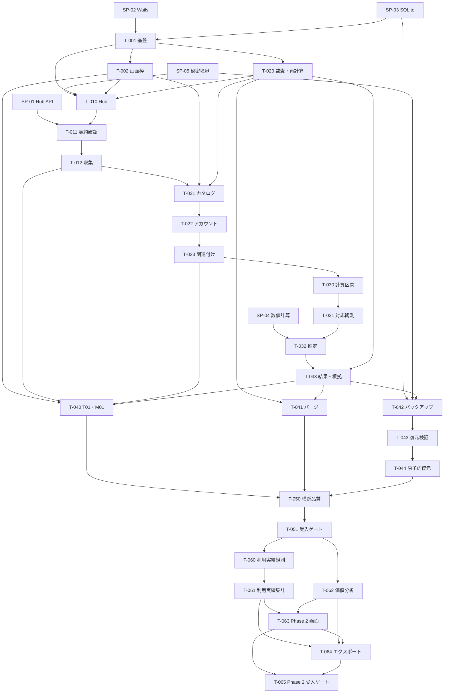

# Token Monitor Analytics 実装計画

| 項目 | 内容 |
| --- | --- |
| 状態 | Phase 2 実装完了・正式受入保留（Phase 1 完了ゲート待ち） |
| 基準日 | 2026-08-26 |
| アーキテクチャ | [アーキテクチャ設計](./docs/architecture.md) |
| 規範文書 | [要件定義](./docs/requirements.md) |
| UI 設計 | [画面設計](./docs/screen-design.md)、[デザインシステム](./docs/design-system.md) |

## 1. 文書の位置付け

本書は、アーキテクチャとデザインシステムを実装するための作業単位、依存順、検証、受入ゲートだけを扱う。唯一の規範文書は [要件定義](./docs/requirements.md) であり、構造、責務、依存方向、データ保全プロトコルは [アーキテクチャ設計](./docs/architecture.md)、共通の UI 規則は [デザインシステム](./docs/design-system.md) を補足参照する。これらの従属文書が矛盾する場合は要件定義を優先する。

2026-08-25 に、最初のリリースをクラウド機能を含まない Windows ローカル版とすることを合意した。2026-08-26 に Phase 2 を開始し、対象を本書の T-001 から T-065、および要件定義の `P1-*`、`P2-*`、`QL-*`、`AC-P1-*`、`AC-P2-*` とした。同日、Phase 2 の要件・受入条件・画面キー計32項目は合格したが、正式な Phase 2 完了判定は Phase 1 の SP-01 とクリーン Windows 手動証跡の完了まで保留する。クラウド同期、クラウド保存、サーバー実装は引き続き対象外とする。

以下の I0 から I8 は、依存関係を示す技術的な実装増分であり、製品フェーズではない。タスク ID は要件 ID と混同しないよう `T-*` とする。

### 1.1 製品フェーズの合意

最初のリリースで得る利用者価値は、複数 Hub のローカル観測を収集し、根拠へ遡れる推定と安全なローカルデータ運用を Windows デスクトップアプリで提供することである。

Phase 1 の完了条件は T-001 から T-051 の成果物を実装し、`AC-P1-01` から `AC-P1-26`、Phase 1 の画面受入キー、デザインシステムの共通規則を確認できることとする。Phase 2 は Phase 1 の完了ゲートを前提に、T-060 から T-065 の成果物、`AC-P2-01` から `AC-P2-08`、Phase 2 の画面受入キーを `wails3 task acceptance` で確認できたときに完了とする。どちらのフェーズにもクラウド依存を持ち込まない。

## 2. 開発コマンド

固定版 Wails CLI の初回導入後、開発者と CI は直接ツールを組み合わせず、Wails 同梱 runner の `wails3 task` を入口にする。外部の Task CLI は前提にしない。

| タスク | 内容 |
| --- | --- |
| `wails3 task bootstrap` | Wails CLI、Go、Node.js、`makensis` の固定版と既存 lockfile を検査し、`npm ci` を実行する。初回依存定義と更新は別の明示操作とし、グローバル既定版は変更しない |
| `wails3 task generate` | sqlc と Wails bindings を生成する |
| `wails3 task generate:check` | 再生成後に Git 差分がないことを検査する |
| `wails3 task fmt` | Go、TypeScript、CSS、Markdown を整形する |
| `wails3 task fmt:check` | 整形を変更せず、差分が必要なら失敗する |
| `wails3 task lint` | go vet、staticcheck、ESLint を実行する |
| `wails3 task test:go` | domain と usecase の高速な Go テストを実行する |
| `wails3 task test:integration` | 一時ファイル SQLite と httptest による統合テストを実行する |
| `wails3 task test:frontend` | Vitest、Testing Library、axe-core を実行する |
| `wails3 task test:e2e` | fake Wails adapter を使う Playwright 試験を実行する |
| `wails3 task test:restore` | 一時ディレクトリだけで復元往復、障害注入、強制終了試験を実行する |
| `wails3 task requirements:check` | 合意済み対象の全規範 ID が 4.10 の担当タスクへ割り当てられていることを検査する。フェーズ未合意の間は対象未確定として失敗させる |
| `wails3 task screens:check` | 画面設計の受入キーが 4.10 の担当タスクへ割り当てられ、参照見出しが存在することを検査する |
| `wails3 task test` | test:go、test:integration、test:frontend、test:e2e、test:restore を実行する |
| `wails3 task verify` | requirements:check、screens:check、generate:check、fmt:check、lint、test:go、test:integration、test:frontend、test:e2e、test:restore、Windows build を実行する |
| `wails3 task dev` | Wails 開発モードを起動する |
| `wails3 task build` | 固定版で Windows 実行ファイルを作る |
| `wails3 task package` | クリーンな入力から単一の NSIS インストーラーを作る |
| `wails3 task acceptance` | 合意済み対象の規範 ID、画面受入キー、デザインシステムの共通規則に対応する試験名・手動証跡を検査し、クリーン Windows ユーザープロファイル向けの受入証跡を収集する |

**wails3 task test:restore** は利用者指定パスや運用 DB を削除対象にしない。アプリが作った一時ディレクトリの解決済み絶対パスだけを使い、運用 DB と異なることを開始前に検査する。

## 3. 検証計画

### 3.1 テスト層

| 層 | 主な対象 | 実施方法 |
| --- | --- | --- |
| domain unit | 半開区間、境界、対応観測、階数、推定状態 | テーブル駆動試験、固定フィクスチャ、順序入替え |
| usecase unit | 状態遷移、影響区間、排他、監査 | 偽時計、偽ポート、障害注入 |
| adapter integration | Hub API、SQLite、Credential Manager、ZIP | httptest、ファイル DB、Windows 専用試験 |
| frontend component | フォーム、guard、空状態、キーボード | Vitest、Testing Library、user-event、axe-core |
| E2E | 画面横断フロー | Playwright と偽バックエンド |
| packaged acceptance | 複数ウィンドウ、DPI、最前面、WebView2、Credential Manager | ビルド済み Windows アプリとクリーンプロファイル |

SQLite 試験はインメモリ DB だけで済ませず、実際の WAL、close、rename、再起動を確認できる一時ファイル DB を使う。

### 3.2 数値計算

- SP-04 で、要件の AC-P1-13 から AC-P1-19 を丸め前の値で再現する。
- 独立実装で事前生成したオラクルフィクスチャと照合する。
- 非負性、KKT 条件、残差、階数、状態分類を別々に検査する。
- Hub、系列、観測点の入力順を入れ替えても、状態と未丸め結果が一致することを検査する。
- 解法の許容誤差と反復上限を計算論理版へ含める。
- SP-04 で合格した解法一つだけを固定し、実行時フォールバックは設けない。

### 3.3 永続化とデータ保全

- 原 JSON パーサーと ZIP 検証処理はファズ試験を持つ。
- 正規化失敗後にも先に保存した原 JSON スナップショットが残ることを検査する。
- 設定変更、監査、再計算要求が同一トランザクションであることを障害注入で確認する。
- パージの全障害点で、commit 前なら主キー順の論理ダンプが不変であることを SHA-256 で確認する。
- バックアップと復元は、全テーブル件数だけでなく主キー順の論理内容を比較する。
- 復元入替えの各段階で補助プロセスを強制終了し、次回起動が元 DB へ戻ることを確認する。
- 番兵用秘密値が DB、ZIP、ログに存在しないことをバイト列と論理値の両方で確認する。

### 3.4 UI とアクセシビリティ

- 偽バックエンドは **frontend/src/lib/backend.ts** の同じインターフェースを実装し、画面テストから生成 bindings を置き換える。
- 実 Wails bindings の型が変わった場合は `wails3 task generate:check` と TypeScript コンパイルで検出する。
- キーボードだけの操作、フォーカス順、dirty-state guard、状態を色だけに依存しないことを自動検証する。
- `docs/design-system.md` の数値書式、状態表現、マスク、テーマ、独自 SVG・CSS の規則をコンポーネント試験と受入証跡へ接続する。Go DTO の `remainingPercent` と鮮度状態を UI が再計算・再判定しないことも検証する。
- Narrator、ハイコントラスト、200% 拡大、複数モニター復帰はパッケージ済みアプリで手動証跡を残す。

## 4. 実装単位と順序

### 4.1 実装前スパイク

次のスパイクは並列に進められるが、各完了条件を満たすまでは依存する実装タスクを開始しない。

| ID | 確認内容 | 完了条件 |
| --- | --- | --- |
| SP-01 | Hub API 契約ポリシー | `hubBuild` の schema、runtime、最低 core revision と端末単位 `updatedAt` の利用実績更新時の更新・利用枠だけの更新時の据置きを実在 Hub と固定リビジョンで確認し、未知フィールドを含む有効応答、無効応答、不正応答のフィクスチャを固定する。接続・応答タイムアウトと応答本文の最大バイト数も決定する。API 最上位時刻や取得時刻は利用実績観測時刻へ代用しない |
| SP-02 | Wails の Windows 複数ウィンドウ | T01 と単一 M00、最前面、フォーカス非奪取、Alt+F4、位置・DPI・モニター復元、全体終了をビルド済み試験アプリで確認し、Wails 版を固定する |
| SP-03 | SQLite バックアップと入替え | Wails beta.12、modernc.org/sqlite v1.57.0、modernc.org/libc v1.74.4 の同居ビルドを固定し、WAL 中の Online Backup、flush、同一ボリューム入替え、全接続閉鎖、全段階の強制終了と次回起動回復を確認する。初期スキーマと代表的な複雑 SQL を sqlc 1.31.1 で生成し、実 SQLite 統合試験に通す。不合格なら T-001 前に SQL 方針を変更し、実行時フォールバックは作らない |
| SP-04 | 階数判定と非負最小二乗法 | AC-P1-13 から AC-P1-19 の未丸め値、KKT 条件、入力順不変性を満たす解法と許容誤差を一つに決定する |
| SP-05 | 資格情報と機微データ境界 | Hub 識別子ごとの Generic Credential、番兵用秘密値の不在、原 JSON の許可・禁止・未知フィールド規則を固定する |

### 4.2 マイルストーン

| マイルストーン | 利用者が確認できる成果 |
| --- | --- |
| I0 基盤成立 | 新しい本実装が起動し、T01、M00、M11、DB マイグレーション、フィクスチャが動く |
| I1 信頼できる収集 | 二つの Hub を登録し、契約を確認して原 JSON と元観測を保存し、M07 と M08 で根拠を確認できる |
| I2 確認済みドメイン | M04 から M06 で同定、論理アカウント、プラン、関連付け、完全性を確定できる |
| I3 説明可能な推定 | M03 で推定状態と上限を確認し、差分行から原 JSON まで遡れる |
| I4 安全なデータ運用 | T01、M01 で運用状態を確認し、M09 でパージ、バックアップ、復元を実行でき、監査記録が保存される |
| I5 横断受入れ | クリーン Windows 環境で AC-P1-01 から AC-P1-26 がすべて合格する |

### 4.3 I0 基盤成立

| ID | タスク | 依存 | 成果物・受入れ |
| --- | --- | --- | --- |
| T-001 | 本実装の新規スケルトン | SP-02、SP-03 | poc に依存しない Wails アプリ、`schemaVersion` 付きマイグレーション、DB `Lifecycle`、DB open より前に復元回復フックを必ず呼ぶ起動順、時計・ID・障害注入境界、固定版の root・build・Windows Taskfile と NSIS 定義。ジャーナルの判定・回復実装は T-044 とし、ここでは空 DB 起動、再起動、`wails3 task build`、クリーン入力からの `wails3 task package`、最大マイグレーション番号と `CurrentSchemaVersion` の一致を検証する |
| T-002 | T01、M00、M11 の共通枠 | T-001 | 起動時 T01、常に最前面、最小化なし、定期更新時のフォーカス非奪取、単一 M00、M00 だけの終了、T01 終了時の全体終了確認、Alt+F4、ルーティング、位置・サイズ・DPI・モニター復元をパッケージ済みアプリで検証する。固定 Go tzdata の IANA 選択肢、固定版 CLDR による Windows ID から IANA 候補への変換、利用者の明示確認、UTC 瞬時の不変、月曜日開始週、23・25 時間日、DST の存在しない時刻の拒否と曖昧時刻のオフセット選択、M11 の `light`・`dark`・`system` 保存、OS 変更時の T01/M00 テーマ同期も検証する |
| T-020 | 監査と選択的再計算の基盤 | T-001 | 単調増加する追記順、変更前後の監査、資格情報保存・削除・復元・復元後再確認成功の非秘密監査、影響区間、永続的な再計算要求、判断状態と再計算状態の分離。変更、監査、再計算要求を同一トランザクションにする |

### 4.4 I1 信頼できる収集

| ID | タスク | 依存 | 成果物・受入れ |
| --- | --- | --- | --- |
| T-010 | Hub 登録と資格情報 | T-001、T-002、T-020、SP-05 | Hub 永続 ID、M07 の登録・編集・無効化、ループバックまたはプライベート IP リテラルの HTTP 許可、それ以外の HTTP と URL の `userinfo`、`query`、`fragment` の拒否、Generic Credential の正確な Target **TokenMonitorAnalytics/Hub/{Hub 識別子}**。同じ URL の二重登録で別 ID、URL 変更で ID 維持、無効化後も履歴維持を検証する。資格情報の三値状態と接続状態を分離し、通常保存後の到達不能でも登録済みで再試行可能、削除後は未登録、復元後の保存・接続失敗では待ちを維持、復元後の接続成功だけで待ちを解除する固定試験を作る |
| T-011 | 契約対応付き接続確認 | T-010、SP-01 | `/api/health`、schema、runtime、最低 core revision による契約ポリシー、実ビルド識別情報の記録、固定したタイムアウトと応答本文最大バイト数、TLS 証明書エラーを含む接続結果分類、取得履歴。証明書エラーを拒否し、最低 revision 未満または未対応契約時に `/api/stats` を呼ばないことを `httptest` で検証する |
| T-012 | 定期収集、原 JSON、正規化 | T-011 | Hub 単位の開始・停止・手動実行・重複防止・再起動復元、受信本文と同一バイト列の原 JSON、正規化世代と規則版、JSON パス、観測重複排除・不整合、M07、M08。未知フィールドを保持し、不正応答は失敗事実だけを残し、有効応答を保存した後の正規化失敗では原 JSON が残ることを検証する。有効な取得元 IANA タイムゾーンと取得元ローカル日付を組で保持し、不明な取得元タイムゾーンを表示タイムゾーンで置換しない |

T-012 では、対応観測に必要な二つの Analytics 収集間隔、両端末の syncUploadIntervalMs、limits.refreshMs を取得時点のメタデータとして固定する。後の設定値から再構成しない。

### 4.5 I2 確認済みドメイン

| ID | タスク | 依存 | 成果物・受入れ |
| --- | --- | --- | --- |
| T-021 | サービス、利用枠、プランカタログ | T-002、T-012、T-020 | 生利用額 ID と生利用枠 ID の別管理、完全一致の同定候補、サービス、利用枠定義、プラン、プラン版、倍率、`billing` の月次利用枠確認状態、M04、M06。プラン版の有効期間重複を拒否し、製品固定カタログや文字列推測を使わない |
| T-022 | Hub アカウント、論理アカウント、プラン履歴 | T-021 | M04、M05 のアカウント候補、論理アカウント、アーカイブ、分割・統合、プラン履歴。別 Hub の同じ `accountKey` は候補に留め、空キー、表示名、メールだけで自動作成しない。半開区間の重複、開始・終了の逆転、参照するプラン版の有効期間外を拒否する |
| T-023 | 観測ソース関連付けと完全性 | T-022 | 利用額 n:n、利用枠の単一関連付け、名称変更、Hub 切替、活動主体の完全性、アーカイブ後要確認、M04、M05。保存前の影響プレビューと重複期間・未確認境界を検証し、完全性未確認の主体が混在する区間全体を推定対象外にする統合フィクスチャを固定する |

### 4.6 I3 説明可能な推定

| ID | タスク | 依存 | 成果物・受入れ |
| --- | --- | --- | --- |
| T-030 | 利用周期、推定対象、計算区間 | T-023 | リセット、プラン、関連付け、完全性、Hub 切替、契約変更、説明不能な減少による境界。推定対象は `weekly` と確認済み月次 `billing` だけとし、`session`、5 時間枠、残高、クレジット、従量額、`credits`、`spend`、未確認 `billing` の除外フィクスチャを固定する。Hub 切替がリセットと一致しなければ当該利用周期全体を推定不能とし、次の確認済みリセット後から再開する。境界不明区間をまたぐ差分を作らない |
| T-031 | 対応観測と推定観測点 | T-030 | 許容時刻差、最近傍、同距離時の過去優先、全系列・全ソース充足、観測 ID 組の重複排除。対応契約の端末単位 `updatedAt` が欠落・不正な観測、同時刻異値、時刻後退後の断絶区間、完全性未確認区間を選ばず、共有する利用額ソースは一度だけ合計する。部分和、補間、外挿をしない。照合規則を計算論理版に含め、境界値の固定フィクスチャを作る |
| T-032 | 隣接差分と推定エンジン | T-031、SP-04 | 隣接差分、等値制約、倍率、列正規化、階数、非負最小二乗、誤差率、七状態分類。階数判定、解法、品質分類、表示丸め前の値を計算論理版に含め、AC-P1-13 から AC-P1-19 を要件値のまま固定試験にする |
| T-033 | 結果、履歴、根拠、再計算 | T-020、T-032 | M03、M08 から点、差分、全元観測、各時刻差、関連付け、完全性、プラン履歴、正規化世代、計算論理版へ追跡する。同一計算区間の再計算世代は置換し、最新有効過去区間は同じプラン版と利用枠定義内だけで参照する。影響区間だけを再計算し、同じ入力 ID、正規化世代、論理版から同じ結果を再現する |

### 4.7 I4 安全なデータ運用

| ID | タスク | 依存 | 成果物・受入れ |
| --- | --- | --- | --- |
| T-040 | T01 と M01 の運用表示 | T-002、T-012、T-023、T-033 | T01、初回チェックリスト、収集・要確認・推定状態、最近増加した利用枠。増加を証明できない場合も、関連付け済みの最新 canonical 観測を推定値と区別して表示する。Go DTO の `remainingPercent`・鮮度状態、一元状態マッパー、全表示経路のプライバシーマスク。未実装機能の空カードを表示しない |
| T-041 | 容量表示と明示パージ | T-020、T-033 | Hub 集合と取得完了 UTC の半開区間による M09 の容量、プレビュー、確認、取消可否、収集・編集ロック。原 JSON 全体とそれだけに依存する観測・結果だけを削除し、Hub、カタログ、アカウント、関連付け、プラン履歴、設定変更監査を保持する。削除、残存データ再計算、対象 Hub・期間・件数・実行 UTC・結果を持つパージ成功監査を単一トランザクションとし、全障害点で commit 前の論理ダンプが不変であることを検証する |
| T-042 | バックアップ作成 | T-033、SP-03、SP-05 | BOM、キー、型まで厳密な manifest と Online Backup DB を持つ ZIP、一時作成、flush、読戻し、`database.sha256`、ZIP 全体の `artifactSha256`、Windows 原子的置換。保存先が運用 DB、sidecar、ジャーナル、退避・一時ファイルと直接または別名・reparse point 経由で同一なら拒否する。原子的置換をコミット点とし、それ以前の失敗では既存成果物を変えず、以後の状態記録失敗では作成成功と警告を返す。M09 に作成中、検証中、成功、失敗、成果物情報、機微性と端末外暗号化の説明を実装する |
| T-043 | 復元検証と隔離復元試験 | T-042 | M09 で ZIP 検証と復元試験を別操作にし、展開・検証中の取消、未実施、試験中、合格、失敗、対象 `artifactSha256`、試験 UTC を表示する。破損・途中切れ、BOM、未知・重複・不足・余分なキーと ZIP エントリ、CRC、未対応形式版・`schemaVersion`、宣言サイズ超過、空き容量不足、SHA、必須テーブル・列、列挙値、日時、参照整合性、区間非重複、秘密不在、再計算可能性を個別試験する。検証済み DB と `artifactSha256` を操作 ID に束縛し、専用の空環境で成果物 DB と隔離 DB の論理内容を比較する |
| T-044 | 原子的復元と起動時回復 | T-043 | M09 の検証と適用の分離、検証操作 ID だけを受け付ける適用、確認、入替え開始後の取消禁止、T01・M00 の復元中表示と操作ロックを実装する。収集停止、全接続閉鎖、WAL checkpoint、固定規約名だけを持つ耐久化ジャーナル、退避・入替え・再open・再検証、復元成功監査による全 Hub の再登録境界を実装する。失敗時は元 DB と適用前の収集状態へ戻し、起動時回復結果を M01 と M09 に表示する。空 DB への完全往復で復元監査一件以外が一致する AC-P1-23 と、全入替え段階を強制終了する AC-P1-24 を検証する。破損・判定不能ジャーナルでは Wails を起動せず候補を変更しない安全停止と、退避に必要な非秘密診断情報も確認する |

### 4.8 I5 横断受入れ

| ID | タスク | 依存 | 成果物・受入れ |
| --- | --- | --- | --- |
| T-050 | 横断 UI、セキュリティ、運用説明 | T-040 から T-044 | ナビゲーションガード、キーボード、200% 拡大、ハイコントラスト、状態・空表示、秘密のマスク、数値と単位の表示丸めを確認する。`docs/design-system.md` のトークン、ダークエラーカウンターの白文字コントラスト、独自 SVG・CSS の強制色対応、テーマ同期、状態マッパー、DTO 契約を横断受入れする。M01 と M09 の容量、バックアップ結果、復元試験日時、回復通知を横断受入れし、M10 に読取り専用の監査一覧、変更前後、絞込み、ページングを実装する。`docs/backup-restore.md` に、復元後再登録待ち、機微性、コピー先 `artifactSha256` 照合、端末外の複数時点保持、保存先のアクセス・復号回復情報、盗難時の資格情報ローテーション、判定不能ジャーナル時の退避とクリーン復旧、条件付き RPO、固定 RTO なし、対応インストーラーと Hub 資格情報原本を含む全損復旧手順・完了条件、四半期ごとの手動復元演習と証跡を記載する |
| T-051 | 規範要件の横断受入ゲート | 全タスク | フェーズ合意後、`wails3 task requirements:check` と `wails3 task screens:check` で合意済み対象の規範要件 ID と画面受入キーの担当を、`wails3 task acceptance` でそれらとデザインシステムの共通規則を含む試験名・手動証跡として検査する。現在の候補範囲では、API 抽出、正規化、照合、階数判定、解法、品質分類、表示丸めを一つの計算論理版に束ねた横断フィクスチャを固定する。クリーン Windows プロファイルで AC-P1-01 から AC-P1-26 を実行し、保存先の機外回復情報だけで暗号化端末外 ZIP を取得・復号するところから、対応インストーラーと試験用 Hub 資格情報原本を使う全損復旧までを一度実演する。要件 ID、画面受入キー、試験名、結果、対象 `artifactSha256`、証跡をまとめた受入報告を生成する |

### 4.9 I6 Phase 2 分析基盤

| ID | タスク | 依存 | 成果物・受入れ |
| --- | --- | --- | --- |
| T-060 | 利用実績観測の正規化と保存 | T-012、T-051 | 対応 API 契約の `devices[].periods.allTime` から、利用額ソース単位の累積トークン数、API 換算利用額、モデル内訳を元観測として保存する。観測時刻、取得元タイムゾーン・ローカル日付、原 JSON と JSON パス、正規化世代を保持し、同じ Hub・利用額ソース・観測時刻の同値だけを重複排除する。別 Hub の値を内容一致で除外せず、未知フィールドを推測して解釈しない |
| T-061 | 利用実績集計と集計根拠 | T-023、T-060 | 指定期間と表示タイムゾーンを受け取り、同一利用額ソースの隣接する有効累積観測の差分から、トークン数、API 換算利用額、モデル内訳を集計する。Hub、収集端末、Hub 端末レコード、正式サービス、生利用額サービス識別子、モデルを分類軸にし、単一アカウント帰属と共有利用実績を区別して共有分を按分しない。各集計行から使用した元観測、原 JSON、関連付けへ遡れる集計根拠を返す |
| T-062 | 月間換算と標準価格比較 | T-021、T-033 | 標準価格の期間付き登録・編集、週次上限の `365.2425 ÷ 12 ÷ 7` 月間換算、確認済み月次 `billing` の等値換算、有効な USD 建て標準価格による価値倍率を実装する。未確認 `billing`、`credits`、`spend`、残高、従量額、モデル不適合を除外し、複数利用枠を合算しない。カレントと同一プラン版内の最新有効区間を分けて表示する |

### 4.10 I7 Phase 2 画面と出力

| ID | タスク | 依存 | 成果物・受入れ |
| --- | --- | --- | --- |
| T-063 | M01・M02・M03・M06・M08 の Phase 2 表示 | T-061、T-062 | M02 の期間・粒度・分類フィルター、サマリー、推移、内訳、共有利用実績、集計根拠への導線を実装する。M01 と T01 に当日・当月の取得済み観測集計、M03 に月間換算・標準価格・価値倍率・履歴、M06 に標準価格編集、M08 に集計根拠を追加する。M02 の期間指定箇所だけに表示タイムゾーン名を常設する |
| T-064 | CSV・JSON エクスポート | T-061、T-062、T-063 | 表示中の一系列または一内訳表を、現在の絞り込み、単位、表示タイムゾーン、集計期間、観測・推定区分、生成 UTC 日時とともに出力する。CSV は UTF-8 BOM 付き RFC 4180、JSON は UTF-8 でトップレベルに `schemaVersion`、`metadata`、`rows` を持たせる。バックグラウンド実行、進捗、取消、成功・失敗を表示し、取消・失敗時に未完成成果物を残さない |

### 4.11 I8 Phase 2 横断受入れ

| ID | タスク | 依存 | 成果物・受入れ |
| --- | --- | --- | --- |
| T-065 | Phase 2 規範要件の横断受入ゲート | T-063、T-064 | `P2-*` と `AC-P2-*` を要件・画面追跡検査へ追加し、AC-P2-01 から AC-P2-08 の固定フィクスチャ、CSV・JSON の画面値一致、IANA タイムゾーン・月曜日開始週・夏時間境界、秘密を含まないことを自動試験で確認する。モック Hub で Phase 2 の主要画面を撮影し、スクリーンショットを受入証跡として目視確認する |

### 4.12 依存関係

### 4.13 規範要件と受入条件との対応

次の表は、要件定義の Phase 1 と Phase 2 の合意済み範囲を割り当てたものである。`01 から 07` の表記は両端を含み、`wails3 task requirements:check` が個別 ID へ展開して未割当を検出する。自動試験名または手動受入証跡には、対象の完全な要件 ID を含める。

| 主担当タスク | 規範要件 |
| --- | --- |
| T-002 | QL-TIME-01 から QL-TIME-02、QL-TIME-04、QL-UI-05 から QL-UI-06 |
| T-010 | DM-ID-01、P1-HUB-01 から P1-HUB-05、QL-SEC-01 |
| T-011 | API-01 から API-03、API-06、P1-HUB-06、P1-COL-03、P1-COL-07 から P1-COL-08 |
| T-012 | API-04 から API-05、API-COST-01 から API-COST-07、API-LIMIT-01 から API-LIMIT-07、API-NORM-01 から API-NORM-04、DM-OBS-01 から DM-OBS-03、DM-OBS-05、P1-COL-01 から P1-COL-02、P1-COL-04 から P1-COL-06、P1-UI-01、QL-TIME-03、QL-REP-03 |
| T-020 | DM-REL-03 から DM-REL-04、QL-SEC-03 |
| T-021 | DM-ID-02 から DM-ID-04、DM-PLAN-01 から DM-PLAN-02、DM-PLAN-05 から DM-PLAN-10、P1-CAT-01 から P1-CAT-04 |
| T-022 | DM-ID-05 から DM-ID-07、DM-PLAN-03 から DM-PLAN-04、P1-CAT-05 から P1-CAT-09 |
| T-023 | DM-REL-01 から DM-REL-02、DM-REL-05 から DM-REL-07、DM-OBS-04、P1-REL-01 から P1-REL-06、P1-UI-02 から P1-UI-03 |
| T-030 | P1-TIME-01 から P1-TIME-06、P1-EST-01 から P1-EST-03 |
| T-031 | P1-MATCH-01 から P1-MATCH-08 |
| T-032 | P1-EST-04 から P1-EST-24 |
| T-033 | P1-RES-01 から P1-RES-05、P1-UI-04 から P1-UI-06、QL-REP-02 |
| T-040 | QL-UI-01 から QL-UI-04 |
| T-041 | P1-DATA-01 から P1-DATA-02、P1-PURGE-01 から P1-PURGE-05、P1-UI-07 |
| T-042 | P1-BACKUP-01 から P1-BACKUP-07、P1-UI-07、QL-SEC-02 |
| T-043 | P1-RESTORE-01 から P1-RESTORE-03、P1-RESTORE-07、P1-UI-07 |
| T-044 | P1-RESTORE-04 から P1-RESTORE-06、P1-RESTORE-09 から P1-RESTORE-10、P1-UI-07、QL-SEC-03 |
| T-050 | P1-RESTORE-08、QL-SEC-01 から QL-SEC-03、QL-TIME-04、QL-UI-06 から QL-UI-07 |
| T-051 | QL-REP-01 |
| T-060 | P2-USAGE-01 から P2-USAGE-02、P2-USAGE-05 から P2-USAGE-08、QL-REP-01 から QL-REP-03 |
| T-061 | P2-USAGE-01 から P2-USAGE-08、P2-VIS-01、P2-VIS-03、QL-TIME-01 から QL-TIME-04 |
| T-062 | P2-VALUE-00 から P2-VALUE-09 |
| T-063 | P2-VIS-01 から P2-VIS-03、QL-UI-01 から QL-UI-07 |
| T-064 | P2-VIS-04 から P2-VIS-05、QL-SEC-01 から QL-SEC-02 |
| T-065 | QL-REP-01 から QL-REP-03 |

画面設計には規範要件 ID がないため、`screen-design.md` の Phase 1 / Phase 2 の記述を次の画面受入キーへ束ねる。共通の見た目、数値書式、状態、マスク、アクセシビリティは `design-system.md` の規則も同じキーで受入れ対象にする。これは参照元の表記を維持するためであり、本計画の製品フェーズを定義するものではない。各キーは、参照先見出しに含まれる該当の表示、操作、状態、遷移をすべて意味する。`wails3 task screens:check` は 14 キーの割当てと参照先見出しの存在を検査し、`wails3 task acceptance` は各キーとデザインシステム規則を含む試験名または手動証跡を検査する。T-050 は Phase 1 の横断ゲート、T-065 は Phase 2 を含む最終ゲートとする。

| 画面受入キー | 画面設計の範囲 | 実装担当タスク |
| --- | --- | --- |
| SCREEN-COMMON | 3、5、8、9 の Phase 1 / 2 共通規則、および `design-system.md` 2–9 | T-002、T-050、T-065 |
| SCREEN-T01 | 4.1、6（Phase 1 / 2） | T-002、T-040、T-063、T-065 |
| SCREEN-M00 | 4.2 | T-002 |
| SCREEN-M01 | 7.1（Phase 1 / 2） | T-040、T-063、T-065 |
| SCREEN-M02 | 7.2（Phase 2） | T-061、T-063、T-064、T-065 |
| SCREEN-M03 | 7.3（Phase 1 / 2） | T-032、T-033、T-062、T-063、T-064、T-065 |
| SCREEN-M04 | 7.4 | T-012、T-021 から T-023 |
| SCREEN-M05 | 7.5 | T-022、T-023 |
| SCREEN-M06 | 7.6（Phase 1 / 2） | T-021、T-062、T-063、T-065 |
| SCREEN-M07 | 7.7 | T-010 から T-012 |
| SCREEN-M08 | 7.8（Phase 1 / 2） | T-012、T-031、T-033、T-061、T-063、T-065 |
| SCREEN-M09 | 7.9 | T-041 から T-044 |
| SCREEN-M10 | 7.10 | T-050 |
| SCREEN-M11 | 7.11 | T-002 |

受入条件の主担当は次のとおりである。

| 受入条件 | 主担当タスク |
| --- | --- |
| AC-P1-01 | T-010 |
| AC-P1-02 | T-010、T-011、T-042、T-050 |
| AC-P1-03 | T-011、T-012、T-040 |
| AC-P1-04 | T-012、T-033 |
| AC-P1-05 | SP-01、T-012、T-031 |
| AC-P1-06 | T-021 |
| AC-P1-07 | T-022 |
| AC-P1-08 | T-021 から T-023 |
| AC-P1-09 | T-023、T-030 |
| AC-P1-10 | T-023、T-031、T-033 |
| AC-P1-11 | T-012、T-023、T-031 |
| AC-P1-12 | T-031 |
| AC-P1-13 から AC-P1-19 | T-032 |
| AC-P1-20 | T-030、T-033 |
| AC-P1-21 | T-032、T-033 |
| AC-P1-22 | T-041 |
| AC-P1-23 | T-042 から T-044 |
| AC-P1-24 | T-043、T-044 |
| AC-P1-25 | T-042、T-044、T-050 |
| AC-P1-26 | T-002、T-040、T-050、T-051 |
| AC-P2-01 から AC-P2-04 | T-062 |
| AC-P2-05 から AC-P2-07 | T-060、T-061、T-063 |
| AC-P2-08 | T-064、T-065 |

### 4.14 並列化と完了条件

- SP-01 から SP-05 は相互に独立して並列実行できる。ただし、SP-01 と SP-03 を最優先にする。
- T-001 後は T-002 と T-020 を並列実行し、T-010 は両方の完了後に開始する。
- SP-04 の純粋な数値フィクスチャは、カタログと関連付けの実装と並列に進められる。
- T-033 後は、T-040、T-041、T-042 を並列実行できる。
- マイグレーション、DB `Lifecycle`、計算論理版は同時に複数タスクで変更せず、統合責任者を一人に固定する。
- 各タスクは、そのタスクに該当する層の成果物と要件 ID 付き試験が揃った時点で完了とする。画面を成果物に含むタスクは backend だけ、画面だけでは完了にしない。
- 各マイルストーン終了時に `wails3 task verify` を通し、失敗中の試験を次のマイルストーンへ持ち越さない。
- T-060 と T-062 は Phase 1 完了後に並列実行できる。T-063 と T-064 は共通の利用実績 DTO と価値 DTO を固定してから進める。
- Phase 2 の実装中も Phase 1 の全試験を維持し、T-065 では Phase 1 と Phase 2 を一つの受入報告へまとめる。

## 5. リスクと実装ゲート

| リスク | なぜ起きるか | ゲート |
| --- | --- | --- |
| 将来の Hub 契約で端末単位 `updatedAt` の意味が変わる | 取得時刻を代用すると同じ累積値から偽の差分を作る | schema、runtime、最低 core revision と連続観測の単調性を検査し、契約不一致の観測だけを推定対象外にする |
| Wails v3 がベータでウィンドウ挙動が変わる | T01 と M00 は Windows 固有挙動へ依存する | SP-02 で版を固定し、更新ごとにビルド済み試験を再実行する |
| sqlc の SQLite 対応がベータで生成できない | 永続化実装の途中で判明すると SQL 層全体へ影響する | SP-03 で代表 SQL の生成と実 DB 試験を T-001 より前に完了する |
| Go の NNLS 実装を誤選定する | 成熟度、許容誤差、退化行列の挙動が実装ごとに異なる | SP-04 でオラクル、KKT、順序不変性に合格した一つだけを採用する |
| 復元中の強制終了で DB を失う | WAL、未閉鎖の接続、Windows のファイル入替えが絡む | SP-03 と T-044 で全段階を強制終了し、DB open 前の回復を検証する |
| 復元後に古い資格情報で収集が再開する | Credential Manager は DB 復元の対象外で端末に残る | 最新の復元成功より前の保存と既存エントリを無効扱いにし、復元後の明示保存と接続確認成功を別イベントで確認するまで収集しない |
| 原 JSON に未知の秘密が入る | 原文証跡の保持と秘密排除が競合する | SP-05 で契約上の禁止・未知フィールド規則を確定できるまでバックアップ受入れを停止する |
| 端末外成果物もランサムウェアで失う | 暗号化は機密性を守るが、感染端末から削除できる保存先の可用性は守らない | オフライン、イミュータブル、または感染端末から書込み不能な保存先を推奨し、利用できない場合は復旧を保証しない |
| 遅れて発覚した論理破損より前へ戻れない | 完全性試験に合格した単一成果物を上書きし続けても、誤設定は検出できない | 端末外保存先のバージョニングまたは異なる名前で複数時点を保持し、単一成果物だけの場合は残存リスクを明示する |
| 盗難端末の資格情報が有効なまま残る | Credential Manager と端末外保存先のセッションは DB 復元の対象外である | 盗難・流出時は Hub と保存先の資格情報を先に失効・ローテーションしてから復旧先を接続する |
| 全損時に対応版アプリ、資格情報原本、または復号手段がない | 復元処理は明示的に対応する `schemaVersion` だけを受理し、資格情報と保存先の回復情報を ZIP に含めない | 対応インストーラー、暗号化端末外 ZIP、Hub 資格情報原本、保存先のアクセス・復号回復情報を復旧生存物として運用文書と演習で確認する |
