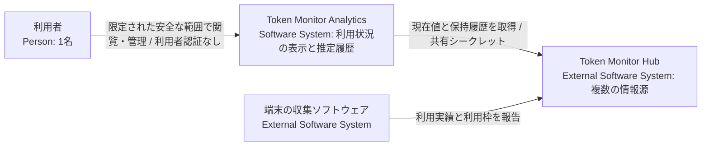
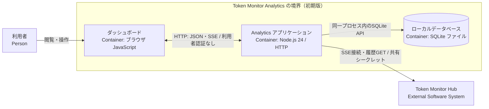
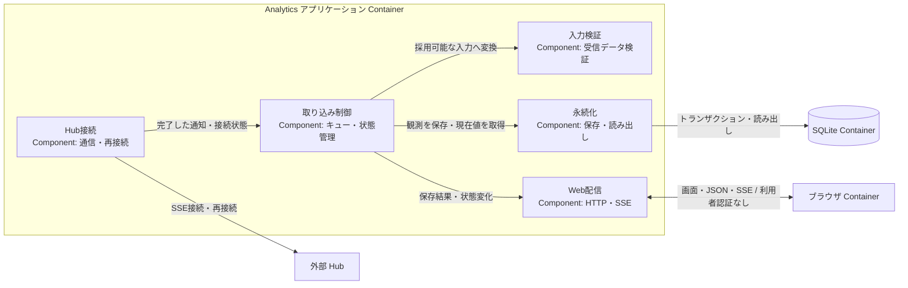
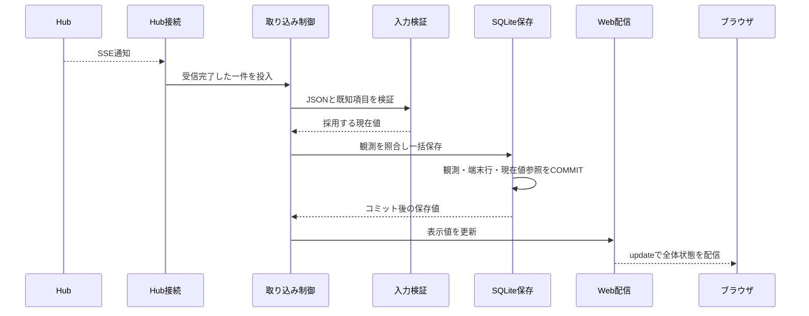

# アーキテクチャ設計書

本書は、Token Monitor Analytics のシステム境界、構造、データモデル、状態の更新責務、および実行時の保存・通知境界を定義する設計書です。動作と検証条件は [機能仕様](../doc/spec/functional-spec.md)、Hub API の取得値・制約・調査根拠は [連携仕様](../doc/spec/interfaces.md)、製品要件は [設計方針](design-policy.md)、用語定義は [CONTEXT.md](../CONTEXT.md)、未決事項は [PLAN.md](../PLAN.md) を参照してください。

現行仕様に基づく実装は未着手です。本書の構成・処理は設計を示し、実装・検証状況は [PLAN.md](../PLAN.md) で管理します。

## 1. 目標・制約と対象スコープ

複数 Hub から AI サービスの利用状況を収集・可視化し、同一契約・利用枠・対象期間の実測増分から利用許容量を推定します。Node.js 24 LTS の単一常駐プロセス、組込 SQLite、限定された安全な範囲での利用者認証なしの運用、Windows 先行対応などの前提制約は [設計方針](design-policy.md) に従います。

- **初期版の設計対象**: 複数 Hub の並行管理（登録・停止・再開）、現在値表示、利用許容量の推定、日次・月次実績の定期収集・補完、安全な手動更新。
- **実装の出発点**: 起動・設定、現在値の受信・検証・保存・表示、再接続、Mock Hub と検証環境から作成します。

## 2. システム境界（Context and Scope）

### 2.1 C4 Context

Analytics は Hub への接続設定と自身のローカルデータを管理します。端末からの直接データ収集や、Hub 側データ・契約情報の直接管理は行いません。

### 2.2 Hub 連携の境界

Hub との経路・認証、受信項目、保持履歴の制約、調査版と確認範囲の正本は [連携仕様](../doc/spec/interfaces.md) です。現在値の観測と保持履歴は別の入力として扱い、受信後の処理と保存の境界を本書 第4〜6節に定めます。上流との互換性検証は [U1](../PLAN.md#u1) に残ります。

## 3. 解決方針 (Solution Strategy)

1. **確実な識別と推定の分離**: 契約・利用枠の同一性が確認できる範囲でのみ利用許容量を推定する。帰属が特定できない取得値も、集計単位・取得状態・時刻を明記してそのまま可視化する。
2. **並行受信と直列処理**: SSE の現在値と GET の履歴データは並行して受信し、受信完了後の照合・計算・保存は [単一の処理キュー](ard/0001-serial-processing-queue.md) で直列化する。通信待機はキュー外で行い、保存成功時のデータ更新通知と異常時の状態通知を明確に分離する。
3. **状態の独立管理と履歴保全**: Hub 接続、収集設定、データ保存、推定可否を独立した状態として管理し、一部の障害が安全な閲覧や他 Hub の通信に影響しないようにする。取得済みの実績履歴は保全し、再取得データで非破壊更新する。

## 4. 構成要素 (Building Block View)

### 4.1 C4 Container

ブラウザは独立したクライアント環境、SQLite は Node.js プロセスに組み込まれた永続化境界です。Analytics は単一常駐プロセスとして動作し、初期版の Web 経路（HTML、静的ファイル、JSON API、ブラウザ向け SSE）は利用者認証なしで提供します。利用範囲は利用者が管理する限定された安全な範囲とし、Hub への接続は共有シークレット認証を使用します。

### 4.2 C4 Component（アプリケーション内部構成）

| コンポーネント | 主な責務 |
| --- | --- |
| 起動・終了 | 設定読み込み、HTTP サーバー起動、DB 接続・終了処理、シャットダウン |
| Hub 接続 | 共有シークレット認証、SSE チャンク受信、自動再接続、通信キャンセル |
| 入力検証 | JSON 構文、型、必須フィールド、数値範囲の検証、安全なデータへの正規化 |
| 取り込み制御 | 受信データの直列キューイング、各状態管理、表示用データの保持 |
| 永続化 | Hub 設定、観測データ、端末別データ、履歴のトランザクション管理と読み書き |
| Web 配信 | 静的ファイル配信、REST API、ブラウザ向け SSE 配信、管理要求の受け渡し |

※ 本コンポーネント構成は責務の論理境界を示し、ファイル配置は実装時に決めます。初期版開発において、契約・枠の照合と推定、保持履歴取得、Hub 管理、手動更新の各責務を順次具体化します（[PLAN.md](../PLAN.md) の各未決事項を参照）。

## 5. 識別・状態・保存 (Crosscutting Concepts)

### 5.1 同一性の判定規則

| 対象エンティティ | 同一性判定の規則 | 設計・実装状況 |
| --- | --- | --- |
| Hub | Analytics への登録単位で分離（URL のみで判定しない） | 未実装。設定・Web 管理の契約は [U7](../PLAN.md#u7) |
| 端末 | Hub と `deviceId` の組み合わせで識別。ID 変更時は別端末として扱い自動名寄せは行わない | 比較基準への反映方針は [U5](../PLAN.md#u5) で検討 |
| 契約 | プロバイダーのアカウントおよび契約単位で識別。名称一致のみでの機械的結合は行わない | 結合根拠は [U2](../PLAN.md#u2) で検討 |
| 利用枠 | 同一契約内の枠として識別。複数端末から報告された同一枠の消費率を単純合算しない | プロバイダー別規則は [U4](../PLAN.md#u4) で検討 |
| 対象期間 | 利用枠識別後、同一枠の有効な `resetsAt`（リセット予定日時）で区別（日次・月次集計期間とは独立） | [機能仕様 第1.3節](../doc/spec/functional-spec.md#13-比較区間と対象期間)の規則を適用 |
| 現在値観測 | 受信ごとの加算を行わず、観測時点のスナップショットとして扱う | 再受信判定は第5.3節、推定照合は U3・U4 |
| 日次実績 | Hub、端末、現地暦日、ツールの組み合わせで一意に特定し更新 | 未実装（日付境界判定は U6） |
| 月次実績 | Hub、端末、現地月、ツールの組み合わせで一意に特定し更新 | 未実装 |

単一フィールドで枠を同定できない根拠は [連携仕様の利用枠・アカウント情報](../doc/spec/interfaces.md#limit-fields) に記載します。帰属と枠識別の成立条件を具体化するまで、U2・U4 は未決です。

### 5.2 比較基準と推定結果の管理

計算式、観測の採用条件、比較区間、期間遷移、結果の表示は [機能仕様 第1節](../doc/spec/functional-spec.md#estimation) を正本とします。

その規則を適用する責務には、観測の同一性・順序の照合、比較基準の更新、結果・不可理由の生成、保存への引き渡しが必要です。帰属する実績項目は [U2](../PLAN.md#u2)、枠識別は [U4](../PLAN.md#u4)、担当と一括保存範囲は [U3](../PLAN.md#u3)、端末別基準は [U5](../PLAN.md#u5) で具体化します。機能仕様の補完だけでこれらを解決済みにはしません。

### 5.3 保存モデルと確定点

| データエンティティ | 永続化規則 | 実装状況 |
| --- | --- | --- |
| Hub 設定・端末 | 情報源を分離して管理 | 未実装 |
| 現在値観測・現在値参照 | 状態変化した観測を追記し、端末データと現在値参照を同一トランザクションで更新 | 未実装 |
| 契約・利用枠の対応 | 契約と枠の対応関係を保持 | U2・U4 に依存 |
| 比較基準・推定結果 | 起点・最新の観測対応、算出時点、対象区間、推定不可理由を保持 | U3・U5 に依存 |
| 日次・月次実績 | 複合キーに基づき再取得データで更新（過去レコードは保持） | 未実装（U6） |
| Hub 収集設定 | 有効／停止フラグを永続化し再起動時に復元 | 未実装（U6） |
| 履歴取得ステータス | 定期取得の完了状況および最終成功日時を記録 | 未実装（U6） |

1受信通知に含まれる観測データ、全端末行、現在値参照を単一トランザクションでコミットします（失敗時はロールバック）。物理テーブル定義は実装時に具体化します。

コミット完了後、確定値を用いて UI 配信用の状態を更新しクライアントへ `update` を通知します。永続化コミットと画面通知は独立した確定点であり、コミット完了後の障害処理は [U9](../PLAN.md#u9) で扱います。

### 5.4 日次・月次実績の保存

保存対象の日付・非破壊更新・表示は [機能仕様 第3節](../doc/spec/functional-spec.md#history)、取得と成功条件は [S2](../doc/spec/functional-spec.md#s2) に従います。履歴の照合は第5.1節のキーを使い、履歴行と取得完了状態・最終成功日時を保存する担当とトランザクション境界は [U6](../PLAN.md#u6) で定めます。GET の処理が比較基準の更新責務を持つことはありません。

### 5.5 独立した状態管理と UI 表示

以下の状態は独立して管理し、単一の状態フラグに統合しません。

| 管理対象 | 状態の定義と更新主体 | 永続化と復元方針 |
| --- | --- | --- |
| Hub 接続状態 | Hub 接続が接続・切断・通信エラーを検知し、取り込み制御が管理 | メモリ管理（起動時の実通信で判定） |
| 入力バリデーション | 入力検証が判定。不正時は取り込み制御がエラー理由を設定し正常受信で解除 | メモリ管理（保存済みデータは維持） |
| データ保存状態 | 永続化時の例外検知により、取り込み制御が「保存失敗」を設定して書き込みを停止 | メモリ管理（原因解消後の再起動で復旧） |
| Hub 収集設定 | ユーザーの管理操作により「有効／停止」を切り替え | SQLite に永続化（再起動時に復元） |
| 利用許容量の推定可否 | 契約・枠・期間の整合性に基づき「算出可能／推定不可」を判定 | 算出結果および理由を SQLite に記録 |
| ブラウザ接続状態 | ブラウザクライアントが Analytics との SSE 接続状態を管理 | クライアント側で管理 |

各状態の表示規則は [機能仕様 第2節](../doc/spec/functional-spec.md#display)、停止と保存失敗の併記は [S5](../doc/spec/functional-spec.md#s5) に従います。

### 5.6 排他制御と通知シーケンス

1. **直列キュー**: 受信完了したデータのみを共通の単一キューへ投入し、キュー内で照合・計算・保存を直列に処理します（通信待機はキュー外で実行）。
2. **ブラウザ向け通知**: 接続確立・状態変化時は `status` イベント、データ保存成功時は `update` イベントで通知します（保存失敗時は `status` で異常通知のみ行い、誤ったデータ更新通知は行いません）。

## 6. 重要な実行時シナリオ (Runtime View)

S1〜S9 は [機能仕様](../doc/spec/functional-spec.md#scenarios)・設計・モック・テストで共通して使用する ID です。動作と検証条件の正本は機能仕様の同じ ID とし、本節は更新担当、保存・通知の確定点、未決の処理境界を記載します。仕様と本節を合わせて初期設計の完了基準を確認します。

### S1. 通常の現在値受信と再受信

現在値の受信・保存・表示は未実装・未検証です。推定処理は U2〜U5 の確定に依存しますが、観測単位の保存・表示は契約別推定と独立して実装します。

- **処理境界**: 取り込み制御が入力検証結果を受け、永続化が観測・端末行・現在値参照を一括コミットした後に表示値を更新し、Web 配信へ通知します。変更のない再受信ではタイムスタンプのみを更新します。不正入力の状態通知も取り込み制御が担当します。
- **動作・検証条件**: [機能仕様 S1](../doc/spec/functional-spec.md#s1)。推定の責務・一括保存範囲は第5.2節の未決事項に依存します。

### S2. 補完中の新規受信と定期取得

取得契機、成功条件、再試行、日付・表示と検証条件は [機能仕様 S2](../doc/spec/functional-spec.md#s2) に従います。通信待機はキュー外で行い、受信完了した GET と SSE を共通キューで処理します。GET の保存先は第5.4節です。

取得完了状態を更新する担当と保存境界、競合する GET の発行・キャンセル・古い応答の採否は [U6](../PLAN.md#u6) に残ります。取得成功に保存完了を含める仕様と、これを実現するトランザクションの未決を区別します。

### S3. 切断と再接続

Hub 接続が切断を検知して取り込み制御へ状態を通知し、キュー外で再接続待ちを行います。既存設計の再接続間隔は既定3秒です。再接続で受けた現在値は S1、履歴は S2 の処理へ渡します。動作と検証条件は [機能仕様 S3](../doc/spec/functional-spec.md#s3)、欠測後の推定再開は [U3](../PLAN.md#u3) に従います。

### S4. リセット・継続性不明・帰属不明

判定結果と検証条件は [機能仕様 S4](../doc/spec/functional-spec.md#s4) に従います。第5.2節の比較基準管理が必要であり、期間変更・推定不可に伴う基準と結果・理由の更新担当、一括保存の範囲は [U3](../PLAN.md#u3) で定めます。帰属・枠識別が未決の対象について、仕様の記載だけでこのシナリオを設計完了としません。

### S5. Hub 個別の収集停止と再開

受信単位、受付前後のデータ採否、停止・保存失敗の表示と検証条件は [機能仕様 S5](../doc/spec/functional-spec.md#s5) に従います。通信キャンセル、受信済みキューの処理、SQLite への設定保存、通知を対応付ける必要があります。

管理操作の担当と共通キューへの対応、停止設定保存と受信済み処理の順序、保存失敗・再起動・停止再開競合時の設定復元は [U6](../PLAN.md#u6)・[U7](../PLAN.md#u7) に残ります。遅着応答の破棄は確定仕様であり、キャンセル方式の未決と混同しません。

### S6. データ保存失敗

データベース書き込み処理で例外が発生した場合の処理シナリオです。

- **処理フロー**: コミット前の例外発生時はロールバックし、取り込み制御が「保存失敗」を設定して後続の書き込みを安全に停止します。直前の正常表示データおよび通信接続は維持し、原因解消後の再起動で復旧します。
- **動作・検証条件**: [機能仕様 S6](../doc/spec/functional-spec.md#s6)。コミット後の読み出し・通知失敗と DB 参照不能、共有 DB の影響範囲は [U9](../PLAN.md#u9) に残ります。

### S7. 再起動とシャットダウン

- **起動シーケンス**: 設定情報および保存済み現在値を読み込み、HTTP 待受開始後に有効な Hub へ SSE 接続します（停止設定された Hub への接続は抑止）。
- **シャットダウンシーケンス**: 新規通信を停止し、キュー処理完了を待機後、ブラウザ接続、HTTP サーバー、SQLite 接続の順に安全にクローズします。
- **動作・検証条件**: [機能仕様 S7](../doc/spec/functional-spec.md#s7)。比較基準と設定・取得完了状態の復元責務は U3・U5・U6 に依存します。

### S8. Hub 管理操作

Web 配信は初期版で利用者認証を行わず、管理要求を入力検証・CSRF 検証後に管理処理へ渡します。操作契約、CSRF の方式、管理処理の担当、秘密情報の保存、結果通知の確定点は [U7](../PLAN.md#u7) に残ります。動作・検証条件は [機能仕様 S8](../doc/spec/functional-spec.md#s8)、後続の利用者認証は [U12](../PLAN.md#u12) を参照します。

### S9. 手動更新と障害復旧

動作と検証条件は [機能仕様 S9](../doc/spec/functional-spec.md#s9) を参照します。取得・適用・再起動・互換性確認の実行主体と順序、途中失敗時に残るファイル・データ、復旧手順は [U8](../PLAN.md#u8) で定めます。

## 7. 配置と運用 (Deployment View)

Windows 環境上に Node.js アプリケーションとローカル SQLite ファイルを配置し、利用者が管理する限定された安全な範囲でブラウザからアクセスします（Linux 環境は後続対応）。初期版の利用者認証はありません。

- **環境設定**: `.env` でポート等の実行設定を与え、Hub 接続設定と共有シークレットの管理は [U7](../PLAN.md#u7) で具体化します。DB ファイルは既定で `data/analytics.sqlite` を使用します。
- **起動・検証環境**: Node.js の依存関係、起動・終了手順、設定例、Mock Hub、テスト実行環境は [PLAN.md の基礎機能](../PLAN.md#unimplemented) として新規作成します。Mock Hub は開発・テスト用であり本番の常駐プロセスではありません。

## 8. 設計判断 (Architecture Decisions)

主要な設計判断は ADR（Architecture Decision Records）として記録しています。

- [ADR 0001: 共通キューによる処理の直列化](ard/0001-serial-processing-queue.md)（Adopted）: 並行受信したデータの照合から保存までを単一キューで直列化し整合性を担保（通信待機はキュー外で実行）。
- [ADR 0002: モック駆動開発の採用方針](ard/0002-adopt-mock-driven-development.md)（Proposed）: 本番用 UI を共用し動作する画面で認識を合わせる開発プロセスの提案。
- [ADR 0003: モック開発の補助製品選定](ard/0003-select-mock-tooling.md)（Proposed）: Storybook、MSW、Playwright の組み合わせ案と最小構成案の比較検討。

## 9. 品質確認とリスク管理 (Quality Requirements / Risks)

製品の品質要求および完了条件は [設計方針 第6節](design-policy.md#product-completion) に従います。

[機能仕様 S1〜S9](../doc/spec/functional-spec.md#scenarios) の検証条件と本書の担当・保存境界を組み合わせて確認します。今回の文書統合は未決事項の解消や、実装・実機検証の完了を意味しません。

- **調査の証跡**: 固定版の上流調査と [Private Hub の実データサンプル](reference/hub-private/README.md) の取得条件は [連携仕様](../doc/spec/interfaces.md) に記録しています。単発応答は継続接続や現行実装の動作を保証しません。
- **現行の未検証範囲とリスク**: 起動・終了、現在値の受信・検証・保存・表示、再接続、保存障害、管理操作、複数 Hub、履歴補完、推定、手動更新を含め、現行実装の動作はすべて未検証です。必要な検証を [PLAN.md](../PLAN.md) で追跡します。
