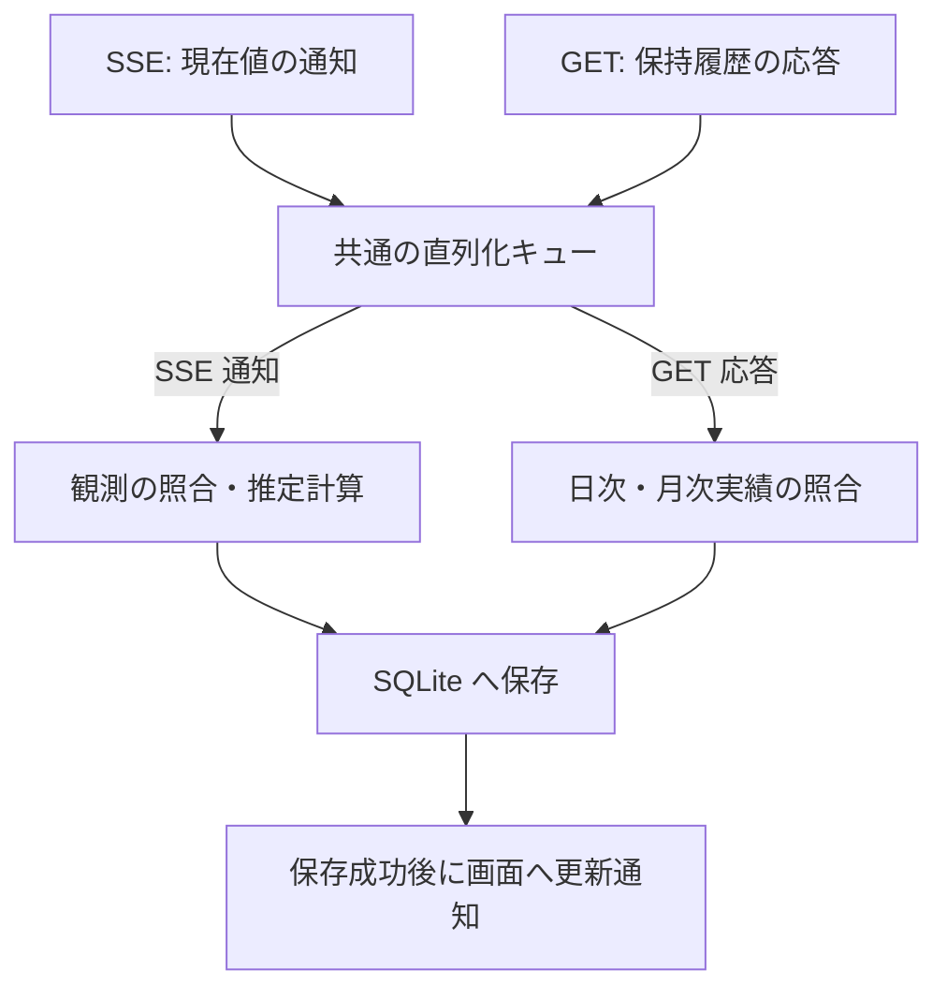

# アーキテクチャ設計書

本書は、上流 Token Monitor Hub の調査結果に基づく、本システムの構成・データ識別・永続化・並行制御のアーキテクチャ設計を定義する。
機能・業務ルールは [機能要件](requirements.md)、目標・品質要求は [設計方針](design-policy.md)、進め方は [文書方針](document-policy.md)、具体仕様は [機能詳細設計](functional-design.md)、用語は [用語定義](../CONTEXT.md) を参照のこと。

## 1. 調査対象と根拠

上流リポジトリ [Token Monitor](https://github.com/Javis603/token-monitor)（`upstream/token-monitor`）のソースコードおよび実環境での応答を調査した。

- **基準コミット**: `2f60827e3028d283969dd74cde5b3f5664220442`（タグ `v0.56.0`）
- **重点確認対象**: Claude および Codex プロバイダー
- **実機検証**: 稼働中の Private Hub（Cloudflare Worker 実装、`coreRevision: 36`、`runtimeRevision: 3`）への接続・API 応答を確認（詳細は [実データ資料](reference/hub-private/README.md) 参照）

| 根拠資料 | 主な確認内容 |
| --- | --- |
| [API 仕様書](../upstream/token-monitor/docs/API.md) | 認証方式、ヘルスチェック、データ投入・集計仕様、契約情報 |
| [Node Hub 実装](../upstream/token-monitor/src/hub/server.js) | `getStats`, `getDevices`, `getHistory`, SSE 配信、リクエスト処理 |
| [Worker Hub 実装](../upstream/token-monitor/worker/src/index.js) | Durable Object による永続化・集計、SSE 配信、公開統計 |
| [利用実績の集計](../upstream/token-monitor/src/shared/usage.js) | 端末レコードの正規化・マージ、セッション集約、履歴集計 |
| [履歴処理](../upstream/token-monitor/src/shared/history.js) | 履歴データの正規化、プレビュー生成、履歴リビジョン管理 |
| [利用枠の正規化](../upstream/token-monitor/src/shared/limits/core.js) | 枠ウィンドウの正規化、プロバイダー別集約 |
| [利用枠の収集状態](../upstream/token-monitor/src/shared/limits/runtime.js) | 最終成功値と最新試行状態の分離管理 |
| プロバイダー実装 | [Claude](../upstream/token-monitor/src/shared/providers/claude/limits.js) / [Codex](../upstream/token-monitor/src/shared/providers/codex/limits.js) の枠生成 |
| 収集とリセット境界 | [収集処理](../upstream/token-monitor/src/shared/collector.js) / [リセット境界の更新](../upstream/token-monitor/src/shared/limits/resetBoundary.js) |

※ 手元のサブモジュール更新（新リビジョン）との互換性確認は未確認事項（U1）として扱う。

## 2. Hub API の確認済み事実

### 2.1 取得経路と認証

| 経路 | 内容 | 本システムでの扱い |
| --- | --- | --- |
| `GET /api/health` | 認証不要。`runtime`, `version`, `hubBuild`, `secretRequired` 等を返却。 | `version` は製品リリース番号ではなく、`hubBuild` は登録ソース識別子。 |
| `GET /api/stats` | 全端末の期間集計、端末別実績・利用枠、集約利用枠、履歴プレビュー。 | 集計スナップショットであり、利用イベント一覧ではない。 |
| `GET /api/stats/stream` | 接続時の `snapshot` イベントおよび以後の `stats` イベント（SSE）。 | `{ type, reason, stats, at }` 形式の集計スナップショット配信。 |
| `GET /api/devices` | 保持端末レコードの一覧（`periods`, `limits`, 任意の `history` 等）。 | 端末別の保持履歴を取得する主経路（SSE には履歴本体が含まれない）。 |
| `GET /api/history` | 端末合算の `daily`, `monthly`, `summary`。 | 全体集約値であり、端末・契約別の履歴補完には利用しない。 |
| `GET /api/subscriptions` | Hub 内で共有される手入力の契約・支払情報。 | 実績との確実な紐付け証拠にならないため初期版では不採用。 |

- **認証方式**: 保護経路へのアクセスには、共有シークレットを `Authorization: Bearer <secret>` または `X-Token-Monitor-Secret: <secret>` ヘッダーで送信する（URL クエリには含めない）。
- **未設定・公開経路の挙動**:
  - Node Hub: シークレット未設定時はループバックにバインドし認証なしで通過。
  - Worker Hub: シークレット未設定時は保護経路へのアクセスを 503 で拒否。公開経路 `/api/public/stats` は端末・アカウント識別情報が欠落するため使用しない。

### 2.2 SSE・順序性・再接続

- **SSE の仕様**: `event:` と `data:` を出力し、30 秒間隔でコメント形式の heartbeat を送信する。`id:`, `retry:`, `Last-Event-ID` による再送や履歴カーソル機能はない。
- **再接続とデータ特性**: 再接続時に取得できるのはその時点のスナップショットであり、切断中の観測データは再送されない。
- **タイムスタンプと順序性**: ペイロード内の `at` や `updatedAt` は集計・応答時刻であり、利用発生時刻やシーケンス番号ではない。API 間および SSE との間で共通利用できる単調増加の版番号はなく、到着順序のみで新旧は判定できない。

### 2.3 利用実績と履歴

| 項目 | 仕様・制約 |
| --- | --- |
| `deviceId` | Hub 内の端末識別キー。Hub 間の一意性や端末再設定後の継続性は保証されない。 |
| `periods.today / month / allTime` | 各期間の累積集計値。`costUsd`（API 換算額）等は累積値であり、受信ごとの加算は不可。 |
| セッション内訳 | ツール・セッション・モデル等の情報は含むが、アカウント識別子（`accountKey`）や契約 ID は含まない。 |
| `periodWindows` | 期間キー、終了時刻、タイムゾーン。端末側のカレンダー境界であり利用枠境界とは異なる。 |
| 日付境界処理 | Hub 集計では期間終了後に該当端末の `today/month` を合計から除外する（`allTime` は維持）。合算額の減少が利用枠リセットを意味するとは限らない。 |
| `historyAvailable` と `history` | `true` でも履歴配列が空の場合がある。端末更新日時にかかわらず保持履歴が古いまま残る場合がある。 |
| 保持履歴 | 標準では日別集計を直近 370 日分保持。任意の日付を遡って復元できる保証はない。 |
| 履歴 GET 応答 | 保持中の全履歴を一括返却。期間指定、ページング、過去利用枠履歴の取得機能はない。 |
| `historyRevision` | 変更検出用のハッシュ値であり、単調増加の版番号や再送カーソルではない。 |

- **利用枠のみ更新時の注意**: 利用枠のみの更新（`limitsOnly`）時は、実績値を維持したまま端末の更新日時（`updatedAt` / `receivedAt`）のみが更新される。実績と利用枠が同一レコード内にあっても同一時点の測定とは限らない。
- **タイムゾーンの扱い**: 日次履歴（`daily`）は送信元の現地暦日ごとの集計値であり、タイムゾーン情報や利用時刻明細を持たない。そのため、本システムではタイムゾーン変換や按分を行わず、端末の現地日付をそのまま保持する。

### 2.4 利用枠・アカウント・観測時刻

利用枠は `limits.providers[]` に格納され、プロバイダー名、`accountKey`、表示用アカウント名・プラン名、`status`, `source`, `updatedAt`, `windows[]` 等を保持する。

| 項目 | 仕様・制約 |
| --- | --- |
| `accountKey` | 上流が生成するアカウント識別子。公式の契約 ID ではなく、プロバイダー共通の永続性規則もない。 |
| 集約利用枠 | 同一キーの候補から鮮度や状態に基づき代表値を選定（単純な合算値ではない）。 |
| `windows[].kind` | `session`, `daily`, `weekly`, `billing` 等。同一種類の枠が複数存在し得る。 |
| `limitId` / `additional` | 利用枠識別の補助項目（任意設定）。プロバイダーごとに体系が異なる。 |
| `usedPercent` | 0～100 に正規化された消費率（欠落時は `null`）。 |
| `resetsAt` / `windowMinutes` | 予定されるリセット時刻および期間長（リセット発生の通知ではない）。 |
| `boundaryKind` / `showMeter` | リセット以外の失効（残高等）や、割合メーター非表示の枠も存在。 |
| `status` と `updatedAt` | 更新試行の状態・時刻を表し、測定時刻と一致するとは限らない。 |

- **Claude**: Web/OAuth 経由ではアカウント ID・組織 ID・メールアドレスから `accountKey` を生成。同一アカウント ID では組織切り替えがキーに反映されない。短時間枠、週次枠、モデル限定枠が併存するため `kind` のみでは一意に特定できない。
- **Codex**: メールアドレスとワークスペースのアカウント ID の組み合わせからキーを生成。同一 `limitId` 内に短時間枠と長時間枠が併存するため `limitId` のみでは一意にならない。
- **収集状態（`LimitsRuntime`）**: 一時エラー時は直前の成功値を保持しつつ `status` を更新する。枠データが存在すること自体を観測成功の証拠として扱ってはならず、`stale: false` のみで鮮度は保証できない。

### 2.5 上流の永続化と通知の限界

- **Node Hub**: メモリ上の変更を JSON ファイルへ保存した後に SSE を配信するが、保存失敗時にメモリ状態をロールバックしない。
- **Worker Hub**: Durable Object への永続化完了後に配信するが、配信到達自体の保証はない。
- **永続化と通知の順序制御**: 上流側に受信完了を確認する仕組みはないため、本システム側で永続化（SQLite）と画面通知の順序を厳密に制御する必要がある。

## 3. 識別・推定の設計原則

### 3.1 情報源と対象の識別単位

| 対象 | 識別の原則 |
| --- | --- |
| Hub | 本システム内の登録単位で管理し、配下の全データを紐付ける。 |
| 端末 | Hub 登録単位と `deviceId` の組み合わせで分離。ID 変更時は名寄せせず別端末として扱う。 |
| 契約 | プロバイダーのアカウント情報と契約を区別し、ツール名やプラン名のみで帰属させない。 |
| 利用枠 | 契約内で枠の種類および識別情報を組み合わせて特定。複数端末の消費率は合算しない。 |
| 対象期間 | 利用枠のリセット予定時刻 `resetsAt` を基準に区切る（日別・月別集計期間とは分離）。 |
| 利用実績 | 端末・ツール・集計期間に属する累積値として扱い、重複加算しない。 |
| 保持履歴 | 日別（Hub・端末・日付・ツール別）、月別（Hub・端末・月・ツール別）を明確に区別して保持する。 |

※ 端末再設定に伴う過去データの手動関連付けは、初期版では実装せず将来要件とする。

### 3.2 設計原則

- **再受信と二重計上防止**: SSE は現在値の観測照合、GET は履歴更新として処理する。受信イベント数を加算する処理は行わず、一意キーに基づき冪等に更新する（[機能要件 第 6 節](requirements.md#6-分離重複防止と端末の扱い) 参照）。
- **推定条件と計算区間**: 同一対象期間内で比較可能な最初と最新の観測を用い、最長区間の差分から利用許容量を算出する。算出時点の推定結果を保持し、過去データの遡及改変は行わない（[機能要件 第 2 節](requirements.md#2-利用許容量の推定)、[機能詳細設計 第 1 節](functional-design.md#1-推定観測と対象期間の対応) 参照）。
- **リセットと欠測の判定**: 枠自体の同一性と対象期間の同一性を分離して管理する。リセット予定時刻（`resetsAt`）の更新を契機に比較基準を適切に切り替える。
- **表示と推定の分離**: 推定が成立しない場合でも、取得できた利用枠や実績はすべて状態・時刻とともに表示・保存する（[機能要件 第 3 節](requirements.md#3-取得情報の表示) 参照）。
- **日次・月次実績の独立管理**: GET で取得する日次・月次実績は推移閲覧専用とし、現在値観測や推定の比較基準とは独立して保存・管理する（[機能要件 第 4 節](requirements.md#4-日次月次実績の保存と利用) 参照）。

## 4. 保存が必要な情報と再取得の限界

| 保存対象 | 保持の目的 | Hub から再取得できる範囲 |
| --- | --- | --- |
| Hub・端末・契約・利用枠の識別情報 | 情報源や契約の混同防止 | 現在の端末・アカウント情報のみ（過去の関連付けは保証外） |
| Hub ごとの収集設定（有効・停止） | 再起動後も指定された設定を維持 | Analytics 独自の設定のため再取得不可 |
| SSE から採用した観測 | 増分の比較基準、鮮度・推定根拠の保持 | 現在のスナップショットのみ（過去の観測は復元不可） |
| 端末別の保持履歴（日次・月次） | 重複排除および Hub 保持期限（370 日等）を超えた履歴保全 | Hub がその時点で保持する履歴のみ |
| 確定済みの比較基準と処理状態 | 再起動後の二重計上防止および処理順序の維持 | 本システムの内部状態のため再取得不可 |
| 推定結果・算出日時・根拠データ | 算出時点の推定履歴の保全（遡及改変防止） | 本システムの独自生成データのため再取得不可 |
| 推定不可の理由と対象区間 | 欠測や不整合の理由の追跡 | 本システムの判定履歴のため再取得不可 |
| 定期取得の実施状況・最終成功日時 | 日次取得の未完了判定および失敗の追跡 | 本システムの実行状態のため再取得不可 |

※ 保存データには表示・計算に必要な項目のみを選定し、認証情報は含めない。

## 5. 未確認事項と設計への影響

| ID | 現在の状態 | 判断が必要な点 | 実装・検証での扱い |
| --- | --- | --- | --- |
| U1 実機接続と互換性 | 固定コミットのソース調査と Private Hub の単発取得に加え、Windows 上で初回 SSE `snapshot` の入力検証・一時SQLite保存まで確認済み。 | 継続更新・切断再接続や新リビジョン全体との互換性は未確認。Linux は未検証。 | 実 Hub の継続更新・切断再接続・長時間稼働を確認し、Linux 対応時に OS 間の差異を検証する。 |
| U2 実績の契約帰属 | 帰属不明時は推定不可とする方針は確定。実績側に契約結合キーがないことを確認済み。 | 利用額が単一契約に対応することをどの根拠で確定するか。 | 成立条件に基づく項目対応と判定分岐の実装。 |
| U3 比較区間の管理 | 同一 SSE 内の値を 1 組とし、最長区間で計算する方針は確定。 | 比較基準を管理する責務と、観測・推定結果を一括更新する範囲。 | 永続化設計およびトランザクション手順の具体化。 |
| U4 利用枠の特定 | 枠の同一性と対象期間を分ける方針は確定。補助項目（`kind`, `limitId`）の限界を確認済み。 | 利用枠の同一性を確定する単位と、特定不能な枠の論理モデル上の扱い。 | 各プロバイダーの枠識別ルールの確定と例外処理。 |
| U5 端末 ID 変更 | 別端末として分離し、手動関連付けは将来要件とする方針は確定。 | 端末ごとの比較基準・保存データの分離構造への反映。 | 初期の論理・物理 DB 定義。 |
| U6 受信処理とタイムゾーン | 独立受信・直列保存・現地日付維持の方針は確定。端末のタイムゾーン欠落時の影響を整理済み。 | キュー管理責務、保存境界、およびタイムゾーン欠落時の当日除外判定。 | 日付判定の分岐処理、定期取得タイマー、通信キャンセル制御。 |

### 5.1 契約帰属（U2）と利用枠特定（U4）の成立条件

上流ソース調査（`usage.js`, `limits/core.js`, 各プロバイダー実装）により以下の事実を確認している。

- **実績の契約非保持**: 実績データ（`usage.js`）はツール別のコストを保持するが、アカウント識別子（`accountKey`）や契約 ID は保持しない。そのため、端末・ツールの利用額を利用枠のアカウントへ直接結合することはできない。
- **枠特定キーの制約**: 利用枠（`limits/core.js`）は `kind`, `limitId`, `resetsAt` 等を保持するが、Codex では同一 `limitId` に複数枠が存在し、Claude では同一 `kind` にモデル別枠が存在するため、単一項目では一意に特定できない。
- **設計への影響**: 複数契約が混在する可能性のある利用額から個別契約の利用許容量は推定しない。「画面上のアカウントが 1 つである」ことのみをもって帰属を確定せず、帰属が特定できる条件が明確になるまで推定不可として扱う（取得情報の表示は維持）。

### 5.2 タイムゾーンと当日判定（U6）

上流の収集処理（`collector.js`）では、端末の `periodWindows.timeZone` に基づき日付境界が計算されるが、欠落や不正値の場合はタイムゾーン情報が省略される。また、日次履歴自体にはタイムゾーンや利用時刻明細が含まれない。

- **設計への影響**: タイムゾーン情報が欠落している場合、取得時点における安全な当日除外判定の条件が必要となる。他タイムゾーンでの代用や推測は行わず、端末の現地日付を維持する。

## 6. 受信データの処理と保存

SSE（現在値観測・推定）と GET（履歴収集）は独立して並行受信し、受信後は **共通の単一キュー** に投入して 1 件ずつ直列に処理・保存する。SQLite への保存成功後にブラウザへ更新通知を配信する。

| 入力種別 | 処理内容 |
| --- | --- |
| SSE 通知（`snapshot` / `stats`） | 入力検証後、比較基準と照合して利用許容量を推定し、観測・推定結果・比較基準を保存。推定不可の場合も現在値は保存・表示する。 |
| GET 応答（`/api/devices`） | 入力検証後、保持履歴を照合し前日以前の日次実績および月次実績を保存・更新（現在値表示や推定には影響させない）。 |

#### 単一キューによる直列化の理由
並行受信時に同一の比較基準を同時に参照・更新すると不整合や重複計算の原因となるため、照合から保存までの一連の処理を直列に実行する。通信の待機はキューの外側で並行処理するため遅延要因にはならず、保存失敗時は更新通知を抑制して安全に書き込みを停止する。

### 6.1 接続制御と履歴の定期取得

- **独立制御**: SSE の開始は履歴 GET の完了を待たず、履歴の定期取得・再試行も SSE とは独立して制御する。
- **キューの分離**: ネットワーク通信の待機処理はキューに入れず、受信完了したペイロードのみをキューに投入する。
- **状態管理**: 接続状態（接続中、未接続）と収集設定（有効、停止）を明確に分離して管理する。

### 6.2 受信・並行制御の検証観点

実装時に確認すべきアーキテクチャ・並行制御上の検証観点は以下のとおりである。

| シナリオ | 検証観点 |
| --- | --- |
| GET の遅延・失敗 | SSE の接続・現在値表示・推定計算が継続し、他 Hub の処理を阻害しないこと。 |
| GET と SSE の同時到着 | 共通キューで順次処理され、GET 応答が現在値表示や推定計算に混入しないこと。 |
| 長時間常駐での定期取得 | SSE 接続維持中も、所定の実行時刻に定期 GET が自動実行されること。 |
| 通信失敗と復帰 | GET の通信失敗時は所定間隔で再試行され、成功後は不要な再試行が行われないこと。 |
| 収集設定の永続化と復元 | 再起動後も Hub ごとの設定（有効/停止）が維持され、有効な Hub のみ自動接続されること。 |
| タイムゾーン差異 | 各端末の現地日付が保持され、当日分が端末ごとの日付基準で正しく除外されること。 |
| SQLite の保存失敗 | 更新成功通知を出さずに書き込みを停止し、安全に参照できる状態を維持すること。 |
| 収集停止と再開 | 停止操作で該当 Hub の全通信が即座に停止し、再開操作で正常復帰すること（他 Hub や閲覧は維持）。 |

### 6.3 収集停止と再開の制御

- **設定の永続化**: Hub ごとの収集設定（有効/停止）は SQLite に保存し、起動時に読み込む。上流の稼働状態から設定を推測しない。
- **通信遮断とキュー**: 収集停止が指示された場合、該当 Hub の通信を即座に停止する。停止要求前に受信完了したデータのみキューで正常に処理・保存し、未完了の通信は破棄する。

### 6.4 段階 A の実装境界

最初の実装では、現在値の受信・保存・表示を一つの Hub で確認する。推定・履歴 GET・Hub 管理操作は後続段階で実装する。通信設定は Git 管理外の `.env` に置き、同じ `HUB_ID` に別の接続 URL を設定した場合は起動を拒否する。情報源の混同を防ぐためであり、URL 変更時の移行操作はこの段階では提供しない。

| 責務 | 境界と理由 |
| --- | --- |
| Hub 接続 | 認証ヘッダー付き `fetch` で SSE を受信する。通信と3秒間隔の再接続待機はキューの外で行う。リダイレクトは拒否し、共有シークレットを別の接続先へ送らない。 |
| 入力検証 | 完了した `snapshot` / `stats` 通知の JSON・型・端末 ID 重複・消費率の範囲を検証し、表示に必要な既知項目を選択する。不正通知は一括で不採用とし、最後の保存値と原因を表示する。次の正常通知の採用は継続する。 |
| 保存 | 共通の単一キュー内で1通知を1トランザクションとして保存する。観測には Hub を、端末レコードには観測と `deviceId` を紐付ける。枠配列は各観測内に保持し、`kind` や `limitId` で観測をまたいで結合しない。 |
| 再受信 | 直前と同じ表示データなら観測を追加せず、最後の受信・保存時刻を更新する。Hub の応答生成時刻は利用増分ではない。累積額の加算は行わない。変化した観測は追記し、現在値への参照を同時に更新する。 |
| 更新通知 | コミット成功後に保存値を読み出し、ブラウザへ `update` を送る。初回接続と状態変化は `status` で同じ全体状態を送る。ブラウザは全体状態を置き換えるので、初回 GET と SSE の到着順の競合を作らない。 |
| 障害状態 | 接続状態・不正入力・保存失敗はプロセス内で管理する。保存失敗時も状態通知は送り、最後のコミット済み表示値を維持する。書き込みは以後停止し、原因を解消した上での再起動を復旧手段とする。DB を読める範囲の閲覧は維持する。 |
| Web 境界 | 画面・静的ファイル・API・ブラウザ SSE の全経路に Basic 認証を適用する。段階 A は参照専用であり管理変更エンドポイントを提供しない。外部由来の表示文字列は HTML として解釈しない。 |

Node.js の標準 HTTP 配信、`node:sqlite`、テストランナーを使う。SSE の分割受信・複数行・改行形式の解釈には `eventsource-parser` を採用する。この境界は初回から実 Hub の通信を扱うため必要であり、自前パーサーでは同じ仕様の実装と保守が増える。追加の常駐サービスや汎用データ層は導入しない。[Node.js SQLite](https://nodejs.org/download/release/latest-v24.x/docs/api/sqlite.html)、[SSE パーサー](https://github.com/rexxars/eventsource-parser) を参照。

U6 のうち今回の受信・保存・通知境界と、U4 のうち観測内での保持単位をここで具体化した。U2 の契約帰属、U3 の比較基準、U4 の観測間の枠識別、U6 の日付判定・履歴取得・収集停止操作は未解決のまま後続処理へ引き継ぐ。
