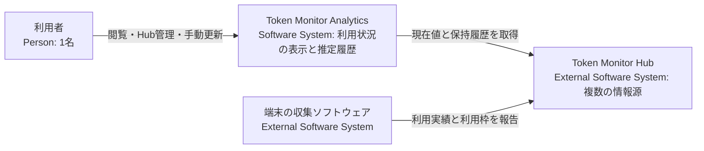
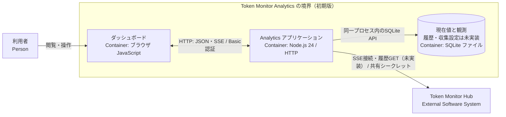
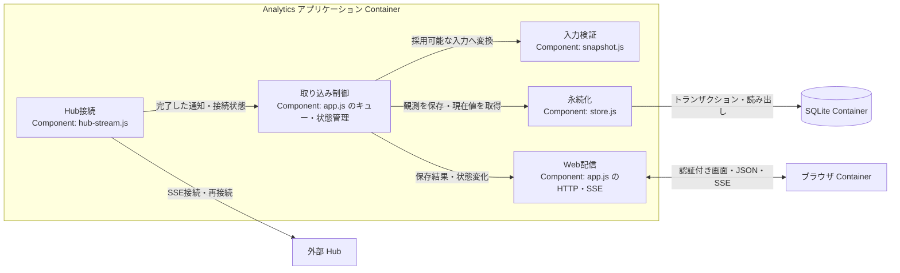
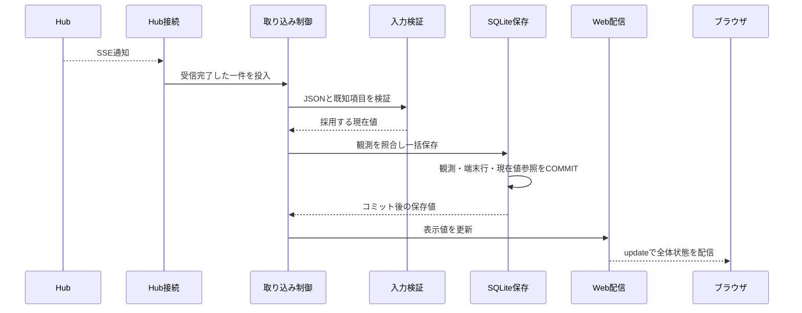

# アーキテクチャ設計書

本書は、確定済みの要件・設計判断と退避した実装を基に、本システムの境界、識別、状態、実行時動作を説明する。arc42 の構成を必要な内容へ絞り、構造を C4 の Context・Container・Component で示す。

目標と制約は [設計方針](design-policy.md)、用語は [CONTEXT.md](../CONTEXT.md) を正本とする。未決事項の詳細は [TODO.md](../TODO.md) に集約する。「合意済み」は必要な動作が決まっていることを、「実装済み」は現在のコードに存在することを表し、検証の成功とは区別する。

2026-09-13 に実装と実行設定をルートの `old/` へ退避した。本書の「実装済み」は退避時点のコードの事実を表し、ルートで稼働・開発中の実装を意味しない。旧文書は `old/docs/` に保管する。

## 1. 目標・制約と現時点の範囲

複数 Hub の利用状況を表示し、契約・利用枠・対象期間を特定できる観測から利用許容量を推定する。初期版全体の機能、Windows 先行、Node.js の単一常駐プロセス、SQLite、Basic 認証、履歴保全は [設計方針](design-policy.md) に従う。

退避した実装は、一つの Hub の現在値受信、入力検証、SQLite 保存、再接続、認証付き表示までである。推定、履歴 GET、複数 Hub の並行管理、Web からの登録・停止・再開、手動更新は未実装。以下の図とシナリオでは、この差を明示する。

## 2. システム境界（arc42 Context and Scope）

### 2.1 C4 Context

Analytics の管理対象は Hub の接続設定と Analytics が保存するデータである。上流の収集、Hub 内部の保持期間、プロバイダーの契約情報を制御しない。端末から直接取得せず、Hub 内部ストレージの完全なバックアップもしない。

### 2.2 Hub との契約と調査根拠

外部仕様の整理は、上流コミット `2f60827e3028d283969dd74cde5b3f5664220442`（`v0.56.0`）のソース調査と、2026-09-12 の Private Hub 単発取得に基づく。取得資料は [退避した実データ資料](../old/docs/reference/hub-private/README.md) に保存している。調査時の Worker は `coreRevision: 36`、`runtimeRevision: 3` だった。

リライト開始時の上流チェックアウトは `c4182fd5bcdcd466f6bcd159026756323e084318` であり、調査対象とは異なる。以下を新リビジョン全体で再検証したとは扱わない。互換性の確認範囲は [U1](../TODO.md#u1) で管理する。

| 経路 | 取得できる情報 | Analytics の用途 |
| --- | --- | --- |
| `GET /api/stats/stream` | 接続直後の `snapshot`、以後の `stats` イベント。`{ type, reason, stats, at }` の集計スナップショット。 | 現在値表示と推定の入力。現在値の受信は実装済み。 |
| `GET /api/devices` | 端末別の実績・利用枠と任意の保持履歴。 | 日次・月次履歴の収集・補完。未実装。 |
| `GET /api/stats` | 全体・端末別の期間集計、利用枠、履歴プレビュー。 | 調査用。推定入力の SSE を置き換えない。 |
| `GET /api/history` | 端末を合算した日次・月次・サマリー。 | 端末・契約別の補完には使わない。 |
| `GET /api/subscriptions` | Hub 内で共有される手入力の契約・支払情報。 | 実績の契約帰属の証拠にならず、初期版では使わない。 |
| `GET /api/health` | 認証不要の稼働・ビルド情報。 | 調査用。`version` を製品リリース番号、`hubBuild` を履歴カーソルとして扱わない。 |

保護経路は共有シークレットを Bearer または `X-Token-Monitor-Secret` ヘッダーで受け付ける。退避したクライアントは Bearer を使用し、URL クエリへ含めず、リダイレクトを拒否する。シークレット未設定時、調査対象の Node Hub はループバックで認証なし、Worker Hub は保護経路を503で拒否する。公開統計は端末・アカウントの識別情報が不足するため使わない。実機の `/api/public/stats` は404だった。

設計を左右する上流の制約は次のとおり。

- SSE は30秒間隔のコメント heartbeat を持つが、イベント ID、再送カーソル、`Last-Event-ID` による未受信観測の回収はない。再接続ではその時点のスナップショットだけを得る。
- `at`、`updatedAt` は集計・応答・更新試行の時刻であり、利用発生時刻や単調増加の版番号ではない。GET と SSE の到着順からデータの新旧を断定しない。
- `periods.today/month/allTime` の金額は累積値であり、受信ごとに加算しない。日付境界で Hub の合算から端末の `today/month` が外れることがあり、金額の減少だけでは利用枠のリセットを判定できない。
- 実績のセッション内訳にはツール等があるが、`accountKey` や契約 ID がない。利用枠側のアカウント情報との直接結合はできない。
- `limitsOnly` 更新は実績値を維持したまま端末更新時刻を変える。利用枠取得の失敗時も直前の成功値が残り得るため、値の存在や `stale: false` だけを観測成功の証拠にしない。
- 集約利用枠は候補から代表値を選んだもので、消費率の合計ではない。`accountKey` は公式契約 ID ではなく、プロバイダー共通の永続性規則もない。
- `usedPercent` は0〜100に正規化された消費率で、欠落時は `null` となる。`boundaryKind` で表されるリセット以外の失効や、`showMeter` が無効な割合メーター非表示の枠も存在する。割合を取得できない値をゼロや推測値へ置き換えて推定入力にしない。
- 保持履歴は標準で直近370日分の日別集計であり、保持中の全履歴を一括取得する。期間指定・ページング・過去利用枠の取得機能はない。`historyRevision` は変更検出用ハッシュであって版番号ではない。`historyAvailable: true` でも履歴が空または古い場合がある。
- 日次履歴は現地暦日と数値であり、利用時刻明細とタイムゾーンを持たない。端末の `periodWindows` はカレンダー境界であり、利用枠の期間境界とは異なる。
- Node Hub は保存失敗時にメモリ変更を戻さず、Worker Hub は永続化後に配信するが到達保証はない。Analytics の保存確定と画面通知は、Analytics 自身の責任で制御する。

元の調査箇所は [API 仕様](../upstream/token-monitor/docs/API.md)、[Node Hub](../upstream/token-monitor/src/hub/server.js)、[Worker Hub](../upstream/token-monitor/worker/src/index.js)、[実績集計](../upstream/token-monitor/src/shared/usage.js)、[履歴](../upstream/token-monitor/src/shared/history.js)、[利用枠](../upstream/token-monitor/src/shared/limits/core.js)、[収集状態](../upstream/token-monitor/src/shared/limits/runtime.js)、[Claude](../upstream/token-monitor/src/shared/providers/claude/limits.js)、[Codex](../upstream/token-monitor/src/shared/providers/codex/limits.js)、[収集処理](../upstream/token-monitor/src/shared/collector.js)、[リセット境界](../upstream/token-monitor/src/shared/limits/resetBoundary.js)。これらのローカルリンクは現在のチェックアウトを指すため、調査時の事実を追跡する場合は上記の基準コミットを使う。

## 3. 解決方針（arc42 Solution Strategy）

識別が成立する範囲だけを結合・推定する。Hub・端末の現在値を保存できても、契約・枠の同一性が決まったことにはしない。推定できない情報も、その集計単位・取得状態・時刻を保って表示する。

SSE の現在値観測と GET の過去実績は並行して受信し、受信後の照合・計算・保存を共通の単一キューで直列化する。通信待ちはキューに入れない。保存成功後にデータの更新を通知し、失敗時の状態通知とは区別する。

Hub 接続、収集設定、保存状態、推定可否を分離する。部分的な障害があっても、安全な閲覧と影響のない Hub の処理を継続する。観測の再取得に限界があるため、保存した履歴と算出時点の推定結果を保全する。

## 4. 構成要素（arc42 Building Block View）

### 4.1 C4 Container：初期版の境界（未実装機能を含む）

これは初期版の実行・保存の境界を示す。ブラウザは配信された JavaScript を実行する独立した実行環境である。SQLite は Node.js に組み込むデータストアであり、追加の常駐サーバーではない。常駐する Analytics サーバーは一つである。

退避した実装では同じ境界で現在値を扱っているが、履歴 GET、収集設定の管理、推定と履歴閲覧は未実装。Basic 認証は画面の取得、静的ファイル、JSON API、ブラウザ向け SSE の全経路に適用する。

### 4.2 C4 Component：退避した Node.js アプリケーション

図は、現在値の取り込みシナリオに必要な責務と依存を退避したコードへ対応付けたもの。`app.js` 内の取り込み制御と Web 配信は別の説明上の責務だが、ファイル分割を要求しない。

| 責務 | 更新する状態・扱う境界 | 退避した実装の根拠 |
| --- | --- | --- |
| 起動と終了 | 設定を読み、Hub を登録し、HTTP 待受と収集を開始する。終了時は受信を止め、キュー完了を待って DB を閉じる。 | [main.js](../old/src/main.js)、[config.js](../old/src/config.js) |
| Hub 接続 | HTTP と SSE の接続状態を取り込み制御へ知らせる。認証、分割受信、再接続待ち、通信キャンセルを担当する。 | [hub-stream.js](../old/src/hub-stream.js) |
| 入力検証 | 外部データの JSON・型・端末 ID 重複、数値の有限性と一部項目の非負・百分率範囲を確認し、採用する既知項目を選ぶ。永続状態は更新しない。 | [snapshot.js](../old/src/snapshot.js) |
| 取り込み制御 | 通知を直列処理し、接続・入力異常・保存異常と画面へ出す保存値を管理する。 | [app.js](../old/src/app.js) |
| 永続化 | Hub、観測、端末別観測、現在値参照を保存する。DB の変更をコミットまたはロールバックする。 | [store.js](../old/src/store.js) |
| Web と画面 | 認証後に保存値と状態を配信し、ブラウザが表示を更新する。ブラウザは比較基準や DB を更新しない。 | [app.js](../old/src/app.js)、[public/app.js](../old/public/app.js) |

合意済みの初期版には、これに加えて契約帰属・利用枠照合・推定、保持履歴の取得と照合、Hub 管理、手動更新の責務が必要である。内部の割り当てと相互作用が未決の部分は [U3](../TODO.md#u3)、[U6](../TODO.md#u6)、[U7](../TODO.md#u7)、[U8](../TODO.md#u8) に残し、固定の追加コンポーネントとして描かない。

## 5. 識別・状態・保存（arc42 Crosscutting Concepts）

### 5.1 何を同一とみなすか

| 対象 | 確定済みの規則 | 現在の到達点 |
| --- | --- | --- |
| Hub | Analytics の登録単位で分離し、配下の全データを紐付ける。接続 URL だけをデータの識別子にしない。 | 退避した実装は設定の `HUB_ID`。同じ ID へ別 URL を設定すると起動を拒否する。URL 変更の操作は未提供。 |
| 端末 | Hub と `deviceId` の組で区別する。ID 変更後は別端末であり、自動で名寄せしない。 | 観測を経由して Hub と端末を分離して保存する。比較基準への反映は [U5](../TODO.md#u5)。 |
| 契約 | プロバイダーのアカウントと契約を区別する。ツール名、プラン名、画面上のアカウントが一つであることだけでは利用額を帰属させない。 | 実績との結合根拠は [U2](../TODO.md#u2)。 |
| 利用枠 | 同じ契約の中で枠を区別する。複数端末に同じ枠が現れても消費率を合算しない。 | プロバイダーごとの識別規則は [U4](../TODO.md#u4)。退避した実装は各観測内に枠配列を保持する。 |
| 対象期間 | 同一利用枠内の有効な `resetsAt` を比較する。日別・月別の集計期間とは分離する。 | 枠識別の成立後に適用する。期間判定の規則は第5.2節。 |
| 現在値の観測 | 受信回数を利用量としない。再受信の現在値を照合し、累積値を加算しない。 | 退避した実装の照合単位は第5.3節。契約別観測や推定結果の一意性を保証する仕組みとは区別する。 |
| 日次実績 | Hub・端末・現地日付・ツールの同じ組を同一実績として更新する。 | 保存処理は未実装。 |
| 月次実績 | Hub・端末・現地月・ツールの同じ組を同一実績として更新する。 | 保存処理は未実装。 |

`accountKey` は契約 ID ではない。調査した Claude では同じアカウント ID の組織切替がキーに反映されない場合があり、同一 `kind` にモデル別枠が存在する。Codex ではメールアドレスとワークスペースのアカウント ID からキーを作り、同一 `limitId` に短時間・長時間枠が存在する。したがって `kind`、`limitId`、`resetsAt` のどれか一つで枠を同一と判定しない。

### 5.2 推定と比較区間

推定は SSE の `snapshot` / `stats` だけを入力とする。一回のイベントに含まれる利用額と `usedPercent` を一組として扱い、測定時刻のずれによる微小誤差を許容する。採用する累積 API 換算額の項目と、契約・利用枠への対応は [U2](../TODO.md#u2) に依存する。

同一の契約・利用枠・対象期間について、API 換算額の差分を ΔC（USD）、消費率の差分を Δp（パーセントポイント）とすると、利用許容量は `100 × ΔC / Δp`（USD）である。次の条件をすべて満たす場合に限る。

1. 利用額の増分が対象契約・利用枠の消費に対応し、契約の混在がない。
2. 二つの観測が同じ対象期間に属し、リセットや欠測によって対応関係が不明になっていない。
3. ΔC と Δp がともに正である。
4. 定額制の利用枠であり、失効性クレジットや残高メーターではない。

複数契約があっても分離できる範囲ではその単位で判定する。帰属不明の利用額を仮の比率で配分したり、未知の利用許容量の比率を利用者に設定させたりしない。

同じ対象期間内で比較可能な最初と最新の観測を使い、最長区間を延ばして計算する。同一端末・同一期間で途中の累積額が減少しても、それだけで起点を変えず、最初と最新の差分で判定する。これは消費率減少時の扱いとは異なる。

| 条件 | 確定済みの扱い |
| --- | --- |
| 有効な `resetsAt` が同一 | 同一期間として扱い、起点を保って最新観測との差分を計算する。 |
| 有効な `resetsAt` が更新された | 新しい期間とみなし、起点を再設定する。期間をまたぐ差分は使わない。 |
| `resetsAt` が欠落または不正 | 対象期間を特定できず、推定不可とする。 |
| 同一 `resetsAt` の中で消費率が減少 | 継続性不明として推定不可とし、不明区間をまたいで計算しない。 |

`resetsAt` は予定時刻であってリセット通知ではない。上表を適用する前に契約と枠の同一性が成立している必要がある。欠測後や継続性不明後に比較を再開する条件、複数端末の観測を束ねる方法は [U3](../TODO.md#u3) に残る。

算出結果、算出日時、根拠を時系列に追記し、保存済み結果を後から計算し直さない。推定不可の場合は理由を表示し、過去結果があれば算出日時とともに併記する。推定機能そのものが未実装である退避時点の実装は「推定不可」と混同せず、「未実装」と表示する。

### 5.3 保存モデルと確定点

| 保存対象 | 保持する意味と更新規則 | 退避時点の実装 |
| --- | --- | --- |
| Hub と端末の識別 | 情報源を分離する。Hub の ID と URL の取り違えを拒否する。 | 実装済み。 |
| 現在値の観測と現在値参照 | 採用した通知と端末別の値を保持する。変化した観測を追記し、現在値参照を同時に更新する。 | 実装済み。 |
| 契約・利用枠の対応 | どの契約・枠の値かを保持する。現状は観測をまたぐ対応を推測しない。 | U2・U4 に依存。 |
| 比較基準・推定結果・推定不可の理由と区間 | 最初と最新の対応、算出時点、再起動後の継続と重複防止に必要な根拠を保持する。 | U3・U5 に依存。 |
| 日次・月次実績 | 同一キーを再取得値で更新し、応答から消えた過去記録は削除しない。 | 未実装。日付判定は U6 に依存。 |
| Hub ごとの収集設定 | 有効・停止の指定を SQLite に保存し、再起動後に復元する。 | 未実装。停止と保存の境界は U6 に依存。 |
| 履歴取得の実施状況と最終成功日時 | 当日の定期取得が保存まで完了したかを判定する。 | 未実装。U6 に依存。 |

退避した DB モデル は [store.js](../old/src/store.js) が定義する `hubs`、`observations`、`observed_devices`、`current_observations` を持つ。観測は一つの Hub に属し、端末行は観測 ID と `deviceId` の組で保持する。現在値参照は Hub ごとに一つである。これは受信保存のモデルであり、未決の契約・枠モデルを代用しない。

退避した実装の再受信判定は、採用した `stats` から最上位の `updatedAt` を除き、JSON 文字列の SHA-256 を直前の現在値と比較する。同じなら観測行を追加せず、現在値参照側の上流時刻・受信時刻・保存時刻を更新する。異なれば観測と端末行を追加する。配列順や下位の時刻等も比較に含まれるため、これを契約別実績の意味上の同一性とみなさない。推定用の観測照合は U3・U4 の対象である。

一つの SSE 通知について、観測の追加、全端末行の追加、現在値参照の更新を一つのトランザクションに含める。端末の途中まで成功した場合も、コミット前の失敗は全体をロールバックする。保存関数はコミット後の読み出しを返し、取り込み制御はその結果で表示値を更新して `update` を送る。

このため、書き込みのコミットと画面の更新通知は別の時点である。コミット後の読み出し失敗時の扱いは [U9](../TODO.md#u9)。全機能での観測・比較基準・推定結果の一括更新範囲は [U3](../TODO.md#u3) で確定する。

### 5.4 日次・月次実績の保存

GET の保持履歴は推移閲覧・比較専用で、SSE の現在値や推定基準を更新しない。

- 日次は端末の現地日付で前日以前を保存する。当日分を保存せず、SSE 現在値も日次へ転記しない。当日の利用は現在値として表示する。
- 月次は返却された各月を保存し、当月分は「途中集計」と表示する。
- 保持履歴全体を照合し、停止中の欠落や遅れて報告された実績を反映する。応答にない過去記録と保存済み推定結果は削除・変更しない。
- 日付と数値をそのまま保持し、タイムゾーン変換や按分をしない。複数端末の同じ日付を合算する場合は「現地日付の合計」とし、タイムゾーン混在時は同一時間帯の合計ではないことを表示する。

端末のタイムゾーン欠落時に当日を安全に除外する方法は [U6](../TODO.md#u6) で未決である。他のタイムゾーンで代用しない。

### 5.5 独立した状態と表示

| 対象 | 状態と更新契機 | 状態を更新する責務 | 永続性と現在の実装 |
| --- | --- | --- | --- |
| Hub の接続 | 接続成功で接続中、切断・接続失敗で未接続。上流の停止理由は推測しない。 | Hub 接続が結果を通知し、取り込み制御が記録する。 | 退避した実装はメモリ。再起動時は未接続から実通信で判定する。 |
| 入力の採用可否 | 不正通知で原因を設定し、次の正常保存で解除する。 | 入力検証の結果を受けた取り込み制御。 | 退避した実装はメモリ。保存済み値は維持する。 |
| 保存処理 | 保存異常で書き込み停止とし、原因解消後の再起動で再開する。 | 永続化の失敗を受けた取り込み制御。 | 退避した実装はメモリ。異常の間、後続通知の書き込みを停止する。 |
| Hub の収集設定 | 利用者の停止・再開で有効・停止を変更する。接続状態とは別に持つ。 | 管理操作と収集制御の割り当ては U6・U7。 | SQLite に保持することは合意済み。操作は未実装。 |
| 契約・枠・期間ごとの推定可否 | 帰属、継続性、増分等の条件により算出可能・推定不可を判定する。 | 観測照合・推定の割り当ては U3。 | 根拠と結果の保存は合意済み。推定処理は未実装。 |
| ブラウザと Analytics の接続 | SSE 接続・切断に応じて表示側が通信状態を更新する。 | ブラウザ。 | サーバーの Hub 接続状態とは別。DB の値は変更しない。 |

「Hub に接続中かつ保存失敗」「収集停止かつ保存失敗」「接続中かつ一部の枠だけ推定不可」は両立する。全体を一つの状態値へ畳み込まない。保存済みの値には上流の更新時刻、Analytics の受信時刻、保存時刻を付け、状態とは別に表示する。未取得値をゼロにしない。

退避した実装は Hub ごとに接続・入力異常・保存異常を別のフィールドとして配信する。画面の代表バッジには優先順位があるが、原因欄には各異常を表示する。今後の収集停止・推定状態を含む表示と永続化の関係は、各シナリオと U3・U6・U7 で確定する。

### 5.6 排他制御と通知

SSE 一通知、または GET 一応答を一件とする。複数端末を含んでいてもこの単位で受信完了を判定する。共通の単一キューには受信完了したペイロードを投入し、照合から保存までを一件ずつ処理する。通信待ちや再接続待ちはキューの外で行う。

退避した実装のブラウザ SSE は、初回接続と状態変化を `status`、保存成功後を `update` として、いずれも全体状態を送る。ブラウザは全体状態を置き換える。初回 GET と SSE の到着順を突き合わせる仕組みは不要であり、退避した画面は SSE から初期状態を得る。保存失敗時も `status` は送り、データ更新成功としての `update` は送らない。

## 6. 重要な実行時シナリオ（arc42 Runtime View）

### S1. 通常の現在値受信と再受信

現在値の部分は実装済み。推定を含む完成形は U2・U3・U4 に依存する。

同一判定と保存結果は第5.3節に従う。同じ通知の再受信で利用額を加算しない。不正入力なら保存値を維持し、取り込み制御が原因を設定して `status` を送り、次の通知の採用を継続する。保存失敗は S6 に従う。確認条件は、変化した通知の一括保存、再受信での観測重複抑止、不正通知からの復帰、保存前の成功通知がないことである。

### S2. 補完中の新規受信と定期取得

動作は合意済み、履歴収集は未実装。履歴 GET の通信が遅れていても SSE は受信・保存・推定を継続する。完了した GET と SSE は共通キューで処理し、GET は第5.4節の実績だけを更新する。

| 契機 | 履歴取得の動作 |
| --- | --- |
| 初回接続 | Hub が保持する全履歴を取得する。SSE の開始はこの完了を待たない。 |
| 定期実行 | 稼働マシンの現地時刻で毎日午前1時に、Hub ごとに取得する。 |
| 再接続 | 当該 Hub の当日の定期取得が未完了なら取得する。 |
| 通信失敗 | 1時間間隔で再試行する。SSE の受信・推定は継続する。 |
| 保存まで成功したが前日データがない | 不在を表示し、ゼロ補完せず次回の定期取得を待つ。 |

取得成功は保存完了を含む。保存失敗を通信失敗と同じ再試行で扱わない。収集停止した Hub では全取得と再試行を止める。タイマーは稼働マシン、履歴の日付は端末の基準であり、混同しない。

既存の日次・月次行は同じキーの再取得値で更新し、応答にない記録は残す。取得完了状態をどの責務がどのトランザクションで確定するか、GET 同士が重なった場合の制御は [U6](../TODO.md#u6)。確認条件は、GET 遅延時の SSE 継続、通信再試行、履歴の非破壊更新、現在値と推定に GET が混入しないことである。

### S3. 切断と再接続

退避した実装は切断時に接続状態を未接続へ変え、既定3秒後に再接続する。最後の保存値とその時刻を維持し、接続異常を通知する。再接続時のスナップショットを S1 で処理する。切断中の観測は再送されず、独自に復元しない。

初期版では他 Hub の収集と履歴閲覧を継続し、必要な履歴補完は S2 に従う。欠測をまたぐ推定の再開条件は [U3](../TODO.md#u3)。確認条件は、切断を正常表示で隠さないこと、再接続時の二重計上がないこと、他 Hub を止めないことである。実 Hub の継続接続による確認は [U1](../TODO.md#u1)。

### S4. リセット・継続性不明・帰属不明

推定処理は未実装。第5.1・5.2節の識別と期間判定を使う。新期間では起点を再設定し、旧期間の保存済み結果は維持する。帰属や継続性が不明な範囲は推定不可として取得情報を表示する。他の識別可能な対象の推定は妨げない。

比較基準を更新する担当、観測・起点・結果・不可理由の一括保存範囲は [U3](../TODO.md#u3) に依存する。確認条件は、期間をまたぐ差分を使わないこと、消費率減少と累積額減少を混同しないこと、理由不明の推定値を生成しないことである。

### S5. Hub 個別の収集停止と再開

動作は合意済み、管理操作は未実装。停止要求の受付時点を取り込みの境界とし、その Hub の SSE、再接続待ち、履歴 GET、GET 再試行を止める。受信途中の通信は完了を待たず中止し、遅着した応答を採用しない。

停止要求前に受信完了したデータは、処理待ち・処理中を含めて通常どおり保存する。処理終了後に「収集停止」を表示する。保存失敗した場合は危険な書き込みを止め、「収集停止」と「保存失敗」を併記する。他 Hub と保存済みデータの閲覧は継続する。

有効・停止の設定は SQLite に保持し、明示的な再開で通信を再開する。通信停止、受信済み処理、停止設定の保存を誰がどの順序で行うか、停止設定を保存できなかった場合の再起動後の扱いは [U6](../TODO.md#u6)。確認条件は、境界前後のデータの採否、全通信の停止、他 Hub の継続、保存異常の併記、再起動後の指定維持である。

### S6. 保存失敗

退避した実装は保存処理の例外を取り込み制御が受け、保存異常を設定する。コミット前の失敗はトランザクション全体を戻し、直前までの表示値を維持して `status` を送る。以後の通知の書き込みを止め、原因を解消した上での再起動を復旧手段とする。退避した実装の Hub 通信と状態通知は継続する。

データの保全を保証できない書き込みを止め、安全に参照できる値の閲覧は維持する。DB 自体を読めない場合、コミット後の読み出しが失敗した場合、複数 Hub で共有する DB の異常の影響範囲は [U9](../TODO.md#u9) に残る。確認条件は、部分保存のロールバック、後続書き込みの停止、誤った成功通知がないこと、原因の記録である。

### S7. 再起動と終了

退避した実装の起動では、設定を読み、Hub を登録し、保存された現在値を読み出し、HTTP 待受後に SSE へ接続する。Hub の接続・入力異常・保存異常はメモリ上の状態として初期化し、保存値を新規受信値とは扱わない。

退避した実装の終了は、Hub 通信を停止し、受信済みキューの完了を待ち、ブラウザ接続と HTTP を終了して DB を閉じる。強制終了やコミット前の障害で未確定の観測を、取得済みとして生成しない。

合意済みだが未実装の初期版の動作として、保存された Hub ごとの収集設定を復元し、有効な Hub のみ接続する。比較基準と推定結果をどこから再開するかは [U3](../TODO.md#u3)、停止設定と取得完了状態は [U6](../TODO.md#u6) に依存する。確認条件は、保存値の再読込、情報源の混同拒否、停止指定の維持、重複推定がないことである。

### S8. 認証と管理操作

退避した実装は画面・静的ファイル・JSON API・ブラウザ SSE で Basic 認証を行い、GET のみを受け付ける。認証失敗では保護対象を返さない。Hub 共有シークレットや Web 認証情報を画面・応答・ログへ出さない。

管理操作では認証、入力検証、CSRF 対策、操作結果の保存と表示が必要となる。管理 API と CSRF の具体方式、Hub 設定や秘密情報の保存方法は [U7](../TODO.md#u7)。確認条件は、保護対象への認証なしアクセス拒否、意図しない管理変更の拒否、秘密情報の非露出である。

### S9. 手動更新と失敗

動作は合意済み、更新機能は未実装。利用者の明示操作で実行し、作業中の停止を許容する。DB 初期化、履歴改変、自動ロールバックを行わず、失敗の事実・原因・手動復旧に必要な情報を残す。

更新対象の取得、適用、再起動の担当と順序、互換性の確認と復旧手順は [U8](../TODO.md#u8)。確認条件は、成功・失敗の区別、更新失敗後の履歴保全、復旧情報の提示である。

## 7. 配置と運用（arc42 Deployment View）

Windows 上に Node.js アプリケーションと SQLite ファイルを配置する。ブラウザは同一端末または許容された LAN・VPN 経路から接続する。Hub は既存の外部環境であり、Analytics の配置に含めない。Linux は後続の対応・検証対象とする。

退避した実装の設定は Git 管理外の `.env`、DB の既定保存先は `data/analytics.sqlite`。現在値の保存データへ認証情報を含めない。Web 管理を導入した後の接続設定と秘密情報の保持方法は U7 で決定する。旧実装の配置と起動手順の参照先は [old/README.md](../old/README.md) に記載する。

Mock Hub は開発・検証時だけ起動する補助プロセスであり、本番の追加常駐サービスではない。退避した実装の実行・依存定義は [package.json](../old/package.json) と [mise.toml](../old/mise.toml)、CI は [Windows のワークフロー](../old/.github/workflows/ci.yml) を参照する。

## 8. 設計判断（arc42 Architecture Decisions）

### 共通の単一キュー

採用済みの理由を [設計方針の4点](design-policy.md#4-設計を追加する判断基準) に対応させる。

| 判断観点 | 理由 |
| --- | --- |
| 現在の要件・リスク | 並行受信と履歴補完によって、同じ比較基準や保存状態を同時に更新し得る。 |
| 追加しない場合の問題 | 照合後から保存までの間に基準が変わり、重複計算や不整合が生じ得る。 |
| より単純な対応では不十分な理由 | SQLite の書き込み競合だけを避けても、アプリケーション側の照合・計算と保存の一連の整合性は定義できない。共通キューでこの範囲を直列化する。 |
| 今必要な理由 | 現在値の保存・通知から一貫した処理境界が必要である。通信はキューの外で待ち、ネットワークの遅延を直列処理へ持ち込まない。 |

### SSE の解析と標準機能の使用

退避した実装は Node.js の HTTP、`node:sqlite`、テストランナーを使う。SSE の解析には `eventsource-parser` を採用する。外部 Hub の分割受信・複数行・改行形式を正しく扱うことが初回接続から必要であり、解析を省くと完了していない通知や分割文字列を誤って扱う。自前実装では同じ仕様の実装と保守が必要となるため、小さな専用依存を使用する。ライブラリの選択を、契約や枠の識別が確定した根拠にはしない。

## 9. 品質確認・リスク（arc42 Quality Requirements / Risks）

品質要求と製品の完了条件は [設計方針 第6節](design-policy.md#6-検証と製品の完了条件) を参照する。S1〜S9 の各シナリオに保存結果、状態、停止・継続と確認条件を記載した。未決の担当や確定点が残るシナリオは、初期設計完了として扱わない。

退避した実装の [テスト](../old/tests/) には、設定・入力検証、SSE の分割と再接続、Hub・端末の保存分離、同一通知の再受信、ロールバック、DB 再オープン、保存失敗、不正入力からの復帰、Basic 認証、秘密情報非露出を扱う20件がある。このリライトでは実装を変更せず、テストは再実行していない。

旧記録では Windows / Node.js 24.18.0 で20件成功、Mock Hub と実ブラウザで現在値を確認、Private Hub の初回 SSE を検証して端末2台・集約プロバイダー22件を一時 SQLite に保存したと報告されている。これは [退避した開発記録](../old/docs/root/PLAN.md) の検証履歴であり、今回の再検証結果ではない。実 Hub の継続更新・切断再接続、新リビジョン互換性、Linux は未確認。

未決事項、必要な追加調査、未実装・未検証の範囲は [TODO.md](../TODO.md) を正本とする。用語は [CONTEXT.md](../CONTEXT.md) を参照する。
