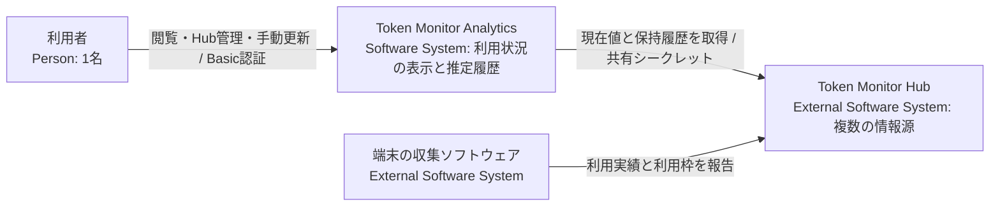
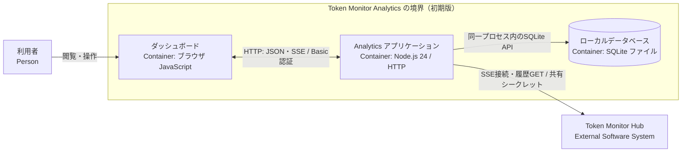
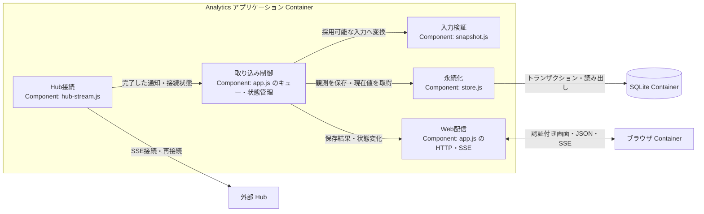
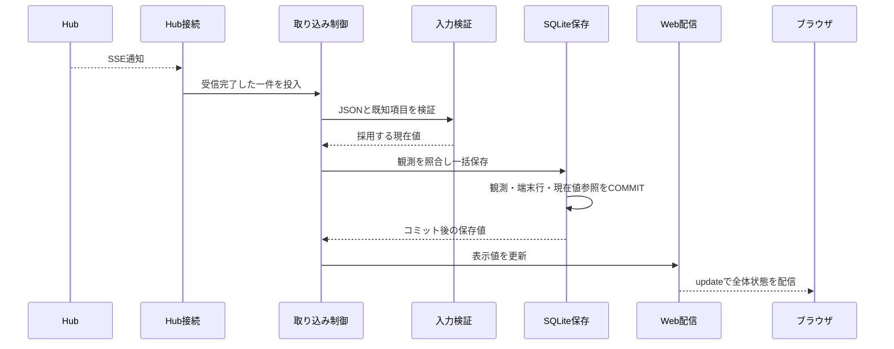

# アーキテクチャ設計書

本書は、Token Monitor Analytics のシステム境界、構造、データモデル、状態管理、および実行時動作を定義する設計書です。製品の目標・制約は [設計方針](design-policy.md)、用語定義は [CONTEXT.md](../CONTEXT.md)、未決・未検証事項は [PLAN.md](../PLAN.md) を正本とします。

※ 現在は初期版の設計フェーズです。過去の実装コードは `old/` に退避されており、本文中の「実装済み」は旧実装における到達事実を示します（現行仕様への適合や実機検証は今後の実装フェーズで行います）。

## 1. 目標・制約と対象スコープ

複数 Hub から AI サービスの利用状況を収集・可視化し、同一契約・利用枠・対象期間に属する実測増分から利用許容量を推定します。Node.js 24 LTS の単一常駐プロセス、組込 SQLite、全通信への Basic 認証適用、Windows 先行対応などの前提制約は [設計方針](design-policy.md) に従います。

- **初期版の設計対象**: 複数 Hub の並行管理（登録・停止・再開）、現在値の表示、利用許容量の推定、日次・月次実績の定期収集・補完、安全な手動更新。
- **旧実装の到達範囲**: 単一 Hub からの現在値受信、入力バリデーション、SQLite への保存、自動再接続、認証付き Web 表示。

## 2. システム境界（Context and Scope）

### 2.1 C4 Context

Analytics は Hub への接続設定と自身のローカルデータを管理します。端末からの直接データ収集は行わず、Hub 側のデータ保持期間や契約情報の直接管理、および Hub ストレージ全体のバックアップ等は行いません。

### 2.2 Hub との連携仕様と調査事実

外部仕様は上流リポジトリ（コミット `2f60827e` / `v0.56.0`）のソースコードおよび [Private Hub 単発取得ログ](../old/docs/reference/hub-private/README.md) に基づき確認しています。現在の上流最新（`c4182fd5`）との差分検証は [U1](../PLAN.md#u1) で追跡します。

| エンドポイント | 取得データと主な用途 |
| --- | --- |
| `GET /api/stats/stream` | 接続直後の `snapshot` および以後の `stats` イベント。集計スナップショットを取得し、現在値表示と利用許容量の推定に利用（旧実装で受信実績あり） |
| `GET /api/devices` | 端末別の実績・利用枠および保持履歴。日次・月次履歴の定期収集・補完に利用（未実装） |
| `GET /api/stats` | 全体・端末別の期間集計、利用枠、履歴プレビュー（調査・診断用） |
| `GET /api/history` | 端末合算の日次・月次サマリー（端末・契約別の補完には不適のため初期版では不使用） |
| `GET /api/subscriptions` | Hub で共有される契約・支払情報の手入力値（実績との帰属を担保できないため初期版では不使用） |
| `GET /api/health` | 稼働・ビルド情報（認証不要） |

※ 保護エンドポイントへのアクセスは Bearer または `X-Token-Monitor-Secret` ヘッダーによる共有シークレット認証を行います。

#### 設計上の前提となる上流仕様の事実

1. **SSE の特性**: 30秒間隔の heartbeat（コメント行）はあるが、イベント ID や再送用カーソル（`Last-Event-ID`）は存在しない。再接続時はその時点の最新スナップショットを再取得する。
2. **タイムスタンプの性質**: `at` および `updatedAt` は集計・応答・更新試行時刻であり、端末での利用発生時刻や単調増加版番号ではない。
3. **累積値の扱い**: `periods.today/month/allTime` は累積値である。日付変更時に端末側で日次リセットされるため、集計値の減少のみをもって利用枠のリセットと判定しない。
4. **契約帰属の不在**: 実績データにはツール等の内訳が含まれるが、`accountKey` や契約 ID が付与されていないため、利用枠側のアカウント情報と機械的に直結できない。
5. **利用枠の状態値**: `usedPercent` は 0〜100 に正規化され、未取得時は `null` となる。欠落した割合を推測値やゼロで補完しない。
6. **保持履歴の構造**: 直近370日の日別集計を一括取得する。履歴には現地暦日と数値のみが含まれ、利用時刻の明細やタイムゾーン情報は含まれない。
7. **保存と配信の順序**: Hub 側の配信成功は Analytics 側の永続化を保証しないため、Analytics 自身がデータ保存のコミットと画面通知を制御する。

## 3. 解決方針 (Solution Strategy)

1. **確実な識別と推定の分離**: 契約・利用枠の同一性が確認できる範囲でのみ利用許容量を推定する。帰属が特定できない取得値も、集計単位・取得状態・時刻を明記してそのまま可視化する。
2. **並行受信と直列処理**: SSE の現在値と GET の履歴データは並行して受信し、受信完了後の照合・計算・保存は [単一の処理キュー](ard/0001-serial-processing-queue.md) で直列化する。通信待機はキュー外で行い、保存成功のデータ更新通知と異常時の状態通知を明確に分離する。
3. **状態の独立管理と履歴保全**: Hub 接続状態、収集設定、データ保存状態、推定可否を独立した状態として管理し、一部の障害が安全な閲覧や他 Hub の通信に影響しないようにする。取得済みの実績履歴は保全し、再取得データで非破壊更新する。

## 4. 構成要素 (Building Block View)

### 4.1 C4 Container

ブラウザは独立したクライアント環境、SQLite は Node.js プロセスに組み込まれた永続化境界です。Analytics サーバーは単一常駐プロセスとして動作します。Basic 認証は HTML、静的ファイル、JSON API、ブラウザ向け SSE の全経路に一貫して適用します。

### 4.2 C4 Component（アプリケーション内部構成）

| コンポーネント | 主な責務 | 主な参照先（旧実装の構成例） |
| --- | --- | --- |
| 起動・終了 | 設定読み込み、HTTP サーバー起動、DB 接続・終了処理、安全なシャットダウン | [main.js](../old/src/main.js)、[config.js](../old/src/config.js) |
| Hub 接続 | 共有シークレット認証、SSE ストリームのチャンク受信、自動再接続、通信キャンセル | [hub-stream.js](../old/src/hub-stream.js) |
| 入力検証 | JSON 構文、型、必須フィールド、数値範囲の検証、安全なデータへの正規化 | [snapshot.js](../old/src/snapshot.js) |
| 取り込み制御 | 受信データの直列キューイング、各状態（接続・入力・保存）の管理、表示用データの保持 | [app.js](../old/src/app.js) |
| 永続化 | Hub 設定、観測データ、端末別データ、履歴のトランザクション管理と読み書き | [store.js](../old/src/store.js) |
| Web 配信 | Basic 認証、静的ファイル配信、REST API、ブラウザ向け SSE による状態配信 | [app.js](../old/src/app.js)、[public/app.js](../old/public/app.js) |

※ 本コンポーネント構成は責務の論理境界を示すものであり、物理ファイル構造を強制するものではありません。初期版の開発にあたっては、契約・枠の照合と推定、保持履歴の取得、Hub 管理、手動更新の各責務を順次具体化します（未決事項 [U3](../PLAN.md#u3)、[U6](../PLAN.md#u6)、[U7](../PLAN.md#u7)、[U8](../PLAN.md#u8) を参照）。

## 5. 識別・状態・保存 (Crosscutting Concepts)

### 5.1 同一性の判定規則

| 対象エンティティ | 同一性判定の規則 | 設計・実装状況 |
| --- | --- | --- |
| Hub | Analytics への登録単位で分離（URL のみで一意性を判定しない） | 旧実装は `HUB_ID` と URL の整合性を検証。Web 管理操作は未実装 |
| 端末 | Hub と `deviceId` の組み合わせで識別。ID 変更時は別端末として扱い自動名寄せは行わない | 比較基準への反映方針は [U5](../PLAN.md#u5) で検討 |
| 契約 | プロバイダーのアカウントおよび契約単位で識別。ツール名やプラン名の一致のみで機械的に結合しない | 結合根拠は [U2](../PLAN.md#u2) で検討 |
| 利用枠 | 同一契約内の枠として識別。複数端末から報告された同一枠の消費率を単純合算しない | プロバイダー別規則は [U4](../PLAN.md#u4) で検討 |
| 対象期間 | 利用枠の識別後、同一枠の有効な `resetsAt`（リセット予定日時）で区別（日次・月次の集計期間とは独立） | 第5.2節の規則を適用 |
| 現在値観測 | 受信ごとの加算を行わず、観測時点のスナップショットとして扱う | 再受信判定は第5.3節、推定用の照合は U3・U4 |
| 日次実績 | Hub、端末、現地暦日、ツールの組み合わせで一意に特定し更新 | 未実装（日付境界の判定は U6） |
| 月次実績 | Hub、端末、現地月、ツールの組み合わせで一意に特定し更新 | 未実装 |

※ `accountKey` は公式な契約 ID ではありません。Claude では組織切り替えがキーへ反映されないケースがあり、同一 `kind` 内にモデル別枠が存在します。Codex ではメールアドレスとアカウント ID からキーが生成され、同一 `limitId` 内に短時間枠と長時間枠が存在します。したがって、単一フィールドのみに頼った枠同定は行いません。

### 5.2 利用許容量の推定ロジックと比較区間

利用許容量の推定入力には、同一 SSE イベント（`snapshot` / `stats`）に含まれる利用額と `usedPercent` のペアのみを使用します（採用する累積額の契約帰属は [U2](../PLAN.md#u2) で確定）。

同一契約・利用枠・対象期間に属する2つの観測データについて、API 換算額の差分を $\Delta C$（USD）、消費率の差分を $\Delta p$（ポイント）とするとき、利用許容量は以下の式で算出します。

$$\text{利用許容量 (USD)} = 100 \times \frac{\Delta C}{\Delta p}$$

#### 推定の成立条件（全条件の充足が必要）
1. 利用額の増分が対象契約・利用枠に正しく帰属していること。
2. 2つの観測が同一の対象期間に属し、リセットや欠測による不連続区間を跨いでいないこと。
3. $\Delta C > 0$ かつ $\Delta p > 0$ であること。
4. 定額制の利用枠であること（失効性クレジットや残高メーターではないこと）。

※ 条件が満たされない場合は「推定不可」として扱い、推測値やゼロによる補完は行いません。比較には同一対象期間内の比較可能な「最初の観測」と「最新の観測」を用います。

| `resetsAt` と消費率の変化 | 推定処理の扱い |
| --- | --- |
| 有効な `resetsAt` が同一 | 比較起点を維持し、最新観測との差分から推定を算出 |
| 有効な `resetsAt` が更新 | 新しい期間の開始と判定して起点を更新（期間を跨ぐ差分計算は行わない） |
| `resetsAt` が欠落または不正 | 対象期間を特定できないため「推定不可」 |
| 同一 `resetsAt` で消費率が減少 | データの連続性に不整合があるため「推定不可」 |

※ 算出結果は算出日時、比較区間、計算根拠とともに追記保存し、過去の計算結果を遡及改変しません。UI には推定不可の理由や、前回推定結果の算出日時を明示します。

### 5.3 保存モデルと確定点

| データエンティティ | 永続化規則 | 実装状況 |
| --- | --- | --- |
| Hub 設定・端末 | 情報源を分離して管理 | 実装済み |
| 現在値観測・現在値参照 | 状態が変化した観測を追記し、端末データと現在値参照を同一トランザクションで更新 | 実装済み |
| 契約・利用枠の対応 | 契約と枠の対応関係を保持 | U2・U4 に依存 |
| 比較基準・推定結果 | 起点・最新の観測対応、算出時点、対象区間、推定不可理由を保持 | U3・U5 に依存 |
| 日次・月次実績 | 複合キーに基づき再取得データで更新（過去レコードは保持） | 未実装（U6） |
| Hub 収集設定 | 有効／停止フラグを永続化し再起動時に復元 | 未実装（U6） |
| 履歴取得ステータス | 定期取得の完了状況および最終成功日時を記録 | 未実装（U6） |

旧実装の DB は `hubs`、`observations`、`observed_devices`、`current_observations` で構成され、1つの受信通知に含まれる観測データ、全端末行、および現在値参照を単一トランザクションでコミットします。コミット前の失敗時は全体をロールバックします。

データ保存がコミットされた後、再読み出しした確定値を用いて UI 配信用の状態を更新し、クライアントへ `update` を通知します。永続化のコミットと画面通知は独立した確定点であり、コミット完了後の障害処理は [U9](../PLAN.md#u9) で扱います。

### 5.4 日次・月次実績の保存

`GET` で取得する保持履歴は推移閲覧および比較専用とし、SSE 経由の現在値や推定基準データとは混在させません。

- **日次実績**: 端末側の現地日付に基づき、前日以前の確定データを保存します（当日分の途中値は保存対象外）。
- **月次実績**: 返却された各月実績を保存し、当月分については「途中集計」として明示します。
- **履歴の非破壊更新**: 履歴全体をキー照合して再取得値で更新し、取得応答に含まれなくなった過去レコードや推定結果を削除・改変しません。
- **タイムゾーンの扱い**: 数値や日付の恣意的な変換・按分は行いません。複数端末の実績を合算する場合は、端末ごとの現地日付の合算値である旨を UI に明記します。

### 5.5 独立した状態管理と UI 表示

以下の状態は互いに独立して管理し、単一の状態フラグに統合しません。

| 管理対象 | 状態の定義と更新主体 | 永続化と復元方針 |
| --- | --- | --- |
| Hub 接続状態 | Hub 接続コンポーネントが接続・切断・通信エラーを検知し、取り込み制御が管理 | メモリ管理（起動時の実通信で判定） |
| 入力バリデーション | 入力検証コンポーネントが判定。不正時は取り込み制御がエラー理由を設定し、正常受信で解除 | メモリ管理（保存済みデータは維持） |
| データ保存状態 | 永続化時の例外検知により、取り込み制御が「保存失敗」を設定して書き込みを安全に停止 | メモリ管理（原因解消後の再起動で復旧） |
| Hub 収集設定 | ユーザーの管理操作によって「有効／停止」を切り替え | SQLite に永続化（再起動時に復元） |
| 利用許容量の推定可否 | 契約・枠・期間のデータ整合性に基づき「算出可能／推定不可」を判定 | 算出結果および理由を SQLite に記録 |
| ブラウザ接続状態 | ブラウザクライアントが Analytics との SSE 接続状態を管理 | クライアント側で管理（DB には影響しない） |

UI 上では各状態を組み合わせて表示し、過去の保存値を現在取得中の値と誤認させないように配慮します。

### 5.6 排他制御と通知シーケンス

1. **直列キュー**: SSE の1イベント、または GET の1レスポンスを受信単位とし、受信完了したデータのみを共通の単一キューに投入します。キュー内では照合・計算・保存までを直列に処理し、ネットワーク通信待機はキューの外側で実行します。
2. **ブラウザ向け通知**: 接続確立時および接続状態の変化時は `status` イベントを送信し、データ保存の成功時は `update` イベントで最新の全体状態を通知します。保存失敗時は `status` のみで異常を通知し、不正なデータ更新通知は行いません。

## 6. 重要な実行時シナリオ (Runtime View)

S1〜S9 は、機能仕様・モック作成・テストケースで共通して使用するシナリオ ID です。モック開発を行う際は、本シナリオ記述に確認結果を記録します。

### S1. 通常の現在値受信と再受信

現在値の受信・保存処理は旧実装で検証済みであり、推定処理は U2〜U4 の確定に依存します。

- **処理フロー**: 第5.3節の単位で同一性を判定し、内容に変更がない再受信時は二重加算を行わずタイムスタンプのみ更新します。入力値が不正な場合は保存済みデータを維持し、エラー理由を `status` イベントで通知して後続通知の待機を継続します。
- **検証項目**: 変更時の一括保存、同一通知再受信時の重複抑止、不正入力からの安全な復旧、およびコミット完了前の誤った更新通知がないこと。

### S2. 補完中の新規受信と定期取得

履歴データの GET 待機中も、並行して SSE による現在値の受信・保存・推定を継続します。完了した GET レスポンスと SSE イベントは共通キューで直列に処理され、GET 処理は第5.4節の実績データのみを更新します。

| 取得契機 | 期待する動作 |
| --- | --- |
| 初回接続時 | 全保持履歴を一括取得（SSE の開始を待たずに並行実行） |
| 定期取得 | サーバー稼働環境の現地時刻で毎日午前1時に Hub ごとに実行 |
| 再接続時 | 当該 Hub の当日の定期取得が未完了である場合に取得を実行 |
| 通信エラー時 | 1時間間隔で再試行を継続（SSE 受信は継続） |
| 前日データ不在時 | 欠落データをゼロ等で補完せず「データなし」と表示し、次回の定期取得を待機 |

- **検証項目**: 履歴 GET 処理の遅延中も SSE 受信がブロックされないこと、通信エラー時の安全な再試行、履歴データの非破壊更新、および履歴データが現在値や推定基準へ混入しないこと。

### S3. 切断と再接続

Hub との切断を検知した場合、UI へ「未接続」を通知し、直前の保存データと時刻表示を保持したまま一定間隔（既定3秒）で自動再接続を試行します。再接続時の初回スナップショットは S1 に従って安全に処理し、欠測期間に対する架空の観測データは生成しません。

- **検証項目**: 切断状態の正確な UI 表示、再接続時のデータ重複防止、他 Hub の通信継続、および履歴閲覧機能の維持。

### S4. リセット・継続性不明・帰属不明

利用枠のリセットやデータの不整合を検知した場合の処理シナリオです。

- **処理フロー**: 第5.1・5.2節の規則に基づき、新期間のリセット予定時刻（`resetsAt`）が検出された場合は比較起点を再設定し、過去の推定結果はそのまま保持します。契約帰属が不明な場合や消費率が減少した場合は「推定不可」とし、取得した実績値と判定理由を UI に表示します（識別可能な他の利用枠の推定は継続）。
- **検証項目**: 期間を跨ぐ誤った増分計算の防止、消費率減少時と累積額減少時の正確な区別、および不整合発生時に架空の推定値を出力しないこと。

### S5. Hub 個別の収集停止と再開

ユーザーの停止指示を受け付けた時点で、該当 Hub の SSE 接続、再接続タイマー、履歴 GET、および再試行処理をすべてキャンセルします。

- **処理フロー**: 停止要求前に受信完了していたデータは、キュー内で安全に保存コミットを完了させた後、UI を「収集停止」状態へ更新します。収集停止フラグは SQLite に永続化し、明示的な再開操作があるまで通信を再開しません（他 Hub の収集および既存データの閲覧は継続）。
- **検証項目**: 停止境界前後のデータ採用判定、全通信の完全停止、他 Hub への影響分離、および再起動後の停止設定の復元。

### S6. データ保存失敗

データベース書き込み処理で例外が発生した場合の処理シナリオです。

- **処理フロー**: コミット前の例外発生時はトランザクション全体をロールバックし、取り込み制御が「保存失敗」状態を設定して後続の書き込みを安全に停止します。直前までの正常表示データおよび通信接続は維持し、原因解消後の再起動によって復旧します。
- **検証項目**: 異常発生時の中途半端なデータ保存（部分書き込み）がないこと、後続の書き込み停止、誤った成功通知の抑止、およびログへのエラー原因記録。

### S7. 再起動とシャットダウン

- **起動シーケンス**: 設定情報および保存済み現在値を読み込み、HTTP 待受を開始した後に各 Hub へ SSE 接続を行います。SQLite に保存された収集設定を復元し、有効化されている Hub のみ接続を再開します。
- **シャットダウンシーケンス**: 新規通信を停止し、受信済みキューの処理完了を待機した後、ブラウザ接続、HTTP サーバー、SQLite 接続の順に安全にクローズします。
- **検証項目**: 保存データの正常な復元、停止指定された Hub への接続抑止、未コミットデータの安全な破棄、および再起動後の推定処理の重複防止。

### S8. 認証と管理操作

- **処理フロー**: Web 画面、静的アセット、JSON API、ブラウザ向け SSE の全経路で Basic 認証を実施します。認証エラー時は保護対象リソースを一切返却しません。Hub 管理操作等の更新 API には CSRF 対策を講じ、Hub 共有シークレットや認証資格情報を画面やログ、API レスポンスへ出力しません。
- **検証項目**: 未認証アクセスの完全遮断、CSRF トークン検証、不正入力の拒否、および機密情報の非露出。

### S9. 手動更新と障害復旧

- **処理フロー**: ユーザーの明示操作により実行し、更新処理中のサービス停止を許容します。自動ロールバックや DB の初期化は行わず、万一の更新失敗時は失敗の事実とエラー原因をログに残し、手動復旧に必要な情報を提示します。
- **検証項目**: 正常更新と失敗時の状態切り分け、失敗時の既存 DB・履歴データの完全保護、および手動復旧情報の確認。

## 7. 配置と運用 (Deployment View)

Windows 環境上に Node.js アプリケーションとローカル SQLite ファイルを配置し、ブラウザから同一ホストまたは許可されたネットワーク（LAN / VPN）経由でアクセスします。外部 Hub は外部環境として接続します（Linux 環境は初期版完了後の対応対象）。

- **環境設定**: `.env` でポートや認証情報を設定し、DB ファイルは既定で `data/analytics.sqlite` を使用します。
- **旧実装の参考情報**: 旧構成の起動手順は [old/README.md](../old/README.md)、依存関係定義は [package.json](../old/package.json) に保管されています。同梱の Mock Hub は開発・テスト用であり本番の常駐プロセスではありません。

## 8. 設計判断 (Architecture Decisions)

主要な設計判断は ADR（Architecture Decision Records）として記録しています。

- [ADR 0001: 共通キューによる処理の直列化](ard/0001-serial-processing-queue.md)（Adopted）: 並行受信したデータの照合から保存までを単一キューで直列化し、整合性を担保。通信待機はキュー外で実行。
- [ADR 0002: モック駆動開発の採用方針](ard/0002-adopt-mock-driven-development.md)（Proposed）: 本番用 UI を共用し動く画面で認識を合わせる開発プロセスの提案。
- [ADR 0003: モック開発の補助製品選定](ard/0003-select-mock-tooling.md)（Proposed）: Storybook、MSW、Playwright の組み合わせ案と最小構成案の比較検討。

※ 旧実装で採用した `eventsource-parser` は、SSE のチャンク受信・複数行・改行コードを堅牢にパースするための軽量ライブラリです。

## 9. 品質確認とリスク管理 (Quality Requirements / Risks)

製品の品質要求および完了条件は [設計方針 第6節](design-policy.md#product-completion) に従います。

- **旧実装での検証実績**: 退避したテスト群（計20件）において、設定読み込み、入力検証、SSE チャンク処理、再接続、DB 保存・ロールバック、保存失敗処理、Basic 認証、機密保護などの単体・結合動作を確認済みです。
- **現行の未検証範囲とリスク**: 新規設計に基づく複数 Hub の並行管理、履歴データの補完、利用許容量の推定、手動更新、および実機 Hub との長時間稼働・互換性については、今後の実装フェーズで検証します（詳細は [PLAN.md](../PLAN.md) の各未決事項を参照）。

