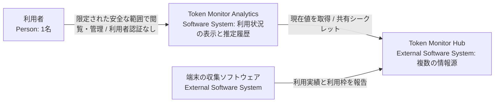
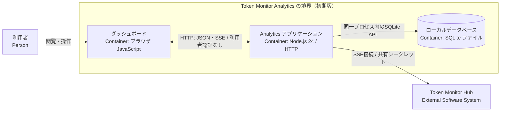
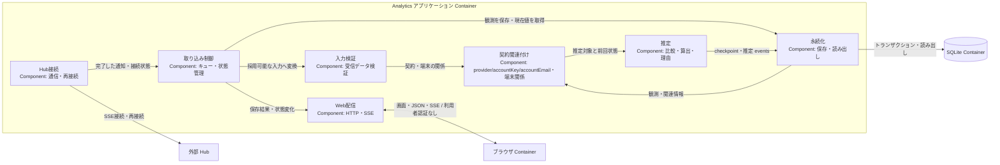
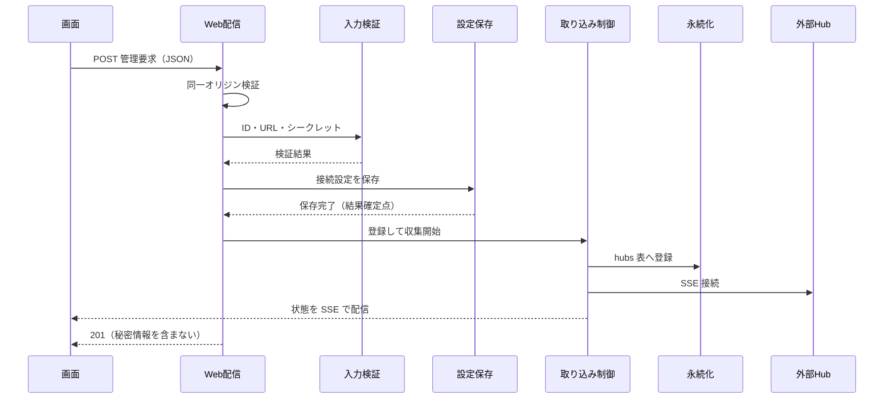

# アーキテクチャ設計書

本書は、Token Monitor Analytics のシステム境界、構造、データモデル、状態更新責務、および実行時の保存・処理境界を定義する設計書です。動作仕様と検証条件は [機能仕様](../doc/spec/functional-spec.md)、Hub API の仕様・制約は [連携仕様](../doc/spec/interfaces.md)、製品要件は [設計方針](design-policy.md)、用語定義は [CONTEXT.md](../CONTEXT.md)、開発計画・未決事項は [PLAN.md](../PLAN.md) を参照してください。

## 全体設計の合意

- 提示コミット: 79b82aa
- 対象節: 本欄、第10節 実現パターン P-1、PLAN.md U7 の提案 D-8〜D-10（第8節 D-8〜D-10 として確定）
- 応答の原文（2026-09-14、リポジトリ所有者）:
  > 合意します。

この欄が埋まるまで、どのユースケースも段階4（実処理接続）に入りません。

## 1. 目標・制約と対象スコープ

複数 Hub から AI サービスの利用状況を収集・可視化し、同一契約・利用枠・対象期間の実測増分から利用許容量を推定します。Node.js 24 LTS の単一常駐プロセス、組込 SQLite、限定された安全な利用環境での利用者認証なし運用、Windows 先行対応などの前提制約は [設計方針](design-policy.md) に従います。

- **初期版の設計対象**: 複数 Hub の並行管理（登録・停止・再開）、現在値表示、利用許容量の推定、日次・月次実績の定期収集・補完、手動更新。
- **現在の実装範囲**: 起動・設定、現在値の受信・検証・保存・表示、再接続、全 provider 共通の契約・利用枠推定、Cursorのアカウント全体実績の重複除去、欠測端末を除外する部分推定、Grokの既合意メールキー、共通・旧方式の履歴API/UIを実装しています。provider と同IDの `clientCosts`・`clientHealth` を共通入力とし、枠ごとの消費率を独立した参考値として扱います。schema 8で受信入力履歴と異常終了の検出を追加し、正常再起動時の比較基準を維持します。最新の検証記録はPLANを参照してください。全サービスの実契約を個別に検証することは要件に含めず、正規化した共通入力のテストで担保します。

## 2. システム境界（Context and Scope）

### 2.1 C4 Context

Analytics は Hub への接続設定と自身のローカルデータを管理します。端末からの直接データ収集や、Hub 側データ・契約情報の直接管理は行いません。

### 2.2 Hub 連携の境界

Hub との通信経路・認証、受信項目、保持履歴の制約は [連携仕様](../doc/spec/interfaces.md) を正本とします。現在値の観測と保持履歴は独立した入力として扱い、受信後の処理と保存の境界を本書 第4〜6節に定めます。

## 3. 解決方針 (Solution Strategy)

1. **確実な識別と推定の分離**: 全 provider 共通の入力規則で、利用額に含まれる契約集合と利用枠を対応付けられる範囲で利用許容量を推定します。共有利用額は個別契約や枠へ分配せず、同一プランの共通許容量または設定されたプラン間倍率から枠ごとの参考値を計算します。枠別の結果を合算しません。対応を特定できない取得値も、集計単位・取得状態・時刻を明記してそのまま可視化します。
2. **並行受信と直列処理**: SSE による現在値受信と GET による履歴取得は並行して行い、受信完了後の照合・計算・保存は [単一の処理キュー](ard/0001-serial-processing-queue.md) で直列に処理します。通信待機はキュー外で行い、保存成功時のデータ更新通知と異常時の状態通知を明確に分離します。
3. **状態の独立管理と履歴保全**: Hub 接続状態、収集設定、データ保存状態、推定可否を独立して管理し、局所的な障害が安全な閲覧や他 Hub の通信を阻害しないようにします。取得済みの実績履歴は保全し、再取得データで非破壊更新します。

## 4. 構成要素 (Building Block View)

### 4.1 C4 Container

ブラウザは独立したクライアント環境、SQLite は Node.js プロセスに組み込まれた永続化境界です。Analytics は単一常駐プロセスとして動作し、初期版の Web 経路（HTML、静的ファイル、JSON API、ブラウザ向け SSE）は利用者認証なしで提供します（利用者が管理する安全な利用範囲を前提）。Hub への接続には共有シークレット認証を使用します。

### 4.2 C4 Component（アプリケーション内部構成）

| コンポーネント | 主な責務 |
| --- | --- |
| 起動・終了 | 設定読み込み、HTTP サーバー起動、DB 接続・終了処理、シャットダウン |
| Hub 接続 | 共有シークレット認証、SSE チャンク受信、自動再接続、通信キャンセル |
| 入力検証 | JSON 構文、データ型、必須項目、数値範囲の検証、安全なデータへの正規化 |
| 取り込み制御 | 受信データの直列キューイング、各状態管理、表示用データの保持 |
| 契約関連付け | provider・accountKey・accountEmail とHub・端末・ツールの関係を保持し、全 provider の観測上のHub横断契約とGrokの正規化メールキーを扱う |
| 推定 | ツールの収集範囲に応じた論理利用額ソースの選択、欠測端末の除外、正常で新しい観測と前回状態の比較、利用許容量・推定不可理由・根拠の生成 |
| 永続化 | Hub 設定、観測データ、端末別データ、契約関連、共通・旧方式の推定状態とevents、履歴のトランザクション管理と読み書き |
| Web 配信 | 静的ファイル配信、REST API、共通・旧方式の推定履歴 API、ブラウザ向け SSE 配信、管理要求の受け渡し |

現在値機能では、コマンドと終了シグナルの受付を `src/main.js`、モード選択・起動排他・内蔵 Mock Hub の生存期間管理を `src/runtime.js`、設定読み込みを `src/config.js`、Hub 接続・取り込み制御・Web 配信を `src/app.js`、SSE フレーム解析を `src/sse.js`、入力検証と比較用正規化を `src/observations.js`、推定を `src/estimation.js`、推定設定の既知項目投影を `src/estimation-config.js`、永続化を `src/store.js`、画面を `public/` に配置しています。推定イベント履歴の取得は `src/app.js` と `src/store.js`、推定理由・`lastResult`・`evidence` と履歴20件単位の表示は `public/app.js` が担当します。日次・月次実績の取得制御は `src/app.js`、受信検証と端末日付の判定は `src/history.js`、保存・複合カーソルによる読み出しは `src/store.js` が担当します。履歴の表示・操作は `public/app.js`、全ページ取得と二期間比較は `public/history.js` が担当します。Hub 管理と手動更新は [PLAN.md](../PLAN.md) の残件です。

## 5. 識別・状態・保存 (Crosscutting Concepts)

本節は各項目の要点と責務を示します。判定表、保存表の一覧、比較対象の範囲、状態表、通知の順序は [識別・状態・保存の詳細](architecture/crosscutting.md) を正本とします。

| 項目 | 要点と責務 | 詳細 |
| --- | --- | --- |
| 5.1 同一性の判定規則 | Hub は Analytics への登録 ID、端末は Hub と `deviceId` の組、契約は `provider` と `accountKey` の組（Grok だけは正規化した `accountEmail` 由来のキー、D-1）、論理利用額ソースは Cursor が契約 ID 集合・他ツールが Hub・端末・ツールの組、利用枠は契約内の枠キー、対象期間は同一枠の有効な `resetsAt`、日次・月次実績は Hub・端末・現地日付・ツールの複合キーで識別する。現在値観測は加算せずスナップショットとして扱う。Hub の識別は契約の識別と別で、共通契約の対応に Hub ID を含めない | [5.1](architecture/crosscutting.md#identity) |
| 5.2 比較基準と推定結果の管理 | `advanceEstimation` が `selectUsageSources` の選んだ論理利用額ソースと前回の共通状態から推定結果・不可理由・根拠を生成し、欠測・stale・費用欠落の端末を除外した部分推定を行う（D-3）。採用するソース集合、利用枠の期間、導出 `percentageLimit` が変わるか gap・reset を検出すると関係する比較基準だけを破棄し、過去の結果と無関係な推定対象は保持する。推定設定の不正は全体の推定だけを止め、Hub の接続・観測保存は続ける。計算式は [機能仕様 第1節](../doc/spec/functional-spec.md#estimation) | [5.2](architecture/crosscutting.md#52-比較基準と推定結果の管理) |
| 5.3 保存モデルと確定点 | 1 受信通知に含まれる観測の追記、全端末の現在参照、Hub 全体の現在表示データ、契約関連、共通推定 checkpoint と新規イベントを単一トランザクションでコミットする（失敗時はロールバック）。永続化層が直前の同一 Hub・端末の観測と比較し、異なる場合だけ観測 ID を発行する。COMMIT 後に `readState` で確定値を読み出して `update` を通知し、永続化コミットと画面通知は独立した確定点とする（コミット後の障害は [U9](../PLAN.md#u9)）。旧方式の `estimation_hubs`・`estimation_events` は読み取り専用の履歴として保持する | [5.3](architecture/crosscutting.md#53-保存モデルと確定点) |
| 5.4 日次・月次実績の保存 | 1 回の取得分の日次・月次行と `history_fetch_state` の成功日時を `commitHistory` の単一トランザクションで確定し、失敗時は成功扱いにしない。当日分の除外は `src/history.js` が端末の `periodWindows.today.key` で判定し、キー不正時は他ゾーンで代用せず当該端末の日次保存を見送る。GET 処理は比較基準を更新しない。規則は [機能仕様 第3節](../doc/spec/functional-spec.md#history) | [5.4](architecture/crosscutting.md#54-日次月次実績の保存) |
| 5.5 独立した状態管理と UI 表示 | Hub 接続状態、接続設定の妥当性、入力バリデーション、データ保存状態、Hub 収集設定、共通契約・関連参照、推定可否、ブラウザ接続状態を独立して管理し、単一の状態フラグへ統合しない。収集設定と契約・推定は SQLite に永続化して再起動時に復元し、接続・検証・保存状態はメモリで管理する。表示規則は [機能仕様 第2節](../doc/spec/functional-spec.md#display) | [5.5](architecture/crosscutting.md#state-management) |
| 5.6 排他制御と通知シーケンス | 受信完了したデータだけを単一キューへ投入し、照合・計算・保存を直列に処理する（D-5、通信待機はキュー外）。ブラウザへは状態変化時に `status`、保存成功時に `update` を送り、保存失敗時に `update` は送らない。接続・再接続時の初回 `status` は保持済みの全体状態から同期的に送って取りこぼしを防ぎ、DB 参照不能時も保持値と異常状態を提供する。ブラウザへの書き込み失敗は当該接続を閉じるだけで保存失敗にしない | [5.6](architecture/crosscutting.md#56-排他制御と通知シーケンス) |

## 6. 重要な実行時シナリオ (Runtime View)

S1〜S9 は機能仕様・設計・モック・テストで共通のシナリオ ID です。動作と検証条件は [機能仕様](../doc/spec/functional-spec.md#scenarios)、処理境界・トランザクション・通知契機の詳細は [実行時シナリオの詳細](architecture/runtime-view.md) を正本とし、本節は担当と確定点の要点を示します。

| ID | シナリオ | 担当と確定点の要点 |
| --- | --- | --- |
| [S1](architecture/runtime-view.md#s1) | 通常の現在値受信と再受信 | 取り込み制御が入力検証の結果を受け、永続化層が観測・端末行・現在値参照・契約関連・共通推定状態を一括コミットし、`readState` の確定値で表示を更新して `update` を配信する。変更のない再受信は観測を追記せず最終受信日時だけ更新する |
| [S2](architecture/runtime-view.md#s2) | 補完中の新規受信と定期取得 | 通信待機はキュー外、保存だけを共通キューへ直列化する。GET は Hub ごとに 1 件、成功は `commitHistory` の確定で判定し、通信失敗は 1 時間後に再試行、JSON・骨格不正は当日の再試行を止める |
| [S3](architecture/runtime-view.md#s3) | 切断と再接続 | 切断 Hub を含む比較基準を直ちに破棄して最終結果は保持し、キュー外で 3 秒間隔の再接続を待つ。次の正常受信は S1、履歴は S2 へ渡す |
| [S4](architecture/runtime-view.md#s4) | リセット・継続性不明・帰属不明 | `resetsAt` の更新・欠測、消費率の減少、契約集合・ソース集合の変更で関係する基準だけを破棄し、境界をまたぐ計算はしない |
| [S5](architecture/runtime-view.md#s5) | Hub 個別の収集停止と再開 | 世代番号の加算、進行中 GET の中止、SSE ループの停止、受信済みキューの処理完了後の停止フラグ保存の順。停止フラグは SQLite に保存して再起動時に復元し、保存失敗時は停止と保存失敗を併記する（API は D-11） |
| [S6](architecture/runtime-view.md#s6) | データ保存失敗 | コミット前の失敗はロールバックし、取り込み制御が全 Hub の保存を停止して表示用の保持値を更新せず `status` だけ通知する。通信は維持し、復旧は原因解消後の再起動で行う |
| [S7](architecture/runtime-view.md#s7) | 再起動とシャットダウン | 名前付きパイプで排他起動し（D-6）、設定検証、保存値と収集設定の読込、HTTP 待受、有効な Hub への接続の順に起動する。終了はキュー処理の完了後にブラウザ接続、HTTP、SQLite の順に閉じ、収集設定は変えない |
| [S8](architecture/runtime-view.md#s8) | Hub 管理操作 | 同一オリジン検証と入力検証の後に管理処理へ渡す。契約は D-8〜D-11、系列は [P-1](#patterns) |
| [S9](architecture/runtime-view.md#s9) | 手動更新と障害復旧 | 互換性確認と更新の安全な実行。シーケンスと復旧手順は [U8](../PLAN.md#u8) で定める |

## 7. 配置と運用 (Deployment View)

Windows 環境上に Node.js アプリケーションとローカル SQLite ファイルを配置し、利用者が管理する安全なネットワーク環境でブラウザからアクセスします（Linux 環境は後続対応、初期版の利用者認証なし）。

- **別端末からの利用**: `.env` の `ANALYTICS_HOST` に実行 PC の LAN 側 IP を指定し、同じネットワークの別端末から接続します。受信許可は必要な通信範囲に限定します。到達性と SSE は [U1](../PLAN.md#u1) の実機検証対象です。
- **環境設定**: `.env` の待受先は両モードで共用します。実データモードは `.local/hubs.json` から Hub 接続設定とトップレベルの `estimation.planMultipliers` を読み込み、`hubs[].estimation` は読み替えず起動を中止します（D-2）。DB は実データ用が `data/real/analytics.sqlite`、Mock 用が `data/mock/analytics.sqlite` です（D-6）。設定ファイルの形と手順は [配置と運用の手順](architecture/operations.md)。
- **設定ファイルの保護**: `.local/` は Git 管理対象外とします。Windows の初期設定手順では、親フォルダーから一般利用者への許可を引き継がないようにし、実行アカウント・SYSTEM・Administrators へ必要なアクセス権を設定します。読み込み後の共有シークレットは Hub 接続の認証ヘッダー生成にだけ渡し、Web 配信用データや診断出力に設定オブジェクト全体を渡しません。ファイルへのアクセス制御は [Windows のファイルセキュリティ](https://learn.microsoft.com/en-us/windows/win32/fileio/file-security-and-access-rights) に従います。初期設定は `scripts/initialize-config.ps1` が担当します。
- **実行構成**: Node.js 24 の組込 HTTP・SQLite とブラウザ標準 API を使用し、外部 npm 依存とビルド工程を設けません。現時点の表示・保存には追加フレームワークが不要であり、インストールと更新の負担を抑えます。Mock Hub は Mock モード時だけ同じ Node.js プロセス内で起動します。`mise.toml` は作業ディレクトリをリポジトリのルートへ固定し、`node src/main.js real` と `node src/main.js mock` を別タスクとして実行します。

初期設定・起動・終了、別端末からの接続、状態確認と復旧、自動検証と Mock Hub の手順は [配置と運用の手順](architecture/operations.md) を正本とします。

## 8. 設計判断 (Architecture Decisions)

決定表の1行で足りない設計判断は ADR（Architecture Decision Records）として記録しています。

- [ADR 0001: 共通キューによる処理の直列化](ard/0001-serial-processing-queue.md)（Adopted）: 並行受信したデータの照合から保存までを単一キューで直列化し整合性を担保（通信待機はキュー外で実行）。

### 決定一覧

| ID | 決定 | 根拠とした事実と出所 | 影響する範囲 |
| --- | --- | --- | --- |
| D-1 | Hub 横断の契約同一性を `provider` と `accountKey` の組で判定し、Grok だけは正規化した `accountEmail` 由来のキーを使う（[機能仕様 第1.5節](../doc/spec/functional-spec.md#15-利用額契約集合利用枠の対応)、第5.1節） | 上流の固定コミット `2f60827e` の Codex 認証・利用枠生成が Hub 識別子をキーへ含めない構造であること、および 2026-09-13 の実 GET で 3 端末の `accountKey` 一致を確認したこと（[連携仕様 第3.5節](../doc/spec/interfaces.md#35-hub横断同一性の確認範囲2026-09-13)・[第3.6節](../doc/spec/interfaces.md#36-grokの契約識別項目2026-09-13)） | 契約の同一性判定、共通推定の対象集合、`contracts`・`device_contracts` |
| D-2 | 共有利用額を契約別へ分離せず、異なるプランの共有利用額をまとめる場合だけトップレベルの基準プラン・倍率設定を使う。`hubs[].estimation` は後方互換として読み替えず起動を中止する（[機能仕様 第1.2節](../doc/spec/functional-spec.md#12-計算式と成立条件)、第7節） | 2026-09-13 の利用者指示（[PLAN U2](../PLAN.md#u2) に記録）と、旧コミット `81672a8` の `docs/requirements.md` にある DM-PLAN-08・P1-EST-06〜08・AC-P1-18 | 設定ファイルの形式と起動時検証（`ConfigurationError('hub_estimation_must_be_top_level')`）、推定の成立条件 |
| D-3 | 推定式と成立条件、および採用できない端末を除外した部分推定を採る（[機能仕様 第1.2節](../doc/spec/functional-spec.md#12-計算式と成立条件)・[第1.6節](../doc/spec/functional-spec.md#16-比較の中断と再開)） | 2026-09-12 10:45:43 JST の利用者発言（基準プランに対する倍率と比例計算）と、欠測端末で全体を停止する規則を除外・部分推定へ変えた 2026-09-13 の利用者指示（[PLAN U2](../PLAN.md#u2) に記録） | 第5.2節の比較基準、`shared_estimation_state`・`shared_estimation_events`、根拠と除外理由の表示 |
| D-4 | Cursor のアカウント全体実績は、同じ契約集合につき一度だけ数える（[機能仕様 第1.5節](../doc/spec/functional-spec.md#15-利用額契約集合利用枠の対応)、第5.1節の論理利用額ソース） | 2026-09-13 の利用者指示と、Cursor の取得経路がアカウント全体であることを確認した調査（[連携仕様 第3.2.1節](../doc/spec/interfaces.md#321-cursorの利用実績範囲2026-09-13追加調査)） | 論理利用額ソースの識別、Hub 内・全体の利用額とトークン数の重複除去 |
| D-5 | 照合から保存までを共通キューで直列化する（[ADR 0001](ard/0001-serial-processing-queue.md)、[第5.6節](#56-排他制御と通知シーケンス)） | ADR-0001（Adopted）。並行受信したデータの照合・計算・保存を直列化しなければ整合性を保証できないため | 取り込み制御と永続化層。通信待機はキュー外で実行する |
| D-6 | Real と Mock を排他起動し、保存先を `data/real/analytics.sqlite` と `data/mock/analytics.sqlite` へ分離する。起動モードは明示指定し、既定値もフォールバックも設けない（第7節、[機能仕様 S7](../doc/spec/functional-spec.md#s7)） | 2026-09-13 の利用者指示（排他起動と mise の別タスク。[PLAN 第2節](../PLAN.md#mode-separation) に記録）。同一 DB では接続設定を外しても保存済み Mock が表示され、画面のフィルターや同一ポートの取り合いでは防げないため | 起動処理、名前付きパイプによる二重起動拒否、DB パスと運用手順 |
| D-7 | 利用者認証を初期版の対象外とし、後続で実装する（[U12](../PLAN.md#u12)、[設計方針 第3.3節](design-policy.md#33-認証と信頼境界)） | 限定された安全な利用環境を前提とするという利用者合意（[設計方針 第2節](design-policy.md#2-制約と前提事項)）。外部 Hub の共有シークレット認証・入力検証・CSRF 対策は初期版の対象 | Web 配信、静的アセット、JSON API、ブラウザ向け SSE、管理操作 |
| D-8 | Web から登録した接続設定と共有シークレットは、実データでは `.local/hubs.json`、モックでは `.local/hubs.mock.json` に保存し、SQLite の hubs 表には秘密情報を持たない（[第10節 P-1](#patterns)） | 2026-09-14 利用者の応答「合意します。」（提示コミット 79b82aa）。`.local/` の既存アクセス権設定（第7節） | UC-1〜UC-3、S8 |
| D-9 | 管理 API は JSON の POST だけを受け付け、`Origin` が待受ホストと一致するか `Sec-Fetch-Site` が同一オリジンであることを検証し、満たさない要求は 403 で拒否する。利用者認証は U12 のまま | 2026-09-14 利用者の応答「合意します。」（提示コミット 79b82aa）。[設計方針 第3.3節](design-policy.md#33-認証と信頼境界) | UC-1〜UC-3、S8 |
| D-10 | `POST /api/hubs` に id・url・secret。成功 201（secret は返さない）、検証失敗 400 と理由コード、同一オリジン検証失敗 403、保存失敗 500。検証規則は設定ファイル読み込みと同じ | 2026-09-14 利用者の応答「合意します。」（提示コミット 79b82aa）。`src/config.js` の既存検証 | UC-1、S8 |
| D-11 | `POST /api/hubs/{id}/stop` は本文を使わず、成功 200 で id・status・storage を返す。未登録の id は 404 と `hub_not_found`、JSON 以外と同一オリジン検証失敗は D-9 と同じ 403。停止済みへの要求も 200 で状態を変えない。保存失敗時も通信は停止し「収集停止」と「保存失敗」を併記する | 2026-09-14 利用者の応答「OKです。」（提示コミット 0ce3156）。[機能仕様 S5](../doc/spec/functional-spec.md#s5) の停止契機と保存の分離 | UC-2、S5、S8 |

実装を破棄しても本節の決定は破棄しない。出所を書けない根拠は決定にせず PLAN.md の未決事項として扱う。

## 9. 品質確認とリスク管理 (Quality Requirements / Risks)

製品の品質要求と受け入れ条件は [設計方針 第6節](design-policy.md#product-completion)、検証条件は [機能仕様 S1〜S9](../doc/spec/functional-spec.md#scenarios) に従います。現在の確認状況は次のとおりです。

| 対象 | 構成 | 実施日 | 結果 | 参照コミット |
| --- | --- | --- | --- | --- |
| 自動テスト | Real・Mock 両構成の入力 | 2026-09-14 | 202件が成功し、失敗・スキップはありません | `2477a5a` |
| DB 移行とデータ保全 | Real・Mock の複製 | 2026-09-14 | schema 8→10 移行後も既存表の件数と推定 checkpoint が一致し、整合性・外部キー検査は正常です | `2477a5a` |
| 実 Hub からの履歴取得 | Real（Private・Work） | 2026-09-14 | 日次・月次を重複なく保存し、当日分を除外します | `2477a5a` |
| ブラウザーでの表示 | Real | 2026-09-14 | ヘッドレス Edge で絞り込み・二期間比較・ページング・読み出し失敗時の表示保持を確認し、390px・1440px で横はみ出しはありません | `2477a5a` |
| モードの排他起動と保存先分離 | Real・Mock | 2026-09-13 | 相互排他が `RUNTIME_IN_USE` で成立し、分離後の全行ハッシュと整合性が元 DB と一致します | `3a8e2d2` |
| Windows の初期設定 | 共通 | 2026-09-13 | `npm run setup` で設定ファイルの継承除外と実行ユーザー・SYSTEM・Administrators への許可を確認しました | `3a8e2d2` |

- 実 Hub の通信切断・自動再接続、長時間稼働、別端末からの JSON API 直接取得と SSE 再接続は未検証です（[U1](../PLAN.md#u1)）。
- 実ディスク障害・読み取り権限異常と、保存停止範囲の管理操作への適用は未検証です（[U9](../PLAN.md#u9)）。
- 稼働中の DB へ外部から読み取り接続を張ると COMMIT が `database is locked` で失敗し、全 Hub の保存が止まります。全件照合は停止中の複製に対して行います。
- `accountKey` と `accountEmail` は上流が生成する値で公式契約IDとは等価でなく、Claude の組織識別は未解決です（[Issue #34](https://github.com/nuitsjp/token-monitor-analytics/issues/34)）。
- Hub 管理と手動更新は未実装で、初期版の受け入れ検証は完了していません（[U7](../PLAN.md#u7)・[U8](../PLAN.md#u8)）。

## 10. 実現パターン

ユースケースの実現方法の型を P-1 から番号で定義します。ユースケースごとには作らず、既存パターンで説明できないユースケースが現れた時だけ、[仕組みの追加基準](standards/design-and-documentation.md#design-decisions) の4問に答えて追加します。シーケンス図はパターンごとに1本です。

### P-1. 管理操作

- 適用条件と関与コンテナ: 利用者の Web 操作で Hub の設定や収集状態を変える操作（登録、収集の停止・再開）。関与するのはブラウザ、Analytics アプリケーション（Web 配信、入力検証、設定保存、取り込み制御、永続化）、外部 Hub。
- 役割表（実装パスは段階4完了時に確定）:

| 役割 | 責務 | 実装パス |
| --- | --- | --- |
| 画面 | Hub 一覧の表示、登録入力、結果表示 | public/app.js |
| Web 配信 | 管理要求の受付、同一オリジン検証、JSON 解析、応答 | src/app.js |
| 入力検証 | ID・URL・共有シークレットの形式と重複の検証 | src/config.js |
| 設定保存 | 接続設定の永続化（保存先は設計判断 D-8） | src/hub-registry.js |
| 取り込み制御 | Hub の登録、収集の開始・停止、状態の配信 | src/app.js |
| 永続化 | hubs 表の登録と収集有効フラグ | src/store.js |

- 主成功系列（参加者名は役割名）:

- 整合性: 状態更新の主体は取り込み制御。結果確定点は接続設定の保存成功で、その後に hubs 表への登録と収集開始を行う。障害時は、検証失敗と保存失敗では登録せず理由を返し、収集開始後の接続失敗は接続エラー状態として表示して登録は維持する。管理要求は既存の保存キューで直列化する。
- モックに置き換える境界と合成点: 外部 Hub（`mock/hub.js`）。合成点は `src/runtime.js` の mode 分岐1箇所で、モック専用の型・画面・通信層は作らない。
- 設計判断への参照: [第8節](#8-設計判断-architecture-decisions) D-8（保存先）、D-9（CSRF 対策）、D-10（管理 API の契約）。
