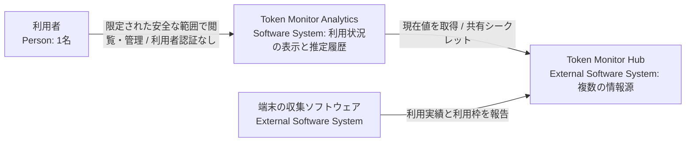
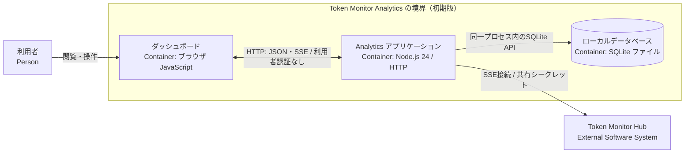
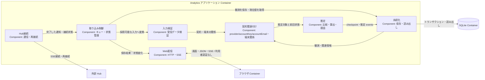
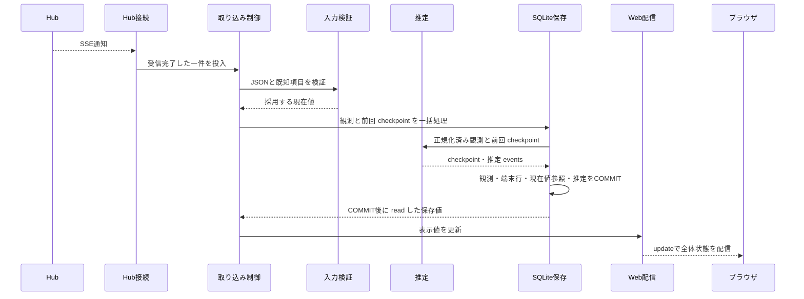

# アーキテクチャ設計書

本書は、Token Monitor Analytics のシステム境界、構造、データモデル、状態更新責務、および実行時の保存・処理境界を定義する設計書です。動作仕様と検証条件は [機能仕様](../doc/spec/functional-spec.md)、Hub API の仕様・制約は [連携仕様](../doc/spec/interfaces.md)、製品要件は [設計方針](design-policy.md)、用語定義は [CONTEXT.md](../CONTEXT.md)、開発計画・未決事項は [PLAN.md](../PLAN.md) を参照してください。

## 1. 目標・制約と対象スコープ

複数 Hub から AI サービスの利用状況を収集・可視化し、同一契約・利用枠・対象期間の実測増分から利用許容量を推定します。Node.js 24 LTS の単一常駐プロセス、組込 SQLite、限定された安全な利用環境での利用者認証なし運用、Windows 先行対応などの前提制約は [設計方針](design-policy.md) に従います。

- **初期版の設計対象**: 複数 Hub の並行管理（登録・停止・再開）、現在値表示、利用許容量の推定、日次・月次実績の定期収集・補完、手動更新。
- **現在の実装範囲**: 起動・設定、現在値の受信・検証・保存・表示、再接続、全 provider 共通の契約・利用枠推定、Cursorのアカウント全体実績の重複除去、欠測端末を除外する部分推定、Grokの既合意メールキー、共通・旧方式の履歴API/UIを実装しています。provider と同IDの `clientCosts`・`clientHealth` を共通入力とし、枠ごとの消費率を独立した参考値として扱います。schema 8で受信入力履歴と異常終了の検出を追加し、正常再起動時の比較基準を維持します。最新の検証記録はPLANを参照してください。全サービスの実契約を個別に検証することは要件に含めず、正規化した共通入力のテストで担保します。

## 2. システム境界（Context and Scope）

### 2.1 C4 Context



Analytics は Hub への接続設定と自身のローカルデータを管理します。端末からの直接データ収集や、Hub 側データ・契約情報の直接管理は行いません。

### 2.2 Hub 連携の境界

Hub との通信経路・認証、受信項目、保持履歴の制約は [連携仕様](../doc/spec/interfaces.md) を正本とします。現在値の観測と保持履歴は独立した入力として扱い、受信後の処理と保存の境界を本書 第4〜6節に定めます。

## 3. 解決方針 (Solution Strategy)

1. **確実な識別と推定の分離**: 全 provider 共通の入力規則で、利用額に含まれる契約集合と利用枠を対応付けられる範囲で利用許容量を推定します。共有利用額は個別契約や枠へ分配せず、同一プランの共通許容量または設定されたプラン間倍率から枠ごとの参考値を計算します。枠別の結果を合算しません。対応を特定できない取得値も、集計単位・取得状態・時刻を明記してそのまま可視化します。
2. **並行受信と直列処理**: SSE による現在値受信と GET による履歴取得は並行して行い、受信完了後の照合・計算・保存は [単一の処理キュー](ard/0001-serial-processing-queue.md) で直列に処理します。通信待機はキュー外で行い、保存成功時のデータ更新通知と異常時の状態通知を明確に分離します。
3. **状態の独立管理と履歴保全**: Hub 接続状態、収集設定、データ保存状態、推定可否を独立して管理し、局所的な障害が安全な閲覧や他 Hub の通信を阻害しないようにします。取得済みの実績履歴は保全し、再取得データで非破壊更新します。

## 4. 構成要素 (Building Block View)

### 4.1 C4 Container



ブラウザは独立したクライアント環境、SQLite は Node.js プロセスに組み込まれた永続化境界です。Analytics は単一常駐プロセスとして動作し、初期版の Web 経路（HTML、静的ファイル、JSON API、ブラウザ向け SSE）は利用者認証なしで提供します（利用者が管理する安全な利用範囲を前提）。Hub への接続には共有シークレット認証を使用します。

### 4.2 C4 Component（アプリケーション内部構成）



| コンポーネント | 主な責務 |
| --- | --- |
| 起動・終了 | 設定読み込み、HTTP サーバー起動、DB 接続・終了処理、シャットダウン |
| Hub 接続 | 共有シークレット認証、SSE チャンク受信、自動再接続、通信キャンセル |
| 入力検証 | JSON 構文、データ型、必須項目、数値範囲の検証、安全なデータへの正規化 |
| 取り込み制御 | 受信データの直列キューイング、各状態管理、表示用データの保持 |
| 契約関連付け | provider・accountKey・accountEmail とHub・端末・ツールの関係を保持し、全 provider の観測上のHub横断契約とGrokの正規化メールキーを扱う |
| 推定 | ツールの収集範囲に応じた論理利用額ソースの選択、欠測端末の除外、正常で新しい観測と前回状態の比較、利用許容量・推定不可理由・根拠の生成 |
| 永続化 | Hub 設定、観測データ、端末別データ、契約関連、共通・旧方式の推定状態とevents、履歴のトランザクション管理と読み書き |
| Web 配信 | 静的ファイル配信、REST API、共通・旧方式の推定履歴 API、ブラウザ向け SSE 配信、管理要求の受け渡し |

現在値機能では、コマンドと終了シグナルの受付を `src/main.js`、モード選択・起動排他・内蔵 Mock Hub の生存期間管理を `src/runtime.js`、設定読み込みを `src/config.js`、Hub 接続・取り込み制御・Web 配信を `src/app.js`、SSE フレーム解析を `src/sse.js`、入力検証と比較用正規化を `src/observations.js`、推定を `src/estimation.js`、推定設定の既知項目投影を `src/estimation-config.js`、永続化を `src/store.js`、画面を `public/` に配置しています。推定イベント履歴の取得は `src/app.js` と `src/store.js`、推定理由・`lastResult`・`evidence` と履歴20件単位の表示は `public/app.js` が担当します。日次・月次実績の履歴取得、Hub 管理、手動更新の各責務は [PLAN.md](../PLAN.md) の計画に従って具体化します。

<a id="crosscutting"></a>
## 5. 識別・状態・保存 (Crosscutting Concepts)

<a id="identity"></a>
### 5.1 同一性の判定規則

| 対象エンティティ | 同一性判定の規則 | 設計・実装状況 |
| --- | --- | --- |
| Hub | Analytics への登録単位で分離（URL のみで判定しない） | 設定ファイルの ID で実装済み。Web 管理は [U7](../PLAN.md#u7) |
| 端末 | Hub と `deviceId` の組み合わせで識別。ID 変更時は別端末として扱い自動名寄せは行わない | 推定の registry と構成変更の扱いに実装済み |
| 契約 | 全 provider で `provider` と `accountKey` の組をHubをまたぐ観測上の契約IDとして扱い、プラン名は属性として保持する。Grokだけは `provider=grok` と trim・lowercase 済み `accountEmail` 由来のSHA-256キーを使い、トークンの `accountKey` 変更では分割しない。メール欠落行は契約を生成せず端末の取得情報として保持する。公式契約IDと等価とは保証しない。Claudeの組織識別不足は [Issue #34](https://github.com/nuitsjp/token-monitor-analytics/issues/34) に残すが、共通実装をブロックしない | schema 5以降の `contracts` に保持。schema 5の検証は歴史的事実として第9節に記録 |
| 論理利用額ソース | Cursorはツールと完全一致する契約ID集合、他ツールはHub・端末・ツールの組で識別する。Cursorの代表端末の交替は同じソース、部分重複する契約集合は別集合として不明扱いにする | `src/usage.js` の `usageScope` と `selectUsageSources` に実装 |
| 利用枠 | 同一契約内の枠として枠キーで識別し、複数端末から報告された同じ枠の消費率を単純合算しない | `tool`・`windowKey`・消費率導出元・`percentageLimit` を含む照合を実装。対象範囲の詳細は [U4](../PLAN.md#u4) |
| 対象期間 | 利用枠識別後、同一枠の有効な `resetsAt`（リセット予定日時）で区別（日次・月次集計期間とは独立） | [機能仕様 第1.3節](../doc/spec/functional-spec.md#13-比較区間と対象期間) を適用 |
| 現在値観測 | 受信ごとの加算を行わず、観測時点のスナップショットとして扱う | 再受信判定と推定入力の保存を実装 |
| 日次実績 | Hub、端末、現地暦日、ツールの組み合わせで一意に特定し更新 | 未実装（日付境界判定は U6） |
| 月次実績 | Hub、端末、現地月、ツールの組み合わせで一意に特定し更新 | 未実装 |

現在値機能の先行実装では、Hub の登録キーに [機能仕様 S7](../doc/spec/functional-spec.md#s7) の設定ファイルの `id` を使用します。起動・終了担当は、既存の Hub 登録情報との照合と新規 ID の登録を永続化層へ依頼します。SQLite に登録 ID と収集設定を保持し、接続先・共有シークレットは起動時に読み込んだ設定だけから Hub 接続へ渡します。設定から外れた登録のデータは削除せず、設定の有無を取り込み制御が管理します。登録情報の書き込みに失敗した場合も HTTP 待受・Hub 接続を開始せず、起動を中止します。Hubの識別は契約の識別とは別であり、共通契約の対応にはHub IDを含めません。

Grokの現在・過去の契約対応と代表値の選択は、永続化層の読み出し時に保存済みの最新端末観測から判定します。判定規則は [機能仕様 第1.5節](../doc/spec/functional-spec.md#15-利用額契約集合利用枠の対応) に従い、観測の内容や過去イベントは書き換えません。Web表示層はこの契約対応を参照してカードと関連リンクをまとめます。

### 5.2 比較基準と推定結果の管理

計算式、観測の採用条件、比較区間、期間遷移、結果表示の仕様は [機能仕様 第1節](../doc/spec/functional-spec.md#estimation) を正本とします。

`advanceEstimation` は、全Hubの端末・ツール報告から `selectUsageSources` が選んだ論理利用額ソースと前回の共通状態を受け取り、比較可能な起点・最新値・推定結果・不可理由・根拠を生成します。Cursorは `usageScope: account` として同じ契約ID集合の最新報告を一件だけ採用し、他ツールは `usageScope: device` として端末ごとに採用します。利用実績の時刻はツール別 `collection.lastSuccessAt` を優先し、未提供時は `clientHealth.observedAt` を使います。

`selectUsageSources` は最新通知にない端末、gap、stale、費用欠落、収集時刻欠落、収集状態不正を推定対象から除外します。`advanceEstimation` は残るソースとその契約の利用枠から `partial: true` の参考値を計算し、除外元と理由をviewへ保持します。残る契約の率欠測・競合では推定を停止します。Cursorの同じ契約集合で同時刻の費用が異なる場合は `conflicting_usage`、一部の契約だけが重なる集合は `overlapping_usage` として不明扱いにします。数値0は有効であり、欠落を0に補完しません。

同一SSE通知に全値がそろうことは要求しません。採用する論理利用額ソース集合が変われば新しい系列・比較基準を作りますが、Cursorの代表端末だけの交替は同じ系列を維持します。`interruptEstimation` は切断、不正通知、未取得、再起動などの欠測区間で関係する比較基準を破棄し、次の正常なSSEで除外後の対象を再構成します。無関係な推定対象と算出済みの結果は保持します。全 provider を同じ計算式で処理し、通常の単一契約または同一プラン共有は設定なしで計算し、異なるプランの共有利用額だけトップレベルの `estimation.planMultipliers` を参照します。ツール全体の API 換算額は枠別に按分せず、枠ごとの推定結果も合算しません。設定の形、計算式、契約・枠の採用条件は [機能仕様 第1節](../doc/spec/functional-spec.md#estimation) を正本とします。

推定設定の不正は共通設定のため全体の推定状態を「設定が必要」または「設定不正」として保持し、URL・共有シークレットの `configError` とは分離します。共通設定が不正でもHubの接続・観測保存は継続します。Hubごとの推定だけを停止する旧方式の扱いは廃止します。`hubs[].estimation` を含む旧配置は後方互換として読み替えず、`ConfigurationError('hub_estimation_must_be_top_level')` を記録して HTTP 待受・Hub接続前に起動を中止します。トップレベルの `estimation` の形式不正はこの起動障害とは分け、全体の推定だけを停止してHubの受信・保存を続行します。

同じ観測上の契約を複数Hub・端末が報告する場合は、論理利用額ソースごとに一度だけ費用を数え、契約・利用枠の消費率も一度だけ採用します。`device_contracts` はHub・端末・ツールと契約のn:n関係を保持し、各関係の最初と最後の観測IDを根拠として記録します。これらのfirst/last観測IDは契約の有効期間を示しません。現在の関係から消えた既知の契約や端末も関連・観測・履歴を保持します。推定では利用できない端末を除外して残るソースから計算しますが、欠落をゼロ補完しません。以前の全端末必須・部分計算禁止の設計は、最新の利用者指示によりこの規則へ変更しました。契約集合、採用する論理利用額ソース集合、利用枠の期間、導出 `percentageLimit` が変わった場合やgap・resetを検出した場合は、過去の結果を保持したまま関係する共通比較基準を破棄し、新しい構成の観測から比較を始めます。通常のプロセス再起動では保存済みの比較基準を継続し、Hub切断の状態は再起動後も維持します。保存失敗・異常終了後は収集の未完了印を検出して、不明区間の後から比較を再開します。同時刻の率・リセット日時・導出上限・明示プラン・枠採否条件の差は競合として扱います。関係しない推定対象は継続します。方式・スキーマ移行時は、追記済みイベントを変更せず、保存した受信入力を現行規則で再生して現在checkpointを再構築します。

### 5.3 保存モデルと確定点

| データエンティティ | 永続化規則 | 実装状況 |
| --- | --- | --- |
| Hub 設定・端末 | 情報源を分離して管理 | 設定ファイルと `hubs`・`current_devices` に実装済み |
| 現在値観測・現在値参照 | Hub・端末ごとに状態変化した観測を追記し、端末データと現在値参照を同一トランザクションで更新 | `observations`・`current_devices` に実装済み |
| Hub 全体の現在表示データ | `stats.periods`・`stats.limits`・集計日時を上書き保存し、端末観測・推定入力と分離する | `hubs` の現在表示データとして実装済み |
| 全Hub・Hub別メトリクス | 保存済みHub集計を基礎に、Cursorだけ同じ契約集合のアカウント全体実績を一度数えるよう各期間の費用・トークン数を補正する。元集計・端末生値は変更せず、欠落値をゼロ補完しない | `src/metrics.js` が `/api/state` の `metrics` と `hubs[].metrics` を導出 |
| 契約・利用枠の対応 | `provider`・`accountKey`・プラン属性とHub・端末・ツール・枠の関係を保持し、全 provider をHub横断の共通規則で照合する | schema 5以降の `contracts`・`device_contracts` に実装 |
| 共通比較基準・推定結果 | 採用した論理利用額ソースの起点・最新観測、除外ソースと理由、算出時点、対象区間、推定不可理由、算出根拠を保持。`percentageLimit` と論理ソース集合の変更を境界とする | `shared_estimation_state` にmethodVersion 2として実装。schema 8で受信入力からの再計算を実装 |
| 推定入力履歴 | 受信日時・観測ID参照・欠測/鮮度・Hub中断・当時の契約対応と設定を通知順に追記。移行前checkpointを開始点に保存 | `estimation_inputs`。観測と同時確定し、再生でイベントは追加しない |
| 収集の終了状態 | 収集開始前に未完了印を永続化し、正常な保存状態で終了するときだけ解除。保存失敗・異常終了後は結果を保持して比較を中断 | `estimation_runtime`。DBを参照するだけの開閉では変更しない |
| 共通推定イベント履歴 | 共通推定状態の変化を系列ごとに追記し、過去の結果を保持 | `shared_estimation_events` に実装。履歴 API は scope で旧方式と分離し、共通テスト・schema 5移行で検証済み |
| 旧方式の比較基準・推定結果 | 既存のHub単位の起点・結果・理由・根拠を内容を変えず保持し、旧方式履歴として参照する | `estimation_hubs`・`estimation_events` を読み取り専用の旧履歴として保持し、共通方式から更新しない |
| 日次・月次実績 | 複合キーに基づき再取得データで更新（過去レコードは保持） | 未実装（U6） |
| Hub 収集設定 | 有効／停止フラグを永続化し再起動時に復元 | フラグの保存・起動時復元は実装済み。変更操作は未実装（U6） |
| 履歴取得ステータス | 定期取得の完了状況および最終成功日時を記録 | 未実装（U6） |

1受信通知に含まれる観測データ、全端末行、現在値参照、契約関連を単一トランザクションでコミットします（失敗時はロールバック）。各SSEで `shared_estimation_state` の部分更新待ち・不可理由・highWaterを保存し、viewが変化した場合は `shared_estimation_events` を追記します。採用した論理利用額ソースとその契約の観測がそろって計算条件を満たした時だけ、同じトランザクションで新しい推定結果を確定します。既存の `estimation_hubs`・`estimation_events` は読み取り専用の旧方式履歴として内容を変えずに保持し、共通方式から更新しません。

schema 8は `estimation_inputs` と `estimation_runtime` を追加します。移行前checkpointを入力履歴の開始点として保持し、schema 7由来の未検証の比較基準だけを中断します。旧結果と観測・現在値・推定events・契約関連の8表は保持します。今後の再計算は通知境界、欠測、契約対応、当時の倍率設定を含む入力を順番通り再生し、追記済みイベントを変更しません。schema 1〜7からの全移行段階を一つのトランザクションで確定し、途中の失敗では版番号を含めて戻します。非互換・破損時の自動初期化は行いません。

**過去のschema 4移行検証（歴史的事実）:** 既存の `observations` の `observation_json`・`comparison_json`、旧方式・共通方式の `estimation_events`、およびGrok以外の `contracts`・`device_contracts` は内容を変えませんでした。保存済み観測からGrokに関係する `contracts`・`device_contracts` だけを再構成し、Grokの `contracts.account_key` には正規化メールアドレスのSHA-256を `email:` 接頭辞付きで格納し、`scope_hub_id` は空としました。平文メールアドレスと生のGrok `accountKey` は既存観測に残し、移行で観測内容を変更しませんでした。他providerの契約関係とCodexを含むshared checkpoint（比較点・前回結果）は維持し、Grokの推定不可状態の現在メタデータだけを新しい関連で再構成しました。過去イベントも保持しています。このschema 4検証の事実は、その後の全 provider 共通schema 5と利用実績範囲方式schema 6の設計・検証と区別します。

schema 8 でも次の共通表の構造と責務を維持します（schema 3〜6で追加・再構成した経緯は歴史的な移行記録です）。

| 表 | 主な意味 |
| --- | --- |
| `contracts` | `id`、`provider`、`account_key`、`scope_hub_id` を保持する契約台帳。全 provider は `provider + account_key` でHub非依存に同定し、Grokだけはschema 4から継続する正規化メール由来のキーを使う。公式契約IDとの等価性は保証しない |
| `device_contracts` | `hub_id`、`device_id`、`tool`、`contract_id` と `first_observation_id`・`last_observation_id` を保持する端末・契約のn:n関連。first/lastは観測根拠であり、契約有効期間ではない |
| `shared_estimation_state` | 論理利用額ソースと契約で構成する推定対象ごとのmethodVersion、比較基準、最新状態、除外・重複ソース、前回結果、停止理由を保持する |
| `shared_estimation_events` | 共通推定の結果・状態変化・算出根拠を時系列で保持する |

**観測の内容と比較担当:** 入力検証は既知項目の型・日時・数値を検証し、端末ごとに比較用データを構成します。Hub と `deviceId` を保存系列のキーとし、端末の `periods`（`today`・`month`・`allTime` の実績と内訳）、`periodWindows`、取得状態（`clientStatus`・`clientHealth`・`wslStatus`）、端末の `updatedAt`、利用枠の `providers`（アカウント・プラン表示情報、`status`・`source`・`updatedAt`、`windows`・残高等の既知項目）を保持します。取得できない値は `null` 等の未取得状態を保ちます。観測・端末の保存単位はHub+deviceIdを維持し、契約の対応だけをHub横断へ分離します。契約・枠の関係が不明な時刻や値を生成せず、`device_contracts` のfirst/last観測IDも根拠を確認できた場合だけ記録します。

入力検証はオブジェクトのキー順を正規化し、`providers`・`windows` の配列は各要素の正規化済み内容で並べ替えます。要素の個数を保ち、同一キーと推測した要素の統合や重複除去はしません。取り込み制御が渡した比較用データを永続化層が直前の同一 Hub・端末の観測と比較し、異なる場合だけ観測 ID を新規発行して追記します。全過去観測を対象とする内容一致の検索や一意制約は設けません。順序変更以外の日時・値の変化は、過去と同じ内容への戻りを含め保存し、推定への採否は U3 の別判定とします。

**比較から除く情報:** SSE のイベント名・`type`・`reason`・外側の `at`、`stats.updatedAt`、端末の `receivedAt`・`ageMs`・`stale`、端末利用枠サマリーの `limits.updatedAt`・`refreshMs` は端末観測の比較対象にしません。上位の Hub 集計、履歴プレビュー・履歴リビジョン、配信設定のメタデータも比較対象外です。日時・鮮度項目の根拠は [連携仕様 第3.1節](../doc/spec/interfaces.md#31-sse-の通知) を参照します。

**受信ごとの保存範囲:** 変化した端末観測の追記、全端末の現在参照・受信日時、端末表示メタデータ、Hub全体の現在表示データ、契約関連を同一トランザクションに含めます。各SSEで共通推定のcheckpointへ部分更新待ち・不可理由・highWater・除外ソースを保存し、viewが変化した場合は新規eventを同じトランザクションへ含めます。採用した論理利用額ソースとその契約の新しい観測がそろい、計算条件を満たした場合だけ新しい推定結果を確定します。既存の `estimation_hubs`・`estimation_events` は読み取り専用の旧方式履歴として保持し、更新しません。端末表示メタデータには識別・端末情報とHubの受信日時・鮮度情報を保持し、比較対象外の情報も表示に必要なものは更新します。今回の通知に含まれない既存端末は現在参照を未報告状態にし、観測・最後の値・受信日時は維持します。正常な同一内容の再受信でも現在表示データと受信日時の保存をコミットします。

COMMIT 完了後に `readState` で確定値を読み出し、UI 配信用の状態を更新してクライアントへ `update` を通知します。永続化コミットと画面通知は独立した確定点であり、コミット完了後の障害処理は [U9](../PLAN.md#u9) で扱います。

### 5.4 日次・月次実績の保存

保存対象の日付・非破壊更新・表示規則は [機能仕様 第3節](../doc/spec/functional-spec.md#history)、取得と成功条件は [S2](../doc/spec/functional-spec.md#s2) に従います。履歴の照合は第5.1節のキーを用い、履歴行と取得完了状態・最終成功日時の保存担当およびトランザクション境界は [U6](../PLAN.md#u6) で定めます。GET 処理が比較基準の更新責務を持つことはありません。

<a id="state-management"></a>
### 5.5 独立した状態管理と UI 表示

以下の状態は独立して管理し、単一の状態フラグに統合しません。

| 管理対象 | 状態の定義と更新主体 | 永続化と復元方針 |
| --- | --- | --- |
| Hub 接続状態 | Hub 接続が接続・切断・通信エラーを検知し、取り込み制御が管理 | メモリ管理（起動時の実通信で判定） |
| Hub 接続設定の妥当性 | 起動・終了担当が入力検証を呼び出して Hub ごとに判定し、取り込み制御が「設定不正」または「接続設定なし」を管理 | メモリ管理（先行実装では起動時に設定ファイルを検証） |
| 入力バリデーション | 入力検証が判定。不正時は取り込み制御がエラー理由を設定し、正常な通知の保存成功で解除 | メモリ管理（保存済みデータは維持） |
| データ保存状態 | 永続化層の書き込み失敗・読み出し不能を受け、取り込み制御が「保存失敗」・「DB 参照不能」を管理し、S6 の範囲で保存を停止 | メモリ管理（原因解消後の再起動で復旧） |
| Hub 収集設定 | ユーザーの管理操作により「有効／停止」を切り替え | SQLite に永続化（再起動時に復元） |
| 共通契約・関連参照 | 契約関連付けが全 provider の `provider + accountKey`（Grokは `provider=grok + 正規化accountEmail`）とHub・端末・ツールの関係を更新し、Web配信が全体 `contracts` とHubごとの `contractIds` を提供 | `contracts`・`device_contracts` に永続化し、`/api/state` から参照 |
| 利用許容量の推定可否 | 契約・枠・期間の整合性に基づき「算出可能／推定不可」を判定し、理由・根拠・過去の最終結果を併記 | checkpoint と events を SQLite に記録し、`/api/state` と画面へ提供 |
| ブラウザ接続状態 | ブラウザクライアントが Analytics との SSE 接続状態を管理 | クライアント側で管理 |

表示規則は [機能仕様 第2節](../doc/spec/functional-spec.md#display)、停止と保存失敗の併記は [S5](../doc/spec/functional-spec.md#s5) に従います。

### 5.6 排他制御と通知シーケンス

1. **直列キュー**: 受信完了したデータのみを共通の単一キューへ投入し、キュー内で照合・計算・保存を直列に処理します（通信待機はキュー外で実行）。
2. **ブラウザ向け通知**: 接続確立・状態変化時は `status` イベント、データ保存成功時は `update` イベントで通知します（保存失敗時は `status` で異常通知のみ行い、誤ったデータ更新通知は行いません）。

SSE 通知は、JSON の解析・正規化、観測・契約関連の保存、論理利用額ソースの選択、共通推定の比較と状態更新、COMMIT、`readState` による読み出しとメトリクス補正、ブラウザへの broadcast の順で処理します。トランザクションには `observations`・現在値参照・`device_contracts` の関係更新を含め、各SSEで共通checkpointの部分更新待ち・不可理由・highWater・除外ソースを保存し、viewが変化した場合は `shared_estimation_events` を追記します。採用した論理利用額ソースとその契約の観測が新しくなり計算条件を満たした場合だけ新しい推定結果を確定します。旧方式の `estimation_hubs`・`estimation_events` は読み取り専用の履歴として共通系列とは別に扱い、更新しません。

現在値の JSON 応答とブラウザ向け SSE は、取り込み制御が保持する保存済みデータ・日時・独立した状態を含む表示用の全体状態を Web 配信が提供します。Web 配信はブラウザの接続・再接続時に配信先を登録し、同じ同期処理内で保持済み全体状態を初回の `status` として送信します。この間に保存結果の適用を挟まないことで、初回表示と以後の更新通知との間の取りこぼしを防ぎます。既存クライアントへは保存後の `update` または状態変更の `status` で全体状態を送信します。

ブラウザへの書き込み失敗は Web 配信が当該接続を終了して処理し、取り込み制御・永続化層へ保存失敗として返しません。ブラウザは SSE を再接続し、その時点の全体状態で表示を置き換えます。初回状態は保持値から生成するため、DB 参照不能時も S6 の保持値と異常状態を提供します。配信のために保存停止中の DB を再読込したり、未保存の受信値で保持値を置き換えたりしません。

<a id="runtime"></a>
## 6. 重要な実行時シナリオ (Runtime View)

S1〜S9 は、機能仕様・設計・モック・テストで共通して使用するシナリオ ID です。動作と検証条件は [機能仕様](../doc/spec/functional-spec.md#scenarios) を正本とし、本節では各シナリオにおけるコンポーネント間の処理境界、永続化トランザクション、および通知契機を定義します。

<a id="s1"></a>
### S1. 通常の現在値受信と再受信



- **処理境界**: 取り込み制御が入力検証結果を受け、永続化層が観測・端末行・現在値参照・契約関連と共通推定状態を一括コミットします。推定は欠測端末を除外して論理利用額ソースを選び、部分更新待ち・不可理由・除外理由を保存し、表示状態が変わった時にイベントを追記します。採用したソースとその契約の正常で新しい観測がそろい、計算条件が成立した時だけ新しい推定結果を確定します。その後に `readState` で確定値とCursor重複補正済みメトリクスを読み出し、表示値を更新して Web 配信へ通知します。Hub 接続はSSE通知の受信完了時刻を付与して取り込み制御へ渡し、永続化層はHubが報告したデータ側の日時と分離して保持します。変更のない再受信では観測を追記せず、現在値参照の最終受信日時を更新します。表示用の日時もコミット後に更新し、表示規則は [機能仕様 第2節](../doc/spec/functional-spec.md#display) に従います。不正入力時の状態通知も取り込み制御が担当します。
- **動作・検証条件**: [機能仕様 S1](../doc/spec/functional-spec.md#s1) を参照（推定の計算式・採用条件は [機能仕様 第1節](../doc/spec/functional-spec.md#estimation)、保存境界は第5.3節）。

<a id="s2"></a>
### S2. 補完中の新規受信と定期取得

通信待機はキュー外で行い、受信完了した GET および SSE データを共通キューで処理します。GET データの保存先は第5.4節に従います。

取得完了状態を更新する担当と保存境界、競合する GET の発行・キャンセル処理は [U6](../PLAN.md#u6) で具体化します（動作・検証条件は [機能仕様 S2](../doc/spec/functional-spec.md#s2) 参照）。

<a id="s3"></a>
### S3. 切断と再接続

Hub 接続が切断を検知して取り込み制御へ通知し、当該Hubを含む共通推定対象の比較基準を直ちに破棄して過去の最終結果を保持したうえで、キュー外で自動再接続を待機します（既定の再接続間隔は3秒）。別Hubからの通知を含む次の正常な現在値は S1 へ引き渡し、gapや取得不能の端末を除外した論理利用額ソースと契約から新しい対象を構成します。履歴は S2 の処理フローへ引き渡します。切断Hubと関係しない推定対象は継続します（動作・検証条件は [機能仕様 S3](../doc/spec/functional-spec.md#s3)）。

<a id="s4"></a>
### S4. リセット・継続性不明・帰属不明

有効な `resetsAt` の更新、欠測、消費率の減少、契約集合・論理利用額ソース集合の変更を検知した場合は関係する共通比較基準を破棄し、過去の推定結果を保持します。欠測・stale・費用欠落等の端末は次の正常な観測で除外し、残るソースの観測を新しい基準として採用します。境界前後をまたぐ計算は行いません。無関係な推定対象の比較基準・結果は維持します（動作・検証条件は [機能仕様 S4](../doc/spec/functional-spec.md#s4) 参照）。

<a id="s5"></a>
### S5. Hub 個別の収集停止と再開

停止要求受付時は通信を中止し、受信済みデータの処理終了後に停止状態を表示します。通信停止・キュー処理・設定保存の順序と担当、設定復元ルールは [U6](../PLAN.md#u6)・[U7](../PLAN.md#u7) で定めます（動作・検証条件は [機能仕様 S5](../doc/spec/functional-spec.md#s5) 参照）。

<a id="s6"></a>
### S6. データ保存失敗

- **処理フロー**: コミット前の例外発生時はロールバックし、取り込み制御が「保存失敗」を設定して後続の書き込みを安全に停止します。共有 SQLite の保存失敗で原因や影響範囲が分からない場合は、取り込み制御が全 Hub の保存を停止します。取り込み制御は表示用に保持している数値・データ側の日時・保存成功データの受信日時を更新せず、Web 配信へ保存状態と Hub 接続状態を通知します。保存停止中の後続受信でも表示用の保持値は更新しません。通信接続は維持し、原因解消後の再起動で復旧します。
- **稼働中の読み出し失敗の処理境界**: 永続化層が検知した DB 参照不能を取り込み制御へ通知し、取り込み制御が全 Hub の保存停止と参照不能状態を管理します。表示用の保持値は更新せず、Web 配信は保持値と異常状態を提供します。DB 読み出しを必要とする履歴要求には取得不能を返します。コミット完了後の読み出し失敗をロールバック処理へ引き渡しません。再起動時の復元は S7 が担当します。
- **保存停止後の受信**: 取り込み制御は未処理の受信済み通知と後続通知を保存対象から外し、復旧後の再処理用には保持しません。Hub 接続・切断・再接続の状態通知と保持済み現在値の閲覧は継続します。復旧は原因解消後の再起動により行い、その時点の Hub スナップショットを通常の受信経路へ渡します。
- **通知不達からの復帰**: 第5.6節の Web 配信とブラウザが担当します。コミット後に永続化層から正常に読み出せた保存値を取り込み制御が保持し、ブラウザの再接続時に最新の保持値を送信します。DB 読み出し不能時は直前の保持値と異常状態を返し、復旧済みとして扱いません。
- **動作・検証条件**: [機能仕様 S6](../doc/spec/functional-spec.md#s6) を参照（履歴取得・管理操作への停止範囲の適用と実装・検証は [U9](../PLAN.md#u9)）。

<a id="s7"></a>
### S7. 再起動とシャットダウン

- **モードと起動排他**: `src/runtime.js` が正規化した作業ディレクトリのハッシュに対応する Windows 名前付きパイプを確保し、その所有権を起動・稼働・終了処理の全体で保持します。二重起動は設定・DB・Hub の処理前に `RUNTIME_IN_USE` として失敗します。OS が所有するため、プロセスの強制終了後にロックファイルは残りません。通常終了と起動途中の失敗では、Analytics、内蔵 Mock Hub、パイプの順で解放します。
- **データ分離**: 設定担当は実データ用と Mock 用で別の DB・ログパスを返します。Mock モードだけが `mock/hub.js` を読み込み、ループバックの空きポートと起動ごとに生成したシークレットで起動します。実 Hub の設定は読み込まず、内蔵 Hub 一つの設定だけを取り込み制御に渡します。Web 配信は選択モードを状態JSONへ含め、`public/app.js` が画面とタブ名へ反映します。
- **全体・契約・利用枠の表示**: `src/metrics.js` は保存済みHub集計を基礎に、Cursorのアカウント全体実績を同じ契約ID集合ごとに一度だけ数えた `state.metrics` と `hubs[].metrics` を生成し、`public/app.js` が画面最上段とHubごとに表示します。補正はHub集計の完全な合計から選ばなかった重複報告の既存Cursor内訳だけを差し引き、選択報告の期間内訳が未提供でも値を生成しません。全体はHub横断、Hub値はHub内で補正するため、全体値はHub値の単純和と異なる場合があります。元の `aggregate` と端末生値は保持し、stale・未接続の保存値も現在値表示から除外しません。契約同定不能・同時刻競合・契約集合の部分重複で補正不能な項目は未取得として理由を表示します。このメトリクス判定は推定用の欠測端末除外とは別です。

  `state.contracts` と `state.estimates` を基に共通契約ごとのカードと共通推定を全体で1件表示し、`hubs[].contractIds`・`hubs[].estimateIds` からHub・端末の関連表示へ移動できるようにします。Hub別の利用額ソースと根拠はHubごとに保持し、契約別に帰属できない額を按分しません。欠落値はゼロ補完せず該当項目を未取得とします。取得状態が `notConfigured` のプロバイダーは既定で描画せず、画面上部のトグルで再表示します。各Hubの `aggregate.updatedAt` は「Hub 最終更新日時（データ側）」、`receivedAt` は「最終保存成功データの受信日時」として表示します。Codexの空のweeklyラベルは `Weekly` と補い、利用枠の表示率とメーターは `remainingPercent`（未提供時は `100 - usedPercent`）による残量を示します。推定ロジックが扱う消費率は変更しません。除外端末がある推定は取得できた端末の利用額に基づく参考値と明示します。`methodVersion: 2` でactiveなviewを現在値に使い、旧methodのviewは既定で閉じた「以前の集計方法・対象構成の記録」に表示します。旧Hub方式は `legacyEstimateCount` と履歴の `scope=legacy` で区別します。
  - **Grok契約の表示**: `public/app.js` は正規化した `accountEmail` ごとにGrokの契約カードを一件表示し、関係デバイスを n:n で参照します。正常かつ非 stale の最新 `updatedAt` を代表にし、古いトークン行は別カードにしません。メールアドレスがない行は契約カードを作らず端末の取得情報として表示します。同時刻で利用枠の比較対象値（率、枠種別・ID、対象期間等）が異なる場合は `conflicting_rate` を表示し、`label`・`detail`・`source`・配列順だけの差は無視します。
  - **起動シーケンス**: 起動・終了担当が設定ファイルを読み込み、入力検証でファイル全体の構造を確認します。読み込みや全体の検証に失敗した場合は、設定本文を含めないエラーをターミナルとログへ出力して起動を中止します。正常に読み込めた場合に保存済み現在値・Hub収集設定を読み込み、Hubごとの接続設定とトップレベルの共通推定設定を検証します。取り込み制御に検証結果を設定し、HTTP待受開始後に、収集が有効で接続設定が正常なHubへ接続します（停止設定または設定不正のHubへの接続は抑止）。共通推定設定が不正でも、接続・観測保存は継続し、推定全体だけを停止します。
- **起動失敗の処理境界**: 既存 DB を開く処理または読み出しの失敗を永続化層から起動・終了担当へ返します。起動・終了担当が原因をターミナルとログへ出力し、後続の HTTP 待受・Hub 接続の開始を中止します（復旧時の動作・検証条件は [機能仕様 S7](../doc/spec/functional-spec.md#s7)）。
- **HTTP 待受**: 起動・終了担当が検証済みの待受アドレス・ポートを Web 配信へ渡し、待受成功後に Hub 接続を開始します。待受失敗時は原因を記録して DB 接続を閉じ、起動を中止します。待受先の設定契約は [機能仕様 S7](../doc/spec/functional-spec.md#s7) に従います。
- **シャットダウンシーケンス**: 起動・終了担当が終了状態を設定し、Hub 接続に SSE 通信の中止と再接続待機の解除を依頼します。終了開始前に受信完了してキューへ渡した通知は処理し、受信途中の通知と終了開始後の受信は採用しません。保存停止中は S6 の扱いに従います。キュー処理完了を待機後、ブラウザ接続、HTTP サーバー、SQLite 接続の順に安全にクローズします。終了要求を受けても Hub 個別の収集有効／停止設定は変更しません。
  - **推定状態の再開**: 通常の起動では既存の推定checkpoint、比較基準、前回結果を保持し、次の正常な通知を同じ比較区間へ適用します。Hub切断の状態は再起動後も維持し、収集の未完了印が残った保存失敗・異常終了後は前回結果を保持して比較を中断します。方式・スキーマ移行時だけ、保存した受信入力を現行規則で再生してcheckpointを再構築し、追記済みイベントは変更しません。
- **動作・検証条件**: [機能仕様 S7](../doc/spec/functional-spec.md#s7) を参照（推定状態の再開条件は第5.2節）。

<a id="s8"></a>
### S8. Hub 管理操作

初期版では Web 配信において利用者認証を行わず、管理要求を入力検証および CSRF 検証後に管理処理へ引き渡します。操作契約、CSRF 方式、秘密情報保護の詳細は [U7](../PLAN.md#u7) で定めます（動作・検証条件は [機能仕様 S8](../doc/spec/functional-spec.md#s8)、利用者認証は [U12](../PLAN.md#u12)）。

<a id="s9"></a>
### S9. 手動更新と障害復旧

手動更新要求を受け付け、アプリ・DB の互換性確認および更新を安全に実行します。取得・適用・再起動のシーケンスと復旧手順は [U8](../PLAN.md#u8) で定めます（動作・検証条件は [機能仕様 S9](../doc/spec/functional-spec.md#s9) 参照）。

## 7. 配置と運用 (Deployment View)

Windows 環境上に Node.js アプリケーションとローカル SQLite ファイルを配置し、利用者が管理する安全なネットワーク環境でブラウザからアクセスします（Linux 環境は後続対応、初期版の利用者認証なし）。

- **別端末からの利用**: 利用者は `.env` の `ANALYTICS_HOST` に実行 PC の LAN 側 IP アドレスを指定し、同じネットワークの別端末からそのアドレスと `ANALYTICS_PORT` へ接続します。Windows の受信許可は利用環境で必要な通信範囲に限定して運用手順で扱います。別端末からの到達性と SSE の動作は U1 の実機検証対象です。
- **環境設定**: `.env` の待受アドレス・ポートは両モードで共用します。実データモードでは起動・終了担当が `.local/hubs.json` からHub接続設定とトップレベルの共通推定設定を読み込み、S7の入力検証と接続開始へ引き渡します。倍率設定はHub行に置かず、ファイル最上位の `estimation.planMultipliers` に記述します。形は次のとおりです（`windowKey` はUIに表示された正確な枠キーを使用します）。

  ```json
  {
    "hubs": [],
    "estimation": {
      "planMultipliers": [
        { "tool": "codex", "windowKey": "<UIからコピーする正確な枠キー>", "basePlan": "Plus", "plans": { "Plus": 1, "Pro": 5 } }
      ]
    }
  }
  ```

  通常の単一契約・同一プラン共有では設定不要で、異なるプランの共有利用額をまとめる場合だけ設定します。旧Hub行の `estimation` は後方互換で読み替えず、存在時は `ConfigurationError('hub_estimation_must_be_top_level')` として起動を中止します。トップレベルの共通設定の形式不正は全体の推定を停止しますが、Hubの接続と観測保存は継続します。設定項目・検証条件・変更反映契機と共有シークレット保存方針は [機能仕様 S7](../doc/spec/functional-spec.md#s7)、推定の詳細は [機能仕様 第1節](../doc/spec/functional-spec.md#estimation)、SQLite のHub登録情報との対応は第5.1節に従います。DB は実データ用が `data/real/analytics.sqlite`、Mock 用が `data/mock/analytics.sqlite` です。旧 `data/analytics.sqlite` は今回の分離前データとして保持し、以降の起動では参照しません。分離結果の検証記録は [PLAN.md](../PLAN.md#mode-separation) を参照してください。
- **設定ファイルの保護**: `.local/` は Git 管理対象外とします。Windows の初期設定手順では、親フォルダーから一般利用者への許可を引き継がないようにし、実行アカウント・SYSTEM・Administrators へ必要なアクセス権を設定します。読み込み後の共有シークレットは Hub 接続の認証ヘッダー生成にだけ渡し、Web 配信用データや診断出力に設定オブジェクト全体を渡しません。ファイルへのアクセス制御は [Windows のファイルセキュリティ](https://learn.microsoft.com/en-us/windows/win32/fileio/file-security-and-access-rights) に従います。初期設定は `scripts/initialize-config.ps1` が担当します。
- **実行構成**: Node.js 24 の組込 HTTP・SQLite とブラウザ標準 API を使用し、外部 npm 依存とビルド工程を設けません。現時点の表示・保存には追加フレームワークが不要であり、インストールと更新の負担を抑えます。Mock Hub は Mock モード時だけ同じ Node.js プロセス内で起動します。`mise.toml` は作業ディレクトリをリポジトリのルートへ固定し、`node src/main.js real` と `node src/main.js mock` を別タスクとして実行します。

### 初期設定・起動・終了

リポジトリのルートで以下を実行します。

```powershell
npm run setup
```

`.env.example` と `hubs.example.json` から、欠落している `.env` と `.local/hubs.json` だけを作成します。権限設定に失敗した場合はエラーを修正して再実行します。設定項目と変更時の再起動規則は [機能仕様 S7](../doc/spec/functional-spec.md#s7) に従います。

Hub の設定例は空の `hubs` 配列です。実データを使う場合は `.local/hubs.json` の `hubs` に安定した `id`・Hub のベース URL・共有シークレットを記入し、`mise run real` を実行します。Mock を使う場合は `mise run mock` を実行するだけで Analytics と Mock Hub が起動します。どちらも `.env` の待受先をブラウザで開きます。既定は `http://127.0.0.1:3000` です。

切り替え時は起動したターミナルで Ctrl+C を押して終了を待ち、もう一方のタスクを実行します。二つ目の起動が `RUNTIME_IN_USE` で失敗した場合も同じ手順です。タスク間で設定ファイルを編集する必要はありません。実 Hub の URL・秘密情報を変えても同じ情報源として扱う場合は `id` を維持します。設定本文をターミナルやチャットへ貼り付ける必要はありません。

### 別端末からの接続

`.env` の `ANALYTICS_HOST` を実行 PC の LAN 側 IP に変更し、再起動します。別端末では `http://<LAN側IP>:<ポート>/` を開きます。IP は Windows のネットワーク設定で確認します。受信ファイアウォールの許可が必要な環境では、管理者 PowerShell で次の例を実行します。値は `.env` と合わせ、Private プロファイルの同一サブネットに限定します。

```powershell
New-NetFirewallRule -DisplayName 'Token Monitor Analytics' -Direction Inbound -Action Allow -Protocol TCP -LocalAddress '<LAN側IP>' -LocalPort 3000 -RemoteAddress LocalSubnet -Profile Private
```

同じ PC から LAN 側 IP を開けても、別端末からの到達性を検証したことにはなりません。別端末で画面表示と継続更新、切断後の再接続を確認します。

### 状態確認と復旧

画面は `/`、保存済み現在値・契約・共通推定状態のJSONは `/api/state`、ブラウザ向けSSEは `/api/events` です。`state` は全体の `contracts`、`estimates`、`metrics`、`legacyEstimateCount` と、Hubごとの `contractIds`・`estimateIds`・`metrics` を返します。SSEは接続時と更新時に現在の状態全体を送ります。推定イベント履歴は `GET` または `HEAD /api/estimates/history` から取得できます。`scope=global`（既定）または `scope=legacy` を指定でき、`hubId` は任意、`seriesId`・`before`・`limit` も指定できます。旧方式と共通推定の履歴IDはscopeで分離し、`limit` の既定値は50、結果は新しいイベント順の `items` と `nextCursor` です。入力不正は400、DB参照不能は503を返します。日次・月次実績の履歴は未実装で、`/api/history` は通常501、DB参照不能中は503を返します。

ログはターミナルと `.local/real.log` または `.local/mock.log` に記録します。設定障害・待受失敗・既存 DB 障害で起動できない場合は、記録された処理と原因を確認し、修正後に同じモードを再起動します。稼働中の保存失敗・DB 参照不能では全 Hub の保存が停止し、画面は保持値を表示します。原因解消後に再起動してください。SQLiteが数値のエラーコードを提供する場合は `sqliteCode` に記録します。DB を削除して復旧させる手順は設けません。ログファイルの書き込み失敗はターミナルへ明示し、保存停止状態の通知を妨げないようにします。

稼働中の状態や履歴の参照にはアプリのHTTP APIを使います。外部のDBツールで長い読み取りトランザクションを保持すると、SQLiteのコミットが競合して保存停止に至る場合があります。DB全件の照合はアプリ停止中、または停止中に作成した検証用複製で行います。

### 自動検証と Mock Hub

`npm test` は `test/*.test.js` のみを実行し、調査用サブモジュールのテストを含めません。テストは一時フォルダーの DB と空きポートの Mock Hub を使い、実運用の設定・DB を変更しません。

`mise run mock` は5秒ごとの通常更新を行います。自動テストでは `startMockHub` の `scenario` 引数により `duplicate`（同一データの再配信）、`invalid`（3回に1回の不正通知）、`disconnect`（3回に1回の切断）も再現できます。Mock Hub 単独の起動コマンドは設けません。

## 8. 設計判断 (Architecture Decisions)

**実データと Mock の分離（2026-09-13）:** 利用者から排他的な起動と mise の別タスクが指定されました。同じ DB では接続設定を外しても保存済み Mock が現在値や履歴へ表示されるため、保存先を物理的に分けます。画面だけのフィルターや同一ポートの取り合いでは、履歴APIの混入と異なるポートでの同時起動を防げません。今回の切り替え操作を確実にするため、モード選択を一つの起動処理に集約し、OS が解放する名前付きパイプによる排他を追加します。外部サービスや追加依存は不要です。

**過去の設計判断：Hub横断の共通契約とschema 3（2026-09-13）:** 実データで同じCodex Pro5x契約が複数Hubに現れ、Hub別方式のままでは契約枠の消費率を重複して扱います。画面上のカードを統合するだけでは、推定に必要な全Hubの利用額と契約枠の対応を修正できません。そのため、Hub・端末・ツールと契約の関係をn:nで永続化し、全関係ソースから共通推定を算出しながら、旧方式の履歴を保持するschema 3移行を行いました。その後、schema 5で全 provider の契約をHub横断へ統合し、schema 6で利用実績の収集範囲を考慮する方式へ更新し、現在はschema 8で欠測情報を含む受信入力を保存して再計算する方式へ更新しています。

主要な設計判断は ADR（Architecture Decision Records）として記録しています。

- [ADR 0001: 共通キューによる処理の直列化](ard/0001-serial-processing-queue.md)（Adopted）: 並行受信したデータの照合から保存までを単一キューで直列化し整合性を担保（通信待機はキュー外で実行）。
- [ADR 0002: モック駆動開発の採用方針](ard/0002-adopt-mock-driven-development.md)（Proposed）: 本番用 UI を共用し動作する画面で認識を合わせる開発プロセスの提案。
- [ADR 0003: モック開発の補助製品選定](ard/0003-select-mock-tooling.md)（Proposed）: Storybook、MSW、Playwright の組み合わせ案と最小構成案の比較検討。

<a id="quality-and-risks"></a>
## 9. 品質確認とリスク管理 (Quality Requirements / Risks)

製品の品質要求および受け入れ条件は [設計方針 第6節](design-policy.md#product-completion) に従います。

機能仕様（S1〜S9）の検証条件と本書の処理・保存境界に基づき受け入れ検証を行います。

- **調査の証跡**: 固定版の上流調査と [Private Hub 実データ資料](reference/hub-private/README.md) の取得条件は [連携仕様](../doc/spec/interfaces.md) に記録しています（単発取得であり継続接続を保証するものではありません）。
- **過去の自動検証（schema 3、歴史的事実）**: 現在値の受信・検証・保存・表示・再接続・DB 境界、従来のHub単位方式とHub横断の共通契約方式による推定、推定イベント履歴、schema 3 移行のコードを `npm test` 115件で確認しています。実DBコピーのschema 3移行は7.492秒で完了し、旧5表の全行SHA256、`integrity_check`、`foreign_key_check`、契約・端末関連の生成を確認しました。実DB・Mock本体にもschema 3を適用し、旧5表の全行不変・整合性正常・新比較点未流用を確認しました。Mockからrealへの切替とheadless Edgeでの契約カード、Hub別関連、メーター、全体メトリクス、scope履歴、ページング、390px・1440px表示、2Hub更新継続、JavaScriptエラーなしを確認済みです。検証数と残る未検証範囲は [PLAN.md](../PLAN.md) を参照してください。
- **過去のGrok修正検証（schema 4、歴史的事実）**: 全122件の自動テストが成功しました。実DBのGrok契約19件を1契約・4端末へ統合し、観測・旧方式と共通方式の推定履歴・他providerの契約関連と比較状態の不変、DB整合性を確認しました。実画面でもGrokカードとメーターが各1件、重複参照の解消、Codex Pro5xの維持、2Hubの更新継続を確認しました。件数・実行時刻・退避先は [PLAN.md](../PLAN.md) に記録しています。
- **Windows での確認**: `npm run setup` を Windows PowerShell 5.1 で実行し、既存設定の非上書き、`.local` と Hub 設定ファイルの継承除外、実行ユーザー・SYSTEM・Administrators の3者への許可を確認しました。初回は `Set-Acl` の監査情報書き戻しで権限不足となり、DACL のみ保存する処理へ修正して再実行に成功しました。
- **Mock データのブラウザ確認**: ユーザー指定の Chrome へ playwright-cli 0.1.11 で接続し、Mock Hub の2端末、数値の継続更新、2種類の日時、JSON API、アプリ再起動後の自動再接続、390px 幅での横はみ出しなしを確認しました。保存失敗・DB 参照不能の表示と未取得値の表示は、ブラウザ向け SSE 応答を差し替えて検証しました。この操作では同じ PC の LAN 側 IP で画面を開いています。
- **別端末からの確認**: 2026-09-13、ヒアリング1-8に対する利用者の回答により、同じネットワークの別端末から `http://192.168.0.17:3000/` を開き、Mock データの画面表示と約5秒ごとの金額更新を確認しました。端末種別・ブラウザは記録しておらず、JSON API の直接取得と通信切断後の再接続はこの確認に含めません。
- **実 Hub の確認**: 2026-09-13 10:36〜10:38 JST に Private（2端末）・Work（5端末）へ同時接続し、初回と後続の現在値を保存しました。Analytics の JSON API とブラウザ向け SSE をヘッドレスで取得し、両 Hub の受信日時がそれぞれ前進すること、入力検証エラーがないこと、保存状態が正常であることを確認しました。SQLite を読み取り専用で開き、配信された観測 ID が正しい Hub・端末の保存行を指すことを確認しました。ログと JSON API に両 Hub の共有シークレットが含まれないことも確認済みです。接続先とビルド情報は [連携仕様 第1節](../doc/spec/interfaces.md#1-調査根拠) に記録しています。
- **実データの画面確認**: ヒアリング1-11で利用者が Mock・Private・Work の表示を確認しました。その後、利用者のヘッドレス検証の指定に従い、playwright-cli 0.1.11 でヘッドレス Edge を起動し、Private の2端末・Work の5端末、両 Hub の接続正常表示と受信日時の継続更新を確認しました。実データでは390px 幅で11か所の金額が枠からはみ出したため、`public/style.css` を修正して480px 以下では期間ごとの金額を縦に並べました。再検証では390px・1440px ともページと金額のはみ出しがなく、JavaScript エラーもありませんでした。当時の Mock は接続設定を外した保存値の表示で、現在は S7 のモード分離を適用しています。
- **過去の共通方式の計算・画面・移行確認（schema 3、歴史的事実）**: 自動テストで、Hub横断の同一Codex契約の利用額増分10 USD・5 USDと消費率増分10ポイントから、共通の許容量150 USDを一件算出することを確認しました。ヘッドレスEdgeではMockと実データを別々に起動し、共通履歴6件・旧履歴20件の取得、旧Hub絞り込みとページング、Pro 5xの1契約・3ソース表示、Hub内の同契約メーター重複0、全体USD合計一致、Weekly・残量、`notConfigured` のトグルを確認しました。150 USDは制御した自動テストの結果であり、実契約の許容量の測定値ではありません。実DBとMock本体へのschema 3適用後、旧5表全行の不変・整合性正常・旧比較点未流用を照合しました。390px・1440px幅で横はみ出しとJavaScriptエラーはなく、Private・Workの更新も継続しています。証跡は [PLAN.md](../PLAN.md) に記録しています。
- **過去の全 provider 共通方式・schema 5検証（2026-09-13、歴史的事実）**: `npm test` 137/137、JavaScript 25ファイルの構文、実DB・Mockのschema 5移行、実DB13456件・Mock780件の観測、旧方式・共通方式eventsのSHA256一致、Codex・Grok checkpoint一致、`integrity_check`・`foreign_key_check` 正常を確認しました。ヘッドレス実画面は390px・1440pxとも横はみ出し0、JavaScriptエラー0でした。Private 2端末・Work 5端末の接続、Cursor billingを含む共通入力からの推定開始、`unsupported_contract` 0、Codexの過去推定保持、Pro 5xの1契約・3端末、Grokの1契約・4端末も確認済みです。この結果はschema 6導入前の過去の方式に対する記録です。
- **過去の利用実績範囲方式・schema 6検証（2026-09-13、歴史的事実）**: 全148件の自動テストが成功し、失敗・スキップはありません。実DB16579観測とMock DB780観測をschema 5から6へ移行し、観測・現在値・旧方式と共通方式の推定events・契約関連を含む8表の全行SHA-256一致、契約registry一致、`integrity_check`・`foreign_key_check` 正常を確認しました。旧30group・2result（Mockは2group・2result）は `method_changed` の非active viewとして保持され、新比較点は0でした。実データ再起動後も両Hubの接続・保存は正常です。headless EdgeではCursorの採用費用1件と重複1件、Grokの採用費用2件とWork側除外2件、旧Cursor結果749.816 USDの履歴表示、Grok・Codex Pro5x各1契約、3期間のメトリクス、390px・1440pxで横はみ出し0、JavaScriptエラー0を確認しました。Cursor・Grokの新方式は旧結果を流用せず、新しい比較基準の観測待ちでした。この結果はschema 7導入前の検証記録です。
- **現行のschema 8レビュー・検証（2026-09-14）**: 自動テスト159件が成功し、欠測・通知境界・倍率変更を含む受信入力の再生一致、旧版移行の全段階ロールバック、保存失敗・異常終了後の回復を確認しました。実DB・Mockの元8表の全行ハッシュ一致、結果の保持、整合性正常を確認し、修正後の実受信入力からのcheckpoint再計算と正常再起動後の保持も確認しました。画面変更はなく、今回のブラウザ再検証は実施していません。件数・失敗した検証スクリプトの修正・証跡は [PLAN第1節](../PLAN.md#1-現在の到達点) に記録しています。
- **過去の推定checkpoint継続・schema 7検証（2026-09-13）**: 全150件の自動テストが成功し、失敗・スキップはありません。Real（観測19,452件）・Mock（780件）をschema 6から7へ移行し、観測・現在値・旧方式と共通方式の推定events・契約関連を含む8表の全行SHA-256一致、共通eventsの不変、`integrity_check`・`foreign_key_check` 正常を確認しました。保存済み観測の再生でRealは現行29系列・結果3件、旧結果2件を保持し、再起動前後で現行結果3件が同一でした。再起動後もPrivate 2端末・Work 5端末の接続・保存が正常に継続しています。証跡は `.local/estimation-continuity/20260913T120942113Z/manifest.json` と同ディレクトリの再起動確認ファイルです。 2026-09-14のレビューで、当時未保存の欠測・通知境界を正常と仮定した再生に問題が見つかりました。この検証はデータ保持の確認であり、再生結果の妥当性を保証しません。schema 8で修正しました。
- **稼働中の全件照合による競合の調査**: 実DBの外部読み取り中に保存停止を観測しました。一時DBで読み取り専用接続の共有ロックによる `ERR_SQLITE_ERROR / errcode=5 / database is locked` と、失敗時のロールバック・読者解放後の保存成功を再現しました。数値コードを安全なログ項目へ追加しています。実運用の読み取りを終了し再起動した後、両Hubの保存・画面更新と保持済み推定履歴を確認しました。実例の数値コードは当時未記録であり、再現結果と時刻の一致からの原因推定です。詳細な時刻と検証結果はPLANの順序2に記録しています。
- **モード分離の確認（2026-09-13）**: Windows の mise 2026.8.6 で両タスクの起動と相互排他を確認しました。停止中の旧DBから実データ用・Mock用の全5表を分離し、全行ハッシュ・件数・外部キー・整合性と元DBの無変更を照合しました。ヘッドレス Edge で両モードの現在値・推定履歴の分離、継続更新、390px・1440px幅のモード表示を確認しました。自動テストには二重起動と強制終了後の解放も含みます。件数と実施結果は [PLANの追加依頼](../PLAN.md#mode-separation) に記録しています。
- **残る検証**: 実Hubの通信切断・自動再接続、別端末からのJSON API直接取得・SSE再接続、実ディスク・権限障害、長時間稼働を含む従来方式の実機検証を [PLAN.md](../PLAN.md) で追跡します。履歴補完、Web管理、手動更新は未実装です。
