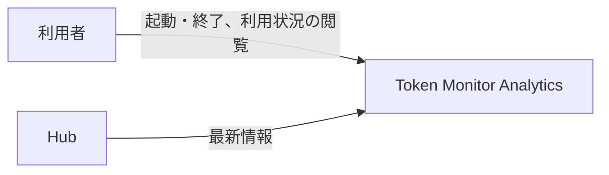
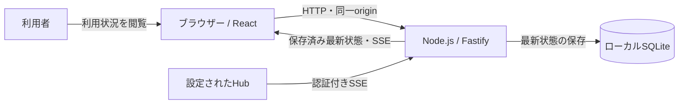

# アーキテクチャ

全体構造と設計上の制約を定義します。技術固有の構成は [React構成](architecture-react.md)、保存形式は [データ設計](design/data.md)、外部仕様は [確認した事実](project.md#design) を参照します。

## 1. システムコンテキスト

利用者がアプリケーションを起動すると、設定ファイルに記載されたHubから最新情報を独立して受信し、ローカルに保存します。利用者はブラウザーで登録Hubの保存済み最新利用状況を閲覧します。

## 2. コンテナ

受信・保存・配信は単一Node.jsプロセスで行い、SQLiteを保存済み状態の正本とします。UC-1は閲覧側への配信までを担当します。UC-2-X1ではブラウザーごとに共通接続を1本持ち、受信した `UsageOverview` を既存のTanStack Queryキャッシュへ反映します。複数コンポーネントは同じキャッシュを購読し、期間選択等の操作状態は分離します。

## 3. 実現パターン

| 実現パターンの設計 | 適用条件・関与コンテナ |
| --- | --- |
| [UCP-1. Hubの受信・保存・通知](design/UCP-1.md) | UC-1-M・UC-1-X1。外部HubからNode.jsが受信し、SQLiteへ保存した最新状態を閲覧側へ通知する |
| [UCP-2. 最新利用状況の閲覧](design/UCP-2.md) | UC-2の各系列。React画面がNode.js経由でSQLiteの最新状態を取得し、通知により表示を更新する |

## 4. 設計上の制約

単一端末で動作し、HTTPサーバーはループバックへ限定します。利用者向けWeb認証と共有環境への配備は対象外です。Hub接続にはGit管理外のJSON設定を使用し、Credential Managerは使用しません。Hubの登録・編集・削除を操作するUIは対象外です。

Hubとの通信は受信と閲覧を分離し、閲覧側の配信失敗は保存処理やHub受信に波及させません。受信履歴の蓄積は行わず、保存した最新状態を利用します。画面のトレンドとアクティビティは固定サンプルで、実データの範囲は [UC-2](usecases/UC-2.md) に従います。
