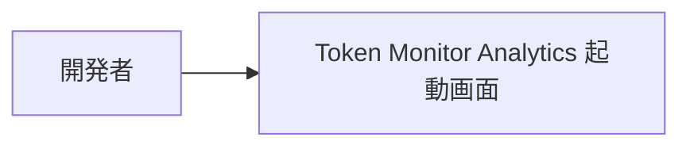
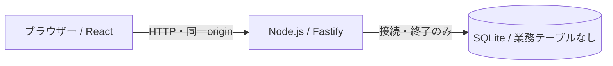

# アーキテクチャ

現在の開発基盤の構成を記録します。製品の全体設計・実現パターン・業務テーブル設計は未合意です。テンプレート採用の承認範囲は [文書方針](document-policy.md#adoption) を参照します。

## 全体設計の合意

製品の全体設計は未提示・未合意です。基盤の起動確認を製品の実処理接続や動作合意として扱いません。

## 1. システムコンテキスト

現在はローカルの起動用画面のみを提供します。外部Hubとの接続はありません。

## 2. コンテナ

ブラウザー側は `frontend/`、サーバー側は `backend/` です。tRPCは空のルーターを登録しています。モック境界は未定義です。責務の補足は [React構成](architecture-react.md) を参照します。

## 3. 実現パターン

製品の系列が未定義のため、実現パターンはありません。

## 4. 設計判断

| ID | 決定 | 根拠と出所 | 影響する範囲 |
| --- | --- | --- | --- |
| ADR-1 | React拡張を適用し、メモ管理サンプルを除去した起動基盤を使用する | 2026-09-20、順序1〜3の実施提案に対する利用者の応答「OK。では進めてください」 | 開発基盤。採用版と差分は文書方針が正本 |

## 5. テーブル設計

業務テーブルはありません。新規DBのスキーマ版は0です。DB接続・WAL設定・終了処理のみを残し、旧製品やサンプルのテーブル作成・移行は行いません。製品のテーブル設計は対象系列の合意時に定義します。
