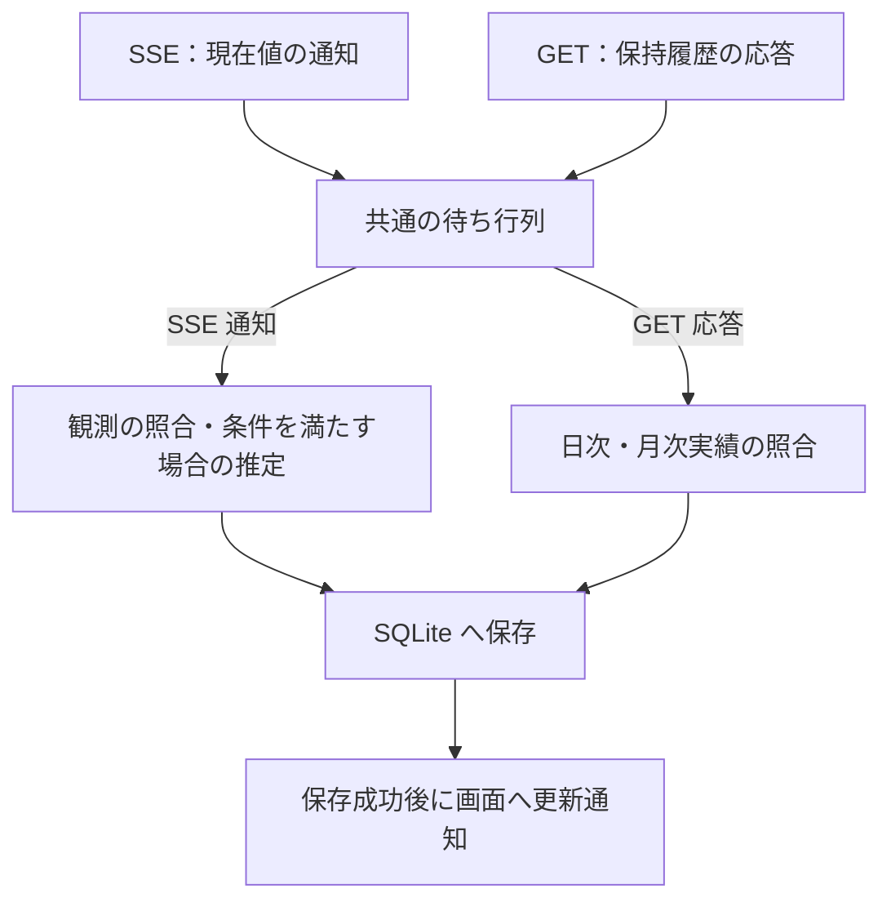

# アーキテクチャ設計

要件・制約は [設計・実装ガードレール](design-policy.md)、設計の進め方は [architecture-process.md](architecture-process.md)、用語は [CONTEXT.md](../CONTEXT.md) を正本とする。

本書は [PLAN.md](../PLAN.md) の手順 1 における調査結果と、合意した識別・推定・保存の原則を記録したものである。手順 3 に属する SSE の現在値観測と GET の履歴収集の役割分担、受信データの処理順序、定期取得・再試行の初期方針も第 7 節に記録する。システム構造、SQLite スキーマ、管理操作を含む排他制御、状態遷移の詳細は未設計である。API の確認済み事実と、Analytics の設計原則、未確定事項を区別する。

## 1. 調査対象と根拠

2026-09-12 に、指定された [Token Monitor](https://github.com/Javis603/token-monitor) を `upstream/token-monitor` に Git サブモジュールとして登録した。

| 項目 | 調査対象 |
| --- | --- |
| URL | `https://github.com/Javis603/token-monitor.git` |
| タグ | `v0.56.0` |
| 固定リビジョン | `2f60827e3028d283969dd74cde5b3f5664220442` |
| Hub 実装 | Node.js Hub と Cloudflare Worker Hub |
| 重点確認した利用枠 | Claude / Codex。その他のプロバイダーの個別仕様は未確認。 |
| 実 Hub | Private Hub への接続と参照 API の応答を確認し、[実データ資料](reference/hub-private/README.md)に保存した。health は Cloudflare Worker、`coreRevision: 36`、`runtimeRevision: 3` を返した。製品リリース番号や全機能の互換性を確認したものではない。 |

サブモジュールは調査根拠であり、Analytics の実行時依存として取り込む判断ではない。別環境で同じソースを取得する場合は、親リポジトリで `git submodule update --init upstream/token-monitor` を実行する。

| 根拠 | 主な確認箇所 |
| --- | --- |
| [API 文書](../upstream/token-monitor/docs/API.md) | 認証、health、投入・集計データ、手入力の契約情報。 |
| [Node Hub](../upstream/token-monitor/src/hub/server.js) | `getStats`、`getDevices`、`getHistory`、`ingest`、`sseFormat`、`handleRequest`。 |
| [Worker Hub](../upstream/token-monitor/worker/src/index.js) | 認証、Durable Object の保存と集計、SSE、公開統計。 |
| [利用実績の正規化・集計](../upstream/token-monitor/src/shared/usage.js) | `normalizeDeviceRecord`、`mergeDeviceRecord`、`normalizeSession`、`aggregateDevices`、`aggregateHistory`。 |
| [履歴](../upstream/token-monitor/src/shared/history.js) | `normalizeHistory`、`coerceHistory`、`historyPreview`、`historyRevision`、`deviceHistoryRevision`。 |
| [送信データ](../upstream/token-monitor/src/shared/syncPayload.js) | `historyForSync`、`buildSyncPayload`。送信時に省略される内訳。 |
| [利用枠の正規化・集計](../upstream/token-monitor/src/shared/limits/core.js) | `normalizeLimitWindow`、`normalizeLimitProvider`、`aggregateLimits`。 |
| [利用枠の収集状態](../upstream/token-monitor/src/shared/limits/runtime.js) | `applyAttempt`、`providerRows`。最後の成功値と最新の試行状態の区別。 |
| [Claude](../upstream/token-monitor/src/shared/providers/claude/limits.js) / [Codex](../upstream/token-monitor/src/shared/providers/codex/limits.js) | アカウントの識別と利用枠の生成。 |
| [収集](../upstream/token-monitor/src/shared/collector.js) / [リセット境界の更新予約](../upstream/token-monitor/src/shared/limits/resetBoundary.js) | 実績と利用枠の更新、期間境界。 |
| [手入力の契約情報](../upstream/token-monitor/src/shared/subscriptionDisplay.js) | `normalizeBinding` と手入力データの意味。 |

上記の相対リンクはサブモジュールの固定リビジョンを参照する。[GitHub 上の同一リビジョン](https://github.com/Javis603/token-monitor/tree/2f60827e3028d283969dd74cde5b3f5664220442)でも確認できる。仕様文書に記載がない経路や保証については、実装を確認した。

Private Hub の実データは 2026-09-12 10:57:13～10:57:14（日本時間）に取得した。取得元・HTTP 状態・取得時刻・本文のハッシュは [manifest](reference/hub-private/2026-09-12T01-57-13-988Z/manifest.json)、ビルド識別情報は [health 応答](reference/hub-private/2026-09-12T01-57-13-988Z/health.json)を参照する。以下の第 2 節は固定ソースの調査結果であり、単発の実データ取得によって全ての挙動を検証したものではない。

## 2. Hub API の確認済み事実

### 2.1 取得経路と認証

| 経路 | 内容 | Analytics にとっての意味 |
| --- | --- | --- |
| `GET /api/health` | 認証不要。`runtime`、`version`、`hubBuild`、`secretRequired` など。 | `version` は製品のリリース番号ではない。`hubBuild` は登録されたソースの識別情報であり、実環境のソース改変を保証するものではない。 |
| `GET /api/stats` | 全端末の期間集計、端末ごとの実績・利用枠、集約された利用枠、履歴プレビュー。 | スナップショットであり、利用イベントの一覧ではない。 |
| `GET /api/stats/stream` | 接続時の `snapshot` イベントと、その後の `stats` イベント。 | いずれも `{ type, reason, stats, at }` に集計スナップショットを包む。 |
| `GET /api/devices` | `{ devices: [...] }`。保持している端末レコードに `periods`、`limits`、任意の `history` などを含む。 | 端末別の保持履歴を得る経路。SSE の `stats.devices` には `history` 本体が含まれない。 |
| `GET /api/history` | 端末間で集約した `daily`、`monthly`、`summary`。 | Hub 全体の履歴。端末・契約の分離を保つ補完の正本には使えない。 |
| `GET /api/subscriptions` | Hub 内で共有する手入力の契約・支払情報。 | 利用実績に契約を帰属させる証拠にはならない。収集への採用は未決定。 |

保護された取得経路は、共有シークレットを `Authorization: Bearer` または `X-Token-Monitor-Secret` で受け取る。Analytics 自身の Web 画面等に適用する Basic 認証とは別の認証である。

Worker は `secret` クエリパラメーターも受け付けるが、Node と共通の方式ではない。Analytics からはヘッダーを使い、接続 URL にシークレットを埋め込まない。

Node Hub はシークレット未設定時にループバックへバインドし、認証判定は通過する。Worker Hub はシークレット未設定時に保護されたデータ経路を 503 で拒否する。Worker にのみ、設定で有効化する認証不要の `/api/public/stats` がある。この公開経路は端末やアカウントの識別情報を落とすため、今回の収集要件を満たす経路として扱わない。

### 2.2 SSE、順序、再接続

- 両 Hub の SSE は `event:` と `data:` を出力し、30 秒間隔でコメント形式の heartbeat を送る。イベントの `id:`、`retry:`、`Last-Event-ID` に基づく再送、履歴カーソルは実装されていない。
- 再接続で得るのは、その時点のスナップショットである。切断中の各観測が再送される保証はない。
- `at` と集計全体の `updatedAt` は応答・集計時刻であり、元の利用が発生した時刻や一意のイベント番号ではない。管理操作による更新でも統計が配信される。
- 各 GET と SSE の間で共通に使える単調増加の版番号や、一貫した読み取り時点を指定する機能はない。GET の応答到着順だけで SSE より新しいデータとは判定できない。
- 投入データは端末 ID ごとに現在のレコードへ反映される。古い `updatedAt` の投入を拒否する一般的なガードはなく、上流でも古い値へ戻る可能性を排除できない。

したがって、受信回数を利用回数として数える方式は成立しない。Analytics では現在値の観測を SSE、日次・月次実績の収集を GET に分け、独立して受信する（第 7.1 節）。SSE 内で遅れて届いた観測の扱い、切断により比較の連続性が失われた範囲の具体的な判定は手順 3 で設計する。

### 2.3 利用実績と履歴

| 情報 | 確認できた意味・限界 |
| --- | --- |
| `deviceId` | Hub 内の端末レコードのキー。Hub をまたぐ一意性、端末の再設定後の継続性は保証されない。 |
| `periods.today / month / allTime` | 各期間の累積集計。`costUsd` は米ドル建ての API 換算額、`clientCosts` はツール別の換算額。これらを受信のたびに足し合わせてはいけない。 |
| セッション内訳 | ツール・セッション・モデル等の情報はあるが、利用枠の `accountKey` や契約 ID はない。送信時に明細が省略される場合もあり、各リクエストの完全な履歴ではない。 |
| `periodWindows` | `today` と `month` のキー・終了時刻、任意の IANA タイムゾーン。端末のカレンダー境界であり、利用枠の期間境界ではない。 |
| 日付境界 | Hub 集計では期間の終了後にその端末の `today/month` を合計から除外する。`allTime` はこの失効を行わない。合計額の減少が必ずしも利用枠のリセットを意味しない。 |
| `historyAvailable` と `history` | `true` と履歴本体の両方を確認する。投入時の `history` 省略は以前の履歴を保持し、明示的な `null` は利用不可を表す。更新された端末レコードに古い履歴が残ることがある。 |
| 保持履歴 | 日別・月別集計とサマリー。標準の履歴生成は日別を直近 370 日に制限し、月別・サマリーはその切り詰め前の入力から生成する。これは Hub が任意の日付の履歴を復元できる保証ではない。 |
| 履歴 GET | 現在保持する履歴をまとめて返す。期間指定・ページング・時刻カーソルによる観測履歴の取得 API はない。過去の利用枠観測も含まれない。 |
| `historyRevision` / `deviceHistoryRevision` | 履歴内容や端末別の保持状態から作る変更検出用ハッシュ。単調増加の版番号、全データの識別子、再送位置ではない。 |

特に `limitsOnly` の投入は、実績を維持したまま端末の `updatedAt` / `receivedAt` を更新する。正規化後のレコードに `limitsOnly` は残らない。実績と利用枠が同じレコードにあること、端末の日時が新しいことだけでは、両者が同時に測定されたとは判断できない。

履歴の `daily` は報告された日付の行を保持範囲から抽出したもので、前日の行が必ず存在するとは限らない。`historyAvailable: true` や端末の更新時刻も、前日分の集計完了を保証しない。[履歴生成処理](../upstream/token-monitor/src/shared/history.js) の実装と [履歴の取得判定テスト](../upstream/token-monitor/tests/electron/historySource.test.js) の記述から、空の履歴と `historyAvailable: true` が共存し得ることを確認した。Private Hub の保存資料でも、2026-09-12 取得時に端末の当日キーが 2026-09-12、履歴の最新日が 2026-09-09 の例がある。日次行の有無、明示的なゼロ値、取得処理の成功・失敗は別に扱う。

履歴の `date` はローカル暦日を表し、日次行自体にはタイムゾーンがない。端末の `periodWindows.timeZone` は任意項目である。保存資料の両端末は `Asia/Tokyo` だが、不明・異なるタイムゾーンを含む場合の「前日」判定は未設計である。

### 2.4 利用枠、アカウント、観測時刻

利用枠は `limits.providers[]` 内にあり、プロバイダー行は `provider`、`accountKey`、表示用のアカウント情報・プラン名、`status`、`source`、`updatedAt`、`windows[]` などを持つ。

| 項目 | 設計に関係する事実 |
| --- | --- |
| `accountKey` | 上流が生成するアカウントの識別情報。正式な契約 ID ではなく、全プロバイダーに共通する生成・継続規則もない。 |
| 集約された利用枠 | 同じキーの候補から鮮度・状態・枠の有無・時刻等で代表を選ぶ処理がある。金額のような加算値ではなく、集約時に非採用になる端末観測もある。 |
| `windows[].kind` | `session`、`daily`、`weekly`、`billing`。同じ種類の枠が複数あるため、これだけで一意とみなせない。 |
| `limitId` / `additional` / `metric` | 枠の区別に利用できるが、任意項目。プロバイダーによって意味が異なる。配列位置や表示ラベルを普遍的な識別キーにはしない。 |
| `usedPercent` | 0～100 の消費率。正規化で範囲内へ丸められる。欠落は `null` になり得る。残り率は別項目。 |
| `resetsAt` / `windowMinutes` | 任意の終了・更新時刻と期間長。期間の一意 ID やリセット実施の通知ではない。 |
| `boundaryKind` / `showMeter` | リセット以外に失効や混合を表す枠、割合メーターを表示しない枠も存在する。全ての残高・クレジットを定額枠として扱えない。 |
| `status` と `updatedAt` | 更新試行の状態や時刻である場合があり、枠の値の測定時刻と同一とは限らない。Codex には一時エラー時に直前の枠を保持する処理がある。 |

契約、アカウント、表示用のプラン名を同一視しない。手入力の `/api/subscriptions` も、利用実績に契約・利用枠の情報を追加する API ではない。

Claude と Codex では、次の差異を確認した。

- Claude の Web / OAuth 経路は、アカウント ID、組織 ID、メールアドレスの順に採用した情報から `accountKey` を生成する。同じアカウント ID が得られる場合には組織 ID はキーに含まれないため、契約や組織の切り替えまで一意に表すとは限らない。CLI 経路はメール・組織名、どちらもなければ固定文字列を使う別の識別規則であり、同じ保証とは扱わない。短時間枠と週次枠があり、追加のモデル限定週次枠もあり得る。`kind` のみでは衝突する。
- Codex はメールアドレスとワークスペースのアカウント ID が揃う場合に、その組からキーを生成する。不足時には保存されたキー等の別の入力を使う経路がある。メールアドレスだけでワークスペースの異なる契約を結合しない。通常枠にも `limitId` があり、追加枠は `additional: true` を持つ。同じ `limitId` に短時間枠と長時間枠があるため、`limitId` のみでも一意にならない。
- 現在の集約実装は、設定済みの Claude / Codex について異なる `accountKey` をプロバイダー名だけで結合しない。「OS 間のキー差をプロバイダー名でまとめる」という上流のコメント・説明を、この二つの現在の動作として採用しない。
- 現在の `LimitsRuntime` は一時エラー時に最後の成功値を保持し、公開する行の `status` は最新の試行状態にする。Codex の対応テストでも `unavailable` と以前の枠・更新時刻が共存する。枠の存在だけを新たな観測成功の証拠にしない。また、Hub の stale 判定は時刻がない場合に false になるため、`stale: false` だけでも鮮度を保証できない。

以上は [Claude の識別処理](../upstream/token-monitor/src/shared/providers/claude/limits.js)、[Codex の識別処理](../upstream/token-monitor/src/shared/providers/codex/auth.js)、[Codex の枠生成](../upstream/token-monitor/src/shared/providers/codex/limits.js)、[共通の集約処理](../upstream/token-monitor/src/shared/limits/core.js)、[収集状態](../upstream/token-monitor/src/shared/limits/runtime.js) と [Codex のテストコード](../upstream/token-monitor/tests/shared/limitCollector.codex.test.js) に基づく。テストコードは読解のみで、実行結果ではない。

### 2.5 上流の保存と通知の限界

Node Hub は端末レコードをメモリ上で変更してから JSON ファイルへ保存し、その後に SSE を配信する。端末の投入・削除では、保存失敗時にメモリの変更を戻す処理がない。そのため後続の GET で見える値を、Hub 側でも永続化が完了した値と断定できない。

Worker Hub は端末レコードを Durable Object storage に保存してから配信を開始するが、更新処理の成功は全購読者への配信完了を保証しない。どちらの Hub にも、Analytics が受信・保存した位置を確認する仕組みはない。Analytics 自身の保存確定と表示・通知の順序は、上流とは独立して設計する。

## 3. 識別・推定について確定できる原則

### 3.1 情報源と対象の分離

以下は Analytics 側の設計原則であり、SQLite のキー定義を確定したものではない。

| 対象 | 識別の原則 | 未確定部分 |
| --- | --- | --- |
| Hub | Analytics の登録単位を持ち、配下の全データをその単位に所属させる。URL や表示名だけに依存しない。 | 接続先変更・同じ Hub の重複登録の扱い。 |
| 端末 | Hub の登録単位と `deviceId` を組み合わせて分離する。ID が変わった場合は別端末とし、自動で結び付けない。同じ ID の実績の比較は第 3.3 節に従う。 | 比較基準の保存と更新（手順 3）。 |
| 契約 | プロバイダーのアカウント観測と、推定対象の契約を区別する。ツール名やプラン名だけで帰属させない。 | 実績から契約への対応付けを証明する方法。 |
| 利用枠 | 契約内で枠の種類と上流の識別情報を組み合わせる。同じアカウントを複数端末が報告しても、消費率を合算しない。 | 対象プロバイダーごとの安定した枠キーと、契約との対応。 |
| 対象期間 | 同じ利用枠のリセット予定時刻 `resetsAt` を基準に区切る（第 3.4 節）。日別実績のキーとは分ける。 | 状態遷移と比較の起点の永続化（手順 3）。 |
| 利用実績 | 端末・ツール・集計期間に属する累積値として扱う。ツール別合計とそのセッション・モデル内訳を重ねて足さない。 | 観測の版、同時刻で値が異なる場合、古い値への巻き戻りの扱い。 |
| 保持履歴 | 日別なら Hub・端末・日付・ツール、月別なら Hub・端末・月・ツールを区別する。日別と月別を重ねて計上しない。 | タイムゾーンや収集範囲が変わった際の継続性。 |

**端末 ID 変更時の扱い（U5、2026-09-12 合意）**: 再インストールなどで `deviceId` が変わった場合は別端末として扱い、以前の端末と自動で結び付けない。以前の記録は保持し、新しい端末では新たに得た観測を推定の起点にする。

**将来の手動関連付け**: 同じ Hub 内の過去データの `deviceId` を、利用者が指定した新しい `deviceId` に書き換えて関連付ける機能を将来実装する。保存済みの利用額や推定値は変更しない。具体的な更新・衝突・再受信の扱いは [設計方針 第 6 節](design-policy.md#6-事前相談と将来要件)に従い将来の実装時に設計する。初期版には関連付け処理を実装しない。

### 3.2 再受信と二重計上防止

SSE と GET は同じ累積値や履歴バケットを何度でも返し得る。初期版では SSE の現在値の観測と GET の日次・月次実績を分けて照合する。同じ SSE 観測の再受信だけでは新たな利用増分や推定結果を計上せず、同じ日次・月次実績の再取得でも値を加算しない。応答時刻、受信時刻、受信経路の違いだけを新しい実績の証拠にしない。

**端末間で複製されたログの扱い（U5、2026-09-12 合意）**: 同じ利用ログファイルを複数端末にコピー・同期し、それぞれの Token Monitor が収集して Hub に報告する構成はサポート対象外とする。端末間の複製ログを自動検出・除外する仕組みは実装しない。同じアカウントを複数端末で使い、各端末で別々に発生した利用を報告する構成は、この対象外には該当しない。SSE の再受信や GET 補完による二重計上は、引き続き防止する。

比較には、情報源、対象、集計期間、元データの時刻、計算に関係する値を用いる必要がある。ただし、元データの時刻だけにも一意性はなく、内容が同じでもリセット後の別期間である場合は区別する。観測を保存する識別子、正規化対象、一意性制約、比較基準と推定結果を同時に確定するトランザクションは手順 3 で定義する。

### 3.3 推定できる条件と単位

**推定に使う情報（U6、2026-09-12 合意）**: 初期版は SSE で取得した現在の利用額・利用枠の観測を使う。GET 応答の現在値や日次・月次実績は推定に使わず、終了した対象期間の利用許容量を後追いで推定しない。進行中の対象期間では、保存済みの起点と最新の観測を比較する。過去に保存済みの推定結果は、そのまま閲覧できる。

同じ契約・利用枠・対象期間について、対応する区間の API 換算額の増分を `ΔC` 米ドル、消費率の増分を `Δp` パーセントポイントとした場合、利用許容量は `100 × ΔC / Δp` 米ドルである。例えば API 換算額が 2 ドル増え、消費率が 20% から 25% へ増えたなら、推定値は 40 ドルとなる。

この算術式は、API から常に対応する二つの増分を作れることを意味しない。少なくとも次を満たさない対象は推定不可とする。以下は利用許容量の計算条件であり、取得情報の表示には第 3.5 節のルールを適用する。

- API 換算額がどの契約・利用枠の消費に対応するか確認できる。
- 二つの観測を同じ対象期間として比較でき、途中のリセットや欠測によって対応関係が不明になっていない。
- 利用額と消費率を、以下の初期版の観測ルールに従って組にできる。
- 必要な値・単位が存在し、`ΔC > 0`、`Δp > 0` である。ゼロ・負値・不明値を代用して計算しない。
- 対象が定額利用枠であり、単なる残高や失効するクレジットの表示ではない。

**契約の混在と推定不可（U2、2026-09-12 合意）**

契約が混在せず、利用額が対象の契約・利用枠に対応する場合に推定する。契約が混在していても、それぞれに帰属する利用額を分離できれば個別に推定できる。分離できず、対応する増分を特定できない場合は推定不可とし、未知の利用許容量の比率や仮の配分で補わない。

API だけでは実績のアカウント帰属を直接確認できない。例えば、同じ端末の Codex でアカウント A と B を使った場合、`clientCosts.codex` を A の消費率だけに対応付ける根拠はない。現在アカウントが一つ見えることだけでも、比較区間全体に契約の混在がないとは断定できない。推定可否の方針は確定し、具体的な契約キーと帰属の判定方法は識別設計で定義する。

**初期版の観測と比較区間（U3、2026-09-12 合意）**

1. 一つの SSE イベントに含まれる利用額と消費率を、一組の観測として扱う。実際の測定時刻が一致するとはみなさず、そのずれによる誤差を参考値として許容する。推定のための取得周期の調整、時刻の補正、許容時間差の設定は行わない。
2. 同じ Hub・契約・利用枠・対象期間の中で、比較可能な最初と最新の観測を使い、最も広い区間の `ΔC` と `Δp` から計算する。新しい観測が届いても起点を維持し、比較区間を延ばす。第 3.2 節のとおり、同じ内容の再受信だけでは新たな推定結果を計上しない。
3. 第 3.4 節のルールで新しい対象期間に移ったら、その期間の最初の有効な観測を起点にする。異なる対象期間をまたぐ場合や途中で対応関係が不明になった場合は、その区間を計算対象にしない。
4. 新しい観測から算出した結果を追加で記録し、既に保存した推定結果は算出時点の値として保持する。

**累積利用額の減少の扱い（U5、2026-09-12 合意）**: 同じ端末 ID・同じ対象期間について、途中で累積利用額が減っても特別扱いしない。起点を維持し、同区間の最初と最新の観測による最長区間の差分だけで計算する。途中の減少を理由とした補正、区間分割、起点の取り直しは行わない。同じ ID の再利用や収集範囲変更を理由とする専用の比較処理も設けない。

両端の差分には上記の `ΔC > 0`・`Δp > 0` 等の推定条件を適用する。累積利用額の途中の減少だけを、比較の継続性が不明となった理由にはしない。利用枠のリセット予定時刻の変更・欠落や消費率の減少は、引き続き第 3.4 節に従う。

測定時刻のずれを許容することは、契約混在による帰属不明、リセット、値の欠落を補うことではない。これらには上記の推定条件を適用する。

### 3.4 リセットと欠測

**初期版の対象期間の判定（U4、2026-09-12 合意）**

同じ Hub・契約・利用枠の観測について、Hub が返すリセット予定時刻 `resetsAt` を基準に、次のルールで対象期間を区切る。

| 条件 | 扱い |
| --- | --- |
| 有効なリセット予定時刻が同じで、比較の継続性に問題がない。 | 同一期間として扱い、第 3.3 節の最初と最新の観測で計算する。 |
| 有効なリセット予定時刻が変わった。 | 新しい期間として起点を取り直す。変更前後の増分は計算しない。 |
| リセット予定時刻が欠落・不正などで不明である。 | 対象期間を判別できないため、その区間は推定不可とする。 |
| 同じ予定時刻の期間内で消費率が減るなど、比較の継続性が不明になった。 | その区間は推定不可とし、不明な区間をまたいで起点と最新の観測を結ばない。 |

これは Analytics の初期版で比較区間を区切るルールであり、上流で実際にリセットが発生したことの証明ではない。リセットの発生時刻や理由を推測する仕組みは設けない。

切断・再接続の前後も同じルールを適用する。対応が不明な区間は推定不可として残し、日別の実績から未観測の短時間枠の消費率やリセット前後の内訳を按分して生成しない。

### 3.5 取得情報の表示と利用許容量の推定

**表示対象の方針（U4、2026-09-12 合意）**: サービス名・プラン名による限定は設けず、Hub から取得できた利用枠・消費率・API 換算額などを表示する。利用許容量を推定できない対象でも、取得できた情報を表示する。

| 情報 | 表示ルール |
| --- | --- |
| 利用枠・消費率など | 取得できた項目を表示する。リセット予定時刻など一部の項目が不明でも、取得済みの項目は表示する。 |
| API 換算額 | Hub・端末・ツールなど、取得できた集計単位を明示して表示する。契約への帰属が不明でも表示し、その金額を各契約の実績として割り当てない。 |
| 利用許容量 | 第 3.3・3.4 節の計算条件を満たす場合に算出する。それ以外は推定不可とし、過去に保存した推定値があれば算出時点とともに表示する。 |

各情報には更新時刻・取得状態を添え、現在の取得状況と過去の保存値を区別する。未取得・不明な値はゼロとして補わず、不明であることを明示する。

現在値の表示は SSE の観測で更新する。日次・月次実績の保存・表示対象は第 3.6 節に従う。

### 3.6 日次・月次実績の保存と利用

**過去実績の初期方針（U6、2026-09-12 合意）**: GET で取得した日次・月次実績は、日別・月別の利用額・トークン数・取得できた内訳を保存し、期間ごとの推移や比較に使う。利用許容量の推定には使わない。

| 実績 | 保存・表示の扱い |
| --- | --- |
| 日次 | 前日以前を対象とする。当日分は日次実績として保存・表示せず、SSE で取得した現在の利用額を日次の当日分へ転記しない。当日の情報は現在値として表示する。 |
| 月次 | Hub が返した月ごとの実績を保存する。当月分は当日の利用を含み得るため、取得時点の途中集計として表示する。 |

`GET /api/devices` で返された端末別の保持履歴全体を照合し、上記の対象を保存する。前日だけに絞って他の過去日を捨てず、停止中の欠落や遅れて報告された実績も反映する。

日次は Hub・端末・日付、月次は Hub・端末・月を区別し、ツール等の内訳を所属する実績とともに扱う。同じ日・月の実績は再取得のたびに加算せず、返された値で更新する。今回の応答にない過去の記録は削除・ゼロ化しない。日次と月次の重なる実績を合算しない。具体的な SQLite のキーや更新単位は手順 3 で設計する。

日次・月次の実績が更新されても、保存済みの推定結果は変更しない。「取得・保存に成功した」ことは、その日・月の全端末の利用が確定したことを意味しない。前日の行がない場合の取得方針は第 7.1 節に従い、「前日」の日付基準は同節の残る設計事項とする。

## 4. 保存が必要な情報と再取得の限界

| 保存対象 | 必要な理由 | Hub から再取得できる範囲 |
| --- | --- | --- |
| Hub と端末・対象の識別情報 | 別の情報源・契約との混同を防ぐ。 | 現在の端末・アカウント情報。過去の対応付けの履歴は保証されない。 |
| SSE から採用した実績・利用枠の観測と来歴 | 増分の比較基準、値の鮮度、推定の根拠を残す。受信時刻と上流の時刻を区別する。 | 現在の実績・利用枠のスナップショット。過去の利用枠観測は復元できない。 |
| 取得した端末別の保持履歴 | 再受信時の重複を判定し、Hub の保持範囲を超えて履歴を残す。 | Hub がその時点で保持する日別・月別等の実績。未保持・無効化・端末削除後のデータは保証外。 |
| 保存確定済みの比較基準と処理結果の関係 | 再起動後に同じ増分を再び計上しない。 | Analytics の処理済み状態は Hub から取得できない。 |
| 推定結果・算出時点・根拠となる観測・算出方式 | 算出時点の結果を保持し、後日のロジック変更で改変しない。 | Analytics 独自の情報のため取得できない。 |
| 推定不可の理由と対象区間 | 欠測や不明な対応関係を正常値と誤認させない。 | Analytics が把握した欠測・判断の履歴は取得できない。 |
| Hub ごとの履歴取得の実施状況・対象日・最終成功時刻 | 再接続・再起動時にその日の定期取得が未完了かを判定し、取得失敗とデータ欠落を区別する。 | Analytics の取得・保存の成否は Hub から取得できない。 |

保存する観測は表示・計算・説明に必要な項目を選び、共有シークレットやプロバイダーの認証情報を観測データに含めない。推定不可の対象も、取得できた情報を表示するために必要な項目を保存する。具体的なカラムは手順 3 で定義する。

GET の日次・月次実績と SSE の現在値の観測は別に保存し、重複する利用を加算しない。日次・月次実績は第 3.6 節に従って再取得した値で更新するが、保存済みの推定結果は遡及再計算・改変しない。接続状態、履歴取得の状態、保存処理の状態、推定の算出可否は別の軸として扱い、GET の取得失敗が SSE の受信・推定や安全な履歴閲覧を妨げない設計とする。

## 5. 未確認事項と設計への影響

| ID | 項目・現在の状況 | 根拠・確認方法 | 確定済みの扱い・残る設計 |
| --- | --- | --- | --- |
| U1 | Private Hub の接続先、実行環境、報告されたビルド識別情報と参照可能なデータを確認済み。 | 第 1 節および [実データ資料](reference/hub-private/README.md)。GET と SSE 初回 snapshot の応答を保存した。 | 単発取得の確認であり、継続的な更新・再接続など全機能の実機互換性は未検証。認証情報は本書に記載しない。 |
| U2 | 実績から契約・利用枠への帰属について、推定可否の方針を合意済み。API には共通の結合キーがない。 | 第 3.3 節。実際の端末・ツール・アカウント情報を識別設計へ対応付ける。 | 対応する増分を特定できない対象は推定不可。未知の容量比率や仮の配分は使わない。具体的な契約キーと帰属の判定方法は未設計。 |
| U3 | 初期版の観測の組み方と比較区間を合意済み。 | 第 3.3 節。同じ SSE 通知の値を一組とし、同じ対象期間の比較可能な最初と最新の観測を使う。 | 最も広い区間で計算し、測定時刻のずれによる誤差を許容する。推定のための取得周期の調整・時刻補正・許容時間差の設定は行わない。 |
| U4 | 対象期間の判定と、サービス・プラン名で表示対象を限定しない方針を合意済み。各枠の識別詳細は未設計。 | 期間判定は第 3.4 節、表示と推定の区別は第 3.5 節。枠キーは実際の `windows`・アカウント情報とプロバイダーの変換処理を照合する。 | 取得情報は表示し、利用許容量の計算条件は枠ごとに判定する。推定不可でも取得情報を表示する。プロバイダー別の枠キーは残る設計事項。 |
| U5 | 複製ログ、端末 ID 変更、同じ ID の累積実績の比較について初期方針を合意済み。手動で過去データの ID を書き換える機能は将来要件。 | ID 変更は第 3.1 節、複製ログは第 3.2 節、累積実績の比較は第 3.3 節。 | 同じ ID・同じ対象期間では、途中の累積利用額の減少に特別な処理を設けず、最初と最新の観測で計算する。SSE 再受信・GET 補完の二重計上防止は維持する。比較基準の保存・更新は手順 3 で具体化する。 |
| U6 | SSE の現在値観測・推定と GET の日次・月次実績の収集を分離し、独立して受信する方針を合意済み。共通の待ち行列・保存後通知、履歴の定期取得と取得失敗時の再試行も合意済み。 | 推定は第 3.3 節、日次・月次実績は第 3.6 節、処理と取得方針は第 7 節。 | 日付基準・タイムゾーン、定期取得の実行時刻・再試行間隔、SSE 観測の新旧判定、SQLite の一意性制約・トランザクション境界・比較基準の保存詳細、管理操作との競合は未設計。 |

U2～U5 の初期方針は合意済みである。手順 1 には U2 の具体的な帰属判定と U4 の枠の識別キーの設計が残る。U3 の測定時刻のずれを許容する方針について、連続観測による許容秒数の決定を初期設計の完了条件にはしない。

U6 は SSE と GET の役割分担、処理順序、履歴の保存・定期取得・再試行の初期方針を先行して合意した。手順 3 全体の設計が完了したものではない。

## 6. 今回の確認結果と未実施事項

- サブモジュールの URL、タグ、コミットを確認した。
- Node.js v24.18.0 で、上流の純粋関数を合成データに適用して確認した。利用枠のみの更新で端末時刻が変わること、実績・履歴が保持されること、投入時の `limitsOnly` と実績側の独自 `accountKey` が正規化後に残らないこと、stats 内の端末に履歴本体が含まれないこと、消費率が 0～100 で正規化されることを確認した。
- Private Hub の health・stats・devices・history・subscriptions と SSE 初回 snapshot を取得・保存した。公開統計の 404 応答も保存した。各 API は独立に取得しており、ファイル間で値が同時点とは扱わない。この一回の取得だけで推定に必要な異なる時点の二つの観測がそろったとは判断しない。
- SSE 更新の継続収集・再接続試験、上流サーバーの起動、上流の全テスト、Analytics の実装・動作試験、Windows / Linux の互換性試験は実施していない。合成データの確認や単発の応答取得を全機能の実機互換の証明として扱わない。

今回の調査で上流のデータ形式と補完の限界を特定し、利用者との検討により U2～U5 の初期方針を確定した。手動での端末関連付けを将来要件として記録した。手順 1 全体は、残る帰属判定・枠の識別キーの設計を終えていないため未完了である。

## 7. 受信データの処理と保存

**処理と役割分担の初期方針（U6、2026-09-12 合意）**: SSE は現在値の表示と利用許容量の推定、GET は日次・月次実績の収集・補完に使う。各 Hub の SSE と GET は独立して受信する。受信後は全 Hub 共通の待ち行列で、取り込みから SQLite への保存まで一件ずつ処理する。保存が成功してから、ブラウザへデータの更新を通知する。

ここで一件とは、一つの Hub から受信し終えた履歴取得の GET 応答または SSE のデータ通知を指す。応答に複数端末の情報が含まれていても、一件として扱う。SSE の接続全体や個々の AI 利用を一件と数える意味ではない。

全 Hub の受信データを、Analytics のプロセス内にある一つの待ち行列へ入れる。処理担当は先頭から一件を取り出し、入力の種類に応じた処理を終えてから次の一件へ進む。Hub・端末・契約・利用枠の識別情報は保持し、異なる対象の実績を混ぜない。

| 入力 | 取り込みから保存までの処理 |
| --- | --- |
| SSE の初回 `snapshot` と後続 `stats` | 外部入力を検証し、現在値の観測を保存済みの比較基準と照合する。第 3.3・3.4 節の条件を満たせば推定し、観測・推定結果や推定不可の理由・次回の比較基準を保存する。推定できない場合も現在値は保存・表示する。 |
| `GET /api/devices` の応答 | 外部入力を検証し、端末別の保持履歴を照合する。第 3.6 節に従い、前日以前の日次実績と月次実績を保存・更新する。取得状態も記録する。この経路では利用許容量を推定しない。応答の現在値を SSE の観測や表示中の現在値へ反映しない。 |

図の二つの分岐は入力ごとの処理内容を示す。一件を保存まで処理してから次の一件へ進むため、二つの分岐を同時に実行するものではない。推定用の時系列に入るのは SSE から採用した現在値の観測だけであり、GET の日次・月次実績を同じ時系列に並べて推定しない。

例えば、Hub A のデータを処理している途中で Hub B のデータが届いた場合、B のデータは待ち行列に入る。A の保存が完了してから B の取り込みを始める。通信の応答待ちや再接続待ちは、この一件の処理に含めない。

保存済みのデータが更新されたことをブラウザへ通知するのは、保存成功後とする。保存失敗時にデータ更新の成功通知を出さない。接続状態、履歴の取得失敗、保存失敗の通知は、保存済みデータの更新通知とは区別する。GET の取得失敗が SSE の受信・推定を止めない一方、SQLite への保存失敗で整合性を保てない書き込みは停止する。失敗時の処理継続・停止は [設計方針 第 3.1 節](design-policy.md#31-障害時の動作継続と通知) に従う。

この方式を採る理由は、設計方針第 2 節の観点で次のとおりである。

| 観点 | 理由 |
| --- | --- |
| 現在の要件・リスク | 複数 Hub の受信と GET 補完が重なっても、比較基準・推定結果・保存済みデータの整合性を保つ必要がある。 |
| 設けない場合の問題 | 同じ対象に対する二つの処理が同じ古い比較基準を読み、それぞれ推定・更新して、重複した結果や食い違う比較基準を保存する可能性がある。 |
| より局所的な制御では足りない理由 | 書き込みだけを順番にしても、その前の照合・推定が同じ古い状態を使う競合は防げない。照合から保存までを一件の処理として順番に実行する。 |
| 初期版で決める理由 | 並行受信と補完は初期版の要件であり、比較基準を読み書きする責務と通常処理の順序を定めるために必要である。 |

待ち行列への到着順は、上流で利用や測定が発生した順序の保証ではない（第 2.2 節）。GET の現在値を採用しないことで GET による SSE 観測の巻き戻りは避けるが、SSE 内の新旧判定まで解決したことにはならない。具体的な重複判定キー・トランザクション境界、Hub の個別停止などの管理操作と進行中処理の扱いも、U6 の残る設計事項とする。

### 7.1 接続時の受信と履歴の定期取得

**取得方針（U6、2026-09-12 合意）**: 初回接続・再接続時には `GET /api/stats/stream` の SSE 接続を開始し、初回 `snapshot` と後続 `stats` を現在値の観測として処理する。履歴の GET 取得・保存の完了は待たない。履歴収集は次のタイミングで独立して実行する。

| タイミング・状況 | `GET /api/devices` による履歴収集 |
| --- | --- |
| 初回接続 | Hub が保持する履歴を取得する。 |
| 起動中の毎日 | 前日の行の有無にかかわらず、Hub ごとに 1 日 1 回の定期取得を行う。 |
| 再接続 | その日の定期取得が未完了なら取得する。 |
| 通信失敗などで取得できない | 一定間隔で再試行する。SSE は継続する。 |
| 取得・保存に成功したが前日の行がない | データがないことを表示し、次回の定期取得で再確認する。行がないことだけを理由に短周期の再試行を続けない。 |

前日の行がない理由を無利用・未報告などと断定せず、取得処理の失敗と区別する。`historyAvailable: true`、前日の行やゼロ値が存在することも、集計完了の証拠にはしない（第 2.3 節）。遅れて Hub に届いた実績は、次回以降の定期 GET で保持履歴全体を再び照合して反映する。

Hub ごとに定期取得の対象日・実施状況・最終成功時刻を記録する。取得したデータを検証し、保存を終えてから、その取得を成功として記録する。HTTP 応答が成功しただけで保存まで完了したとは扱わず、SQLite の保存失敗を通信失敗の再試行へ混ぜない。履歴の有無・取得不能の状態と、取得・保存の成否は別に保持する。

GET の通信待ち、SSE の接続待ち、再試行までの待機は共通の待ち行列を占有しない。受信済みデータだけを待ち行列で処理する。GET が失敗しても、SSE で現在値を表示し、条件を満たす観測から推定を継続できる。

定期 GET は、常時接続中も日次・月次実績と遅れて報告された過去日の実績を更新するために必要である。接続時だけの取得では、SSE が切れない間の履歴更新が取り込まれない。SSE の履歴プレビューには端末別履歴の本体がないため代用できず、初期版の履歴表示と自動補完のために定期取得を設ける。

「前日」と定期取得の対象日を区切るタイムゾーン、タイムゾーンが不明・異なる端末の扱い、定期取得の実行時刻、再試行間隔の具体値は未設計である。本節では数値や日付基準を推測で補完しない。

### 7.2 受信・履歴取得の検証方針

| シナリオ | 実装時に確認する期待結果 |
| --- | --- |
| GET の応答が遅い、または取得に失敗する | SSE の接続・現在値の表示・条件を満たす推定を継続する。通信や再試行の待機が他 Hub の処理を止めない。 |
| GET と SSE の応答が重なる | 共通の待ち行列で一件ずつ保存まで処理する。GET の現在値を推定・現在値表示へ反映せず、履歴から過去の推定値を生成しない。 |
| 長時間 SSE 接続を維持する | 再接続がなくても日次の定期 GET を実行する。 |
| 再接続・再起動する | 記録した実施状況からその日の定期取得の未完了を判定する。既存の観測・日次・月次実績を二重計上しない。 |
| 取得成功で前日の行がない | 前日のデータがないことを表示し、ゼロで埋めず、行がないことだけでは短周期の再試行を続けない。 |
| 過去日の実績が後から追加・変更される | 次回以降の GET で保存・更新する。返ってこない過去行は保持し、保存済みの推定結果は変更しない。 |
| 当日の日次実績と当月の月次実績が返る | 当日の日次は保存・表示対象外とし、当月の月次は途中集計として扱う。SSE の現在値は日次実績へ転記しない。 |
| SQLite の保存に失敗する | データ更新や取得完了の成功通知を出さず、整合性を保てない書き込みを止める。安全な読み取りと状態表示は可能な限り維持する。 |

以上は実装時の検証方針であり、この処理の実装・動作試験は未実施である。
