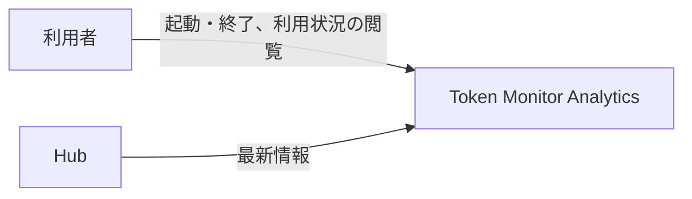
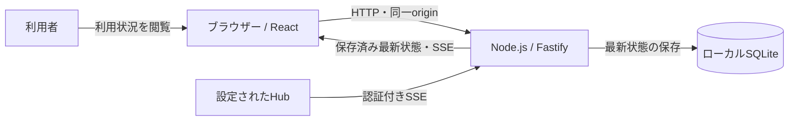
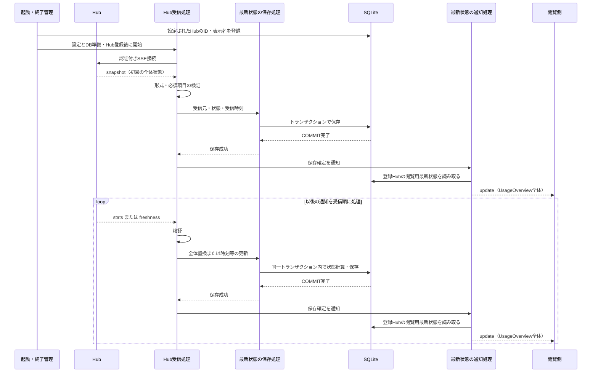
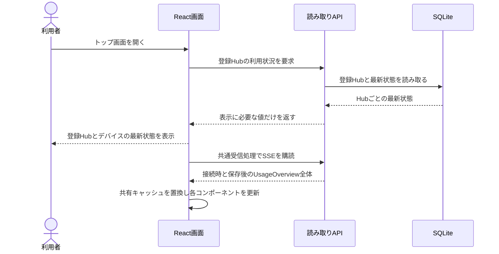
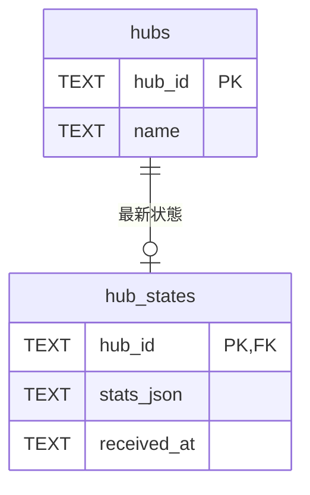

# アーキテクチャ

UC-1の保存後通知・切断時再接続と、UC-2の初回取得・自動更新の承認済み設計を記録します。実装済みの基盤は [React構成](architecture-react.md)、テンプレート採用範囲は [文書方針](document-policy.md#adoption) を参照します。

## 全体設計の合意

2026-09-20、リポジトリ所有者がUC-1の全体構造とUCP-1を承認しました。確認後の本文保存コミット: `fc2e1f7c2892fc4a464444dcdaab81cb69fd266e`。対象は第1〜4節で、テーブル設計は別途合意します。

> はい。合意します。次へ進めてください。

2026-09-21、リポジトリ所有者がUC-1の保存後通知と、ブラウザーの共通受信から共有キャッシュを更新する全体方針を承認しました。今回の実装はUC-1の配信までで、ブラウザーの受信と表示更新は後続のUC-2で扱います。

> 承認します。次のフェーズへ進めてください。

2026-09-21、リポジトリ所有者がUC-1-X1の通信断時再接続をUCP-1へ追加することを承認しました。確認後の本文保存コミット: `5fbbc6f`。

> 承認します。次のフェーズへ進めてください。

## 1. システムコンテキスト

利用者がアプリケーションを起動すると、設定ファイルに記載されたHubから最新情報を独立して受信し、ローカルに保存します。利用者はブラウザーで登録Hubの保存済み最新利用状況を閲覧します。

## 2. コンテナ

受信・保存・配信は単一Node.jsプロセスで行い、SQLiteを保存済み状態の正本とします。UC-1は閲覧側への配信までを担当します。UC-2-X1ではブラウザーごとに共通接続を1本持ち、受信した `UsageOverview` を既存のTanStack Queryキャッシュへ反映します。複数コンポーネントは同じキャッシュを購読し、期間選択等の操作状態は分離します。

## 3. 実現パターン

### UCP-1. Hubから受信した最新状態をDBへ反映し、閲覧側へ通知する

適用系列: [UC-1-M・UC-1-X1](usecases/UC-1.md)。受信履歴ではなく、通知を反映した最新状態を保存します。

| 役割               | 責務                                                                                               | 実装パス                                           |
| ------------------ | -------------------------------------------------------------------------------------------------- | -------------------------------------------------- |
| 起動・終了管理     | 設定ファイル・DBを準備し、2つのHubを同期してから受信開始。終了時は再接続待ちを含む両方の受信を止めてからDBを閉じる | backend/app.ts、backend/main.ts、backend/config.ts |
| 接続設定読込       | `.env` で指定したJSONを検証し、2つの接続情報を返す。ファイルは更新しない                           | backend/hub/config-file.ts                         |
| Hub受信処理        | 認証付きSSE接続、通知の解析・境界検証、受信順の保存呼び出し、通信断時の再接続                      | backend/hub/receiver.ts、backend/hub/protocol.ts   |
| 最新状態の保存処理 | 次の状態の計算、SQL実行、受信元・受信時刻との一括保存                                              | backend/db/hub-state.ts、backend/db/database.ts    |
| 最新状態の通知処理 | 登録Hubの保存済み閲覧用データを生成し、接続時と保存確定後にSSEで配信 | backend/http/usage-stream.ts、backend/app.ts |

汎用キューやRepository層は追加しません。同じHubの通知は、1件の保存が完了してから次を処理します。2つのHubは別の受信処理で動き、一方の停止は他方やWebサーバーへ波及させません。

- `snapshot` は全体状態を保存し、`stats` は当該Hubの全体状態を置換します。端末の追加・削除も全体置換に含めます。
- `freshness` は既存状態の時刻・鮮度情報のみを更新し、利用量・上限等を維持します。各接続で初回の全体状態を受信する前に差分通知は受け付けません。heartbeatコメントは業務DBを更新しません。
- 保存処理が状態更新を担当し、COMMIT完了を成功確定点とします。差分適用に必要な既存状態の読み取りも同じトランザクションに含め、内部では外部通信を行いません。同じ通知を再受信しても利用量を加算しません。
- 通知処理は `GET /api/usage/stream` でSSEを提供し、`event: update` のJSON本文に既存の `UsageOverview` を用います。全登録Hubの閲覧用状態だけを含め、秘密情報や未公開のHub生データは配信しません。通知器はアプリケーション単位で1つ所有します。
- 接続時のDB読み取り・購読登録・初回送信と、保存確定後のDB読み取り・配信はそれぞれ同期処理とし、初回と更新の間に取りこぼしや逆転を生じさせません。再接続でも最新保存値を送信し、イベント履歴は再送しません。低速な接続では最新の待機通知1件だけを保持します。
- 配信失敗は当該閲覧接続だけを終了し、保存やHub受信へ例外を返しません。通知用のDB読み取り失敗は原因の固定メッセージをログへ記録し、初回は503、接続済みの配信は終了します。保存済み状態の取り消しや未保存値による代替は行いません。
- 認証失敗・HTTP応答不正（リダイレクトを含む）、不正通知（不正なバイト列を含む）では当該Hubの受信を停止し、原因をログに残します。保存失敗はロールバックして受信を停止します。通信断（接続失敗またはストリーム終了）では当該Hubを停止せず、同じ接続設定で3秒間隔・同時1本・稼働中は上限なく再接続します。再接続後の初回はsnapshotを検証して保存し、切断中は最後の保存状態を維持します。切断専用の閲覧通知は送りません。最後に保存できた状態とWebサーバーは維持します。
- 通常終了では再接続待ちを含むHub受信と閲覧側へのSSE配信を終了し、処理中の保存がコミットまたはロールバックした後にDBを閉じます。
- `.env` は接続設定JSONのパスだけを持ちます。JSONは2つのHubのID・表示名・URL・認証トークンを持ち、Git管理外とします。URLとトークンをDB・保存状態・ログへ含めず、アプリケーションから設定ファイルを更新しません。
- UI確認用モックは不要です。検証時の置き換え境界は外部Hubとし、制御可能なSSEサーバーから本番の受信・保存・配信処理を通し、別のDB接続の保存値と閲覧側の受信内容を照合します。保存後通知と切断時再接続は完成系承認、段階6のE2E・実Hub検証まで完了しています。詳細は [検証結果](project.md#verification) を参照します。

Hubは情報の提供元を表す独立した実体です。Hubごとに最新状態は0件または1件で、未受信でもHubは存在します。起動時に設定ファイルのIDと表示名をDBへ同期します。同じIDでの再起動は表示名だけを更新し、保存状態を維持します。URL変更でも同じ提供元ならIDを維持し、別の提供元には新しいIDを割り当てます。設定から外しても保存済みのHubと状態は削除しません。Hub情報の登録・編集・削除は別UCで扱います。

### UCP-2. 保存済みの最新利用状況を読み取って表示する

適用系列: [UC-2-M・UC-2-X1・UC-2-X2・UC-2-X3](usecases/UC-2.md)。現在の接続設定に登録されているHubだけを表示対象とし、表示処理ではHub数を固定しません。

| 役割         | 責務                                                                                              | 実装パス    |
| ------------ | ------------------------------------------------------------------------------------------------- | ----------- |
| 利用状況読取 | 登録Hubと最新状態を読み、Hub・デバイス・ツール別集計の表示に必要な値だけを返す                  | backend/http/router.ts、backend/db/hub-state.ts |
| 利用状況画面 | 共通フックから初回取得と通知後の値を参照し、期間選択を維持して表示する | frontend/src/routes/index.tsx |
| 共通受信・共有データ | 初回取得成功後に購読を開始し、Queryキャッシュの全体置換と接続状態を管理する。コンポーネントごとに接続しない | frontend/src/features/usage-updates.tsx、frontend/src/features/usage-overview.ts |

初回の読み取りAPI応答と、以後の通知によるQueryキャッシュの全体置換を表示更新の確定点とし、閲覧ではDBを更新しません。期間切替と構成比は共有キャッシュの期間別数値から計算します。UC-2-X3では期間別 `clients` を共有契約へ含め、全Hubの同じツールを合算して構成比を画面で算出します。初回API失敗は従来の取得失敗表示とし、購読は開始しません。初回成功後にSSEを開始するため古いAPI応答で通知を上書きせず、接続時の全体状態で間の更新を補います。切断中は最後の値と「再接続中」を表示します。HTTP 503も再試行できるよう失敗したEventSourceを閉じ、3秒後に同じ接続先へ1本だけ再接続し、最初の更新通知で最新状態へ置き換えて接続済みに戻します。画面終了時に接続と再接続タイマーを解放します。

合成点は `frontend/src/features/usage-overview.ts` の取得・購読境界です。本番の `UsageOverview` を共有し、初回取得はtRPC、以後は同一originの `/api/usage/stream` を使います。段階3で合意した共有キャッシュと表示処理を実接続でも再利用し、仕様合意用の固定データとモック切替は削除済みです。他のパーツは固定サンプルで、API応答には含めません。DB変更はありません。

## 4. 設計判断

| ID    | 決定                                                                              | 根拠と出所                                                                             | 影響する範囲                                   |
| ----- | --------------------------------------------------------------------------------- | -------------------------------------------------------------------------------------- | ---------------------------------------------- |
| ADR-1 | React拡張を適用し、メモ管理サンプルを除去した起動基盤を使用する                   | 2026-09-20、順序1〜3の実施提案に対する利用者の応答「OK。では進めてください」           | 開発基盤。採用版と差分は文書方針が正本         |
| ADR-2 | 単一Node.jsプロセスでSSEを逐次受信し、Hubごとの最新状態をSQLiteへ原子的に保存する | 2026-09-20、UC-1とUCP-1への利用者の合意。最新状態の整合性を保つため。通信断時の再接続は2026-09-21のUC-1-X1承認で追加 | UC-1-M、UC-1-X1。履歴蓄積は含めない。通信断時は当該Hubを再接続する |
| ADR-3 | Hubと最新状態を分離し、Hubの識別を受信成功に依存させない                          | 2026-09-20、Hubの独立実体化への応答「合意します。先に進めてください。」                | UC-1-M。URLと認証情報は接続設定に残す          |
| ADR-4 | UC-1はGit管理外のJSONから2つのHub接続を読み、Hub情報の登録は別UCとする            | 2026-09-20、改訂全文への応答「では先にUC-1から対応してください。次へ進めてください。」 | UC-1-M。Credential Managerは導入しない         |
| ADR-5 | UC-2はA案を採用し、初期実装ではHub・デバイスだけを保存済み状態から一度読み取る     | 2026-09-21、A案と段階的実装への応答「Aにします。…それ以外の部分はハードコード実装でOKです。」 | UC-2-M。他パーツは固定サンプルとして段階的に置換する |
| ADR-6 | UC-1はCOMMIT後に閲覧用全体状態をSSE配信する。UC-2の自動更新では共通受信と既存Queryキャッシュを使う | 2026-09-21、改訂全文と全体方針への応答「承認します。次のフェーズへ進めてください。」。複数コンポーネントへ同じ値を反映する要求に、個別接続を増やさず対応する | UC-1-M、後続UC-2。DB変更・新規依存なし。共有配信処理は通信失敗を保存処理から分離するために設ける |

## 5. テーブル設計

以下はUC-1-Mで合意した設計です。実装済みのDBスキーマ版は1です。

### UC-1-Mのテーブル設計

変更範囲は `hubs` と `hub_states` の新設とスキーマ版0から1への移行です。Hubごとに通知を反映済みの最新状態を1行で保持します。受信履歴は蓄積しません。

`hubs`:

| カラム | SQLite型 | NULL | 制約・意味                                                 |
| ------ | -------- | ---- | ---------------------------------------------------------- |
| hub_id | TEXT     | 不可 | 主キー。設定で指定する安定したHub識別子                    |
| name   | TEXT     | 不可 | 設定から登録する表示名。識別には使わず、一意制約を設けない |

`hub_states`:

| カラム      | SQLite型 | NULL | 制約・意味                                                          |
| ----------- | -------- | ---- | ------------------------------------------------------------------- |
| hub_id      | TEXT     | 不可 | 主キー兼外部キー。hubs.hub_idを参照する受信元識別子                 |
| stats_json  | TEXT     | 不可 | snapshot・stats・freshnessを反映した最新のstats全体をJSONとして保持 |
| received_at | TEXT     | 不可 | 最後に保存に成功したデータ通知のローカル受信時刻。UTCのISO 8601形式 |

外部キーはHubの存在を保証し、削除・ID変更の連鎖更新は設けません。主キー以外の一意制約・索引・既定値は設けません。HubのURLと認証情報は接続設定ファイルに置き、このテーブルへ保存しません。Hub側の更新時刻は `stats_json` 内に保持し、別カラムへ重複させません。JSONの形式と必須項目は受信境界で検証します。2 Hub対応によるテーブル変更はありません。

受信開始前にHubを登録します。初回保存前のhub_statesは0行です。`snapshot` と `stats` は受信元の1行を挿入または全体置換します。`freshness` は同じトランザクションで既存状態を読み、時刻・鮮度情報だけを適用したstats全体を書き戻します。`received_at` は受信時に取得し、状態と同時にコミットします。heartbeatでは更新せず、失敗時には状態・受信時刻の両方を維持します。終了・通信断でも行を削除しません。

移行では、空のスキーマ版0に2テーブルを作成し、`PRAGMA user_version` を1に変更します。作成と版更新は同一トランザクションで行い、失敗時は両方をロールバックします。旧製品DBの移行は対象外です。マイグレーションは backend/db/database.ts に実装しています。

合意記録（2026-09-20、判断者: リポジトリ所有者）: UC-1-M。単一テーブル案の提示版は `7a5fd9b`。対話でHubの独立実体化、表示名、0または1の関係、起動時登録、設定管理を追加提案し、下記の応答で合意しました。改訂内容の確認後保存コミット: `8d6669e0944acb818dc228d0a6017eec6c25e21b`。JSONでの最新状態保存とスキーマ版0から1への移行は維持します。

> 合意します。先に進めてください。
