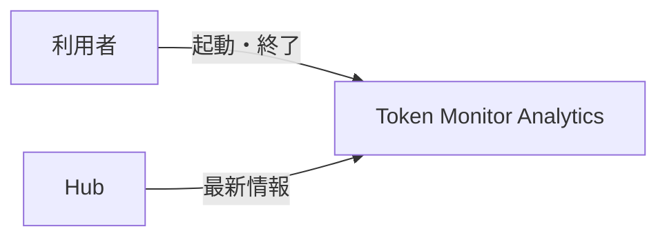
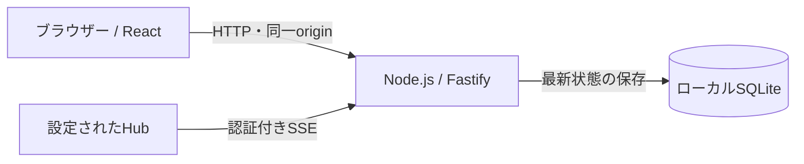
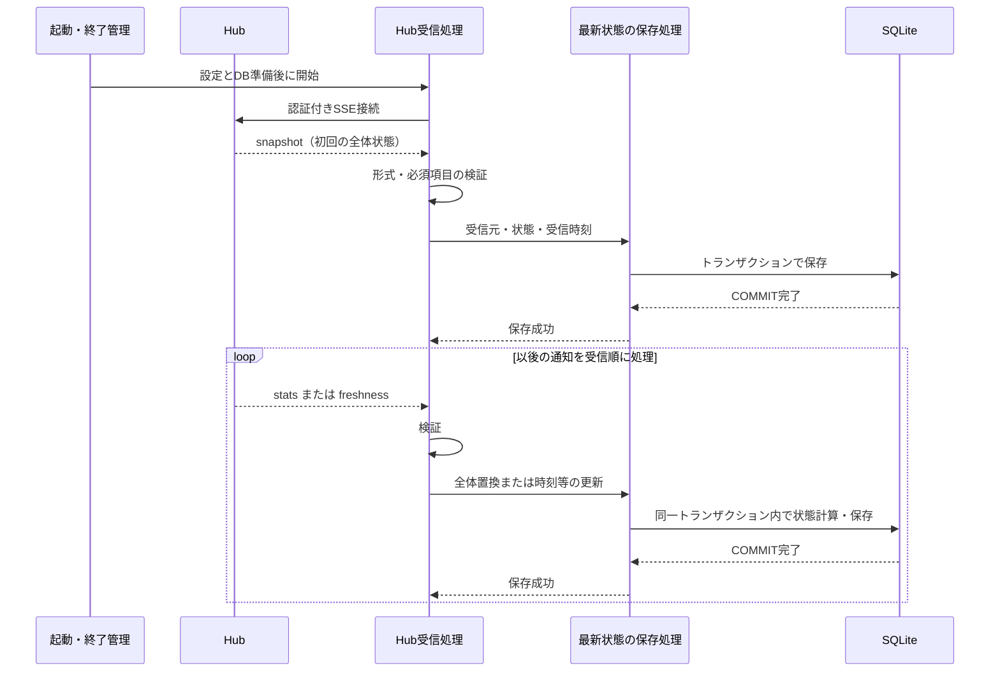
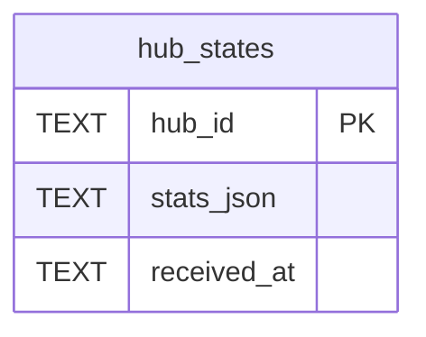

# アーキテクチャ

UC-1の合意済み設計を記録します。Hub受信・保存は未実装です。実装済みの基盤は [React構成](architecture-react.md)、テンプレート採用範囲は [文書方針](document-policy.md#adoption) を参照します。

## 全体設計の合意

2026-09-20、リポジトリ所有者がUC-1の全体構造とUCP-1を承認しました。確認後の本文保存コミット: `fc2e1f7c2892fc4a464444dcdaab81cb69fd266e`。対象は第1〜4節で、テーブル設計は別途合意します。

> はい。合意します。次へ進めてください。

## 1. システムコンテキスト

利用者がアプリケーションを起動すると、設定された1つのHubから最新情報を受信し、ローカルに保存します。UC-1には画面操作を設けません。

## 2. コンテナ

受信と保存は既存の単一Node.jsプロセスで行い、SQLiteを保存済み状態の正本とします。ブラウザーは既存の起動画面で、UC-1の処理経路には含めません。図は合意済みの構成であり、現在の実装は空のSQLiteへの接続までです。

## 3. 実現パターン

### UCP-1. Hubから受信した最新状態をDBへ反映する

適用系列: [UC-1-M](usecases/UC-1.md)。受信履歴ではなく、通知を反映した最新状態を保存します。

| 役割 | 責務 | 実装パス |
| --- | --- | --- |
| 起動・終了管理 | 設定・DBの準備後に受信開始。終了時は受信を止めてからDBを閉じる | 未実装 |
| Hub受信処理 | 認証付きSSE接続、通知の解析・境界検証、受信順の保存呼び出し | 未実装 |
| 最新状態の保存処理 | 次の状態の計算、SQL実行、受信元・受信時刻との一括保存 | 未実装 |

汎用キューやRepository層は追加しません。同じHubの通知は、1件の保存が完了してから次を処理します。

- `snapshot` は全体状態を保存し、`stats` は当該Hubの全体状態を置換します。端末の追加・削除も全体置換に含めます。
- `freshness` は既存状態の時刻・鮮度情報のみを更新し、利用量・上限等を維持します。各接続で初回の全体状態を受信する前に差分通知は受け付けません。heartbeatコメントは業務DBを更新しません。
- 保存処理が状態更新を担当し、COMMIT完了を成功確定点とします。差分適用に必要な既存状態の読み取りも同じトランザクションに含め、内部では外部通信を行いません。同じ通知を再受信しても利用量を加算しません。
- 接続・認証失敗、通信断、不正通知では受信処理を停止し、原因をログに残します。保存失敗はロールバックして受信を停止します。最後に保存できた状態とWebサーバーは維持します。
- 通常終了ではSSEを中止し、処理中の保存がコミットまたはロールバックした後にDBを閉じます。この系列では自動再接続せず、復旧はアプリケーションの再起動で行います。
- 接続先と認証情報はサーバー側の設定で管理し、認証情報を受信データの保存内容やログへ含めません。
- UI確認用モックは不要です。検証時の置き換え境界は外部Hubとし、制御可能なSSEサーバーから本番の受信・保存処理を通し、別のDB接続で保存結果を確認します。実Hubとの相互接続は別途実環境で検証します。現在はいずれも未検証です。

## 4. 設計判断

| ID | 決定 | 根拠と出所 | 影響する範囲 |
| --- | --- | --- | --- |
| ADR-1 | React拡張を適用し、メモ管理サンプルを除去した起動基盤を使用する | 2026-09-20、順序1〜3の実施提案に対する利用者の応答「OK。では進めてください」 | 開発基盤。採用版と差分は文書方針が正本 |
| ADR-2 | 単一Node.jsプロセスでSSEを逐次受信し、Hubごとの最新状態をSQLiteへ原子的に保存する | 2026-09-20、UC-1とUCP-1への利用者の合意。最新状態の整合性を保つため | UC-1-M。履歴蓄積・自動再接続は含めない |

## 5. テーブル設計

現在の実装に業務テーブルはなく、新規DBのスキーマ版は0です。UC-1-Mのテーブル設計は未合意で、段階4には未着手です。

### UC-1-Mのテーブル案（未合意）

変更範囲は `hub_states` の新設とスキーマ版0から1への移行です。Hubごとに通知を反映済みの最新状態を1行で保持します。受信履歴は蓄積しません。

| カラム | SQLite型 | NULL | 制約・意味 |
| --- | --- | --- | --- |
| hub_id | TEXT | 不可 | 主キー。サーバー側接続設定で指定する受信元の識別子 |
| stats_json | TEXT | 不可 | snapshot・stats・freshnessを反映した最新のstats全体をJSONとして保持 |
| received_at | TEXT | 不可 | 最後に保存に成功したデータ通知のローカル受信時刻。UTCのISO 8601形式 |

外部キーはなく、主キー以外の一意制約・索引・既定値は設けません。HubのURLと認証情報は接続設定に置き、このテーブルへ保存しません。Hub側の更新時刻は `stats_json` 内に保持し、別カラムへ重複させません。JSONの形式と必須項目は受信境界で検証します。

初回保存前は0行です。`snapshot` と `stats` は受信元の1行を挿入または全体置換します。`freshness` は同じトランザクションで既存状態を読み、時刻・鮮度情報だけを適用したstats全体を書き戻します。`received_at` は受信時に取得し、状態と同時にコミットします。heartbeatでは更新せず、失敗時には状態・受信時刻の両方を維持します。終了・通信断でも行を削除しません。

移行では、空のスキーマ版0にテーブルを作成し、`PRAGMA user_version` を1に変更します。作成と版更新は同一トランザクションで行い、失敗時は両方をロールバックします。旧製品DBの移行は対象外です。マイグレーションは未実装です。

判断論点は、今回必要な最新状態を1つのJSONとして保存することです。利用量・端末別の検索要件はまだないため、集計用テーブルへの分解は行いません。提示コミットへの利用者の応答を得てから、対象版・論点への回答・原文を本節に記録します。
