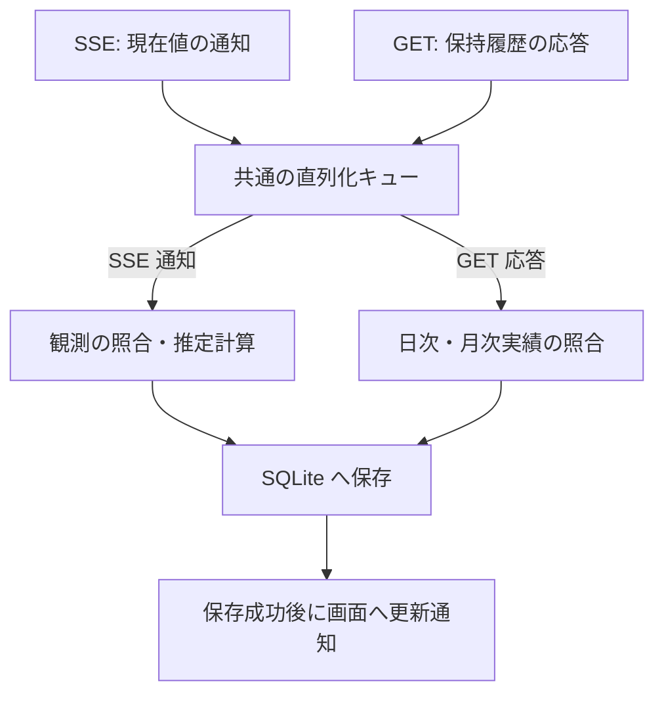

# アーキテクチャ設計書

機能・業務ルールは [機能要件](requirements.md)、目標・制約・品質要求は [設計方針](design-policy.md)、文書作業と実装への着手は [文書方針](document-policy.md)、用語は [CONTEXT.md](../CONTEXT.md) を正本とする。API 項目の対応・取得時刻等の具体仕様は [機能詳細設計](functional-design.md) に分離する。

本書は、上流の調査根拠と、構成・識別・保存・並行制御の設計を扱う。調査結果と合意済み方針を出発点に、[PLAN.md](../PLAN.md) の直近の実装に必要な責務・識別・保存境界を具体化する。未確定事項は第 5 節に残し、本書全体の完成を実装の前提にしない。

## 1. 調査対象と根拠

上流リポジトリ [Token Monitor](https://github.com/Javis603/token-monitor) を `upstream/token-monitor` に Git サブモジュールとして登録し、ソースコードおよび実環境での応答を調査した（仕様調査用であり実行時依存ではない）。

以下は固定コミット `2f60827e3028d283969dd74cde5b3f5664220442` を基準とした調査記録である。今回の整理時点では手元のサブモジュールは `04ed24538c344de81e9b8518c1fa49f599e49cde` に更新されている。固定基準は `git show <commit>:<path>` で照合し、手元のファイル参照が調査時と同じ内容とはみなさない。新リビジョン全体の互換性確認は U1 に残す。

| 項目 | 調査対象・環境 |
| --- | --- |
| URL / タグ | `https://github.com/Javis603/token-monitor.git`（タグ `v0.56.0`） |
| 固定コミット | `2f60827e3028d283969dd74cde5b3f5664220442`（[GitHub 参照](https://github.com/Javis603/token-monitor/tree/2f60827e3028d283969dd74cde5b3f5664220442)） |
| Hub 実装 | Node.js Hub および Cloudflare Worker Hub |
| 重点確認対象 | Claude および Codex（その他プロバイダーの個別仕様は未確認） |
| 実機検証 | 稼働中の Private Hub（Cloudflare Worker 実装、`coreRevision: 36`、`runtimeRevision: 3`）への接続・API 応答を確認（[実データ資料](reference/hub-private/README.md) 参照） |

| 根拠資料 | 主な確認箇所・内容 |
| --- | --- |
| [API 仕様書](../upstream/token-monitor/docs/API.md) | 認証方式、health、データ投入・集計仕様、手入力契約情報 |
| [Node Hub 実装](../upstream/token-monitor/src/hub/server.js) | `getStats`, `getDevices`, `getHistory`, `ingest`, `sseFormat`, `handleRequest` |
| [Worker Hub 実装](../upstream/token-monitor/worker/src/index.js) | 認証、Durable Object の永続化・集計、SSE 配信、公開統計 |
| [利用実績の正規化・集計](../upstream/token-monitor/src/shared/usage.js) | `normalizeDeviceRecord`, `mergeDeviceRecord`, `normalizeSession`, `aggregateDevices`, `aggregateHistory` |
| [履歴処理](../upstream/token-monitor/src/shared/history.js) | `normalizeHistory`, `coerceHistory`, `historyPreview`, 各種履歴リビジョン生成 |
| [送信データ構造](../upstream/token-monitor/src/shared/syncPayload.js) | `historyForSync`, `buildSyncPayload`（送信時に省略される内訳項目） |
| [利用枠の正規化・集計](../upstream/token-monitor/src/shared/limits/core.js) | `normalizeLimitWindow`, `normalizeLimitProvider`, `aggregateLimits` |
| [利用枠の収集状態](../upstream/token-monitor/src/shared/limits/runtime.js) | `applyAttempt`, `providerRows`（最終成功値と最新試行状態の分離） |
| プロバイダー実装 | [Claude](../upstream/token-monitor/src/shared/providers/claude/limits.js) / [Codex](../upstream/token-monitor/src/shared/providers/codex/limits.js) におけるアカウント識別と利用枠生成 |
| 収集と期間境界 | [収集処理](../upstream/token-monitor/src/shared/collector.js) / [リセット境界の更新予約](../upstream/token-monitor/src/shared/limits/resetBoundary.js) |
| 手入力契約情報 | [subscriptionDisplay.js](../upstream/token-monitor/src/shared/subscriptionDisplay.js)（`normalizeBinding` と手入力データの意味） |

Private Hub の実データ（取得日時: 2026-09-12 10:57:13 JST）のハッシュ値等は [manifest](reference/hub-private/2026-09-12T01-57-13-988Z/manifest.json) および [health 応答](reference/hub-private/2026-09-12T01-57-13-988Z/health.json) に保存している。

## 2. Hub API の確認済み事実

### 2.1 取得経路と認証

| 経路 | 内容 | 本システムでの扱い |
| --- | --- | --- |
| `GET /api/health` | 認証不要。`runtime`, `version`, `hubBuild`, `secretRequired` 等を返却。 | `version` は製品リリース番号ではなく、`hubBuild` は登録ソース識別子。 |
| `GET /api/stats` | 全端末の期間集計、端末別実績・利用枠、集約利用枠、履歴プレビュー。 | 集計スナップショットであり、利用イベント一覧ではない。 |
| `GET /api/stats/stream` | 接続時の `snapshot` イベントおよびその後の `stats` イベント（SSE）。 | `{ type, reason, stats, at }` 形式で集計スナップショットを配信。 |
| `GET /api/devices` | 保持端末レコードの一覧（`periods`, `limits`, 任意の `history` 等）。 | 端末別の保持履歴を取得する主経路（SSE には履歴本体が含まれない）。 |
| `GET /api/history` | 端末間で合算された `daily`, `monthly`, `summary`。 | 全体集約値であり、端末・契約別の分離を保つ履歴補完には利用しない。 |
| `GET /api/subscriptions` | Hub 内で共有される手入力の契約・支払情報。 | 実績と契約の確実な紐付け証拠とならないため初期版では不採用。 |

- **認証方式**: 保護経路へのアクセスには、共有シークレットを `Authorization: Bearer <secret>` または `X-Token-Monitor-Secret: <secret>` ヘッダーで送信する（URL クエリには含めない）。Web 画面の Basic 認証とは独立して管理する。
- **未設定・公開経路の挙動**:
  - Node Hub: シークレット未設定時はループバックにバインドし認証なしで通過。
  - Worker Hub: シークレット未設定時は保護経路へのアクセスを 503 で拒否。公開経路 `/api/public/stats` は端末・アカウント識別情報が欠落するため本システムでは使用しない。

### 2.2 SSE、順序、再接続

- **SSE の仕様**: `event:` と `data:` を出力し、30 秒間隔でコメント形式の heartbeat を送信する。`id:`, `retry:`, `Last-Event-ID` による再送や履歴カーソル機能はない。
- **再接続とデータ特性**: 再接続時に取得できるのはその時点のスナップショットであり、切断中の観測は再送されない。
- **タイムスタンプの性質**: ペイロード内の `at` や `updatedAt` は集計・応答時刻であり、利用発生時刻やシーケンス番号ではない。
- **順序性の不在**: API 間および SSE との間で共通利用できる単調増加の版番号はなく、到着順序のみで新旧は判定できない。

上記のとおり受信イベント数をそのまま利用回数として扱えないため、本システムでは「現在値の観測（SSE）」と「日次・月次実績の収集（GET）」を完全に分離して独立に受信・処理する（詳細は第 6 節参照）。

### 2.3 利用実績と履歴

| 項目 | 仕様・制約 |
| --- | --- |
| `deviceId` | Hub 内の端末識別キー。Hub 間の一意性や端末再設定後の継続性は保証されない。 |
| `periods.today / month / allTime` | 各期間の累積集計値。`costUsd`（API 換算額）等は累積値であり、受信ごとの加算は不可。 |
| セッション内訳 | ツール・セッション・モデル等の情報は含むが、アカウント識別子（`accountKey`）や契約 ID は含まない。 |
| `periodWindows` | 期間キー、終了時刻、タイムゾーン。端末側のカレンダー境界であり利用枠境界とは異なる。 |
| 日付境界処理 | Hub 集計では期間終了後に該当端末の `today/month` を合計から除外する（`allTime` は維持）。合算額の減少が利用枠リセットを意味するとは限らない。 |
| `historyAvailable` と `history` | `true` でも履歴配列が空の場合がある。端末更新日時にかかわらず保持履歴が古いまま残る場合がある。 |
| 保持履歴 | 標準では日別集計を直近 370 日分保持。任意の日付を遡って復元できる保証はない。 |
| 履歴 GET 応答 | 保持中の全履歴を一括返却。期間指定、ページング、過去利用枠履歴の取得機能はない。 |
| `historyRevision` | 変更検出用のハッシュ値であり、単調増加の版番号や再送カーソルではない。 |

特に利用枠のみの更新（`limitsOnly`）時は、実績値を維持したまま端末の更新日時（`updatedAt` / `receivedAt`）のみが更新される。実績と利用枠が同一レコード内にあっても、双方が同一時点で測定されたとは判断できない。

また、日次履歴（`daily`）は送信元の現地暦日ごとの集計値であり、タイムゾーン情報や利用時刻明細を持たない。Hub の履歴集約も同じ日付の行を合算する処理であり、共通タイムゾーンへの再集計ではない。そのため、本システムではタイムゾーン変換や按分を行わず、端末の現地日付を維持して扱う（第 3.6 節参照）。

### 2.4 利用枠、アカウント、観測時刻

利用枠は `limits.providers[]` に格納され、プロバイダー名、`accountKey`、表示用アカウント名・プラン名、`status`, `source`, `updatedAt`, `windows[]` 等を保持する。

| 項目 | 仕様・制約 |
| --- | --- |
| `accountKey` | 上流が生成するアカウント識別子。公式の契約 ID ではなく、プロバイダー共通の永続性規則もない。 |
| 集約利用枠 | 同一キーの候補から鮮度や状態に基づき代表値を選定（単純な合算値ではない）。 |
| `windows[].kind` | `session`, `daily`, `weekly`, `billing` 等。同一種類の枠が複数存在し得る。 |
| `limitId` / `additional` | 利用枠識別の補助項目（任意設定）。プロバイダーごとに体系が異なる。 |
| `usedPercent` | 0～100 に正規化された消費率（欠落時は `null`）。 |
| `resetsAt` / `windowMinutes` | 予定されるリセット時刻および期間長（リセット発生の通知ではない）。 |
| `boundaryKind` / `showMeter` | リセット以外の失効（残高等）や、割合メーター非表示の枠も存在。 |
| `status` と `updatedAt` | 更新試行の状態・時刻を表し、測定時刻と一致するとは限らない。 |

#### Claude と Codex の個別仕様
- **Claude**: Web/OAuth 経由ではアカウント ID・組織 ID・メールアドレスから `accountKey` を生成。同一アカウント ID では組織切り替えがキーに反映されない。短時間枠、週次枠、モデル限定枠が併存するため `kind` のみでは一意に特定できない。
- **Codex**: メールアドレスとワークスペースのアカウント ID の組み合わせからキーを生成。同一 `limitId` 内に短時間枠と長時間枠が併存するため `limitId` のみでは一意にならない。
- **収集状態（`LimitsRuntime`）**: 一時エラー時は直前の成功値を保持しつつ `status` を更新する。枠データが存在すること自体を観測成功の証拠として扱ってはならず、`stale: false` のみで鮮度は保証できない。

### 2.5 上流の永続化と通知の限界
- **Node Hub**: メモリ上の変更を JSON ファイルへ保存した後に SSE を配信するが、保存失敗時にメモリ状態をロールバックしない。
- **Worker Hub**: Durable Object storage への永続化完了後に配信するが、配信自体の到達は保証されない。
- **共通の制約**: 受信完了を確認するハンドシェイクはないため、本システム側で永続化と画面通知の順序を独立制御する必要がある。

## 3. 識別・推定の設計原則

### 3.1 情報源と対象の分離

各対象の識別原則は以下のとおりとする（後続の課題は第 5 節参照）。

| 対象 | 識別の原則 |
| --- | --- |
| Hub | 本システム内の登録単位で管理し、配下の全データを紐付ける。 |
| 端末 | Hub 登録単位と `deviceId` の組み合わせで分離。ID 変更時は名寄せせず別端末として扱う。 |
| 契約 | プロバイダーのアカウント情報と契約を区別し、ツール名やプラン名のみで帰属させない。 |
| 利用枠 | 契約内で枠の種類および識別情報を組み合わせて特定。複数端末の消費率は合算しない。 |
| 対象期間 | 利用枠のリセット予定時刻 `resetsAt` を基準に区切る（日別・月別集計期間とは分離）。 |
| 利用実績 | 端末・ツール・集計期間に属する累積値として扱い、重複加算しない。 |
| 保持履歴 | 日別（Hub・端末・日付・ツール別）、月別（Hub・端末・月・ツール別）を明確に区別して保持する。 |

※ 端末再設定に伴う過去データの手動関連付けは将来要件とし、初期版には実装しない（[設計・実装ガードレール 第 6 節](design-policy.md#合意済みの将来要件) 参照）。

### 3.2 再受信と二重計上防止

[要件 第 6 節](requirements.md#6-分離重複防止と端末の扱い) に従い、SSE は現在値の観測の照合、GET は同一履歴の更新として処理する。受信イベント数を利用回数とみなす加算処理は置かない。一意性を保証する情報の組と SQLite の保存境界は、対象の保存処理に着手する時に確定する。

### 3.3 利用許容量の推定条件と計算区間

計算式、有効な増分の条件、最長区間の採用、累積額減少の扱い、算出時点の結果保全は [要件 第 2 節](requirements.md#2-利用許容量の推定) を正本とする。SSE の観測、比較基準、推定結果の関係と、実績の帰属を判定できる範囲は本書で扱う。具体的な入力項目は [機能詳細 第 1 節](functional-design.md#1-推定観測と対象期間の対応) を参照する。

### 3.4 リセットと欠測の判定

契約・利用枠の同一性と、その枠の対象期間の同一性を分けて管理する。比較基準の継続・更新を判断する `resetsAt` の具体的な判定表は [機能詳細 第 1 節](functional-design.md#1-推定観測と対象期間の対応) を参照する。比較基準の保存・状態遷移を担う責務は、推定処理に着手する時に確定する。

### 3.5 取得情報の表示方針

表示項目と、推定不可・未取得・過去値の表示ルールは [要件 第 3 節](requirements.md#3-取得情報の表示) を正本とする。表示用情報の保存・配信は推定の成立可否から分離し、算出できないことを理由に取得済み情報全体を更新対象から外さない。

### 3.6 日次・月次実績の保存と利用

日付基準、当日除外、当月の途中集計、非破壊更新のルールは [要件 第 4 節](requirements.md#4-日次月次実績の保存と利用) を正本とする。GET で取得する日次・月次実績は SSE の現在値観測・比較基準・推定結果と別の保存対象として扱い、履歴で観測や比較基準を代用しない。

## 4. 保存が必要な情報と再取得の限界

| 保存対象 | 保持の目的 | Hub から再取得できる範囲 |
| --- | --- | --- |
| Hub・端末・契約・利用枠の識別情報 | 情報源や契約の混同防止 | 現在の端末・アカウント情報のみ（過去の関連付けは保証外） |
| Hub ごとの収集設定（有効・停止） | 再起動後も指定された設定を維持 | Analytics 独自の設定のため再取得不可 |
| SSE から採用した観測 | 増分の比較基準、鮮度・推定根拠の保持 | 現在のスナップショットのみ（過去の観測は復元不可） |
| 端末別の保持履歴（日次・月次） | 重複排除および Hub 保持期限（370 日等）を超えた履歴保全 | Hub がその時点で保持する履歴のみ |
| 確定済みの比較基準と処理状態 | 再起動後の二重計上防止および処理順序の維持 | 本システムの内部状態のため再取得不可 |
| 推定結果・算出日時・根拠データ | 算出時点の推定履歴の保全（遡及改変防止） | 本システムの独自生成データのため再取得不可 |
| 推定不可の理由と対象区間 | 欠測や不整合の理由の追跡 | 本システムの判定履歴のため再取得不可 |
| 定期取得の実施状況・最終成功日時 | 日次取得の未完了判定および失敗の追跡 | 本システムの実行状態のため再取得不可 |

保存データには表示・計算に必要な項目のみを選定し、認証情報は含めない。

## 5. 未確認事項と設計への影響

基本方針の合意と、成立根拠の確認・設計の具体化・実装検証を分ける。U1〜U6 は同じ ID で管理し、局所的な詳細を未決のままにできる場合も、構成や保証への影響を明示する。

| ID | 現在の状態 | 判断が必要な点 | 実装・検証で扱うこと |
| --- | --- | --- | --- |
| U1 実機接続と互換性 | 固定基準のソース調査と Private Hub の単発取得まで確認済み。 | 取得・確認範囲を前提に検証方針を定める。手元の新リビジョン全体との互換性は未確認。 | 継続更新・切断・再接続・長時間稼働、実 Hub・両 OS の試験。 |
| U2 実績の契約帰属 | 帰属不明時は推定不可という要件は確定。実績に契約への結合キーがないことを確認した（第 5.1 節）。 | 単一契約に対応する利用額であることを、どの根拠で確定するかが残る。根拠が決まるまで推定対象の成立範囲は確定しない。 | 成立条件に基づく項目対応・判定分岐。 |
| U3 比較区間の管理 | 同一 SSE 内の値を 1 組とし、最長区間で計算する要件は確定。 | 比較基準を管理する責務、保持する情報、観測・推定結果と一括で更新する範囲。 | カラム・型・SQL・関数内の更新手順。 |
| U4 利用枠の特定 | 枠の同一性と対象期間を分ける方針は確定。識別の補助項目と、その限界を確認した（第 5.1 節）。 | 利用する識別単位と、同一性を確定できない枠の扱いを論理モデルへ反映する。一般的な永続識別キーは未確定。 | 各プロバイダーの全枠への項目対応・例外分岐。 |
| U5 端末 ID 変更 | 別端末として分離し、手動関連付けは将来に送る要件は確定。 | 端末ごとの比較基準・保存データの関係へ反映する。 | 初期の物理 DB 定義。手動関連付けは初期対象外。 |
| U6 受信処理とタイムゾーン | 独立受信・直列保存・現地日付・設定復元の方針は確定。当日判定の情報と欠落時の影響を整理した（第 5.2 節）。 | キュー・状態・収集設定の管理責任と保存境界。当日判定が成立しない入力での影響範囲を維持する。 | 日付情報欠落時の具体的な分岐、タイマー・キャンセル・物理 DB 定義。 |

### 5.1 U2・U4 の成立条件と確認範囲

以下の根拠となる `usage.js`、`limits/core.js`、Claude/Codex の `limits.js` は、固定基準 `2f60827e...` と手元の `04ed245...` でファイル内容が一致することを Git の blob ID で確認した。他のファイルや実機の互換性まで確認したものではない。

| 区分 | 確認した範囲と根拠 | 設計への影響 |
| --- | --- | --- |
| 確認できる | [usage.js](../upstream/token-monitor/src/shared/usage.js) の `emptySession` / `normalizeSession` はツール・セッション・コスト等を保持し、`accountKey` / `contractId` は保持しない。`addPeriodInto` は `clientCosts` をツール名で合算する。 | 端末・ツール別の実績を扱えるが、実績を利用枠のアカウントへ直接結合できない。 |
| 確認できる | [利用枠の正規化](../upstream/token-monitor/src/shared/limits/core.js) は `kind`、任意の `limitId` / `additional`、`windowMinutes`、`resetsAt` 等を保持する。 | 枠と期間を区別する材料はある。`resetsAt` は同一枠内の期間判定に使い、契約・枠の識別に代用しない。 |
| 確認できる | [Codex の枠生成](../upstream/token-monitor/src/shared/providers/codex/limits.js) は同じ `limitId` に primary/secondary の枠を作り得る。[Claude の枠生成](../upstream/token-monitor/src/shared/providers/claude/limits.js) は通常の週次枠に加えてモデル別の週次枠を作り得る。 | `limitId` 単独、または `kind` 単独を一般的な一意キーにはできない。追加項目の組で特定できる範囲を論理モデルで定義する。 |
| 取得情報だけでは確定できない | 同じ端末・ツールの利用額に複数契約が混ざっている場合、その利用額を契約ごとに配分する項目がない。 | その混在額から個別契約の許容量は推定しない。 |
| 取得情報だけでは確定できない | 利用枠側に一つのアカウントしか見えなくても、過去から最新までの利用額がその契約だけに対応する証拠にはならない。 | 「表示中のアカウントが一つ」という理由だけで帰属を確定しない。 |
| 未確認 | 実際に単一契約で利用している範囲を、Analytics がどの根拠で識別するか。利用額がその枠の消費全体に対応するか。 | 利用者の運用情報等を使うかを含め、要件上の前提が未確定。自動推測や新たな設定機能を追加したとは扱わない。 |
| 未確認 | プロバイダー別に、観測を跨いで同一枠と判定する具体的な識別キー。 | ソース・保存資料の該当枠を対応付け、識別可能な範囲を確認する。全プロバイダーの全分岐は機能詳細へ送る。 |

確認できない契約への帰属を仮の比率で補わず、推定不可でも取得情報を表示するという [要件](requirements.md#2-利用許容量の推定) は維持する。これは帰属判定の実現方法が決まったことを意味しない。

### 5.2 U6 の日付判定に必要な情報

固定基準の [collector.js](../upstream/token-monitor/src/shared/collector.js) の `computePeriodWindows` は、端末の `periodWindows.timeZone` と、観測時の日付キー・期間終了時刻を生成する。[usage.js](../upstream/token-monitor/src/shared/usage.js) の `normalizePeriodWindows` は有効な IANA タイムゾーンだけを残し、欠落・不正な値は省略する。

有効な `timeZone` があれば、取得時点の日時を端末側の日付として判定するための情報が得られる。一方、`today.key` は観測時の日付であり、端末が更新していなければ取得時点の当日とは限らない。履歴行自体にはタイムゾーンや利用時刻の明細がなく、日次集計を別タイムゾーンへ再集計する材料はない。

タイムゾーン欠落時に安全に当日を判定できる条件と具体的な分岐は未確定であり、その端末の日次取り込みで当日除外を保証する部分に影響する。別のタイムゾーンで代用する方針は追加しない。月次実績や SSE 現在値の経路とは分けて影響を扱い、[端末の現地日付を維持する要件](requirements.md#4-日次月次実績の保存と利用) は変更しない。

## 6. 受信データの処理と保存

SSE（現在値観測・推定）と GET（履歴収集）は独立して並行受信し、受信後は **共通の単一キュー** に投入して 1 件ずつ直列に処理・保存する。SQLite への保存成功後にブラウザへ更新通知を配信する。

受信を判定する単位は [機能詳細 第 3 節](functional-design.md#3-受信と停止の判定単位) を参照する。この単位でキューに投入し、各処理に含める情報とトランザクション境界は、対象の保存処理に着手する時に確定する。

| 入力種別 | 処理内容 |
| --- | --- |
| SSE 通知（`snapshot` / `stats`） | 入力検証後、比較基準と照合して利用許容量を推定し、観測・推定結果・比較基準を保存。推定不可の場合も現在値は保存・表示する。 |
| GET 応答（`/api/devices`） | 入力検証後、保持履歴を照合し前日以前の日次実績および月次実績を保存・更新（現在値表示や推定には影響させない）。 |

#### 単一キューによる直列化の理由
並行受信時に同一の比較基準を同時に参照・更新すると不整合や重複計算の原因となるため、照合から保存までの一連の処理を直列に実行する。通信の待機はキューの外側で並行処理するため遅延要因にはならず、保存失敗時は更新通知を抑制して安全に書き込みを停止する。

### 6.1 接続制御と履歴の定期取得

SSE の開始は履歴 GET の完了を待たず、履歴取得・再試行は SSE と独立して制御する。接続・再接続・定期実行等の契機と時刻・間隔は [機能詳細 第 2 節](functional-design.md#2-接続と履歴取得のタイミング) を参照する。

通信待機を処理キューに入れず、履歴取得の成否や収集停止設定を接続状態から分けて管理する。状態の管理責任と永続化・トランザクション境界は、対象の収集処理に着手する時に確定する。

### 6.2 実装時の検証シナリオ

以下は先行して整理した検証観点であり、試験の実施結果ではない。対応する実装で必要な検証を選び、結果と未実施事項を記録する。取得時刻と再試行間隔は機能詳細 第 2 節の値を使う。

| シナリオ | 検証観点 |
| --- | --- |
| GET の遅延・失敗 | SSE の接続・現在値表示・推定計算が継続し、他 Hub の処理を阻害しないこと。 |
| GET と SSE の同時到着 | 共通キューで順次処理され、GET 応答が現在値表示や推定計算に混入しないこと。 |
| 長時間常駐での定期取得 | SSE 接続維持中も、所定の毎日の実行時刻に定期 GET が自動実行されること。 |
| 通信失敗と復帰 | GET の通信失敗時は所定の間隔で再試行され、成功後は不要な再試行が行われないこと。 |
| 再接続・再起動 | 当日未完了の定期取得を正しく判定し、二重計上なく履歴補完が行われること。 |
| 収集設定の永続化と復元 | 再起動後も Hub ごとの設定（有効/停止）が維持され、有効な Hub のみ自動接続されること。 |
| 前日データ不在 | データ不在が明示され、ゼロ埋めや過剰な再試行が発生しないこと。 |
| 過去実績の遅延反映 | 遅れて報告された実績が次回以降の GET で安全に上書き反映されること。 |
| 当日日次・当月月次 | 当日日次は保存から除外され、当月月次は途中集計として扱われること。 |
| タイムゾーン差異 | 各端末の現地日付が保持され、当日分が端末ごとの日付基準で正しく除外されること。 |
| SQLite の保存失敗 | 更新成功通知を出さず書き込みを停止し、安全に参照できる状態を維持すること。 |
| Hub への接続失敗 | 収集停止状態でない限り「未接続」と表示し、自動再接続を継続すること。 |
| 収集停止と再開 | 停止操作で全通信が停止し、再開操作で正常に復帰すること（他 Hub や閲覧は維持）。 |
| 処理中の収集停止 | 停止要求前に受信完了したデータのみ正常に保存され、未完了通信は破棄されること。 |

### 6.3 Analytics 上での収集停止と再開

未接続と利用者による収集停止、停止時の受信済みデータと表示、再起動後の動作は [要件 第 5 節](requirements.md#5-hub-管理と収集の継続) を正本とする。収集設定は上流の稼働状態から推測せず、Analytics 側で管理する。

Hub ごとの収集設定は SQLite に保存し、起動時は通信を始める前に読み込む。実際の接続状態は通信結果から更新する。収集停止は該当 Hub の通信制御へ反映し、受信済みデータの処理・保存は共通キューの順序を守る。

停止要求とキュー・保存の順序、保存失敗時の影響範囲、および設定を更新する責務は、停止・再開操作に着手する時に確定する。停止を維持する要件と接続状態を単一の排他的な状態にまとめない。
