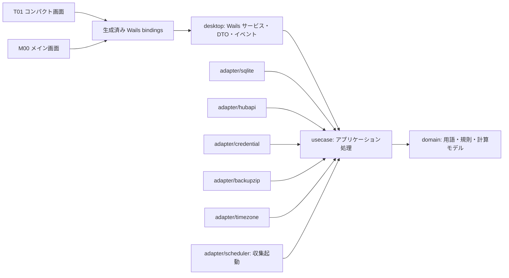

# Token Monitor Analytics アーキテクチャ設計

| 項目 | 内容 |
| --- | --- |
| 状態 | アーキテクチャ設計基準 |
| 基準日 | 2026-08-25 |
| 対象 | Windows デスクトップ版 |
| 規範文書 | [要件定義](./requirements.md) |
| UI 設計 | [画面設計](./screen-design.md)、[デザインシステム](./design-system.md)。いずれも要件定義と矛盾する場合は要件定義を優先する |
| 実装計画 | [PLAN.md](../PLAN.md) |

## 1. 結論

本アプリは、**Wails v3 をデスクトップシェルとし、Go のモジュラーモノリス、React、TypeScript、SQLite で構成する**。本実装はリポジトリ直下へ置き、**poc/** は技術的知見の参照だけに使う。

採用する中心構成は次のとおりである。

- UI シェルは Wails v3、フロントエンドは React、TypeScript、Vite、Fluent UI React v9 とする。
- ドメイン判断、時刻処理、収集、推定、トランザクションは Go が所有する。React は表示と入力を担当する。
- 永続化は SQLite、Go ドライバーは modernc.org/sqlite、SQL は database/sql と sqlc、マイグレーションは goose の埋め込み SQL とする。
- 数値計算の行列処理と階数判定は Gonum を使う。非負最小二乗法は検証済みの解法を一つだけ固定し、実行時の解法切替えやフォールバックは設けない。
- Windows Credential Manager、Hub API、SQLite、ZIP、Wails はすべて Go の境界アダプターとして隔離する。
- T01 と M00 は別の Wails ウィンドウだが、同一プロセス、同一ユースケース、同一 DB ライフサイクル管理を共有する。
- バックアップ境界は、ローカル ZIP の作成・検証・復元とする。端末外転送、保存先暗号化、世代保持はアプリ外の運用責務として分離する。

この構成で、要件の中心である「原 JSON から推定結果までの追跡可能性」「複数 Hub」「説明可能な推定」「原子的なパージと復元」を、不要な分散システムや汎用抽象化を増やさずに実現する。

## 2. システム境界と設計原則

### 2.1 システム境界

- Windows だけをビルド対象にする。
- ローカルファーストの単一ユーザーアプリとし、アプリ本体にサーバー、クラウド同期、モバイル実行環境を含めない。
- 外部境界は Hub API、Windows Credential Manager、利用者が選択するファイルシステムだけとする。
- **poc/** から本実装への import は禁止する。
- PoC の DB、JSON バックアップ、画面、単一点推定との後方互換性は設けない。
- 実装上の唯一の規範文書は [要件定義](./requirements.md) とする。画面設計、デザインシステム、本書、PLAN、README は要件を実装・検証へ接続する従属文書であり、矛盾した場合は要件を優先する。
- 本書は製品フェーズ、リリース範囲、実装順を定義しない。それらは利用者との合意後に [PLAN.md](../PLAN.md) へ記録する。

### 2.2 設計原則

1. 原 JSON は最初に保存し、その後の正規化が失敗しても削除しない。
2. 元観測、利用者の判断、導出結果、監査記録を同じテーブルへ混在させない。
3. 導出結果は、使用した観測 ID、原 JSON、設定、計算論理版まで遡れるようにする。
4. UI、収集、再計算、データ管理から SQLite ファイルを直接操作させない。
5. バックアップは「作れた」だけで成功にせず、読戻し検証と隔離 DB への復元試験を別の状態として記録する。
6. 復元は、通常起動前の回復、全接続の閉鎖、耐久化ジャーナル、同一ボリューム内の入替えを一つのプロトコルとして扱う。
7. 汎用 Repository、イベントバス、プラグイン機構、common や utils パッケージは作らない。必要な境界だけを明示する。

## 3. 全体アーキテクチャ

### 3.1 依存方向



依存規則は次のとおりである。

- **domain** は標準ライブラリと純粋な数値処理だけに依存し、Wails、SQLite、HTTP、JSON DTO を知らない。
- **usecase** は domain と、自身が定義する小さなポートに依存する。
- **desktop** と **adapter/scheduler** は入力側アダプターとして usecase を呼ぶ。**adapter/sqlite**、**adapter/hubapi**、**adapter/credential**、**adapter/backupzip**、**adapter/timezone** は usecase が定義する出力ポートを実装する。adapter 同士を暗黙に呼び合わせない。
- **desktop** は Wails へ公開する入力 DTO と出力 DTO を持ち、usecase を呼ぶ。
- **main.go** だけが実装を組み立て、起動順と終了順を決める。
- frontend は生成済み bindings を介して desktop だけを呼ぶ。

### 3.2 実行時の所有権

| 関心事 | 所有者 | 補足 |
| --- | --- | --- |
| ドメイン規則、半開区間、状態遷移 | Go domain | UI で再実装しない |
| 収集、再計算、パージ、バックアップ、復元 | Go usecase | 操作 ID を返す非同期処理とする |
| UTC、表示タイムゾーン変換、DST 判定 | Go | IANA タイムゾーンを保存し、`time/tzdata` と固定版 CLDR の変換表を埋め込む |
| DB 接続、WAL、マイグレーション | sqlite adapter | 単一の Lifecycle が全接続を所有する |
| ウィンドウ生成、単一 M00、前面表示 | desktop | Wails のウィンドウ API を一箇所に集約する |
| 画面入力、ナビゲーション、表示整形 | React | ドメイン判断は行わない |
| 表示 DTO、状態コード、鮮度状態、残り（%） | Go desktop/usecase | DTO と共通マッパーを UI の正本とし、React は再計算・独自判定を行わない |
| 秘密 | Windows Credential Manager | DB、監査、ログ、バックアップへ保存しない |

### 3.3 収集から推定までの流れ

1. Hub ごとの収集ロックを取得し、許可リストに従って **/api/health** を検証する。
2. 契約対応が確認できた場合だけ、資格情報を取得して **/api/stats** を呼ぶ。
3. 応答全体の JSON 構文と、対応契約で既知の必須フィールド、型、日時、有限数を検証する。不正な応答は原 JSON スナップショットとして保存せず、取得失敗の事実と理由だけを記録する。未知フィールドの追加だけでは有効な応答を拒否しない。
4. 有効な応答本文を再直列化せず、受信した JSON 本文の同一バイト列と取得メタデータを原 JSON スナップショットとしてトランザクション保存する。未知フィールドも失わない。
5. 保存済みスナップショットから元観測を正規化する。保存後の正規化に失敗してもスナップショットは残し、失敗理由を記録する。
6. 確認済みのサービス、利用枠、論理アカウント、プラン履歴、関連付けから計算区間を作る。
7. 許容時刻差と収集時点の間隔メタデータを使い、対応観測と推定観測点を作る。
8. 隣接点の差分、列正規化、階数判定、非負最小二乗法、誤差率から推定状態と結果を作る。
9. 結果には、計算論理版、入力 ID、差分行、元観測、スナップショット ID を保存し、M03 と M08 から追跡できるようにする。

元観測には API 抽出規則と正規化規則の版を記録し、後から更新しない。規則を変更する場合は、保存済み原 JSON から新しい正規化世代を追記し、下流処理は一つの明示的な世代だけを選ぶ。利用者の判断や計算論理が変わった場合は、元観測を変えずに派生計算結果だけを選択的に再計算する。

### 3.4 同時実行と保守モード

- Hub ごとに収集を直列化し、同じ Hub の定期収集と手動収集を重複させない。
- 通常の書込みは一つの書込みコーディネーターを経由する。SQLite の busy timeout と foreign_keys は全接続へ設定する。
- バックアップ、復元試験、復元、パージは **maintenance.go** の共通ゲートで相互排他にする。
- 復元適用は、収集停止、編集禁止、終了抑止、全 DB 接続閉鎖の順に進める。ファイル入替え開始後は取消し不可とする。
- 長時間操作は操作 ID と状態を返し、進捗は版付き Wails イベントで通知する。自動再試行は行わない。
- アプリ起動時は DB を開く前に **RecoverPendingRestore** を実行する。復元ジャーナルを判定できない場合は DB、scheduler、Wails を起動せず、候補ファイルも削除しない。

## 4. フレームワークと主要ライブラリ

### 4.1 採用一覧

| 層・用途 | 採用 | 理由 |
| --- | --- | --- |
| デスクトップ UI | Wails v3 | Go と Web UI を同一プロセスに置け、複数ウィンドウと生成 bindings を持つ |
| フロントエンド | React 19、TypeScript、Vite 8 | 複数画面、フォーム、非同期状態を小さなコンポーネントへ分割しやすい |
| Windows UI 部品 | Fluent UI React v9 | Windows に馴染む部品、キーボード操作、ハイコントラスト、アクセシビリティを利用できる |
| サーバー状態 | TanStack Query v5 | Go 側データの取得、キャッシュ、イベント後の無効化を担当する |
| 画面遷移 | React Router v8 の `MemoryRouter` | ローカルアプリで URL サーバーを必要とせず、M00 内の画面履歴を扱える |
| フォーム | React Hook Form v7 | 変更検知、検証結果、ナビゲーションガードを統一できる |
| DB | SQLite、modernc.org/sqlite | ローカル単一ユーザー、トランザクション、オンラインバックアップを CGo なしで扱える |
| SQL | database/sql、sqlc | SQL を明示しつつ、Go の型付き呼出しを生成できる |
| マイグレーション | pressly/goose v3 | 埋め込み連番 SQL を順序どおり適用できる |
| 行列計算 | Gonum | SVD、階数判定、線形代数の検証済み基盤として使える |
| ID | google/uuid の UUID v4 | 永続 ID を DB 採番や表示名から独立させる |
| Windows API | golang.org/x/sys/windows | Credential Manager と原子的ファイル置換の薄いアダプターに使う |
| ログ | log/slog | 標準ライブラリの構造化ログを許可リスト方式で出力する |
| タスク実行 | Wails v3 同梱の Taskfile runner（`wails3 task`） | 外部の Task CLI を増やさず、Wails のビルド方式とローカル・CI の入口を統一する |
| フロントエンド静的検査・整形 | ESLint、typescript-eslint、Prettier | TypeScript と React の規則、生成物を除く整形を固定する |
| Windows 配布 | NSIS | Wails の標準 Windows Taskfile から単一インストーラーを生成する |
| Go テスト | testing、httptest | domain、usecase、Hub API、SQLite の試験に使う |
| frontend テスト | Vitest、Testing Library、user-event、axe-core | UI の状態、キーボード操作、アクセシビリティを自動検証する |
| E2E | Playwright | fake Wails adapter を使うブラウザー試験と、限定した実 WebView2 試験に使う |

### 4.2 初期バージョン基準

2026-08-25 時点の初期基準を次とする。

- Go 1.26.7
- Node.js 24.19.0 LTS
- Wails CLI、github.com/wailsapp/wails/v3、@wailsio/runtime はすべて 3.0.0-beta.12
- React と React DOM 19.2.8、React Router 8.3.0、TypeScript 6.0.3、Vite 8.2.2、@vitejs/plugin-react 6.1.0、Fluent UI React 9.74.7
- TanStack Query 5.102.3、React Hook Form 7.86.0
- ESLint 10.9.1、typescript-eslint 8.68.0、Prettier 3.9.6、@types/react 19.2.18、@types/react-dom 19.2.5
- modernc.org/sqlite v1.57.0 と、それに対応する modernc.org/libc v1.74.4、sqlc v1.31.1、goose v3.27.3、Gonum v0.17.0
- google/uuid v1.6.0、golang.org/x/sys v0.47.0、staticcheck v0.8.1
- NSIS 3.12

Wails v3 はベータ版であるため、CLI、Go module、frontend runtime の版を必ず一致させる。Wails を更新する場合は通常の依存更新と分け、複数ウィンドウとパッケージの互換性を再検証する。

TypeScript 7.0 はコンパイラー API を提供せず、フロントエンド lint には TypeScript 6 系との併用が必要になるため採用しない。単一ツールチェーンとなる TypeScript 6.0.3 を固定し、TypeScript 7 以降は lint 基盤の対応後に評価する。React Router 8.3.0 が要求する React 19.2.7 以上と Node.js 22.22.0 以上は、上記の固定版で満たす。

パッチ版を暗黙に更新しないため、次をリポジトリへ記録する。

- **.mise.toml** に Go と Node.js の版を固定する。外部の Task CLI は導入しない。
- **go.mod** と **go.sum** を commit し、modernc.org/sqlite と対応する modernc.org/libc、sqlc、goose、staticcheck などの Go module と tool を固定する。
- Wails CLI と `makensis` の実行版を自動検査し、固定版と異なる場合はビルドを停止する。
- `go list -m` で実際に選択された SQLite と libc の版を自動検査する。Wails も SQLite に依存するため、同一モジュールグラフでビルドとバックアップ試験を行う。
- **package.json** は caret と tilde を使わず exact version とし、lockfile を commit する。
- **package.json** は `"type": "module"` とし、`MemoryRouter` は `react-router` から import する。`react-router-dom` は導入しない。
- 初回 lockfile 作成と明示的な依存更新は `npm install --save-exact`、通常の開発環境構築と CI は `npm ci` を使う。`package.json` と lockfile が一致しない場合は CI を失敗させる。
- Wails beta.12 が生成する **build/Taskfile.yml** のフロントエンド依存導入は `npm install` から `npm ci` へ変更して commit する。Wails 更新時はこの差分を再確認し、`build` と `package` から lockfile が更新されないことを試験する。
- Wails bindings と sqlc 生成 Go コードは commit し、手編集を禁止する。
- 生成処理の再実行後に Git 差分がないことを自動検証する。

### 4.3 採用しないもの

- ORM は使わない。要件上重要な SQL、トランザクション境界、削除範囲を隠さないためである。
- Redux や frontend のグローバル業務状態は使わない。正本は Go と SQLite に置く。
- Next.js、Web サーバー、SSR は使わない。Wails のローカル UI に不要である。
- Tailwind CSS は導入せず、Fluent UI と必要最小限の CSS を使う。チャートが必要な画面では、表示専用の依存として閉じ込め、計算規則をフロントエンドへ移さない。
- 汎用 DI コンテナー、メッセージブローカー、内部イベントソーシングは導入しない。

## 5. Go バックエンド設計

### 5.1 domain

[CONTEXT.md](../CONTEXT.md) の日本語を文書上の正規語とし、コード識別子へ次のように一対一で対応付ける。domain は一つのパッケージとし、ファイルで関心事を分ける。

- Hub、Hub 識別子: `Hub`、`HubID`
- 原 JSON スナップショット、元観測: `RawSnapshot`、`SourceObservation`
- サービス、利用額ソース、利用枠ソース: `Service`、`UsageCostSource`、`UsageLimitSource`
- 論理アカウント、プラン版、プラン履歴: `LogicalAccount`、`PlanVersion`、`PlanHistory`
- 計算区間、対応観測、推定観測点: `CalculationInterval`、`MatchedObservation`、`EstimationPoint`
- 推定状態、派生計算結果、設定変更監査履歴: `EstimationStatus`、`DerivedResult`、`ConfigurationAudit`

集約ごとの汎用 `Repository` インターフェースは作らない。usecase が実際に必要とする読み書きだけを、用途別ポートとして定義する。

### 5.2 usecase

usecase は画面単位ではなく、利用者の操作とトランザクション境界で分ける。

- Hub 登録、接続確認、収集開始・停止・手動収集
- カタログと同定候補の確認
- 論理アカウント、プラン履歴、関連付け、完全性の変更
- 計算区間、対応観測、推定、根拠照会
- 利用実績集計、価値比較、エクスポート
- パージ、バックアップ作成、復元試験、復元適用
- 監査、選択的再計算、設定

設定変更、監査記録、再計算要求は同じ SQLite トランザクションへ含める。パージも、削除と残存元観測からの再計算を一つのトランザクションとして扱う。

### 5.3 Wails 公開サービス

Wails へは一つの巨大 Service ではなく、次の粗い機能境界を公開する。

| Service | 主な画面 |
| --- | --- |
| OverviewService | T01、M01 |
| UsageService | M02 |
| HubService | M07 |
| ReviewService | M04 |
| CatalogService | M06 |
| AccountService | M05 |
| EstimationService | M03 |
| EvidenceService | M08 |
| DataManagementService | M09 |
| AuditService | M10 |
| SettingsService | M11 |
| WindowService | T01、M00 の生成・前面化・終了 |

Service は薄い変換層とし、SQL や業務判断を置かない。DB entity や domain struct をそのまま公開せず、専用 DTO を返す。`WindowService` だけは usecase を経由せず、Wails のウィンドウライフサイクルを直接制御する。

### 5.4 DTO とエラー

- 永続 ID は frontend へ不透明な文字列として渡す。
- UTC 日時は RFC 3339 Nano の文字列とする。
- API から取得した十進数の字句は json.Decoder.UseNumber で読み、TEXT のまま保存する。
- 推定途中と導出結果は丸め前の binary64 を SQLite REAL として保存する。表示用の丸め値は DTO で別に作る。
- 利用枠の表示 DTO は、Go が未丸めで計算した `remainingPercent` を明示的に返す。React は `usedPercent` から再計算せず、このフィールドを通常表示・詳細表示・出力の書式へ渡す。
- 表示 DTO は鮮度状態、状態理由、観測時刻を返す。React は経過時間の閾値や鮮度状態を判定しない。
- 状態コードから日本語ラベル、Fluent の intent、アイコン、説明、次操作を生成する一元マッパーを Go の共有ポートとして実装し、画面ごとの翻訳表を持たない。
- NaN と Infinity は DTO へ出さない。該当する場合は推定状態とエラーコードで表す。
- エラーは安定した code、利用者向け message、機微情報を除いた details とする。
- 資格情報を入力 DTO から再表示せず、出力 DTO、イベント、エラー、ログへ含めない。

### 5.5 Hub HTTP クライアント

- URL は絶対 URL に限定し、`userinfo`、`query`、`fragment` を拒否する。host が `localhost`、`127.0.0.0/8`、`::1` の場合だけ HTTP を許可し、それ以外は証明書検証を有効にした HTTPS だけを許可する。
- 証明書検証を無効化する設定は設けない。redirect ごとに URL 制約を再検査し、別 host へ資格情報を転送しない。
- 接続と応答のタイムアウト、応答本文の最大バイト数を一つのクライアント生成処理で固定する。値は実在 Hub と固定フィクスチャで検証し、実行時設定にはしない。
- 各収集の前に /api/health を取得し、二段階の許可リストへ一致した場合だけ、認証済み /api/stats を一度呼ぶ。
- 401 と 403 は認証失敗として記録するが、資格情報を削除せず、別資格情報への切替えや暗黙の即時再試行を行わない。
- ログへは Hub 識別子、非秘密の host、処理段階、分類済みエラーだけを出し、header、Cookie、資格情報、応答本文を出さない。

### 5.6 Windows タイムゾーン候補

- OS から Windows タイムゾーン ID を取得し、固定した Unicode CLDR 48.2 の `windowsZones.xml` にある `territory="001"` の対応から IANA タイムゾーン候補を一つ得る。
- CLDR の版、取得元 URL、SHA-256 を生成処理へ固定し、必要な対応表だけを Go コードとして生成して commit する。実行時のネットワーク取得や文字列推測は行わない。
- M11 の選択肢は、固定した Go ツールチェーンの `zoneinfo.zip` から IANA ID 一覧を生成して commit し、各 ID が埋め込み `time/tzdata` で読めることを生成検査する。実行時に OS のタイムゾーン一覧を正本として使わない。
- 候補は初回画面へ示すだけで、利用者が M11 で明示確認するまで保存済み表示タイムゾーンとして扱わない。Windows ID に対応がない場合は候補を空にし、利用者の IANA 選択を待つ。
- 選択した IANA ID は埋め込み `time/tzdata` で検証する。Windows ID、IANA 候補、DST 境界、存在しない時刻、曖昧時刻を固定試験にする。

## 6. React フロントエンド設計

### 6.1 ウィンドウとルーティング

- Wails の初期 URL または起動データで T01 と M00 を識別し、それぞれ別の React root を描画する。
- T01 は常時最前面の小型画面、M00 はアプリ内で一つだけ存在するメイン画面とする。
- T01 から M00 を開く操作は WindowService に集約し、既存 M00 があれば新規作成せず前面へ出す。
- M00 は MemoryRouter を使い、M01 から M11 までを route とする。実装済み画面だけをナビゲーションへ公開する。
- 未保存フォームの移動、ウィンドウ終了、復元開始は同じ dirty-state guard を通す。

### 6.2 状態管理

- Go 側のデータは TanStack Query で取得し、query key を画面ごとの集約 ID に揃える。
- Wails イベントには eventVersion と影響 ID を含め、frontend は該当 query だけを invalidate する。
- React Context はテーマ、表示タイムゾーン、fake/backend adapter など、画面全体に本当に必要な値だけに使う。
- M11 のテーマ設定は Go と SQLite を正本とし、`light`、`dark`、`system` を保存する。`system` の OS テーマ変更は desktop 層が購読して Go の設定イベントを発行し、T01 と M00 が同じイベントを受けて FluentProvider と独自トークンを更新する。
- ウィンドウ間で frontend state を同期しない。共有状態とテーマ変更イベントの正本は Go と SQLite とする。ウィンドウごとのテーマ設定は持たない。
- 表のページング、絞込み、並び順は Go へ渡す。仮想スクロールは計測で必要性を確認した場合だけ導入する。

### 6.3 UI 品質

- Fluent UI の標準部品、フォーカス表示、キーボード操作、ハイコントラストを優先する。
- フォームは React Hook Form で変更状態とフィールドエラーを管理する。
- 状態は色だけで示さず、ラベルとアイコンを併用する。
- 独自 SVG・CSS は `forced-colors`、`currentColor`、システム色を使い、ハイコントラストでハードコードした色だけに依存しない。200% 拡大では固定寸法で情報や操作を切り取らずリフローし、グラフは同じ情報を表とテキストでも提供する。
- プライバシーモードのマスク処理は表示文字、Tooltip、`title`、`aria-label`、アクセシブル説明、クリップボード、タスクバーのサムネイルで同じマスク済み DTO を使う。未加工の値を React の別経路へ渡さない。
- 200% 拡大、Windows の表示倍率、複数モニター、画面外位置からの復帰を実機受入れで確認する。
- 推定値、状態、根拠は表と詳細パネルで追跡できるようにする。グラフは Go が返す導出値だけを可視化し、独自計算を行わない。

## 7. SQLite、バックアップ、復元

### 7.1 SQLite

- `journal_mode` は WAL、`synchronous` は FULL、`foreign_keys` は ON とし、`busy_timeout` を全接続へ適用する。
- 運用 DB は一つの `Lifecycle` が所有し、各 usecase が独自に `database/sql.DB` を生成しない。
- マイグレーションは **migrations/** の連番 SQL を埋め込み、アプリは前方向だけを適用する。
- `CurrentSchemaVersion` は SQLite アダプターの一箇所だけに置き、マイグレーション、manifest、復元検証、画面表示が同じ値を参照する。埋め込み済みマイグレーションの最大番号との一致を生成検査で保証する。
- 復元処理は明示的に対応する `schemaVersion` だけを受理し、暗黙の互換変換はしない。
- 原 JSON は BLOB、原 API の十進数字句は TEXT、導出数値は REAL とする。
- 自由な key-value 設定テーブルは作らず、非秘密項目を型付き列で定義する。

### 7.2 バックアップ作成

バックアップ ZIP は利用者が選んだパスへ手動で作る。内容は厳密に **manifest.json** と自己完結した **data.sqlite3** の二つだけとする。

作成前に保存先の親ディレクトリと既存対象を解決し、固定アプリデータディレクトリ配下を拒否する。既存対象は Windows のボリューム ID とファイル ID も比較し、運用 DB、`-wal`、`-shm`、復元ジャーナル、退避・一時ファイルと同一なら、別名や reparse point 経由でも拒否する。この検査は一時 ZIP 作成前と成果物確定直前に行う。

1. SQLite Online Backup API で、運用 DB から同一アプリ管理領域の一時 DB を作る。
2. 一時 DB を開いて integrity_check、foreign_key_check、意味制約を検証し、その後 checkpoint、全接続 close、DB 本体の flush、sidecar 不在を確認する。
3. manifest に形式版、`schemaVersion`、作成 UTC、アプリ版、`data.sqlite3` のサイズと `database.sha256` を書く。
4. 利用者指定先と同じディレクトリへ一時 ZIP を作り、flush、close、CRC、エントリ、サイズ、`database.sha256` を読戻し検証する。完成した ZIP 全体の `artifactSha256` は close 後に算出し、自己参照を避けるため ZIP 内には格納しない。
5. Windows の安全な原子的置換で成果物を確定する。対象ファイルシステムが安全な置換を提供しない場合は失敗させ、コピー・削除によるフォールバックは行わない。この置換成功を成果物作成のコミット点とする。
6. コミット後にローカル状態へ `artifactSha256`、成果物サイズ、作成 UTC を記録する。この記録だけが失敗しても成果物作成を失敗へ戻さず、現在セッションでは成功結果と記録警告を表示する。
7. コミット点より前のどの障害でも既存の同名成果物を変更しないことを試験する。

ZIP に運用 DB の **-wal** と **-shm** は含めない。ログ、資格情報、復元ジャーナルも含めない。

### 7.3 秘密不在の境界

- Hub 資格情報は Hub 識別子ごとの Windows Generic Credential に保存する。
- DB には秘密や Credential Manager の存在を複製したフラグを保存しない。`資格情報保存成功`、`資格情報削除成功`、`復元成功`、`復元後再確認成功` を、秘密を含まない監査イベントとして同一 DB の単調増加する追記順へ記録する。UTC 日時は前後判定に使わない。
- 資格情報の主状態は `登録済み`、`未登録`、`復元後再登録待ち` の三値とし、接続確認結果とは分ける。通常時は保存成功だけで登録済みとし、同時の接続確認が失敗しても登録済みを取り消さず、失敗理由を接続状態へ記録して再試行を許可する。削除成功なら未登録とする。
- 最新の復元成功より前の保存イベントと端末に残った Credential Manager エントリは再利用しない。復元後の明示的な保存成功は再保存済みという補助事実だけを記録し、主状態は復元後再登録待ちのままとする。同じ復元より後の保存を使った接続確認が成功して `復元後再確認成功` を追記した時点で初めて登録済みへ遷移し、収集を許可する。接続確認の失敗では待ち状態を解除しない。
- 原 JSON は証跡として保持するため、Hub API 契約で既知の認証フィールドを禁止フィールドとして定義し、viewer では許可済みフィールドだけを平文表示する。
- DB validator は禁止テーブル、禁止列、禁止設定キー、既知の認証フィールドを検査する。
- 受入試験では番兵用資格情報を登録し、DB、ZIP、ログのバイト列と論理内容に存在しないことを確認する。
- 未知 JSON フィールドを「秘密ではない」と推測しない。契約上分類できないフィールドは raw viewer でマスクし、分類規則が確定するまで当該スナップショットを含むバックアップを許可しない。

### 7.4 復元検証と復元試験

復元の「検証」「試験」「適用」は別操作とする。

- 検証では ZIP 直下の二エントリ、重複・不足・余分なエントリ、絶対パス、親ディレクトリ参照、CRC、manifest、`schemaVersion`、`database.sha256` を確認し、ZIP 全体の `artifactSha256` を算出する。
- `manifest.json` は BOM なし UTF-8 とし、未知・重複キー、末尾トークンを拒否する。`database.path` は `data.sqlite3` と完全一致、`database.sizeBytes` は正の整数、`database.sha256` は小文字 64 桁の十六進数に限定する。
- 固定の任意サイズ上限は設けない。`database.sizeBytes` と実際の非圧縮読取り量を一致させ、宣言値を超えた時点で展開を失敗させる。適用前に、一時 DB、耐久化ジャーナル、現 DB 一式の退避に必要な空き容量を確認する。
- DB は本番 DB と同じボリュームに、アプリが生成した固定規約名で展開する。
- 展開 DB を開き、integrity_check、foreign_key_check、意味制約、秘密不在、再計算可能性を検証する。
- 検証後は展開 DB を checkpoint、close し、適用対象の論理内容が WAL に残らない状態にする。
- 検証成功時は、操作 ID、`artifactSha256`、固定規約名の検証済み DB を組にしたプロセス内の検証結果を返す。適用はこの操作 ID だけを受け付け、利用者が選んだ ZIP を再度直接読み込まない。アプリ再起動または別の検証開始で結果を無効にし、適用には再検証を要求する。
- 復元試験は、アプリが作った本番 DB とは異なる専用ディレクトリだけを破棄可能な対象とする。
- 復元試験は専用の空環境へ展開して検証し、成果物 DB と隔離 DB のテーブル件数、主キー順の論理内容、代表原 JSON、関連付け、プラン履歴、推定根拠を比較する。運用 DB の入替えと復元監査を含む往復受入れは、7.5 の復元適用が完成した後に行う。
- 作成状態と最終復元試験合格状態を分け、ZIP 全体の `artifactSha256` と試験 UTC を関連付ける。

### 7.5 原子的な復元適用

復元適用は次の順で行う。

1. maintenance gate を取得し、適用前の収集状態を記憶して、収集停止、編集禁止、終了抑止を行う。
2. 現 DB と検証済み DB を checkpoint して全接続を閉じる。
3. 形式版、操作 ID、`artifactSha256`、固定規約のファイル名トークン、各 sidecar の存在、段階を持つ復元ジャーナルを、一時ファイルへの書込み、flush、原子的置換の順で耐久化する。任意の絶対パスは保存しない。
4. 同一ボリューム内で、現 DB と sidecar を退避し、検証済み DB と sidecar を一組として入れ替える。
5. 新 DB を開いて再検証する。
6. `artifactSha256`、形式版、`schemaVersion`、復元 UTC を持つ復元成功監査を一件だけ追記する。この監査を、復元した全 Hub の復元後再登録待ちを導出する境界として使う。
7. 新 DB の論理内容が、手順 6 の復元成功監査一件を除いて成果物 DB と一致することを確認する。
8. ここまで成功した場合だけジャーナルを committed にし、後始末して通常動作へ戻る。

手順 4 から 7 で通常の処理エラーが発生した場合は、その場で新 DB の接続を閉じ、退避した元 DB と sidecar の一組へ戻して再オープンする。ロールバックが成功した場合だけ適用前の収集状態へ戻す。即時ロールバックにも失敗した場合は通常動作を再開せず、ジャーナルを残して起動時回復へ委ねる。

復元ジャーナルから使う絶対パスは、固定アプリデータディレクトリと固定規約名から都度導出する。解決済みパスが管理領域内か、同一ボリュームか、reparse point ではないかを入替え前と起動時回復の両方で検査する。起動時の段階別処理は次のとおりとする。

| ジャーナルとファイルの状態 | 起動時処理 |
| --- | --- |
| 現 DB を未退避 | 現 DB を維持し、安全と確認できた一時ファイルだけを後始末する |
| 退避後から `committed` 前 | 新 DB を採用せず、退避した元 DB 一式へ戻す |
| `committed` | 新 DB を維持し、残った退避・一時ファイルの後始末を完了する |
| 破損、不明な段階、判定不能な組合せ | DB、scheduler、Wails を起動せず、候補ファイルを削除しない |

判定不能で安全停止した場合、アプリ自身は候補へ手を加えない。運用手順では、元のアプリデータ領域全体を別媒体へ退避し、クリーンな Windows ユーザープロファイルへ対応版を導入して、検証済み端末外 ZIP から復旧する。候補ファイルを手作業で選別・削除して通常起動へ戻す手順は提供しない。

復元成功後は全 Hub を復元後再登録待ちとして表示し、利用者が Hub ごとに資格情報を明示保存して接続確認に成功するまで収集を再開しない。

### 7.6 保護範囲と運用上の限界

アプリが証明できるのは、ローカル成果物の作成と復元試験までである。端末外コピーと保存先の暗号化は観測できない。

- UI は「最終作成 UTC」「ZIP 全体の `artifactSha256`」「最終復元試験合格 UTC」を事実として表示する。
- RPO は、利用者が暗号化済みの端末外保存先へコピーし、コピー先 ZIP の `artifactSha256` を画面表示値と照合し、復元試験にも合格した最後の成果物の作成時点と条件付きで説明する。
- 端末全損からの復旧に必要な生存物は、暗号化された端末外 ZIP、その `schemaVersion` と `appVersion` を扱える Windows インストーラーと入手元、全 Hub の資格情報を再登録できる機外原本、端末外保存先へアクセスして復号するための回復情報とする。インストーラーをバックアップ ZIP へ含めず、復号手段を成果物と同じ保存先または喪失対象端末だけに置かない。
- 固定 RTO は保証しない。対応版の再インストール、ZIP 検証と適用、全 Hub の資格情報再登録と接続確認、収集再開、手動バックアップ一回、復元試験合格を復旧完了条件とする。
- 端末外保存先は、オフライン、イミュータブル、または感染端末から書込み不能な方式を推奨する。利用できない場合は、ランサムウェアからの復旧を保証できない残存リスクを明示する。
- 端末外保存先では、バージョニングを有効にするか、異なる成果物名で複数時点を保持する。アプリ内の自動世代管理は追加せず、単一成果物だけを上書きする場合は、遅れて発覚した論理破損より前へ戻れない残存リスクを明示する。
- 端末の盗難または資格情報流出が疑われる場合は、復旧先で接続する前に、Hub 資格情報と端末外保存先のアクセス資格情報を失効・ローテーションする。
- 手動バックアップの作り忘れ、端末外コピーと照合のし忘れ、対応インストーラーまたは資格情報原本の喪失を残存リスクとして扱う。
- 復旧手順、演習、運用上の完了条件は **docs/backup-restore.md** に置き、作成・検証タスクは [PLAN.md](../PLAN.md) で管理する。

## 8. ディレクトリ構成

```text
token-monitor-analytics/
├─ PLAN.md                         # 実装順、タスク、検証、受入ゲート
├─ main.go                         # 構成、DB 前回復、Wails 起動、終了順
├─ go.mod
├─ go.sum
├─ sqlc.yaml                       # SQLite、SQL 入力、生成先の固定設定
├─ Taskfile.yml                    # wails3 task が読む唯一のタスク定義
├─ .mise.toml                      # Go、Node.js の固定版
├─ frontend/
│  ├─ package.json
│  ├─ package-lock.json
│  ├─ index.html                   # Vite の build entry
│  ├─ tsconfig.json
│  ├─ eslint.config.js             # ESM の flat config
│  ├─ vite.config.ts
│  ├─ bindings/                    # Wails 生成物。commit する
│  └─ src/
│     ├─ main.tsx                  # React の mount entry
│     ├─ app/
│     │  ├─ App.tsx
│     │  ├─ providers.tsx
│     │  └─ router.tsx
│     ├─ windows/
│     │  ├─ compact/               # T01
│     │  └─ main/                  # M00 の shell
│     ├─ pages/
│     │  ├─ overview/              # M01
│     │  ├─ usage/                 # M02
│     │  ├─ estimation/            # M03
│     │  ├─ review/                # M04
│     │  ├─ accounts/              # M05
│     │  ├─ catalog/               # M06
│     │  ├─ hubs/                  # M07
│     │  ├─ evidence/              # M08
│     │  ├─ data-management/       # M09
│     │  ├─ audit/                 # M10
│     │  └─ settings/              # M11
│     ├─ components/               # 2 画面以上で使う部品だけ
│     ├─ lib/
│     │  ├─ backend.ts             # bindings と fake 実装の単一境界
│     │  ├─ queryClient.ts
│     │  └─ time.ts
│     ├─ test/
│     └─ styles/
├─ internal/
│  ├─ domain/                      # 一つの package、関心事ごとにファイル分割
│  │  ├─ hub.go
│  │  ├─ catalog.go
│  │  ├─ account.go
│  │  ├─ observation.go
│  │  ├─ interval.go
│  │  ├─ estimation.go
│  │  └─ audit.go
│  ├─ usecase/
│  │  ├─ ports.go
│  │  ├─ hub.go
│  │  ├─ collection.go
│  │  ├─ review.go                 # M04 の横断作業一覧
│  │  ├─ catalog.go
│  │  ├─ linking.go
│  │  ├─ estimation.go
│  │  ├─ usage.go
│  │  ├─ queries.go
│  │  ├─ purge.go
│  │  ├─ maintenance.go            # M09 共通排他、収集停止、UI ロック
│  │  ├─ backup.go                 # 作成状態と復元試験状態
│  │  ├─ restore.go                # 検証と適用の調停
│  │  └─ audit.go
│  ├─ adapter/
│  │  ├─ sqlite/
│  │  │  ├─ db.go
│  │  │  ├─ lifecycle.go
│  │  │  ├─ migrate.go
│  │  │  ├─ validate.go
│  │  │  ├─ backup.go
│  │  │  ├─ restore_journal.go
│  │  │  ├─ restore_swap_windows.go
│  │  │  ├─ recovery.go            # DB オープン前の復元回復
│  │  │  ├─ queries/               # sqlc 入力 SQL
│  │  │  ├─ sqlcgen/               # sqlc 生成物。commit する
│  │  │  └─ migrations/
│  │  │     └─ 0001_initial.sql
│  │  ├─ hubapi/
│  │  │  ├─ client.go
│  │  │  ├─ contract.go
│  │  │  └─ normalize.go
│  │  ├─ credential/
│  │  │  └─ manager_windows.go
│  │  ├─ timezone/
│  │  │  ├─ windows.go             # Windows ID の取得
│  │  │  ├─ windows_to_iana_generated.go # 固定版 CLDR から生成
│  │  │  └─ iana_zones_generated.go # 固定 Go tzdata から生成
│  │  ├─ backupzip/
│  │  │  ├─ manifest.go
│  │  │  ├─ writer.go
│  │  │  ├─ validator.go
│  │  │  └─ atomic_replace_windows.go
│  │  └─ scheduler/
│  │     └─ collection.go
│  └─ desktop/
│     ├─ services.go
│     ├─ dto.go
│     ├─ events.go
│     └─ windows.go
├─ testdata/
│  ├─ hubapi/
│  ├─ estimation/
│  ├─ backup/
│  └─ sqlite/
├─ tests/
│  ├─ traceability/                 # 規範要件・画面受入キーと試験名の対応検査
│  └─ acceptance/
│     ├─ backup_restore_test.go
│     ├─ restore_failure_test.go
│     └─ restore_crash_helper_test.go
├─ build/
│  ├─ appicon.png                   # Wails 共通アプリアイコン
│  ├─ config.yml                    # Wails の製品・パッケージ設定
│  ├─ Taskfile.yml                  # Wails 共通ビルドタスク。npm ci へ固定
│  └─ windows/
│     ├─ Taskfile.yml
│     ├─ icon.ico
│     ├─ info.json
│     ├─ wails.exe.manifest
│     └─ nsis/
│        ├─ project.nsi             # 固定した NSIS インストーラー定義
│        └─ wails_tools.nsh         # Wails の NSIS 補助定義
├─ docs/
│  ├─ requirements.md
│  ├─ screen-design.md
│  ├─ design-system.md
│  ├─ architecture.md
│  └─ backup-restore.md             # 復旧と演習の運用手順
└─ poc/                             # 参照専用。本実装から依存しない
```

この構成は「パッケージを細かくすること」ではなく、依存方向と障害境界を見えるようにするための最小分割である。domain と usecase は機能ごとに package を増やさず、同じ package 内のファイルとして分ける。

## 9. PoC から扱うもの

PoC から参照してよいのは、Wails の起動方法、Windows Credential Manager の Win32 呼出し、Hub 通信、modernc SQLite の利用経験である。

次は目標仕様と異なるため流用しない。

- 単一 Hub 前提の設定とスキーマ
- devices.updatedAt や取得時刻を使う観測時刻処理
- 単一点式の簡易推定
- JSON 形式のバックアップ
- クラウド同期とサーバー実装
- 月次ダッシュボード、CSV/JSON エクスポート
- 一つの巨大 Service と Vanilla DOM UI

## 10. 参照資料

- [Wails v3 Beta announcement](https://v3.wails.io/blog/)
- [Wails multiple windows](https://v3.wails.io/features/windows/multiple/)
- [Wails services and generated bindings](https://v3.wails.io/features/bindings/services/)
- [Wails Taskfile build system](https://v3.wails.io/concepts/build-system/)
- [Wails Windows packaging](https://v3.wails.io/guides/build/windows/)
- [Wails build customization](https://v3.wails.io/guides/build/customization/)
- [npm ci](https://docs.npmjs.com/cli/commands/npm-ci/)
- [TypeScript 7.0 announcement](https://devblogs.microsoft.com/typescript/announcing-typescript-7-0/)
- [Fluent UI React v9](https://fluent2.microsoft.design/get-started/develop)
- [React releases](https://react.dev/versions)
- [React Router releases](https://reactrouter.com/changelog)
- [React Router 8.3.0 package metadata](https://registry.npmjs.org/react-router/8.3.0)
- [Vite build guide](https://vite.dev/guide/build)
- [ESLint configuration files](https://eslint.org/docs/latest/use/configure/configuration-files)
- [Node.js releases](https://nodejs.org/en/about/previous-releases)
- [Go release history](https://go.dev/doc/devel/release)
- [modernc.org/sqlite package](https://pkg.go.dev/modernc.org/sqlite)
- [SQLite Online Backup API](https://www.sqlite.org/backup.html)
- [sqlc database and language support](https://docs.sqlc.dev/en/stable/reference/language-support.html)
- [sqlc generate](https://docs.sqlc.dev/en/stable/howto/generate.html)
- [goose](https://github.com/pressly/goose)
- [Gonum](https://www.gonum.org/)
- [Unicode CLDR 48 release](https://cldr.unicode.org/downloads/cldr-48)
- [Unicode CLDR Windows zone mappings](https://github.com/unicode-org/cldr/blob/release-48-2/common/supplemental/windowsZones.xml)
- [NSIS download](https://nsis.sourceforge.io/Download)
