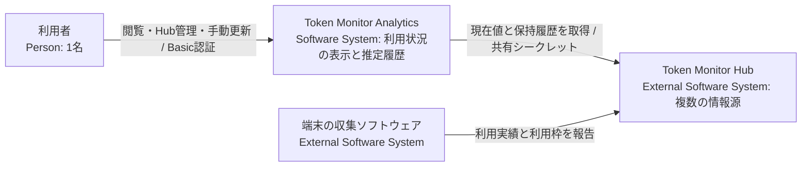
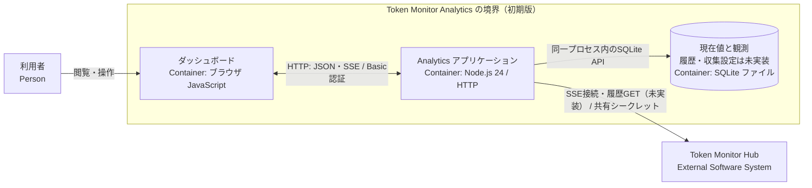
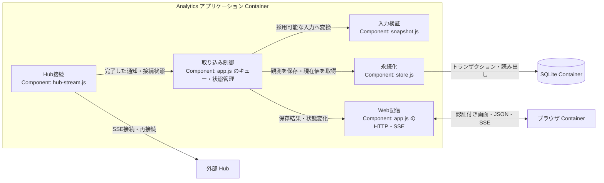
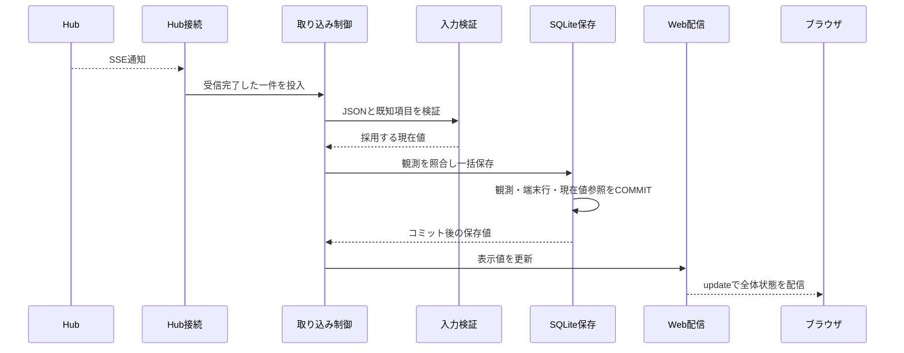

# アーキテクチャ設計書

本書はシステムの境界、構造、識別、状態、保存、実行時動作を定める。目標と制約は [設計方針](design-policy.md)、用語は [CONTEXT.md](../CONTEXT.md)、未決・未検証事項は [PLAN.md](../PLAN.md) を正本とする。2026-09-13 に実装と実行設定を `old/` へ退避したため、以下の「実装済み」は退避時点の事実であり、合意済みの初期版や検証済みの範囲とは区別する。

## 1. 目標・制約と現時点の範囲

複数 Hub の利用状況を表示し、契約・利用枠・対象期間を特定できる観測から利用許容量を推定する。Windows 先行、Node.js の単一常駐プロセス、SQLite、Basic 認証、履歴保全などの初期版の条件は [設計方針](design-policy.md) に従う。

退避した実装は、一つの Hub の現在値受信、入力検証、SQLite 保存、再接続、認証付き表示までである。推定、履歴 GET、複数 Hub の並行管理、Web からの登録・停止・再開、手動更新は合意済みだが未実装である。

## 2. システム境界（arc42 Context and Scope）

### 2.1 C4 Context

Analytics が管理するのは Hub の接続設定と自身の保存データである。端末から直接取得せず、上流の収集、Hub の保持期間、契約情報を制御せず、Hub ストレージの完全なバックアップもしない。

### 2.2 Hub との契約と調査根拠

外部仕様は上流コミット `2f60827e3028d283969dd74cde5b3f5664220442`（`v0.56.0`）のソースと、2026-09-12 の [Private Hub 単発取得](../old/docs/reference/hub-private/README.md) で確認した。取得先の Worker は `coreRevision: 36`、`runtimeRevision: 3` だった。リライト開始時の上流チェックアウトは未検証の `c4182fd5bcdcd466f6bcd159026756323e084318` であり、互換性は [U1](../PLAN.md#u1) で追跡する。

| 経路 | 取得情報と用途 |
| --- | --- |
| `GET /api/stats/stream` | 接続直後の `snapshot` と以後の `stats`。`{ type, reason, stats, at }` の集計スナップショットを現在値表示と推定に使う。現在値受信は実装済み。 |
| `GET /api/devices` | 端末別の実績・利用枠と任意の保持履歴。日次・月次履歴の収集・補完に使う。未実装。 |
| `GET /api/stats` | 全体・端末別の期間集計、利用枠、履歴プレビュー。調査用であり、推定入力の SSE を置き換えない。 |
| `GET /api/history` | 端末を合算した日次・月次・サマリー。端末・契約別の補完には使わない。 |
| `GET /api/subscriptions` | Hub で共有される手入力の契約・支払情報。実績の契約帰属を証明しないため初期版では使わない。 |
| `GET /api/health` | 認証不要の稼働・ビルド情報。`version` を製品リリース番号、`hubBuild` を履歴カーソルとして扱わない。 |

保護経路は共有シークレットを Bearer または `X-Token-Monitor-Secret` ヘッダーで受け付ける。退避したクライアントは Bearer を使い、URL クエリへ含めず、リダイレクトを拒否する。シークレット未設定時、調査した Node Hub はループバックで認証なし、Worker Hub は保護経路を 503 で拒否する。識別情報が不足する公開統計は使わない。実機の `/api/public/stats` は 404 だった。

設計に影響する上流の事実は次のとおりである。

- SSE には30秒間隔のコメント heartbeat があるが、イベント ID、再送カーソル、`Last-Event-ID` による回収はない。再接続ではその時点のスナップショットだけを得る。
- `at` と `updatedAt` は集計・応答・更新試行の時刻であり、利用発生時刻や単調増加版ではない。GET と SSE の到着順で新旧を決めない。
- `periods.today/month/allTime` は累積値であり、受信ごとに加算しない。日付境界で Hub 合算から端末の値が外れるため、金額の減少だけで利用枠のリセットを判定しない。
- 実績にはツール等の内訳があるが、`accountKey` や契約 ID がない。利用枠側のアカウント情報へ直接結合できない。
- `limitsOnly` 更新は実績を保ったまま端末更新時刻を変える。利用枠取得失敗後も直前値が残り得るため、値の存在や `stale: false` だけを成功の証拠にしない。
- 集約利用枠は候補の代表値であり、消費率の合計ではない。`accountKey` は公式契約 ID ではなく、プロバイダー共通の永続性規則もない。
- `usedPercent` は0〜100へ正規化され、欠落時は `null` になる。リセット以外に失効する `boundaryKind` や、`showMeter` が無効な枠もある。割合の欠落をゼロや推測値で補わない。
- 保持履歴は標準で直近370日の日別集計を一括取得する。期間指定、ページング、過去利用枠はなく、`historyRevision` は変更検出用ハッシュである。`historyAvailable: true` でも空または古い場合がある。
- 日次履歴は現地暦日と数値だけを持ち、利用時刻明細とタイムゾーンを持たない。端末の `periodWindows` は暦の境界であり、利用枠の期間境界ではない。
- Node Hub は保存失敗時にメモリ変更を戻さない。Worker Hub は永続化後に配信するが到達保証はない。Analytics 自身が保存確定と画面通知を制御する。

調査箇所は [API 仕様](../upstream/token-monitor/docs/API.md)、[Node Hub](../upstream/token-monitor/src/hub/server.js)、[Worker Hub](../upstream/token-monitor/worker/src/index.js)、[実績集計](../upstream/token-monitor/src/shared/usage.js)、[履歴](../upstream/token-monitor/src/shared/history.js)、[利用枠](../upstream/token-monitor/src/shared/limits/core.js)、[収集状態](../upstream/token-monitor/src/shared/limits/runtime.js)、[Claude](../upstream/token-monitor/src/shared/providers/claude/limits.js)、[Codex](../upstream/token-monitor/src/shared/providers/codex/limits.js)、[収集処理](../upstream/token-monitor/src/shared/collector.js)、[リセット境界](../upstream/token-monitor/src/shared/limits/resetBoundary.js) である。リンクは現在のチェックアウトを指すため、調査事実の追跡には上記基準コミットを使う。

## 3. 解決方針（arc42 Solution Strategy）

- 識別できる範囲だけを結合・推定する。推定できない取得値も集計単位、取得状態、時刻を保って表示する。
- SSE の現在値と GET の履歴は並行受信し、受信完了後の照合・計算・保存を [共通の単一キュー](ard/0001-serial-processing-queue.md) で直列化する。通信待ちはキュー外とし、保存成功後のデータ更新通知と失敗時の状態通知を分ける。
- Hub 接続、収集設定、保存、推定可否を別の状態とする。障害の影響外にある Hub と安全な閲覧を継続する。取得済みの実績履歴を保持し、再取得値で更新する。算出時点の推定結果は改変しない。

## 4. 構成要素（arc42 Building Block View）

### 4.1 C4 Container：初期版の境界（未実装機能を含む）

ブラウザは独立した実行環境、SQLite は Node.js 組込の保存境界であり、Analytics の常駐サーバーは一つである。Basic 認証は画面、静的ファイル、JSON API、ブラウザ向け SSE の全経路に適用する。退避した実装は同じ境界で現在値を扱うが、履歴 GET、収集設定、推定、履歴閲覧は未実装である。

### 4.2 C4 Component：退避した Node.js アプリケーション

| 退避実装の責務 | 境界と根拠 |
| --- | --- |
| 起動・終了 | 設定、HTTP、収集、キュー完了、DB 終了。[main.js](../old/src/main.js)、[config.js](../old/src/config.js) |
| Hub 接続 | 認証、SSE 分割受信、再接続、通信キャンセル。[hub-stream.js](../old/src/hub-stream.js) |
| 入力検証 | JSON・型・端末 ID 重複、有限数、一部の非負・百分率範囲を検証し、既知項目だけを採用する。永続状態は更新しない。[snapshot.js](../old/src/snapshot.js) |
| 取り込み制御 | 通知の直列処理と接続・入力・保存状態、表示値を管理する。[app.js](../old/src/app.js) |
| 永続化 | Hub、観測、端末別観測、現在値参照をコミットまたはロールバックする。[store.js](../old/src/store.js) |
| Web 配信 | 認証後に保存値と状態を配信する。ブラウザは比較基準や DB を更新しない。[app.js](../old/src/app.js)、[public/app.js](../old/public/app.js) |

図の責務はファイル分割を要求しない。初期版にはさらに契約・枠の照合と推定、保持履歴の取得、Hub 管理、手動更新の責務が必要である。割り当てが未決の責務は [U3](../PLAN.md#u3)、[U6](../PLAN.md#u6)、[U7](../PLAN.md#u7)、[U8](../PLAN.md#u8) で追跡し、退避実装の部品数を完成形へ固定しない。

## 5. 識別・状態・保存（arc42 Crosscutting Concepts）

### 5.1 何を同一とみなすか

| 対象 | 確定済みの規則 | 未実装・未決 |
| --- | --- | --- |
| Hub | Analytics の登録単位で全データを分離する。URL だけを識別子にしない。 | 退避実装は `HUB_ID` と URL の対応変更を拒否する。管理操作は未実装。 |
| 端末 | Hub と `deviceId` の組で区別し、ID 変更後は別端末とする。自動で名寄せしない。 | 比較基準への反映は [U5](../PLAN.md#u5)。 |
| 契約 | プロバイダーのアカウントと契約を区別し、ツール名、プラン名、単一の画面表示だけで利用額を帰属させない。 | 結合根拠は [U2](../PLAN.md#u2)。 |
| 利用枠 | 同じ契約内の枠を区別し、複数端末に現れる同じ枠の消費率を合算しない。 | プロバイダー別規則は [U4](../PLAN.md#u4)。退避実装は観測内の配列だけを保持する。 |
| 対象期間 | 枠を識別した後、同一枠の有効な `resetsAt` で区別する。日・月の集計期間とは別である。 | 第5.2節の規則を適用する。 |
| 現在値観測 | 受信回数を利用量にせず、累積値を加算しない。 | 退避実装の再受信判定は第5.3節。推定用の意味上の照合は U3・U4。 |
| 日次実績 | Hub・端末・現地日付・ツールの組を同一として更新する。 | 未実装。 |
| 月次実績 | Hub・端末・現地月・ツールの組を同一として更新する。 | 未実装。 |

`accountKey` は契約 ID ではない。調査した Claude では組織切替がキーへ反映されない場合があり、同じ `kind` にモデル別枠がある。Codex ではメールアドレスとワークスペースのアカウント ID からキーを作り、同じ `limitId` に短時間・長時間枠がある。`kind`、`limitId`、`resetsAt` の単独項目で枠を同定しない。

### 5.2 推定と比較区間

推定入力は SSE の一つの `snapshot` / `stats` に含まれる利用額と `usedPercent` の組だけとする。採用する累積 API 換算額と契約・利用枠への対応は [U2](../PLAN.md#u2) で確定する。

同じ契約・利用枠・対象期間の二観測について、API 換算額の差を ΔC（USD）、消費率の差を Δp（パーセントポイント）とすると、利用許容量は `100 × ΔC / Δp`（USD）である。次の全条件を満たす場合だけ算出する。

1. 利用額の増分が対象契約・利用枠へ帰属し、契約が混在しない。
2. 二観測が同じ対象期間に属し、リセットや欠測による不明区間をまたがない。
3. ΔC と Δp がともに正である。
4. 定額制の利用枠であり、失効性クレジットや残高メーターではない。

帰属不明額の比率配分や、未知の許容量比率の利用者入力で条件を補わない。同じ期間の比較可能な最初と最新の観測を使い、途中で累積額が減ってもそれだけで起点を変えない。

| `resetsAt` と消費率 | 扱い |
| --- | --- |
| 有効な `resetsAt` が同一 | 起点を保ち、最新観測との差を計算する。 |
| 有効な `resetsAt` が更新 | 新期間の起点へ変更し、期間をまたぐ差を使わない。 |
| `resetsAt` が欠落・不正 | 期間を特定できないため推定不可。 |
| 同じ `resetsAt` で消費率が減少 | 継続性不明として推定不可。不明区間をまたがない。 |

`resetsAt` は予定時刻でありリセット通知ではない。欠測後の再開条件と複数端末の束ね方は [U3](../PLAN.md#u3) に残る。結果は算出日時、区間、根拠とともに追記し、遡及再計算しない。推定不可の理由と過去結果の算出日時を表示する。未実装は推定不可と区別する。

### 5.3 保存モデルと確定点

| 保存対象 | 規則 | 状況 |
| --- | --- | --- |
| Hub・端末 | 情報源を分離し、Hub ID と URL の取り違えを拒否する。 | 実装済み。 |
| 現在値観測・現在値参照 | 変化した観測を追記し、端末値と現在値参照を同時更新する。 | 実装済み。 |
| 契約・利用枠の対応 | 契約・枠を保持し、観測間の対応を推測しない。 | U2・U4 に依存。 |
| 比較基準・推定結果・不可理由 | 最初・最新の対応、算出時点、区間、再起動後の継続と重複防止の根拠を保持する。 | U3・U5 に依存。 |
| 日次・月次実績 | 同じキーを再取得値で更新し、応答から消えた記録を削除しない。 | 未実装。日付判定は U6。 |
| Hub の収集設定 | 有効・停止を保存し再起動後に復元する。 | 未実装。境界は U6。 |
| 履歴取得状況・最終成功日時 | 定期取得が保存まで完了したか判定できるようにする。 | 未実装。U6 に依存。 |

退避 DB は `hubs`、`observations`、`observed_devices`、`current_observations` を持つ。観測は Hub に属し、端末行は観測 ID と `deviceId` の組、現在値参照は Hub ごとに一つである。このモデルで未決の契約・枠を代用しない。

退避実装は `stats` の最上位 `updatedAt` を除いた JSON の SHA-256 を直前値と比較する。同じなら観測を追加せず現在値参照の上流・受信・保存時刻を更新し、異なれば観測と全端末行を追加する。配列順や下位時刻もハッシュに含むため、契約別実績の意味上の同一性には使わない。

一通知の観測、全端末行、現在値参照を一トランザクションで更新する。コミット前の失敗は全体をロールバックする。保存関数はコミット後の読み出しを返し、その結果で表示値を更新して `update` を送る。したがってコミットと通知は別の確定点であり、コミット後の失敗は [U9](../PLAN.md#u9)、推定まで含む一括更新範囲は [U3](../PLAN.md#u3) で確定する。

### 5.4 日次・月次実績の保存

GET の保持履歴は推移閲覧・比較専用とし、SSE 現在値や推定基準を更新しない。

- 日次は端末の現地日付の前日以前を保存し、当日分と SSE 値を転記しない。
- 月次は返却された各月を保存し、当月を途中集計と表示する。
- 保持履歴全体を照合して再取得値で更新し、応答にない過去記録と推定結果を削除・変更しない。
- 日付と数値を変換・按分せず保存する。複数端末を合算する場合は現地日付の合計と明示し、タイムゾーン混在時は同じ時間帯の合計ではないことを表示する。

端末タイムゾーンの欠落・不正時に当日を除外する条件は [U6](../PLAN.md#u6) で未決であり、別のタイムゾーンで補わない。

### 5.5 独立した状態と表示

| 対象 | 状態・更新担当 | 永続性・状況 |
| --- | --- | --- |
| Hub 接続 | Hub 接続が成功・切断・失敗を通知し、取り込み制御が接続中・未接続を記録する。上流の停止理由は推測しない。 | 退避実装はメモリ。起動後の実通信で判定する。 |
| 入力採用 | 検証失敗の原因を取り込み制御が設定し、次の正常保存で解除する。 | 退避実装はメモリ。保存値を維持する。 |
| 保存処理 | 永続化の例外で取り込み制御が保存失敗を設定し、書き込みを止める。原因解消後の再起動で再開する。 | 退避実装はメモリ。 |
| Hub 収集設定 | 管理操作で有効・停止を変える。接続状態とは別である。 | SQLite 保存は合意済み、操作と担当は U6・U7。 |
| 推定可否 | 契約・枠・期間ごとに帰属、継続性、増分から算出可能・推定不可を判定する。 | 根拠保存は合意済み、担当は U3。 |
| ブラウザ接続 | ブラウザが Analytics との SSE 接続状態を更新する。Hub 接続とは別で DB を変更しない。 | 実装済み。 |

これらは同時に成立するため一つの状態値へ畳み込まない。保存値には上流更新時刻、Analytics の受信時刻、保存時刻を付け、未取得をゼロにしない。退避画面は代表バッジの優先順位とは別に各異常原因を表示する。

### 5.6 排他制御と通知

SSE 一通知または GET 一応答を一件とし、受信完了したペイロードだけを共通キューへ入れる。複数端末を含む一件の照合から保存までを直列処理し、通信・再接続待ちはキュー外で行う。

退避実装のブラウザ SSE は初回接続と状態変化を `status`、保存成功を `update` として全体状態を送り、ブラウザは全体を置き換える。初回状態も SSE から得る。保存失敗では `status` だけを送り、`update` を送らない。

## 6. 重要な実行時シナリオ（arc42 Runtime View）

S1〜S9 を機能仕様・モック・テストの共通 ID とする。モックで確認する際は、[記録項目](standards/mock-driven-development.md#進め方)を該当シナリオへ追記する。現在の合意済み動作と、今後行う UI の操作確認・承認は区別する。現行のモック確認入口・対応テスト・UI 承認記録はまだない。

### S1. 通常の現在値受信と再受信

現在値部分は実装済み、推定は U2〜U4 に依存する。

第5.3節の単位で同一性を判定し、再受信を加算しない。不正入力では保存値を維持して原因を `status` で送り、次の通知を受け付ける。保存失敗は S6 に従う。変化時の一括保存、再受信の重複抑止、不正入力からの復帰、コミット前に成功通知がないことを検証する。

### S2. 補完中の新規受信と定期取得

合意済みだが未実装。履歴 GET の待機中も SSE の受信・保存・推定を継続し、完了した GET と SSE を共通キューで処理する。GET は第5.4節の実績だけを更新する。

| 契機 | 動作 |
| --- | --- |
| 初回接続 | 全保持履歴を取得する。SSE 開始は待たない。 |
| 定期 | 稼働マシンの現地時刻で毎日午前1時、Hub ごとに取得する。 |
| 再接続 | 当該 Hub の当日の定期取得が未完了なら取得する。 |
| 通信失敗 | 1時間間隔で再試行し、SSE を継続する。 |
| 保存成功だが前日データなし | 不在と表示し、ゼロ補完せず次回の定期取得を待つ。 |

取得成功は保存完了までを指す。保存失敗を通信再試行へ混ぜず、収集停止中は取得・再試行を止める。取得完了の担当・トランザクションと GET の重複制御は [U6](../PLAN.md#u6)。GET 遅延中の SSE、通信再試行、履歴の非破壊更新、GET が現在値・推定へ混入しないことを検証する。

### S3. 切断と再接続

退避実装は切断を未接続として通知し、最後の保存値と時刻を保ち、既定3秒後に再接続する。再接続スナップショットを S1 で処理し、欠測観測を生成しない。初期版では他 Hub と履歴閲覧を継続し、補完は S2 に従う。欠測後の推定再開は [U3](../PLAN.md#u3)。切断表示、二重計上防止、他 Hub の継続を検証し、実 Hub での継続確認は [U1](../PLAN.md#u1) に残る。

### S4. リセット・継続性不明・帰属不明

推定は未実装。第5.1・5.2節で同定し、新期間では起点を設定し直して旧結果を維持する。帰属・継続性が不明な対象だけを推定不可とし、取得値と理由を表示する。識別できる他の対象は推定を続ける。起点・結果・不可理由の一括保存は [U3](../PLAN.md#u3)。期間横断の差を使わないこと、消費率減少と累積額減少を混同しないこと、根拠のない推定値を作らないことを検証する。

### S5. Hub 個別の収集停止と再開

合意済みだが未実装。停止受付を境界として当該 Hub の SSE、再接続待ち、履歴 GET、再試行を止める。受信途中の通信は中止し、遅着応答を採用しない。受付前に受信完了したデータは、処理待ち・処理中も保存を完了してから「収集停止」を表示する。保存失敗時は両状態を併記し、他 Hub と保存値の閲覧を継続する。

有効・停止は SQLite に保存し、明示的な再開で通信を戻す。通信停止、受信済み処理、設定保存の順序と失敗時の再起動状態は [U6](../PLAN.md#u6)。境界前後の採否、全通信の停止、他 Hub の継続、状態併記、再起動後の設定維持を検証する。

### S6. 保存失敗

退避実装では、コミット前の例外を取り込み制御が保存失敗として設定し、トランザクション全体を戻す。直前の表示値を保って `status` を送り、後続書き込みを停止する。通信と状態通知は継続し、原因解消後の再起動で復旧する。

参照可能な値の閲覧を維持するが、DB 参照不能、コミット後の読み出し失敗、共有 DB 障害の影響範囲は [U9](../PLAN.md#u9) で未決である。部分保存の不在、後続書き込み停止、成功通知の不在、原因記録を検証する。

### S7. 再起動と終了

退避実装は設定と保存現在値を読み、HTTP 待受後に SSE へ接続する。接続・入力・保存状態はメモリで初期化し、保存値を新規受信値としない。終了時は通信を止め、受信済みキューを完了し、ブラウザ接続・HTTP・DB の順に閉じる。強制終了等で未コミットの観測を、取得済みとして生成しない。

初期版では保存した収集設定を復元し、有効な Hub だけへ接続する。比較基準・推定結果の再開は U3、停止設定・取得完了状態は U6 に依存する。保存値の復元、Hub の混同拒否、停止指定、推定重複防止を検証する。

### S8. 認証と管理操作

退避実装は画面、静的ファイル、JSON API、ブラウザ SSE の全てで Basic 認証を行い、GET だけを受け付ける。失敗時は保護対象を返さず、Hub シークレットと Web 認証情報を画面・応答・ログへ出さない。

未実装の管理操作には認証、入力検証、CSRF 対策、結果の保存・表示が必要である。方式と秘密情報の保存は [U7](../PLAN.md#u7)。未認証アクセス、CSRF、不正入力、秘密情報露出を検証する。

### S9. 手動更新と失敗

合意済みだが未実装。利用者の明示操作で実行し、作業中の停止を許容する。DB 初期化、履歴改変、自動ロールバックを行わず、失敗の事実・原因・手動復旧情報を残す。取得、適用、再起動、互換性確認、復旧手順は [U8](../PLAN.md#u8) で未決である。成功・失敗の区別、失敗後の履歴保全、復旧情報を検証する。

## 7. 配置と運用（arc42 Deployment View）

Windows 上へ Node.js アプリケーションと SQLite ファイルを置き、ブラウザは同一端末または許容した LAN・VPN 経路から接続する。Hub は外部環境であり配置に含めない。Linux は後続の対応・検証対象である。

退避実装は Git 管理外の `.env` を使い、DB の既定先は `data/analytics.sqlite` である。現在値保存へ認証情報を含めない。管理後の接続設定と秘密情報は U7 で決める。起動手順は [old/README.md](../old/README.md)、依存・実行定義は [package.json](../old/package.json) と [mise.toml](../old/mise.toml)、CI は [Windows ワークフロー](../old/.github/workflows/ci.yml) にある。Mock Hub は開発・検証用であり、本番の常駐サービスではない。

## 8. 設計判断（arc42 Architecture Decisions）

照合から保存までを共通の単一キューで直列化する理由は [判断記録 0001](ard/0001-serial-processing-queue.md) に分離した。通信待ちはその範囲に含めない。

退避実装は Node.js の HTTP、`node:sqlite`、テストランナーを使う。`eventsource-parser` は、初回接続から SSE の分割受信・複数行・改行形式を正しく扱うために採用した。解析の省略による未完了通知の誤処理と、自前実装の保守負担を避ける小さな依存であり、契約や枠の識別根拠にはしない。

開発プロセスと補助製品は [ADR 0002](ard/0002-adopt-mock-driven-development.md)・[ADR 0003](ard/0003-select-mock-tooling.md) に提案を記録する。いずれも Proposed であり、現行の採用構成ではない。

## 9. 品質確認・リスク（arc42 Quality Requirements / Risks）

品質要求と製品完了条件は [設計方針 第6節](design-policy.md#6-検証と製品の完了条件) に従う。S1〜S9 には保存結果、状態、停止・継続、検証条件を記載したが、PLAN の未決事項に依存するシナリオは初期設計完了ではない。

退避した [テスト](../old/tests/) は設定・入力検証、SSE 分割と再接続、Hub・端末の保存分離、再受信、ロールバック、DB 再オープン、保存失敗、不正入力からの復帰、Basic 認証、秘密情報非露出の20件である。この文書編集では再実行していない。

旧記録では Windows / Node.js 24.18.0 で20件成功し、Mock Hub と実ブラウザで現在値を確認した。Private Hub の初回 SSE では端末2台・集約プロバイダー22件を一時 SQLite に保存した。これは [退避した開発記録](../old/docs/root/PLAN.md) の履歴であり、今回の検証結果ではない。実 Hub の継続更新・切断再接続、新リビジョン互換性、Linux は未検証である。残る未決・未実装・未検証は [PLAN.md](../PLAN.md) を参照する。
