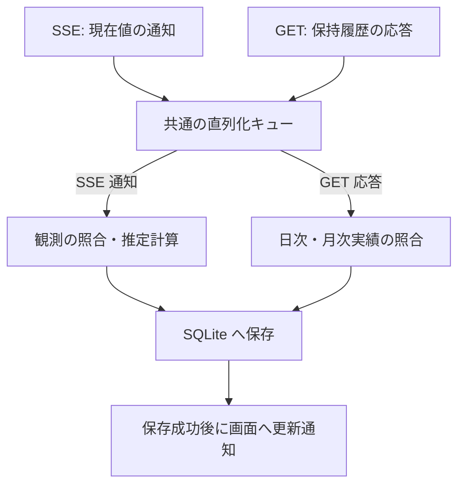

# アーキテクチャ設計書

要件・制約は [設計・実装ガードレール](design-policy.md)、設計手順は [architecture-process.md](architecture-process.md)、用語は [CONTEXT.md](../CONTEXT.md) を正本とする。

本書は、上流 Token Monitor Hub の仕様調査結果、およびデータ識別・利用許容量推定・保存の設計原則を記録したものである。受信データの処理順序や履歴の定期取得方針は第 7 節に定める。なお、システム構造の詳細、SQLite スキーマ、排他制御、状態遷移の詳細設計は後続フェーズで具体化する。

## 1. 調査対象と根拠

上流リポジトリ [Token Monitor](https://github.com/Javis603/token-monitor) を `upstream/token-monitor` に Git サブモジュールとして登録し、ソースコードおよび実環境での応答を調査した。

| 項目 | 調査対象・環境 |
| --- | --- |
| URL / タグ | `https://github.com/Javis603/token-monitor.git`（タグ `v0.56.0`） |
| 固定コミット | `2f60827e3028d283969dd74cde5b3f5664220442`（[GitHub 参照](https://github.com/Javis603/token-monitor/tree/2f60827e3028d283969dd74cde5b3f5664220442)） |
| Hub 実装 | Node.js Hub および Cloudflare Worker Hub |
| 重点確認対象 | Claude および Codex（その他のプロバイダー個別仕様は未確認） |
| 実機検証 | 稼働中の Private Hub（Cloudflare Worker 実装、`coreRevision: 36`、`runtimeRevision: 3`）への接続および参照 API の応答を確認（[実データ資料](reference/hub-private/README.md) 参照） |

※ サブモジュールは仕様調査の根拠であり、本システムの実行時依存ではない。

| 根拠資料 | 主な確認箇所・内容 |
| --- | --- |
| [API 仕様書](../upstream/token-monitor/docs/API.md) | 認証方式、health、データ投入・集計仕様、手入力契約情報 |
| [Node Hub 実装](../upstream/token-monitor/src/hub/server.js) | `getStats`, `getDevices`, `getHistory`, `ingest`, `sseFormat`, `handleRequest` |
| [Worker Hub 実装](../upstream/token-monitor/worker/src/index.js) | 認証、Durable Object の永続化・集計、SSE 配信、公開統計 |
| [利用実績の正規化・集計](../upstream/token-monitor/src/shared/usage.js) | `normalizeDeviceRecord`, `mergeDeviceRecord`, `normalizeSession`, `aggregateDevices`, `aggregateHistory` |
| [履歴処理](../upstream/token-monitor/src/shared/history.js) | `normalizeHistory`, `coerceHistory`, `historyPreview`, 各種履歴リビジョン生成 |
| [送信データ構造](../upstream/token-monitor/src/shared/syncPayload.js) | `historyForSync`, `buildSyncPayload`（送信時に省略される内訳項目） |
| [利用枠の正規化・集計](../upstream/token-monitor/src/shared/limits/core.js) | `normalizeLimitWindow`, `normalizeLimitProvider`, `aggregateLimits` |
| [利用枠の収集状態](../upstream/token-monitor/src/shared/limits/runtime.js) | `applyAttempt`, `providerRows`（最終成功値と最新試行状態の分離） |
| プロバイダー実装 | [Claude](../upstream/token-monitor/src/shared/providers/claude/limits.js) / [Codex](../upstream/token-monitor/src/shared/providers/codex/limits.js) におけるアカウント識別と利用枠生成 |
| 収集と期間境界 | [収集処理](../upstream/token-monitor/src/shared/collector.js) / [リセット境界の更新予約](../upstream/token-monitor/src/shared/limits/resetBoundary.js) |
| 手入力契約情報 | [subscriptionDisplay.js](../upstream/token-monitor/src/shared/subscriptionDisplay.js)（`normalizeBinding` と手入力データの意味） |

Private Hub の実データ（取得日時: 2026-09-12 10:57:13 JST）のハッシュ値等は [manifest](reference/hub-private/2026-09-12T01-57-13-988Z/manifest.json) および [health 応答](reference/hub-private/2026-09-12T01-57-13-988Z/health.json) に保存している。以下に記載する仕様事実は固定ソースのコード調査に基づく。

## 2. Hub API の確認済み事実

### 2.1 取得経路と認証

| 経路 | 内容 | 本システム（Analytics）における扱い |
| --- | --- | --- |
| `GET /api/health` | 認証不要。`runtime`, `version`, `hubBuild`, `secretRequired` 等を返却。 | `version` は製品リリース番号ではなく、`hubBuild` は登録ソース識別子である。 |
| `GET /api/stats` | 全端末の期間集計、端末別実績・利用枠、集約利用枠、履歴プレビュー。 | 集計スナップショットであり、利用イベントの一覧ではない。 |
| `GET /api/stats/stream` | 接続時の `snapshot` イベントおよびその後の `stats` イベント（SSE）。 | `{ type, reason, stats, at }` 形式で集計スナップショットを配信。 |
| `GET /api/devices` | 保持端末レコードの一覧（`periods`, `limits`, 任意の `history` 等を含む）。 | 端末別の保持履歴を取得する主経路（SSE の `stats.devices` には履歴本体が含まれない）。 |
| `GET /api/history` | 端末間で合算された `daily`, `monthly`, `summary`。 | Hub 全体の集約値であり、端末・契約別の分離を保つ履歴補完には利用しない。 |
| `GET /api/subscriptions` | Hub 内で共有される手入力の契約・支払情報。 | 利用実績に契約を帰属させる証拠とはならないため、初期版では採用しない。 |

- **認証方式**: 保護された経路は、共有シークレットを `Authorization: Bearer <secret>` または `X-Token-Monitor-Secret: <secret>` ヘッダーで受け取る。通信 URL にシークレットを含めず、常にヘッダーを使用する。本システム自身の Web 画面に適用する Basic 認証とは独立して管理する。
- **未設定・公開経路の挙動**:
  - Node Hub: シークレット未設定時はループバックアドレスにバインドし、認証は通過する。
  - Worker Hub: シークレット未設定時は保護経路へのアクセスを 503 で拒否する。設定により有効化できる公開経路 `/api/public/stats` は端末・アカウント識別情報を欠落させるため、収集経路としては使用しない。

### 2.2 SSE、順序、再接続

- **SSE の仕様**: `event:` と `data:` を出力し、30 秒間隔でコメント形式の heartbeat を送信する。`id:`, `retry:`, `Last-Event-ID` による再送や履歴カーソル機能は備えていない。
- **再接続とデータ特性**: 再接続時に取得できるのはその時点のスナップショットであり、切断中の観測は再送されない。
- **タイムスタンプの性質**: ペイロード内の `at` や `updatedAt` は集計・応答時刻であり、利用発生時刻や一意なシーケンス番号ではない。管理操作による更新でも配信が発生する。
- **順序性の不在**: 各 API 間および SSE との間で共通利用できる単調増加の版番号はなく、到着順序のみで新旧を判定することはできない。上流へのデータ投入順序による巻き戻りの可能性も排除できない。

したがって、受信イベント数をそのまま利用回数として扱うことはできない。本システムでは「現在値の観測（SSE）」と「日次・月次実績の収集（GET）」を完全に分離し、独立して受信・処理する（第 7 節参照）。

### 2.3 利用実績と履歴

| 項目 | 仕様・制約 |
| --- | --- |
| `deviceId` | Hub 内の端末レコードの識別キー。Hub 間の一意性や、端末再設定後の継続性は保証されない。 |
| `periods.today / month / allTime` | 各期間の累積集計値。`costUsd`（米ドル建て API 換算額）や `clientCosts`（ツール別換算額）は累積値であり、受信ごとの加算は不可。 |
| セッション内訳 | ツール・セッション・モデル等の情報は含まれるが、アカウント識別子（`accountKey`）や契約 ID は含まれない。送信時に明細が省略される場合がある。 |
| `periodWindows` | `today` / `month` の期間キー、終了時刻、任意のタイムゾーン。端末側のカレンダー境界であり、利用枠の期間境界とは異なる。 |
| 日付境界処理 | Hub 集計では期間終了後に該当端末の `today/month` を合計から除外する（`allTime` は維持）。合算額の減少が利用枠のリセットを意味するとは限らない。 |
| `historyAvailable` と `history` | `true` であっても履歴配列が空の場合がある（前日実績の集計完了を保証しない）。端末レコードの更新日時にかかわらず、保持履歴が古いまま残る場合がある。 |
| 保持履歴 | 標準では日別集計を直近 370 日分保持する（月別・サマリーは制限前のデータから生成）。任意の日付を過去に遡って復元できる保証はない。 |
| 履歴 GET 応答 | 保持中の全履歴を一括返却する。期間指定、ページング、過去の利用枠履歴の取得機能はない。 |
| `historyRevision` | 変更検出用のハッシュ値であり、単調増加の版番号や再送カーソルではない。 |

特に `limitsOnly`（利用枠のみの更新）投入時は、実績値を維持したまま端末の更新日時（`updatedAt` / `receivedAt`）のみが更新される。実績と利用枠が同一レコード内にあっても、双方が同一時点で測定されたとは判断できない。

また、履歴の日次データ（`daily`）はローカル暦日を表し、タイムゾーン情報を持たない。端末ごとのタイムゾーン差異を考慮した前日判定は後続設計とする。

### 2.4 利用枠、アカウント、観測時刻

利用枠は `limits.providers[]` に格納され、プロバイダー名、`accountKey`、表示用アカウント名・プラン名、`status`, `source`, `updatedAt`, `windows[]` 等を保持する。

| 項目 | 仕様・制約 |
| --- | --- |
| `accountKey` | 上流が生成するアカウント識別子。公式の契約 ID ではなく、プロバイダー共通の永続性規則もない。 |
| 集約利用枠 | 同一キーの候補から鮮度や状態に基づき代表値を選定する（単純な合算値ではない）。 |
| `windows[].kind` | `session`, `daily`, `weekly`, `billing` 等。同一種類の枠が複数存在し得るため、種類名だけでは一意にならない。 |
| `limitId` / `additional` | 利用枠識別の補助項目だが任意設定。プロバイダーごとに体系が異なる。 |
| `usedPercent` | 0～100 に正規化された消費率。欠落時は `null`。 |
| `resetsAt` / `windowMinutes` | 予定されるリセット時刻および期間長。リセット発生の通知ではない。 |
| `boundaryKind` / `showMeter` | リセット以外の失効（残高・クレジット等）や、割合メーター非表示の枠も存在する。 |
| `status` と `updatedAt` | 更新試行の状態・時刻を表す場合があり、値自体の測定時刻と一致するとは限らない（Codex ではエラー時に直前の値を保持する）。 |

#### Claude と Codex の個別仕様

- **Claude**: Web/OAuth 経由ではアカウント ID・組織 ID・メールアドレスから `accountKey` を生成する。同一アカウント ID の場合は組織切り替えがキーに反映されない。CLI 経由では異なる識別規則が用いられる。短時間枠と週次枠、モデル限定枠が併存するため、`kind` のみでは一意に特定できない。
- **Codex**: メールアドレスとワークスペースのアカウント ID の組み合わせからキーを生成する。メールアドレスのみで異なるワークスペースの契約を混同しない。同一 `limitId` 内に短時間枠と長時間枠が併存するため、`limitId` のみでも一意にならない。
- **収集状態（`LimitsRuntime`）**: 一時エラー時には直前の成功値を保持しつつ、`status` を最新の試行状態（`unavailable` 等）に更新する。枠データが存在すること自体を新たな観測成功の証拠として扱ってはならない。また、Hub の stale 判定は時刻未設定時に `false` となるため、`stale: false` のみで鮮度を保証できない。

### 2.5 上流の永続化と通知の限界

- **Node Hub**: メモリ上の変更を JSON ファイルへ保存した後に SSE を配信するが、ファイル保存失敗時にメモリ状態をロールバックしない。後続の GET 応答値がファイル上に永続化されているとは限らない。
- **Worker Hub**: Durable Object storage への永続化完了後に配信するが、配信自体の完了は保証されない。
- **共通の制約**: どちらの Hub にもクライアントの受信完了を確認するハンドシェイクはない。本システムの永続化および画面通知は、上流から独立して順序を制御する必要がある。

## 3. 識別・推定の設計原則

### 3.1 情報源と対象の分離

各対象の識別原則は以下のとおりとする（SQLite の物理スキーマは後続設計）。

| 対象 | 識別の原則 | 未確定・後続設計事項 |
| --- | --- | --- |
| Hub | 本システム内の登録単位で管理し、配下の全データを紐付ける。 | 接続先変更や同一 Hub の重複登録時の挙動。 |
| 端末 | Hub 登録単位と `deviceId` の組み合わせで分離する。端末再設定等で ID が変更された場合は別端末として扱い、自動での名寄せは行わない。 | 比較基準の保存と更新手順。 |
| 契約 | プロバイダーのアカウント情報と推定対象の契約を明確に区別し、ツール名やプラン名のみで帰属させない。 | 実績から契約への対応付け判定ロジック。 |
| 利用枠 | 契約内で枠の種類および識別情報を組み合わせて特定する。同一アカウントを複数端末が報告した場合も消費率を合算しない。 | プロバイダーごとの安定した枠キー定義。 |
| 対象期間 | 利用枠のリセット予定時刻 `resetsAt` を基準に区切る（日別・月別集計期間とは分離）。 | 状態遷移と比較起点の永続化設計。 |
| 利用実績 | 端末・ツール・集計期間に属する累積値として扱い、ツール別合計と内訳を重複加算しない。 | 巻き戻りや同一時刻異値の処理。 |
| 保持履歴 | 日別（Hub・端末・日付・ツール別）、月別（Hub・端末・月・ツール別）を明確に区別し、相互に二重加算しない。 | タイムゾーン差異発生時の継続性。 |

※ **将来要件（手動関連付け）**: 同一 Hub 内で過去データの `deviceId` を新しい `deviceId` に書き換えて手動関連付けを行う機能は将来要件とし、初期版には実装しない。

### 3.2 再受信と二重計上防止

- **重複排除**: SSE および GET は同一の累積値や履歴を反復して返却し得る。同一内容の再受信によって新たな増分や推定値を計上せず、同一日次・月次実績の再取得時も加算を行わず上書き更新する。受信時刻や通信経路の違いを新規実績の根拠としない。
- **端末間複製ログの非サポート**: 同一の利用ログファイルを複数端末にコピー・共有し、各端末から Hub へ多重報告する構成はサポート対象外とする（自動検出・排除機構は実装しない）。ただし、同一アカウントを複数端末で独立して利用する構成はサポート対象である。

### 3.3 利用許容量の推定条件と計算区間

#### 推定に用いる情報
初期版の利用許容量推定には **SSE で取得した現在値の観測のみ** を使用する。GET で取得した日次・月次実績は推定に使用せず、終了した対象期間の遡及推定も行わない。

#### 計算式
同一の契約・利用枠・対象期間において、対応する区間の API 換算額の増分を $\Delta C$（米ドル）、消費率の増分を $\Delta p$（パーセントポイント）とした場合、利用許容量は以下の式で算出する。

$$\text{利用許容量} = 100 \times \frac{\Delta C}{\Delta p} \quad (\text{USD})$$

#### 推定可否の判定基準
以下の条件をすべて満たす場合に限り推定を実施し、1 つでも満たさない場合は「推定不可」として扱う。

1. API 換算額の増分が対象の契約・利用枠の消費に対応していること（契約の混在がなく、帰属が特定できること）。
2. 2 つの観測が同一の対象期間に属し、途中のリセットや欠測により対応関係が不明になっていないこと。
3. 必要な値が存在し、$\Delta C > 0$ かつ $\Delta p > 0$ であること（ゼロ・負値・不明値による代用計算は不可）。
4. 定額制の利用枠であり、失効性クレジットや残高メーターではないこと。

※ 契約が混在していても利用額を契約別に分離特定できる場合は推定可能とするが、特定できない場合は仮の配分を行わず推定不可とする。

#### 比較区間と観測の組み合わせ
1. **観測の組**: 1 つの SSE イベントに含まれる利用額と消費率を 1 組の観測として扱う。測定時刻のずれによる誤差は参考値として許容し、時刻補正や許容時間差の判定は行わない。
2. **最長区間の採用**: 同一対象期間内において、比較可能な最初と最新の観測を用い、最も広い区間の $\Delta C$ と $\Delta p$ から計算する。新規観測が届いた場合は起点を維持したまま区間を延伸する。
3. **累積額減少の扱い**: 同一端末・同一対象期間において途中で累積利用額が減少した場合も特別な補正や区間分割は行わず、起点を維持して最初と最新の観測差分から計算する。
4. **期間遷移**: 新たな対象期間へ移行した場合は、その期間の最初の有効観測を新たな起点とする。期間を跨ぐ差分計算は行わない。
5. **結果の保存**: 新たに算出した推定結果を時系列として追記保存し、過去に保存した推定結果は改変しない。

### 3.4 リセットと欠測の判定

同一の Hub・契約・利用枠において、リセット予定時刻 `resetsAt` を基準に対象期間を判定する。

| 条件 | 扱い |
| --- | --- |
| 有効な `resetsAt` が同一で、継続性に問題がない | 同一期間として扱い、最初と最新の観測から差分を計算する。 |
| 有効な `resetsAt` が更新された | 新しい対象期間へ遷移したものとして起点を取り直す（新旧期間を跨ぐ計算は不可）。 |
| `resetsAt` が欠落または不正 | 対象期間を識別できないため、該当区間は推定不可とする。 |
| 同一 `resetsAt` 内で消費率が減少した（継続性不明） | 該当区間は推定不可とし、不明区間を跨いだ計算は行わない。 |

※ 切断・再接続の前後も同様のルールを適用する。過去の実績から未観測期間の消費率やリセット前後を推測・按分して補完することは行わない。

### 3.5 取得情報の表示方針

プロバイダー名やプラン名による限定は設けず、Hub から取得できた情報は推定可否にかかわらず画面上に表示する。

| 項目 | 表示ルール |
| --- | --- |
| 利用枠・消費率等 | 取得できた項目をそのまま表示する（リセット時刻が不明でも取得済み値は表示）。 |
| API 換算額 | 取得できた集計単位（Hub・端末・ツール等）を明示して表示する。契約への帰属が不明であっても表示するが、特定契約の実績としては割り当てない。 |
| 利用許容量 | 計算条件を満たす場合にのみ推定値を表示する。満たさない場合は推定不可と明示し、過去の保存値があれば算出日時とともに併記する。 |

各表示項目には取得状態および更新日時を明記し、現在値と過去の保存値を明確に区別する。未取得の値をゼロとみなして埋めることは行わない。

### 3.6 日次・月次実績の保存と利用

`GET /api/devices` から取得した保持履歴は、日別・月別の推移閲覧や比較のために保存する（利用許容量の推定には使用しない）。

| 種別 | 保存・表示ルール |
| --- | --- |
| 日次実績 | **前日以前** を対象とする。当日分は日次実績として保存・表示せず、SSE の現在値も日次実績へ転記しない（当日の利用は現在値画面で表示）。 |
| 月次実績 | 返却された各月の実績を保存する。当月分は当日の利用を含み得るため、取得時点の「途中集計」として表示する。 |

- **全履歴の照合**: 端末別の保持履歴全体を照合して保存・更新する。前日分のみに限定せず、停止中の欠落データや遅れて報告された実績も反映する。
- **非破壊更新**: 同一の日次・月次実績は再取得値で上書き更新し、応答に含まれない過去記録を削除・ゼロ化しない。日次と月次の重なる期間を合算しない。
- **推定結果の不変性**: 過去実績が更新された場合であっても、保存済みの推定結果は変更しない。前日データが存在しない場合の対応は第 7.1 節に従う。

## 4. 保存が必要な情報と再取得の限界

| 保存対象 | 保持の目的 | Hub から再取得できる範囲 |
| --- | --- | --- |
| Hub・端末・契約・利用枠の識別情報 | 異なる情報源や契約との混同防止 | 現在の端末・アカウント情報のみ（過去の関連付け履歴は保証外） |
| SSE から採用した実績・利用枠の観測 | 増分の比較基準、値の鮮度、推定根拠の保持 | 現在のスナップショットのみ（過去の観測は復元不可） |
| 端末別の保持履歴（日次・月次） | 重複排除および Hub 保持期限（直近 370 日等）を超えた履歴保全 | Hub がその時点で保持する履歴のみ（未保持・端末削除後は保証外） |
| 確定済みの比較基準と処理状態 | 再起動後の二重計上防止および処理順序の維持 | 本システムの内部状態であるため Hub からは取得不可 |
| 推定結果・算出日時・根拠データ | 算出時点の推定履歴の保全（遡及改変の防止） | 本システムの独自生成データであるため Hub からは取得不可 |
| 推定不可の理由と対象区間 | 欠測や不整合の理由を追跡可能にする | 本システムの判定履歴であるため Hub からは取得不可 |
| 定期取得の実施状況・最終成功日時 | 日次取得の未完了判定および取得失敗とデータ欠落の区別 | 本システムの実行状態であるため Hub からは取得不可 |

保存データには表示・計算・説明に必要な項目のみを選定し、共有シークレットや認証情報は含めない。現在値の観測と日次・月次実績は別テーブルで管理し、GET の通信失敗が SSE の受信・推定を阻害しない設計とする。

## 5. 未確認事項と設計への影響

合意済みの初期方針と、後続フェーズで設計・具体化する事項を以下に整理する。

| ID | 項目 | 確定済みの初期方針 | 後続フェーズの設計事項 |
| --- | --- | --- | --- |
| U1 | 実機接続と互換性 | Private Hub への接続および初回スナップショット取得を確認済み（単発取得）。 | 継続的な更新・再接続など、長期運用における実機挙動の検証。 |
| U2 | 実績の契約帰属 | 帰属が特定できない場合は推定不可とし、仮の配分計算は行わない。 | 契約識別キーの定義および実績から契約への具体的な対応付け判定ロジック。 |
| U3 | 観測の組み合わせ・比較区間 | 同一 SSE 通知内の値を 1 組とし、最長区間の差分から計算する。測定時刻のずれは許容する。 | 比較基準の保存形式および更新トランザクションの詳細。 |
| U4 | 対象期間判定・表示範囲 | リセット予定時刻 `resetsAt` を基準に期間を区切る。推定可否にかかわらず取得情報を表示する。 | プロバイダー別の安定した利用枠識別キーの定義。 |
| U5 | 複製ログ・端末 ID 変更 | 複製ログはサポート外。ID 変更時は名寄せせず別端末として扱う。途中の累積額減少は特別扱いしない。手動関連付けは将来要件とする。 | 端末別の比較基準永続化および将来の手動関連付け機能の設計（初期版外）。 |
| U6 | 受信処理の分離と順序制御 | SSE（現在値・推定）と GET（履歴補完）を独立受信し、共通キューで 1 件ずつ直列保存する。保存成功後に画面へ通知する。 | 日付判定のタイムゾーン基準、定期取得の実行時刻・再試行間隔、SQLite スキーマおよびトランザクション境界の詳細。 |

## 6. 調査結果サマリー

- 上流リポジトリのソースコードおよび純粋関数の動作を確認し、利用枠のみの更新時の挙動、正規化処理による属性の欠落、消費率の丸め仕様等を把握した。
- Private Hub から各種 API レスポンスおよび SSE 初回スナップショットを取得・保存し、実際のペイロード構造を確認した。
- 上記調査に基づき、識別・推定・保存に関する初期方針（U2～U6）を確定した。未決定となっている具体的な識別キーやトランザクション境界の設計は、後続の設計手順に従って具体化する。

## 7. 受信データの処理と保存

SSE（現在値観測・推定）と GET（履歴収集）は独立して並行受信し、受信後は **共通の単一キュー** に投入して 1 件ずつ直列に保存処理を行う。データが SQLite に正常保存された後に、ブラウザへ更新通知を配信する。

ここで「1 件」とは、1 回の GET 応答または 1 回の SSE データ通知を指す（複数端末分のデータが含まれていても 1 処理単位として扱う）。

| 入力種別 | 処理内容 |
| --- | --- |
| SSE 通知（`snapshot` / `stats`） | 入力検証後、保存済みの比較基準と照合する。第 3.3・3.4 節の条件を満たす場合は利用許容量を推定し、観測・推定結果・次回比較基準を保存する。推定不可の場合も現在値は保存・表示する。 |
| GET 応答（`/api/devices`） | 入力検証後、保持履歴を照合する。第 3.6 節に従い前日以前の日次実績および月次実績を保存・更新し、取得状態を記録する。利用許容量の推定や現在値表示の更新には反映しない。 |

#### 単一キューによる直列化を採用する理由
複数 Hub からの並行受信や GET 履歴補完が重複した場合、並行して比較基準の読み書きを行うと、古い基準に基づく重複計算やデータの不整合が発生する。これを防止するため、照合・推定から SQLite 保存までの一連の処理を 1 件ずつ直列に実行する。通信の待機時間（HTTP レスポンス待ちや再接続待ち）はキューの外側で並行処理するため、システム全体の遅延要因とはならない。

保存失敗時は誤った更新通知を抑制し、整合性を損なう書き込みを停止する（障害時の挙動は [設計・実装ガードレール 第 3.1 節](design-policy.md#31-障害時の動作継続と通知) に準拠）。

### 7.1 接続制御と履歴の定期取得

初回接続・再接続時は `GET /api/stats/stream` の SSE 接続を直ちに開始し、現在値の観測・表示を優先する（GET 完了を待機しない）。履歴収集（`GET /api/devices`）は以下のタイミングで独立して実行する。

| タイミング・状況 | 動作仕様 |
| --- | --- |
| 初回接続時 | Hub が保持する全履歴を取得・保存する。 |
| 稼働中の定期実行 | 前日データの有無にかかわらず、Hub ごとに 1 日 1 回定期取得する。 |
| 再接続時 | 当該 Hub の当日の定期取得が未完了である場合に実行する。 |
| 通信失敗時 | 一定間隔で再試行する（SSE の現在値受信・推定は継続）。 |
| 取得成功・前日データなし | データが存在しない旨を表示し、次回の定期取得まで待機する（前日データ不在のみを理由とした短周期再試行は行わない）。 |

Hub ごとに定期取得の対象日、実施状況、最終成功日時を記録し、SQLite への保存完了をもって取得成功と判定する。遅れて報告された過去日の実績は、次回以降の定期取得時に自動反映される。

※ 定期取得を実行する具体的な時刻、再試行間隔、日付境界となるタイムゾーン仕様は後続設計とする。

### 7.2 実装時の検証シナリオ

| シナリオ | 期待される動作 |
| --- | --- |
| GET の遅延・失敗 | SSE の接続・現在値表示・推定計算を継続する。他 Hub の処理を阻害しない。 |
| GET と SSE の同時到着 | 共通キューで 1 件ずつ順次処理する。GET 応答が現在値表示や推定に混入しない。 |
| 長時間の常駐稼働 | SSE 接続が維持されている場合でも、1 日 1 回の日次定期 GET を確実に実行する。 |
| 再接続・プロセス再起動 | 記録された実行状態から当日の未完了を正しく判定し、既存データの二重計上を防ぐ。 |
| 前日データが存在しない | データ不在を明示し、ゼロ埋めを行わず、過剰な再試行を抑制する。 |
| 過去実績の遅延反映 | 次回以降の GET で正しく更新され、未返却の過去データや保存済み推定結果を破壊しない。 |
| 当日日次・当月月次の受信 | 当日日次は保存対象外とし、当月月次は途中集計として扱う。SSE 現在値は日次へ転記しない。 |
| SQLite の保存失敗 | 更新成功通知を出さず、書き込みを安全に停止する（可能な範囲で参照と状態表示を維持）。 |
