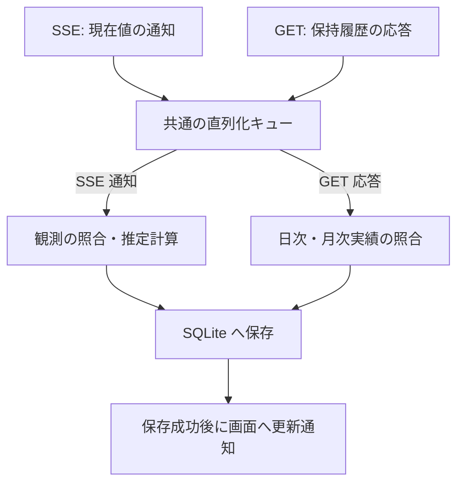

# アーキテクチャ設計書

要件・制約は [設計・実装ガードレール](design-policy.md)、設計手順は [architecture-process.md](architecture-process.md)、用語は [CONTEXT.md](../CONTEXT.md) を正本とする。

本書は、上流 Token Monitor Hub の仕様調査結果、およびデータ識別・利用許容量推定・保存の設計原則を記録する。詳細な SQLite スキーマや状態遷移は後続フェーズで具体化する。

## 1. 調査対象と根拠

上流リポジトリ [Token Monitor](https://github.com/Javis603/token-monitor) を `upstream/token-monitor` に Git サブモジュールとして登録し、ソースコードおよび実環境での応答を調査した（仕様調査用であり実行時依存ではない）。

| 項目 | 調査対象・環境 |
| --- | --- |
| URL / タグ | `https://github.com/Javis603/token-monitor.git`（タグ `v0.56.0`） |
| 固定コミット | `2f60827e3028d283969dd74cde5b3f5664220442`（[GitHub 参照](https://github.com/Javis603/token-monitor/tree/2f60827e3028d283969dd74cde5b3f5664220442)） |
| Hub 実装 | Node.js Hub および Cloudflare Worker Hub |
| 重点確認対象 | Claude および Codex（その他プロバイダーの個別仕様は未確認） |
| 実機検証 | 稼働中の Private Hub（Cloudflare Worker 実装、`coreRevision: 36`、`runtimeRevision: 3`）への接続・API 応答を確認（[実データ資料](reference/hub-private/README.md) 参照） |

| 根拠資料 | 主な確認箇所・内容 |
| --- | --- |
| [API 仕様書](../upstream/token-monitor/docs/API.md) | 認証方式、health、データ投入・集計仕様、手入力契約情報 |
| [Node Hub 実装](../upstream/token-monitor/src/hub/server.js) | `getStats`, `getDevices`, `getHistory`, `ingest`, `sseFormat`, `handleRequest` |
| [Worker Hub 実装](../upstream/token-monitor/worker/src/index.js) | 認証、Durable Object の永続化・集計、SSE 配信、公開統計 |
| [利用実績の正規化・集計](../upstream/token-monitor/src/shared/usage.js) | `normalizeDeviceRecord`, `mergeDeviceRecord`, `normalizeSession`, `aggregateDevices`, `aggregateHistory` |
| [履歴処理](../upstream/token-monitor/src/shared/history.js) | `normalizeHistory`, `coerceHistory`, `historyPreview`, 各種履歴リビジョン生成 |
| [送信データ構造](../upstream/token-monitor/src/shared/syncPayload.js) | `historyForSync`, `buildSyncPayload`（送信時に省略される内訳項目） |
| [利用枠の正規化・集計](../upstream/token-monitor/src/shared/limits/core.js) | `normalizeLimitWindow`, `normalizeLimitProvider`, `aggregateLimits` |
| [利用枠の収集状態](../upstream/token-monitor/src/shared/limits/runtime.js) | `applyAttempt`, `providerRows`（最終成功値と最新試行状態の分離） |
| プロバイダー実装 | [Claude](../upstream/token-monitor/src/shared/providers/claude/limits.js) / [Codex](../upstream/token-monitor/src/shared/providers/codex/limits.js) におけるアカウント識別と利用枠生成 |
| 収集と期間境界 | [収集処理](../upstream/token-monitor/src/shared/collector.js) / [リセット境界の更新予約](../upstream/token-monitor/src/shared/limits/resetBoundary.js) |
| 手入力契約情報 | [subscriptionDisplay.js](../upstream/token-monitor/src/shared/subscriptionDisplay.js)（`normalizeBinding` と手入力データの意味） |

Private Hub の実データ（取得日時: 2026-09-12 10:57:13 JST）のハッシュ値等は [manifest](reference/hub-private/2026-09-12T01-57-13-988Z/manifest.json) および [health 応答](reference/hub-private/2026-09-12T01-57-13-988Z/health.json) に保存している。

## 2. Hub API の確認済み事実

### 2.1 取得経路と認証

| 経路 | 内容 | 本システムでの扱い |
| --- | --- | --- |
| `GET /api/health` | 認証不要。`runtime`, `version`, `hubBuild`, `secretRequired` 等を返却。 | `version` は製品リリース番号ではなく、`hubBuild` は登録ソース識別子。 |
| `GET /api/stats` | 全端末の期間集計、端末別実績・利用枠、集約利用枠、履歴プレビュー。 | 集計スナップショットであり、利用イベント一覧ではない。 |
| `GET /api/stats/stream` | 接続時の `snapshot` イベントおよびその後の `stats` イベント（SSE）。 | `{ type, reason, stats, at }` 形式で集計スナップショットを配信。 |
| `GET /api/devices` | 保持端末レコードの一覧（`periods`, `limits`, 任意の `history` 等）。 | 端末別の保持履歴を取得する主経路（SSE には履歴本体が含まれない）。 |
| `GET /api/history` | 端末間で合算された `daily`, `monthly`, `summary`。 | 全体集約値であり、端末・契約別の分離を保つ履歴補完には利用しない。 |
| `GET /api/subscriptions` | Hub 内で共有される手入力の契約・支払情報。 | 実績と契約の確実な紐付け証拠とはならないため初期版では不採用。 |

- **認証方式**: 保護経路は共有シークレットを `Authorization: Bearer <secret>` または `X-Token-Monitor-Secret: <secret>` ヘッダーで受け取る（URL に含めずヘッダー送信）。Web 画面の Basic 認証とは独立して管理する。
- **未設定・公開経路の挙動**:
  - Node Hub: シークレット未設定時はループバックアドレスにバインドし、認証なしで通過する。
  - Worker Hub: シークレット未設定時は保護経路へのアクセスを 503 で拒否する。設定により有効化できる公開経路 `/api/public/stats` は端末・アカウント識別情報を欠落させるため使用しない。

### 2.2 SSE、順序、再接続

- **SSE の仕様**: `event:` と `data:` を出力し、30 秒間隔でコメント形式の heartbeat を送信する。`id:`, `retry:`, `Last-Event-ID` による再送や履歴カーソル機能はない。
- **再接続とデータ特性**: 再接続時に取得できるのはその時点のスナップショットであり、切断中の観測は再送されない。
- **タイムスタンプの性質**: ペイロード内の `at` や `updatedAt` は集計・応答時刻であり、利用発生時刻やシーケンス番号ではない。管理操作による更新でも配信が発生する。
- **順序性の不在**: API 間および SSE との間で共通利用できる単調増加の版番号はなく、到着順序のみで新旧は判定できない。

したがって、受信イベント数をそのまま利用回数として扱うことはできない。本システムでは「現在値の観測（SSE）」と「日次・月次実績の収集（GET）」を完全に分離して独立に受信・処理する（第 6 節）。

### 2.3 利用実績と履歴

| 項目 | 仕様・制約 |
| --- | --- |
| `deviceId` | Hub 内の端末レコード識別キー。Hub 間の一意性や端末再設定後の継続性は保証されない。 |
| `periods.today / month / allTime` | 各期間の累積集計値。`costUsd`（API 換算額）等は累積値であり、受信ごとの加算は不可。 |
| セッション内訳 | ツール・セッション・モデル等の情報は含むが、アカウント識別子（`accountKey`）や契約 ID は含まない。 |
| `periodWindows` | 期間キー、終了時刻、任意のタイムゾーン。端末側のカレンダー境界であり利用枠境界とは異なる。 |
| 日付境界処理 | Hub 集計では期間終了後に該当端末の `today/month` を合計から除外する（`allTime` は維持）。合算額の減少が利用枠のリセットを意味するとは限らない。 |
| `historyAvailable` と `history` | `true` でも履歴配列が空の場合がある。端末更新日時にかかわらず保持履歴が古いまま残る場合がある。 |
| 保持履歴 | 標準では日別集計を直近 370 日分保持。任意の日付を遡って復元できる保証はない。 |
| 履歴 GET 応答 | 保持中の全履歴を一括返却。期間指定、ページング、過去利用枠履歴の取得機能はない。 |
| `historyRevision` | 変更検出用のハッシュ値であり、単調増加の版番号や再送カーソルではない。 |

特に利用枠のみの更新（`limitsOnly`）時は、実績値を維持したまま端末の更新日時（`updatedAt` / `receivedAt`）のみが更新される。実績と利用枠が同一レコード内にあっても、双方が同一時点で測定されたとは判断できない。

また、日次履歴（`daily`）は送信元の現地暦日ごとの集計値であり、タイムゾーン情報や利用時刻の明細を持たない。Hub の履歴集約も同じ日付の行を合算する処理であり、共通タイムゾーンへの再集計ではない。そのため、受信側でのタイムゾーン変換や利用額の按分は行わず、端末の現地日付を維持して保存・表示する（第 3.6 節）。

### 2.4 利用枠、アカウント、観測時刻

利用枠は `limits.providers[]` に格納され、プロバイダー名、`accountKey`、表示用アカウント名・プラン名、`status`, `source`, `updatedAt`, `windows[]` 等を保持する。

| 項目 | 仕様・制約 |
| --- | --- |
| `accountKey` | 上流が生成するアカウント識別子。公式の契約 ID ではなく、プロバイダー共通の永続性規則もない。 |
| 集約利用枠 | 同一キーの候補から鮮度や状態に基づき代表値を選定（単純な合算値ではない）。 |
| `windows[].kind` | `session`, `daily`, `weekly`, `billing` 等。同一種類の枠が複数存在し得る。 |
| `limitId` / `additional` | 利用枠識別の補助項目（任意設定）。プロバイダーごとに体系が異なる。 |
| `usedPercent` | 0～100 に正規化された消費率（欠落時は `null`）。 |
| `resetsAt` / `windowMinutes` | 予定されるリセット時刻および期間長（リセット発生の通知ではない）。 |
| `boundaryKind` / `showMeter` | リセット以外の失効（残高等）や、割合メーター非表示の枠も存在。 |
| `status` と `updatedAt` | 更新試行の状態・時刻を表し、測定時刻と一致するとは限らない。 |

#### Claude と Codex の個別仕様
- **Claude**: Web/OAuth 経由ではアカウント ID・組織 ID・メールアドレスから `accountKey` を生成。同一アカウント ID では組織切り替えがキーに反映されない。短時間枠、週次枠、モデル限定枠が併存するため `kind` のみでは一意に特定できない。
- **Codex**: メールアドレスとワークスペースのアカウント ID の組み合わせからキーを生成。同一 `limitId` 内に短時間枠と長時間枠が併存するため `limitId` のみでは一意にならない。
- **収集状態（`LimitsRuntime`）**: 一時エラー時は直前の成功値を保持しつつ `status` を更新する。枠データが存在すること自体を観測成功の証拠として扱ってはならない。また `stale: false` のみで鮮度は保証できない。

### 2.5 上流の永続化と通知の限界
- **Node Hub**: メモリ上の変更を JSON ファイルへ保存した後に SSE を配信するが、保存失敗時にメモリ状態をロールバックしない。
- **Worker Hub**: Durable Object storage への永続化完了後に配信するが、配信自体の到達は保証されない。
- **共通の制約**: 受信完了を確認するハンドシェイクはないため、本システム側で永続化と画面通知の順序を独立制御する必要がある。

## 3. 識別・推定の設計原則

### 3.1 情報源と対象の分離

各対象の識別原則は以下のとおりとする（後続フェーズの課題は第 5 節参照）。

| 対象 | 識別の原則 |
| --- | --- |
| Hub | 本システム内の登録単位で管理し、配下の全データを紐付ける。 |
| 端末 | Hub 登録単位と `deviceId` の組み合わせで分離。ID 変更時は名寄せせず別端末として扱う。 |
| 契約 | プロバイダーのアカウント情報と契約を明確に区別し、ツール名やプラン名のみで帰属させない。 |
| 利用枠 | 契約内で枠の種類および識別情報を組み合わせて特定。複数端末の消費率は合算しない。 |
| 対象期間 | 利用枠のリセット予定時刻 `resetsAt` を基準に区切る（日別・月別集計期間とは分離）。 |
| 利用実績 | 端末・ツール・集計期間に属する累積値として扱い、重複加算しない。 |
| 保持履歴 | 日別（Hub・端末・日付・ツール別）、月別（Hub・端末・月・ツール別）を明確に区別して保持する。 |

※ 同一 Hub 内で過去データの `deviceId` を新しい `deviceId` に書き換える手動関連付けは将来要件とし、初期版には実装しない。

### 3.2 再受信と二重計上防止

- **重複排除**: 同一内容の再受信によって新たな増分や推定値を計上せず、同一日次・月次実績の再取得時も加算を行わず上書き更新する。受信時刻や通信経路の違いを新規実績の根拠としない。
- **端末間複製ログの非サポート**: 同一の利用ログファイルを複数端末にコピー・共有して Hub へ多重報告する構成はサポート対象外とする（同一アカウントを複数端末で独立利用する構成はサポート対象）。

### 3.3 利用許容量の推定条件と計算区間

#### 推定に用いる情報
初期版の推定には **SSE で取得した現在値の観測のみ** を使用する。GET で取得した日次・月次実績は推定に使用せず、終了した対象期間の遡及推定も行わない。

#### 計算式
同一の契約・利用枠・対象期間において、API 換算額の増分を $\Delta C$（USD）、消費率の増分を $\Delta p$（パーセントポイント）とした場合、利用許容量は以下の式で算出する。

$$\text{利用許容量} = 100 \times \frac{\Delta C}{\Delta p} \quad (\text{USD})$$

#### 推定可否の判定基準
以下の条件をすべて満たす場合に限り推定を実施し、満たさない場合は「推定不可」とする。

1. API 換算額の増分が対象の契約・利用枠の消費に対応していること（契約の混在がなく帰属が特定できること）。
2. 2 つの観測が同一の対象期間に属し、途中のリセットや欠測により対応関係が不明になっていないこと。
3. $\Delta C > 0$ かつ $\Delta p > 0$ であること（ゼロ・負値・不明値による代用計算は不可）。
4. 定額制の利用枠であり、失効性クレジットや残高メーターではないこと。

#### 比較区間と観測の組み合わせ
1. **観測の組**: 1 つの SSE イベントに含まれる利用額と消費率を 1 組の観測として扱う（測定時刻のずれによる誤差は許容）。
2. **最長区間の採用**: 同一対象期間内で比較可能な最初と最新の観測を用い、最も広い区間の差分から計算する。新規観測到着時は起点を維持して区間を延伸する。
3. **累積額減少の扱い**: 同一端末・同一対象期間で途中に累積額の減少があっても特別扱いせず、最初と最新の観測差分から計算する。
4. **期間遷移**: 新たな対象期間へ移行した場合は、その期間の最初の有効観測を新たな起点とする（期間を跨ぐ差分計算は不可）。
5. **結果の保存**: 新たに算出した推定結果を時系列として追記保存し、過去の推定結果は改変しない。

### 3.4 リセットと欠測の判定

リセット予定時刻 `resetsAt` を基準に対象期間を判定する。

| 条件 | 扱い |
| --- | --- |
| 有効な `resetsAt` が同一 | 同一期間として扱い、最初と最新の観測から差分計算。 |
| 有効な `resetsAt` が更新された | 新しい対象期間へ遷移したとみなし起点を取り直す（期間を跨ぐ計算は不可）。 |
| `resetsAt` が欠落または不正 | 対象期間を識別できないため推定不可。 |
| 同一 `resetsAt` 内で消費率が減少 | 継続性不明のため推定不可（不明区間を跨ぐ計算は行わない）。 |

### 3.5 取得情報の表示方針

プロバイダーやプランによる限定は設けず、取得できた情報は推定可否にかかわらず表示する。

| 項目 | 表示ルール |
| --- | --- |
| 利用枠・消費率等 | 取得できた項目をそのまま表示。 |
| API 換算額 | 取得できた集計単位（Hub・端末・ツール等）を明示して表示（特定契約への配分は行わない）。 |
| 利用許容量 | 計算条件を満たす場合のみ表示。満たさない場合は推定不可と明示し、過去の保存値があれば算出日時とともに併記する。 |

各表示項目には取得状態および更新日時を明記し、未取得の値をゼロ埋めしない。

### 3.6 日次・月次実績の保存と利用

`GET /api/devices` から取得した保持履歴は、推移の閲覧や比較のために保存する（推定には使用しない）。

| 種別 | 保存・表示ルール |
| --- | --- |
| 日次実績 | **各端末の日付基準で前日以前** を対象とする。当日分は保存せず、SSE 現在値も日次へ転記しない（当日の利用は現在値画面で表示）。 |
| 月次実績 | 返却された各月の実績を保存。当月分は「途中集計」として表示する。 |

- **全履歴の照合**: 端末別の保持履歴全体を照合し、停止中の欠落データや遅れて報告された実績も反映する。
- **非破壊更新**: 同一実績は再取得値で上書き更新し、応答に含まれない過去記録の削除や保存済み推定結果の変更は行わない。
- **日付とタイムゾーン**: 受信した端末ごとの現地日付と数値をそのまま保持し、変換や按分は行わない。当日判定は端末側の日付基準で行う。複数端末の同じ日付を合算する場合は「現地日付の合計」とし、タイムゾーン混在時は同一時間帯の合計ではない旨を明示する。

## 4. 保存が必要な情報と再取得の限界

| 保存対象 | 保持の目的 | Hub から再取得できる範囲 |
| --- | --- | --- |
| Hub・端末・契約・利用枠の識別情報 | 情報源や契約の混同防止 | 現在の端末・アカウント情報のみ（過去の関連付けは保証外） |
| SSE から採用した観測 | 増分の比較基準、鮮度・推定根拠の保持 | 現在のスナップショットのみ（過去の観測は復元不可） |
| 端末別の保持履歴（日次・月次） | 重複排除および Hub 保持期限（370 日等）を超えた履歴保全 | Hub がその時点で保持する履歴のみ |
| 確定済みの比較基準と処理状態 | 再起動後の二重計上防止および処理順序の維持 | 本システムの内部状態のため再取得不可 |
| 推定結果・算出日時・根拠データ | 算出時点の推定履歴の保全（遡及改変防止） | 本システムの独自生成データのため再取得不可 |
| 推定不可の理由と対象区間 | 欠測や不整合の理由の追跡 | 本システムの判定履歴のため再取得不可 |
| 定期取得の実施状況・最終成功日時 | 日次取得の未完了判定および失敗の追跡 | 本システムの実行状態のため再取得不可 |

保存データには表示・計算に必要な項目のみを選定し、シークレット等の認証情報は含めない。現在値観測と日次・月次実績は別テーブルで管理し、GET の通信失敗が SSE の受信・推定を阻害しない設計とする。

## 5. 未確認事項と設計への影響

上流コード調査および実機検証に基づき基本方針を確定した。後続フェーズで具体化する課題は以下のとおりである。

| ID | 課題 | 基本方針 | 後続フェーズの設計事項 |
| --- | --- | --- | --- |
| U1 | 実機接続と互換性 | 単発接続・初回スナップショット取得を確認済み。 | 継続的な更新や再接続など、長期運用における挙動検証。 |
| U2 | 実績の契約帰属 | 帰属が特定できない場合は推定不可とし、仮の配分は行わない。 | 契約識別キーの定義および実績との対応付け判定ロジック。 |
| U3 | 比較区間の管理 | 同一 SSE 内の値を 1 組とし、最長区間の差分から計算。 | 比較基準の永続化形式および更新トランザクション。 |
| U4 | 利用枠の特定 | `resetsAt` で期間を区切り、推定可否にかかわらず取得情報を表示。 | プロバイダー別の安定した利用枠識別キーの定義。 |
| U5 | 端末 ID 変更 | 名寄せせず別端末として扱い、手動関連付けは将来要件とする。 | 端末別の比較基準管理および手動関連付け機能の設計（将来）。 |
| U6 | 受信処理とタイムゾーン | SSE と GET を独立受信し単一キューで直列保存。日次履歴は現地日付を維持。収集停止時は受信済みデータを処理・保存し、新しい受信は明示的な再開まで停止する（第 6.3 節）。 | タイムゾーン欠落時の当日判定、SQLite スキーマ、トランザクション境界、収集状態の保存・復元。 |

## 6. 受信データの処理と保存

SSE（現在値観測・推定）と GET（履歴収集）は独立して並行受信し、受信後は **共通の単一キュー** に投入して 1 件ずつ直列に保存処理を行う。SQLite への保存成功後にブラウザへ更新通知を配信する。

※ 1 件とは、1 回の GET 応答または 1 回の SSE データ通知（複数端末分を含む場合も 1 処理単位）。

| 入力種別 | 処理内容 |
| --- | --- |
| SSE 通知（`snapshot` / `stats`） | 入力検証後、保存済みの比較基準と照合。条件を満たす場合は利用許容量を推定し、観測・推定結果・比較基準を保存。推定不可の場合も現在値は保存・表示する。 |
| GET 応答（`/api/devices`） | 入力検証後、保持履歴を照合。前日以前の日次実績および月次実績を保存・更新し、取得状態を記録する（現在値表示や推定には影響させない）。 |

#### 単一キューによる直列化の理由
並行受信時に同一の比較基準を同時に読み書きすると不整合や重複計算の原因となるため、照合から保存までの一連の処理を直列に実行する。通信の待機時間はキューの外側で並行処理するため全体の遅延要因とはならず、保存失敗時は更新通知を抑制して安全に書き込みを停止する。

### 6.1 接続制御と履歴の定期取得

初回接続・再接続時は `GET /api/stats/stream` の SSE 接続を直ちに開始し、現在値の観測・表示を優先する。履歴収集（`GET /api/devices`）は以下のタイミングで独立して実行する。Analytics 上で収集を停止した Hub は、再開操作まで SSE 接続・自動再接続および GET 実行の対象外とする（第 6.3 節）。

| タイミング・状況 | 動作仕様 |
| --- | --- |
| 初回接続時 | Hub が保持する全履歴を取得・保存する。 |
| 稼働中の定期実行 | Analytics 稼働マシンの時刻で毎日午前 1 時に、Hub ごとに保持履歴を取得する。 |
| 再接続時 | 当該 Hub の当日の定期取得が未完了である場合に実行する。 |
| 通信失敗時 | 1 時間後に再試行し、失敗が続く間も同間隔で繰り返す（SSE の受信・推定は継続）。 |
| 取得成功・前日データなし | データ不在を明示し、次回の定期取得まで待機する（短周期での再試行は行わない）。 |

定期取得のスケジュール（実行時刻・対象日）は Analytics 稼働マシンのタイムゾーンを基準とするが、保存する履歴の日付基準（端末の現地日付）および当日除外の判定基準は変更しない。

### 6.2 実装時の検証シナリオ

| シナリオ | 検証観点 |
| --- | --- |
| GET の遅延・失敗 | SSE の接続・現在値表示・推定計算が継続し、他 Hub の処理を阻害しないこと。 |
| GET と SSE の同時到着 | 共通キューで順次処理され、GET 応答が現在値表示や推定計算に混入しないこと。 |
| 長時間常駐での定期取得 | SSE 接続維持中も、毎日午前 1 時に定期 GET が自動実行されること。 |
| 通信失敗と復帰 | 失敗時は 1 時間間隔で再試行され、その間も SSE が継続すること。成功後は不要な再試行が行われないこと。 |
| 再接続・再起動 | 実行状態から当日の未完了を正しく判定し、二重計上なく履歴補完が行われること。 |
| 前日データ不在 | データ不在が明示され、ゼロ埋めや過剰な再試行が発生しないこと。 |
| 過去実績の遅延反映 | 遅れて報告された実績が次回以降の GET で正しく反映され、過去データや推定結果が破壊されないこと。 |
| 当日日次・当月月次 | 当日日次は保存除外され、当月月次は途中集計として扱われること。SSE 現在値が日次へ転記されないこと。 |
| 端末間のタイムゾーン差異 | 各端末の現地日付が保持され、同一日付の合算時に同一時間帯の合計と誤認させない表示となること。 |
| 端末間で当日日付が異なる時刻の GET | 各端末の日付基準で当日分が正しく除外されること（例: JST 9/13 1:00 時点では JST 端末は 9/12 まで、UTC 端末は 9/11 までを保存）。 |
| SQLite の保存失敗 | 更新成功通知を出さず書き込みを停止し、参照や状態表示が可能な限り維持されること。 |
| 上流 Hub の停止による接続失敗 | Hub 障害停止・利用者停止を問わず、Analytics 上で収集を停止していなければ未接続と表示し、自動再接続を継続すること。 |
| Analytics 上での収集停止・再開 | 停止操作により該当 Hub の SSE 接続・自動再接続・定期 GET・GET 再試行が停止すること。保存済みデータの閲覧と他 Hub の収集は維持し、明示的な再開操作で収集を再開すること。 |
| 受信・保存中の収集停止 | 停止要求の受け付け前に受信が完了したデータは、キューで待機中・処理中の分も通常どおり処理・保存されること。受信が未完了の通信は中止され、遅れて届いた応答は取り込まれないこと。受信済みデータの処理終了後に「収集停止」と表示されること。 |
| 収集停止時の保存失敗 | 受信済みデータの保存に失敗した場合は、安全に継続できない書き込みを停止し、「収集停止」に加えて「保存失敗」も表示すること。失敗した保存について、更新成功通知を出さないこと。 |

### 6.3 Analytics 上での収集停止と再開

「Hub ごとの収集停止」は、利用者が Analytics 上でその Hub からのデータ取得を停止する操作を指す（上流 Hub 自体の停止・起動ではない）。Analytics は上流 Hub の停止理由を判別できないため、接続状態と収集停止・再開の操作を区別して扱う。

| 区分 | 判定できる事実と動作 |
| --- | --- |
| 1. Hub への接続失敗・通信切断 | 収集停止操作がなく Hub に接続できない場合は「未接続」と表示し、原因を問わず自動再接続を継続する（Hub 障害と利用者停止は区別しない）。履歴 GET の通信失敗は第 6.1 節の再試行方針に従う。 |
| 2. Analytics 上での収集停止 | 利用者の明示的な停止操作で判定する。再開操作まで該当 Hub の SSE 接続・自動再接続・定期 GET・GET 再試行を停止する。受信済みデータの処理終了後に「収集停止」と表示し、未接続と区別する。 |

収集停止中も保存済みデータの閲覧や他 Hub の収集は継続する。再開操作により該当 Hub の収集を再開し、再開後に Hub へ接続できない場合は区分 1 に従う。

停止時のデータの扱いは、**Analytics が停止要求を受け付けた時点**を境界とする。受信完了は、第 6 節の処理単位である 1 件の GET 応答または 1 件の SSE データ通知ごとに判定する。

| 対象・状況 | 処理と表示 |
| --- | --- |
| 受信済みのデータ | 共通キューで待機中の分と処理中の分を含め、通常どおり処理・保存する。SSE は観測・推定、GET は履歴の照合という役割を維持する。 |
| 受信が完了していない通信 | 完了を待たずに中止する。中止した通信から遅れて届いた GET 応答や SSE データ通知は取り込まない。 |
| 受信済みデータの処理が終了 | 該当 Hub を「収集停止」と表示する。保存成功後のデータ更新通知は第 6 節に従う。 |

保存に失敗した場合は、[設計方針 第 3.1 節](design-policy.md#31-障害時の動作継続と通知)に従って安全に継続できない書き込みを停止する。処理を停止した後は「収集停止」に加えて「保存失敗」も表示し、未保存のデータを保存成功として扱わない。

収集状態の保存形式・再起動時の復元手順は後続設計で具体化する。
