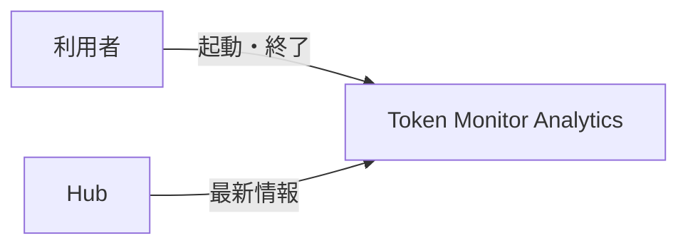
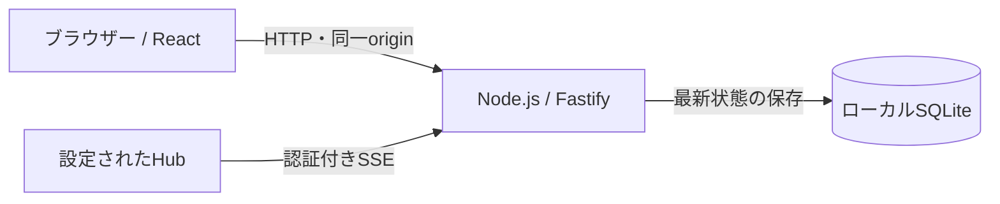
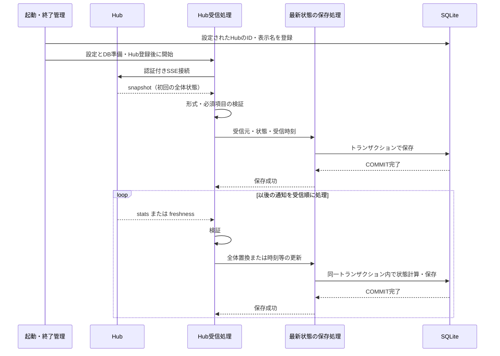
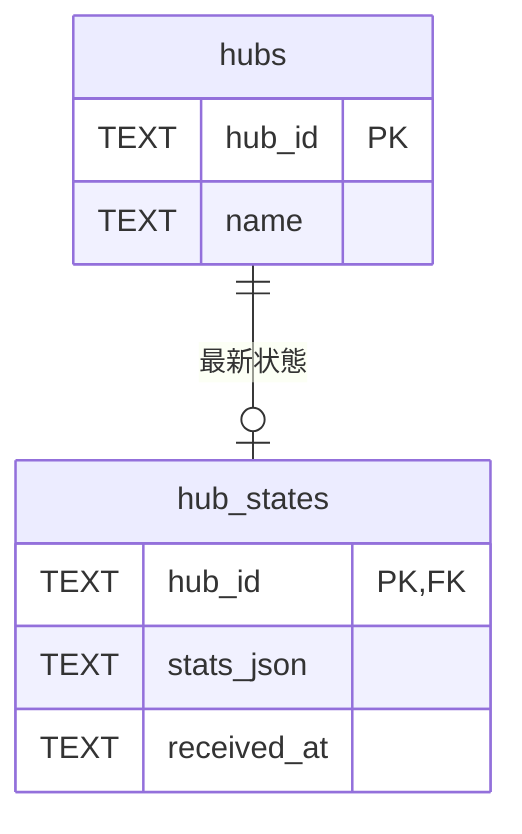

# アーキテクチャ

UC-1の合意済み設計を記録します。1 Hub版から2 Hub・設定ファイル対応へ実装を改訂中です。完成系の承認と段階6の検証は未実施です。実装済みの基盤は [React構成](architecture-react.md)、テンプレート採用範囲は [文書方針](document-policy.md#adoption) を参照します。

## 全体設計の合意

2026-09-20、リポジトリ所有者がUC-1の全体構造とUCP-1を承認しました。確認後の本文保存コミット: `fc2e1f7c2892fc4a464444dcdaab81cb69fd266e`。対象は第1〜4節で、テーブル設計は別途合意します。

> はい。合意します。次へ進めてください。

## 1. システムコンテキスト

利用者がアプリケーションを起動すると、設定ファイルに記載された2つのHubから最新情報を独立して受信し、ローカルに保存します。UC-1には画面操作を設けません。

## 2. コンテナ

受信と保存は既存の単一Node.jsプロセスで行い、SQLiteを保存済み状態の正本とします。ブラウザーは既存の起動画面で、UC-1の処理経路には含めません。図は合意済みの構成であり、現在の実装もこの構成です。

## 3. 実現パターン

### UCP-1. Hubから受信した最新状態をDBへ反映する

適用系列: [UC-1-M](usecases/UC-1.md)。受信履歴ではなく、通知を反映した最新状態を保存します。

| 役割 | 責務 | 実装パス |
| --- | --- | --- |
| 起動・終了管理 | 設定ファイル・DBを準備し、2つのHubを同期してから受信開始。終了時は両方の受信を止めてからDBを閉じる | 実装改訂中 |
| 接続設定読込 | `.env` で指定したJSONを検証し、2つの接続情報を返す。ファイルは更新しない | 実装改訂中 |
| Hub受信処理 | 認証付きSSE接続、通知の解析・境界検証、受信順の保存呼び出し | backend/hub/receiver.ts、backend/hub/protocol.ts |
| 最新状態の保存処理 | 次の状態の計算、SQL実行、受信元・受信時刻との一括保存 | backend/db/hub-state.ts、backend/db/database.ts |

汎用キューやRepository層は追加しません。同じHubの通知は、1件の保存が完了してから次を処理します。2つのHubは別の受信処理で動き、一方の停止は他方やWebサーバーへ波及させません。

- `snapshot` は全体状態を保存し、`stats` は当該Hubの全体状態を置換します。端末の追加・削除も全体置換に含めます。
- `freshness` は既存状態の時刻・鮮度情報のみを更新し、利用量・上限等を維持します。各接続で初回の全体状態を受信する前に差分通知は受け付けません。heartbeatコメントは業務DBを更新しません。
- 保存処理が状態更新を担当し、COMMIT完了を成功確定点とします。差分適用に必要な既存状態の読み取りも同じトランザクションに含め、内部では外部通信を行いません。同じ通知を再受信しても利用量を加算しません。
- 接続・認証失敗、通信断、不正通知では受信処理を停止し、原因をログに残します。保存失敗はロールバックして受信を停止します。最後に保存できた状態とWebサーバーは維持します。
- 通常終了ではSSEを中止し、処理中の保存がコミットまたはロールバックした後にDBを閉じます。この系列では自動再接続せず、復旧はアプリケーションの再起動で行います。
- `.env` は接続設定JSONのパスだけを持ちます。JSONは2つのHubのID・表示名・URL・認証トークンを持ち、Git管理外とします。URLとトークンをDB・保存状態・ログへ含めず、アプリケーションから設定ファイルを更新しません。
- UI確認用モックは不要です。検証時の置き換え境界は外部Hubとし、制御可能なSSEサーバーから本番の受信・保存処理を通し、別のDB接続で保存結果を確認します。実Hubとの相互接続は別途実環境で検証します。段階4のローカル手動確認は実施済みで、実Hubとの相互接続と段階6のE2Eは未検証です。詳細は [検証結果](project.md#verification) を参照します。

Hubは情報の提供元を表す独立した実体です。Hubごとに最新状態は0件または1件で、未受信でもHubは存在します。起動時に設定ファイルのIDと表示名をDBへ同期します。同じIDでの再起動は表示名だけを更新し、保存状態を維持します。URL変更でも同じ提供元ならIDを維持し、別の提供元には新しいIDを割り当てます。設定から外しても保存済みのHubと状態は削除しません。Hub情報の登録・編集・削除は別UCで扱います。

## 4. 設計判断

| ID | 決定 | 根拠と出所 | 影響する範囲 |
| --- | --- | --- | --- |
| ADR-1 | React拡張を適用し、メモ管理サンプルを除去した起動基盤を使用する | 2026-09-20、順序1〜3の実施提案に対する利用者の応答「OK。では進めてください」 | 開発基盤。採用版と差分は文書方針が正本 |
| ADR-2 | 単一Node.jsプロセスでSSEを逐次受信し、Hubごとの最新状態をSQLiteへ原子的に保存する | 2026-09-20、UC-1とUCP-1への利用者の合意。最新状態の整合性を保つため | UC-1-M。履歴蓄積・自動再接続は含めない |
| ADR-3 | Hubと最新状態を分離し、Hubの識別を受信成功に依存させない | 2026-09-20、Hubの独立実体化への応答「合意します。先に進めてください。」 | UC-1-M。URLと認証情報は接続設定に残す |
| ADR-4 | UC-1はGit管理外のJSONから2つのHub接続を読み、Hub情報の登録は別UCとする | 2026-09-20、改訂全文への応答「では先にUC-1から対応してください。次へ進めてください。」 | UC-1-M。Credential Managerは導入しない |

## 5. テーブル設計

以下はUC-1-Mで合意した設計です。実装済みのDBスキーマ版は1です。

### UC-1-Mのテーブル設計

変更範囲は `hubs` と `hub_states` の新設とスキーマ版0から1への移行です。Hubごとに通知を反映済みの最新状態を1行で保持します。受信履歴は蓄積しません。

`hubs`:

| カラム | SQLite型 | NULL | 制約・意味 |
| --- | --- | --- | --- |
| hub_id | TEXT | 不可 | 主キー。設定で指定する安定したHub識別子 |
| name | TEXT | 不可 | 設定から登録する表示名。識別には使わず、一意制約を設けない |

`hub_states`:

| カラム | SQLite型 | NULL | 制約・意味 |
| --- | --- | --- | --- |
| hub_id | TEXT | 不可 | 主キー兼外部キー。hubs.hub_idを参照する受信元識別子 |
| stats_json | TEXT | 不可 | snapshot・stats・freshnessを反映した最新のstats全体をJSONとして保持 |
| received_at | TEXT | 不可 | 最後に保存に成功したデータ通知のローカル受信時刻。UTCのISO 8601形式 |

外部キーはHubの存在を保証し、削除・ID変更の連鎖更新は設けません。主キー以外の一意制約・索引・既定値は設けません。HubのURLと認証情報は接続設定ファイルに置き、このテーブルへ保存しません。Hub側の更新時刻は `stats_json` 内に保持し、別カラムへ重複させません。JSONの形式と必須項目は受信境界で検証します。2 Hub対応によるテーブル変更はありません。

受信開始前にHubを登録します。初回保存前のhub_statesは0行です。`snapshot` と `stats` は受信元の1行を挿入または全体置換します。`freshness` は同じトランザクションで既存状態を読み、時刻・鮮度情報だけを適用したstats全体を書き戻します。`received_at` は受信時に取得し、状態と同時にコミットします。heartbeatでは更新せず、失敗時には状態・受信時刻の両方を維持します。終了・通信断でも行を削除しません。

移行では、空のスキーマ版0に2テーブルを作成し、`PRAGMA user_version` を1に変更します。作成と版更新は同一トランザクションで行い、失敗時は両方をロールバックします。旧製品DBの移行は対象外です。マイグレーションは backend/db/database.ts に実装しています。

合意記録（2026-09-20、判断者: リポジトリ所有者）: UC-1-M。単一テーブル案の提示版は `7a5fd9b`。対話でHubの独立実体化、表示名、0または1の関係、起動時登録、設定管理を追加提案し、下記の応答で合意しました。改訂内容の確認後保存コミット: `8d6669e0944acb818dc228d0a6017eec6c25e21b`。JSONでの最新状態保存とスキーマ版0から1への移行は維持します。

> 合意します。先に進めてください。
