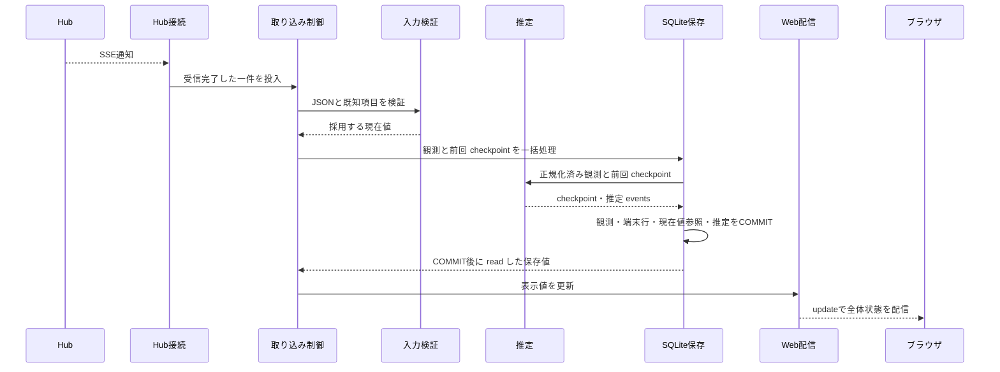

# 実行時シナリオの詳細 (Runtime View)

本書は [設計書 第6節](../architecture.md#runtime) の詳細です。S1〜S9 は機能仕様・設計・モック・テストで共通のシナリオ ID で、動作と検証条件は [機能仕様](../../doc/spec/functional-spec.md#scenarios) を正本とします。本書は各シナリオのコンポーネント間の処理境界、永続化トランザクション、通知契機を定めます。

### S1. 通常の現在値受信と再受信

- **処理境界**: 取り込み制御が入力検証結果を受け、永続化層が観測・端末行・現在値参照・契約関連と共通推定状態を一括コミットします。推定は欠測端末を除外して論理利用額ソースを選び、部分更新待ち・不可理由・除外理由を保存し、表示状態が変わった時にイベントを追記します。採用したソースとその契約の正常で新しい観測がそろい、計算条件が成立した時だけ新しい推定結果を確定します。その後に `readState` で確定値とCursor重複補正済みメトリクスを読み出し、表示値を更新して Web 配信へ通知します。Hub 接続はSSE通知の受信完了時刻を付与して取り込み制御へ渡し、永続化層はHubが報告したデータ側の日時と分離して保持します。変更のない再受信では観測を追記せず、現在値参照の最終受信日時を更新します。表示用の日時もコミット後に更新し、表示規則は [機能仕様 第2節](../../doc/spec/functional-spec.md#display) に従います。不正入力時の状態通知も取り込み制御が担当します。
- **動作・検証条件**: [機能仕様 S1](../../doc/spec/functional-spec.md#s1) を参照（推定の計算式・採用条件は [機能仕様 第1節](../../doc/spec/functional-spec.md#estimation)、保存境界は第5.3節）。

### S2. 補完中の新規受信と定期取得

通信待機はキュー外で行い、受信完了した GET および SSE データを共通キューで処理します。GET データの保存先は第5.4節に従います。

通信待機はキュー外で行い保存だけを共通キューへ直列化するため、取得中のSSE受信・推定を継続します。並行するGETはHubごとに1件に制限し、停止・再開で世代番号が進んだ後の遅着応答は破棄します。取得成功は commitHistory の確定をもって判定し、保存失敗は成功扱いにせず再試行の対象にもしません。通信失敗時は1時間間隔で再試行します。通信エラーと専用の受信検証例外を区別し、JSON・骨格不正はHub側データの問題として記録して当日の自動再試行を止めます。取り込み制御がHubごとに成功日時・再試行予約・不正日の状態を共有し、定期取得・再接続でも再試行待機を尊重します。成功時は予約を解除します。再接続が成立した時に当日分が未完了なら再取得します（動作・検証条件は [機能仕様 S2](../../doc/spec/functional-spec.md#s2) 参照）。

### S3. 切断と再接続

Hub 接続が切断を検知して取り込み制御へ通知し、当該Hubを含む共通推定対象の比較基準を直ちに破棄して過去の最終結果を保持したうえで、キュー外で自動再接続を待機します（既定の再接続間隔は3秒）。別Hubからの通知を含む次の正常な現在値は S1 へ引き渡し、gapや取得不能の端末を除外した論理利用額ソースと契約から新しい対象を構成します。履歴は S2 の処理フローへ引き渡します。切断Hubと関係しない推定対象は継続します（動作・検証条件は [機能仕様 S3](../../doc/spec/functional-spec.md#s3)）。

### S4. リセット・継続性不明・帰属不明

有効な `resetsAt` の更新、欠測、消費率の減少、契約集合・論理利用額ソース集合の変更を検知した場合は関係する共通比較基準を破棄し、過去の推定結果を保持します。欠測・stale・費用欠落等の端末は次の正常な観測で除外し、残るソースの観測を新しい基準として採用します。境界前後をまたぐ計算は行いません。無関係な推定対象の比較基準・結果は維持します（動作・検証条件は [機能仕様 S4](../../doc/spec/functional-spec.md#s4) 参照）。

### S5. Hub 個別の収集停止と再開

停止要求受付時は通信を中止し、受信済みデータの処理終了後に停止状態を表示します。停止の順序は、世代番号の加算と進行中GETの中止・再試行解除、SSE収集ループの停止、受信済みキューの処理完了後の停止フラグ保存と停止表示とします。GETの世代確認は受信完了・キュー投入前に行い、受付済みの保存は後の停止によって破棄しません。停止フラグはSQLiteに保存し再起動時に復元します。旧収集ループと履歴GETの終了待ちは共通保存キューの外で行います。再開済みの再開要求は何も増やさず完了し、停止・再開が続いた場合は世代番号を確認して最後の要求を反映します。停止設定の保存失敗時は表示用の collectionStopped を確定し、最後に保存できた collectionEnabled と区別して停止・保存失敗を併記します。Web 管理画面からの停止・再開操作は [第10節 P-1](../architecture.md#patterns) と D-11 に従います（動作・検証条件は [機能仕様 S5](../../doc/spec/functional-spec.md#s5) 参照）。

### S6. データ保存失敗

- **処理フロー**: コミット前の例外発生時はロールバックし、取り込み制御が「保存失敗」を設定して後続の書き込みを安全に停止します。共有 SQLite の保存失敗で原因や影響範囲が分からない場合は、取り込み制御が全 Hub の保存を停止します。取り込み制御は表示用に保持している数値・データ側の日時・保存成功データの受信日時を更新せず、Web 配信へ保存状態と Hub 接続状態を通知します。保存停止中の後続受信でも表示用の保持値は更新しません。通信接続は維持し、原因解消後の再起動で復旧します。
- **稼働中の読み出し失敗の処理境界**: 永続化層が検知した DB 参照不能を取り込み制御へ通知し、取り込み制御が全 Hub の保存停止と参照不能状態を管理します。表示用の保持値は更新せず、Web 配信は保持値と異常状態を提供します。DB 読み出しを必要とする履歴要求には取得不能を返します。コミット完了後の読み出し失敗をロールバック処理へ引き渡しません。再起動時の復元は S7 が担当します。
- **保存停止後の受信**: 取り込み制御は未処理の受信済み通知と後続通知を保存対象から外し、復旧後の再処理用には保持しません。Hub 接続・切断・再接続の状態通知と保持済み現在値の閲覧は継続します。復旧は原因解消後の再起動により行い、その時点の Hub スナップショットを通常の受信経路へ渡します。
- **通知不達からの復帰**: 第5.6節の Web 配信とブラウザが担当します。コミット後に永続化層から正常に読み出せた保存値を取り込み制御が保持し、ブラウザの再接続時に最新の保持値を送信します。DB 読み出し不能時は直前の保持値と異常状態を返し、復旧済みとして扱いません。
- **動作・検証条件**: [機能仕様 S6](../../doc/spec/functional-spec.md#s6) を参照（履歴取得・管理操作への停止範囲の適用と実装・検証は [U9](../../PLAN.md#u9)）。

### S7. 再起動とシャットダウン

- **モードと起動排他**: `src/runtime.js` が正規化した作業ディレクトリのハッシュに対応する Windows 名前付きパイプを確保し、その所有権を起動・稼働・終了処理の全体で保持します。二重起動は設定・DB・Hub の処理前に `RUNTIME_IN_USE` として失敗します。OS が所有するため、プロセスの強制終了後にロックファイルは残りません。通常終了と起動途中の失敗では、Analytics、内蔵 Mock Hub、パイプの順で解放します。
- **データ分離**: 設定担当は実データ用と Mock 用で別の DB・ログパスを返します。Mock モードだけが `mock/hub.js` を読み込み、ループバックの空きポートと起動ごとに生成したシークレットで起動します。実 Hub の設定は読み込まず、内蔵 Hub 一つの設定だけを取り込み制御に渡します。Web 配信は選択モードを状態JSONへ含め、`public/app.js` が画面とタブ名へ反映します。
- **全体・契約・利用枠の表示**: `src/metrics.js` は保存済みHub集計を基礎に、Cursorのアカウント全体実績を同じ契約ID集合ごとに一度だけ数えた `state.metrics` と `hubs[].metrics` を生成し、`public/app.js` が画面最上段とHubごとに表示します。補正はHub集計の完全な合計から選ばなかった重複報告の既存Cursor内訳だけを差し引き、選択報告の期間内訳が未提供でも値を生成しません。全体はHub横断、Hub値はHub内で補正するため、全体値はHub値の単純和と異なる場合があります。元の `aggregate` と端末生値は保持し、stale・未接続の保存値も現在値表示から除外しません。契約同定不能・同時刻競合・契約集合の部分重複で補正不能な項目は未取得として理由を表示します。このメトリクス判定は推定用の欠測端末除外とは別です。

  `state.contracts` と `state.estimates` を基に共通契約ごとのカードと共通推定を全体で1件表示し、`hubs[].contractIds`・`hubs[].estimateIds` からHub・端末の関連表示へ移動できるようにします。Hub別の利用額ソースと根拠はHubごとに保持し、契約別に帰属できない額を按分しません。欠落値はゼロ補完せず該当項目を未取得とします。取得状態が `notConfigured` のプロバイダーは既定で描画せず、画面上部のトグルで再表示します。各Hubの `aggregate.updatedAt` は「Hub 最終更新日時（データ側）」、`receivedAt` は「最終保存成功データの受信日時」として表示します。Codexの空のweeklyラベルは `Weekly` と補い、利用枠の表示率とメーターは `remainingPercent`（未提供時は `100 - usedPercent`）による残量を示します。推定ロジックが扱う消費率は変更しません。除外端末がある推定は取得できた端末の利用額に基づく参考値と明示します。`methodVersion: 2` でactiveなviewを現在値に使い、旧methodのviewは既定で閉じた「以前の集計方法・対象構成の記録」に表示します。旧Hub方式は `legacyEstimateCount` と履歴の `scope=legacy` で区別します。
  - **Grok契約の表示**: `public/app.js` は正規化した `accountEmail` ごとにGrokの契約カードを一件表示し、関係デバイスを n:n で参照します。正常かつ非 stale の最新 `updatedAt` を代表にし、古いトークン行は別カードにしません。メールアドレスがない行は契約カードを作らず端末の取得情報として表示します。同時刻で利用枠の比較対象値（率、枠種別・ID、対象期間等）が異なる場合は `conflicting_rate` を表示し、`label`・`detail`・`source`・配列順だけの差は無視します。
  - **起動シーケンス**: 起動・終了担当が設定ファイルを読み込み、入力検証でファイル全体の構造を確認します。読み込みや全体の検証に失敗した場合は、設定本文を含めないエラーをターミナルとログへ出力して起動を中止します。正常に読み込めた場合に保存済み現在値・Hub収集設定を読み込み、Hubごとの接続設定とトップレベルの共通推定設定を検証します。取り込み制御に検証結果を設定し、HTTP待受開始後に、収集が有効で接続設定が正常なHubへ接続します（停止設定または設定不正のHubへの接続は抑止）。共通推定設定が不正でも、接続・観測保存は継続し、推定全体だけを停止します。
- **起動失敗の処理境界**: 既存 DB を開く処理または読み出しの失敗を永続化層から起動・終了担当へ返します。起動・終了担当が原因をターミナルとログへ出力し、後続の HTTP 待受・Hub 接続の開始を中止します（復旧時の動作・検証条件は [機能仕様 S7](../../doc/spec/functional-spec.md#s7)）。
- **HTTP 待受**: 起動・終了担当が検証済みの待受アドレス・ポートを Web 配信へ渡し、待受成功後に Hub 接続を開始します。待受失敗時は原因を記録して DB 接続を閉じ、起動を中止します。待受先の設定契約は [機能仕様 S7](../../doc/spec/functional-spec.md#s7) に従います。
- **シャットダウンシーケンス**: 起動・終了担当が終了状態を設定し、Hub 接続に SSE 通信の中止と再接続待機の解除を依頼します。終了開始前に受信完了してキューへ渡した通知は処理し、受信途中の通知と終了開始後の受信は採用しません。保存停止中は S6 の扱いに従います。キュー処理完了を待機後、ブラウザ接続、HTTP サーバー、SQLite 接続の順に安全にクローズします。終了要求を受けても Hub 個別の収集有効／停止設定は変更しません。
  - **推定状態の再開**: 通常の起動では既存の推定checkpoint、比較基準、前回結果を保持し、次の正常な通知を同じ比較区間へ適用します。Hub切断の状態は再起動後も維持し、収集の未完了印が残った保存失敗・異常終了後は前回結果を保持して比較を中断します。方式・スキーマ移行時だけ、保存した受信入力を現行規則で再生してcheckpointを再構築し、追記済みイベントは変更しません。
- **動作・検証条件**: [機能仕様 S7](../../doc/spec/functional-spec.md#s7) を参照（推定状態の再開条件は第5.2節）。

### S8. Hub 管理操作

初期版では Web 配信において利用者認証を行わず、管理要求を入力検証および CSRF 検証後に管理処理へ引き渡します。操作契約、CSRF 方式、秘密情報保護は [設計書 第8節](../architecture.md#8-設計判断-architecture-decisions) の D-8〜D-11 と [第10節 P-1](../architecture.md#patterns) に定めます（動作・検証条件は [機能仕様 S8](../../doc/spec/functional-spec.md#s8)、利用者認証は [U12](../../PLAN.md#u12)）。

### S9. 手動更新と障害復旧

利用者が Ctrl+C で終了し、`git pull` でコードを更新して同じモードで起動します。起動時に永続化層が `user_version` を確認し、必要な移行を 1 つのトランザクションで行い、成功すると `started` ログと画面のフッターにアプリの版・スキーマ版・移行元の版を出します。移行失敗は ROLLBACK で移行前の版とデータに戻し、対応範囲外の版は書き込みを始めません。どちらも `startup` ログに原因コード・段階・DB のパス・版・復旧手順を出して終了コード 1 で止まります（契約は [D-13](../architecture.md#8-設計判断-architecture-decisions)、系列は [P-2](../architecture.md#p-2)、動作・検証条件は [機能仕様 S9](../../doc/spec/functional-spec.md#s9)）。
