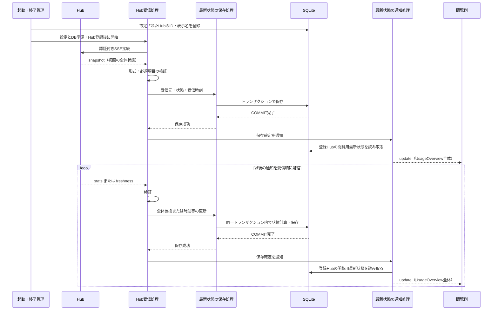

# UCP-1. Hubから受信した最新状態をDBへ反映し、閲覧側へ通知する

適用系列: [UC-1-M・UC-1-X1](../usecases/UC-1.md)。受信履歴ではなく、通知を反映した最新状態を保存します。

| 役割               | 責務                                                                                               | 実装パス                                           |
| ------------------ | -------------------------------------------------------------------------------------------------- | -------------------------------------------------- |
| 起動・終了管理     | 設定ファイル・DBを準備し、2つのHubを同期してから受信開始。終了時は再接続待ちを含む両方の受信を止めてからDBを閉じる | backend/app.ts、backend/main.ts、backend/config.ts |
| 接続設定読込       | `.env` で指定したJSONを検証し、2つの接続情報を返す。ファイルは更新しない                           | backend/hub/config-file.ts                         |
| Hub受信処理        | 認証付きSSE接続、通知の解析・境界検証、受信順の保存呼び出し、通信断時の再接続                      | backend/hub/receiver.ts、backend/hub/protocol.ts   |
| 最新状態の保存処理 | 次の状態の計算、SQL実行、受信元・受信時刻との一括保存                                              | backend/db/hub-state.ts、backend/db/database.ts    |
| 最新状態の通知処理 | 登録Hubの保存済み閲覧用データを生成し、接続時と保存確定後にSSEで配信 | backend/http/usage-stream.ts、backend/app.ts |

汎用キューやRepository層は追加しません。同じHubの通知は、1件の保存が完了してから次を処理します。2つのHubは別の受信処理で動き、一方の停止は他方やWebサーバーへ波及させません。

- `snapshot` は全体状態を保存し、`stats` は当該Hubの全体状態を置換します。端末の追加・削除も全体置換に含めます。メーター残量（`remainingPercent` / `usedPercent`）が変わった利用枠 window には、その保存時刻を記録します。
- `freshness` は既存状態の時刻・鮮度情報のみを更新し、利用量・上限等を維持します。各接続で初回の全体状態を受信する前に差分通知は受け付けません。heartbeatコメントは業務DBを更新しません。
- 保存処理が状態更新を担当し、COMMIT完了を成功確定点とします。差分適用に必要な既存状態の読み取りも同じトランザクションに含め、内部では外部通信を行いません。同じ通知を再受信しても利用量を加算しません。
- 通知処理は `GET /api/usage/stream` でSSEを提供し、`event: update` のJSON本文に既存の `UsageOverview` を用います。全登録Hubの閲覧用状態だけを含め、秘密情報や未公開のHub生データは配信しません。通知器はアプリケーション単位で1つ所有します。
- 接続時のDB読み取り・購読登録・初回送信と、保存確定後のDB読み取り・配信はそれぞれ同期処理とし、初回と更新の間に取りこぼしや逆転を生じさせません。再接続でも最新保存値を送信し、イベント履歴は再送しません。低速な接続では最新の待機通知1件だけを保持します。
- 配信失敗は当該閲覧接続だけを終了し、保存やHub受信へ例外を返しません。通知用のDB読み取り失敗は原因の固定メッセージをログへ記録し、初回は503、接続済みの配信は終了します。保存済み状態の取り消しや未保存値による代替は行いません。
- 認証失敗・HTTP応答不正（リダイレクトを含む）、不正通知（不正なバイト列を含む）では当該Hubの受信を停止し、原因をログに残します。保存失敗はロールバックして受信を停止します。通信断（接続失敗またはストリーム終了）では当該Hubを停止せず、同じ接続設定で3秒間隔・同時1本・稼働中は上限なく再接続します。再接続後の初回はsnapshotを検証して保存し、切断中は最後の保存状態を維持します。切断専用の閲覧通知は送りません。最後に保存できた状態とWebサーバーは維持します。
- 通常終了では再接続待ちを含むHub受信と閲覧側へのSSE配信を終了し、処理中の保存がコミットまたはロールバックした後にDBを閉じます。
- `.env` は接続設定JSONのパスだけを持ちます。JSONは2つのHubのID・表示名・URL・認証トークンを持ち、Git管理外とします。URLとトークンをDB・保存状態・ログへ含めず、アプリケーションから設定ファイルを更新しません。
- UI確認用モックは不要です。検証時の置き換え境界は外部Hubとし、制御可能なSSEサーバーから本番の受信・保存・配信処理を通し、別のDB接続の保存値と閲覧側の受信内容を照合します。

Hubは情報の提供元を表す独立した実体です。Hubごとに最新状態は0件または1件で、未受信でもHubは存在します。起動時に設定ファイルのIDと表示名をDBへ同期します。同じIDでの再起動は表示名だけを更新し、保存状態を維持します。URL変更でも同じ提供元ならIDを維持し、別の提供元には新しいIDを割り当てます。設定から外しても保存済みのHubと状態は削除しません。Hub情報の登録・編集・削除は別UCで扱います。
