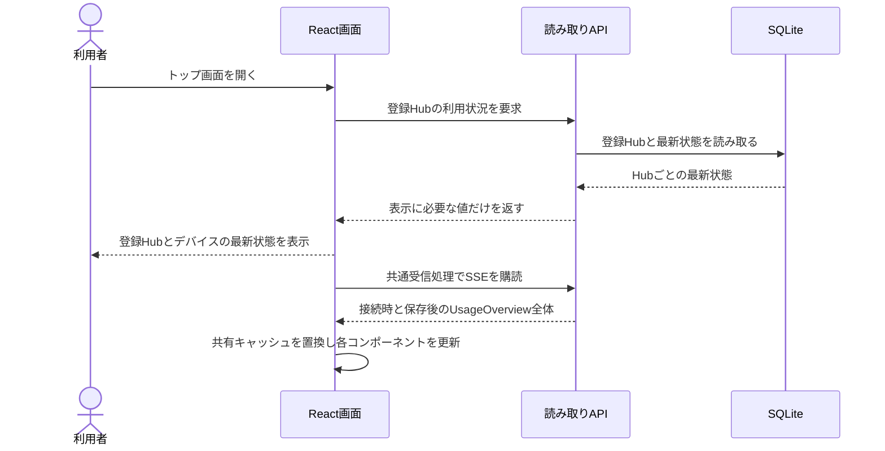

# UCP-2. 保存済みの最新利用状況を読み取って表示する

適用ユースケース: [利用状況を閲覧する](../usecases/利用状況を閲覧する/README.md)。現在の接続設定に登録されているHubだけを表示対象とし、表示処理ではHub数を固定しません。

| 役割         | 責務                                                                                              | 実装パス    |
| ------------ | ------------------------------------------------------------------------------------------------- | ----------- |
| 利用状況読取 | 登録Hubと最新状態を読み、Hub・デバイス・ツール・モデル・利用枠の表示に必要な値だけを返す            | backend/http/router.ts、backend/db/hub-state.ts |
| 利用状況画面 | 共通フックから初回取得と通知後の値を参照し、期間選択を維持して表示する | frontend/src/routes/index.tsx |
| 共通受信・共有データ | 初回取得成功後に購読を開始し、Queryキャッシュの全体置換と接続状態を管理する。コンポーネントごとに接続しない | frontend/src/features/usage-updates.tsx、frontend/src/features/usage-overview.ts |

初回の読み取りAPI応答と、以後の通知によるQueryキャッシュの全体置換を表示更新の確定点とし、閲覧ではDBを更新しません。期間切替と構成比は共有キャッシュの期間別数値から計算します。初回API失敗は従来の取得失敗表示とし、購読は開始しません。初回成功後にSSEを開始するため古いAPI応答で通知を上書きせず、接続時の全体状態で間の更新を補います。切断中は最後の値と「再接続中」を表示します。HTTP 503も再試行できるよう失敗したEventSourceを閉じ、3秒後に同じ接続先へ1本だけ再接続し、最初の更新通知で最新状態へ置き換えて接続済みに戻します。画面終了時に接続と再接続タイマーを解放します。

合成点は `frontend/src/features/usage-overview.ts` の取得・購読境界です。本番の `UsageOverview` を共有し、初回取得はtRPC、以後は同一originの `/api/usage/stream` を使います。仕様合意用の固定データとモック切替は削除済みです。期間別の `clients`（ツール別）と `models`（モデル別）をAPI応答と通知へ含め、画面で全Hubの同じ識別子を合算して構成比を算出します。利用枠は保存済み Hub 集約 `limits` から表示します。トレンド・アクティビティは固定サンプルです。DB変更はありません。
