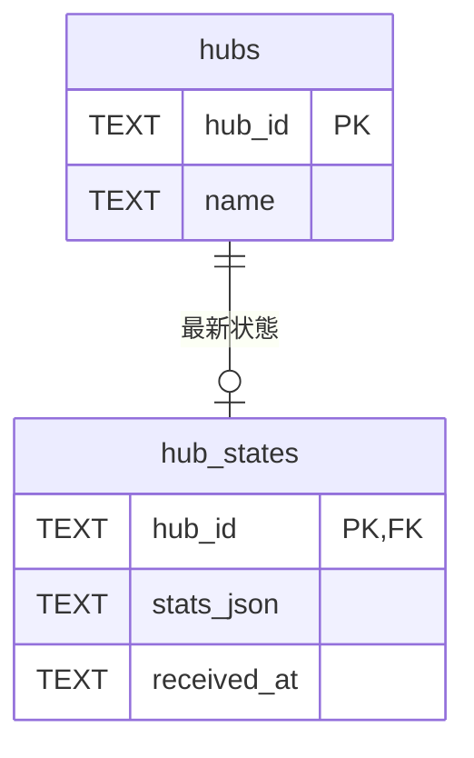

# データ設計

SQLiteのスキーマ版は1で、`hubs` と `hub_states` を使用します。Hubごとに通知を反映済みの最新状態を1行で保持し、受信履歴は蓄積しません。

`hubs`:

| カラム | SQLite型 | NULL | 制約・意味                                                 |
| ------ | -------- | ---- | ---------------------------------------------------------- |
| hub_id | TEXT     | 不可 | 主キー。設定で指定する安定したHub識別子                    |
| name   | TEXT     | 不可 | 設定から登録する表示名。識別には使わず、一意制約を設けない |

`hub_states`:

| カラム      | SQLite型 | NULL | 制約・意味                                                          |
| ----------- | -------- | ---- | ------------------------------------------------------------------- |
| hub_id      | TEXT     | 不可 | 主キー兼外部キー。hubs.hub_idを参照する受信元識別子                 |
| stats_json  | TEXT     | 不可 | snapshot・stats・freshnessを反映した最新のstats全体をJSONとして保持 |
| received_at | TEXT     | 不可 | 最後に保存に成功したデータ通知のローカル受信時刻。UTCのISO 8601形式 |

外部キーはHubの存在を保証し、削除・ID変更の連鎖更新は設けません。主キー以外の一意制約・索引・既定値は設けません。HubのURLと認証情報は接続設定ファイルに置き、このテーブルへ保存しません。Hub側の更新時刻は `stats_json` 内に保持し、別カラムへ重複させません。JSONの形式と必須項目は受信境界で検証します。

受信開始前にHubを登録します。初回保存前のhub_statesは0行です。`snapshot` と `stats` は受信元の1行を挿入または全体置換します。`freshness` は同じトランザクションで既存状態を読み、時刻・鮮度情報だけを適用したstats全体を書き戻します。`received_at` は受信時に取得し、状態と同時にコミットします。heartbeatでは更新せず、失敗時には状態・受信時刻の両方を維持します。終了・通信断でも行を削除しません。

移行では、空のスキーマ版0に2テーブルを作成し、`PRAGMA user_version` を1に変更します。作成と版更新は同一トランザクションで行い、失敗時は両方をロールバックします。旧製品DBの移行は対象外です。マイグレーションは backend/db/database.ts に実装しています。
